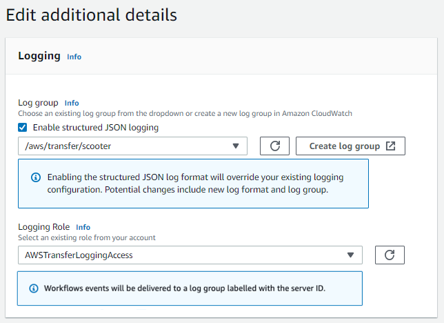
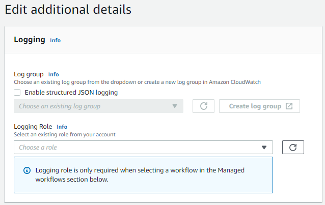
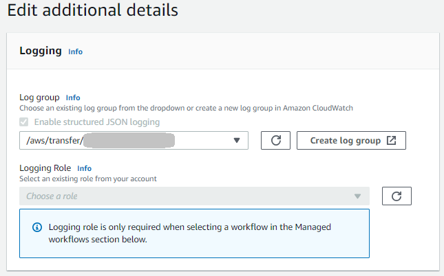
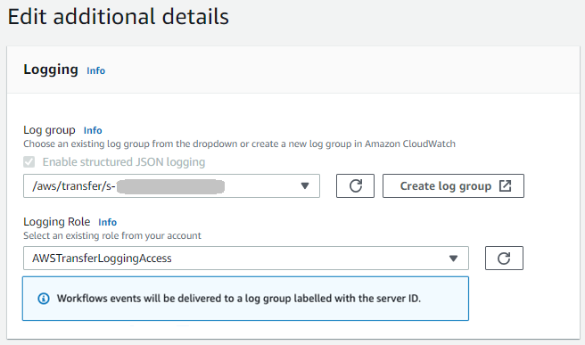
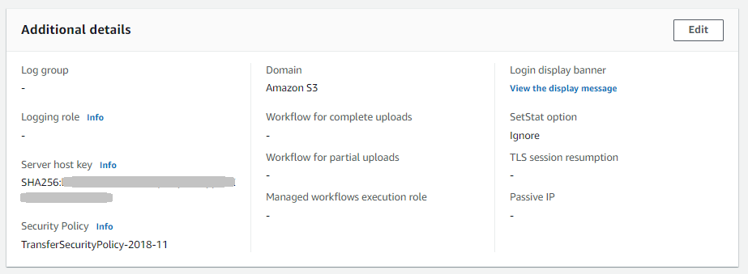
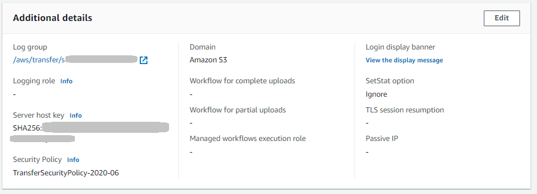
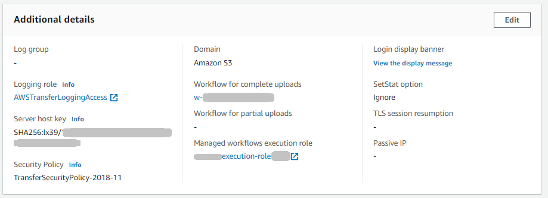
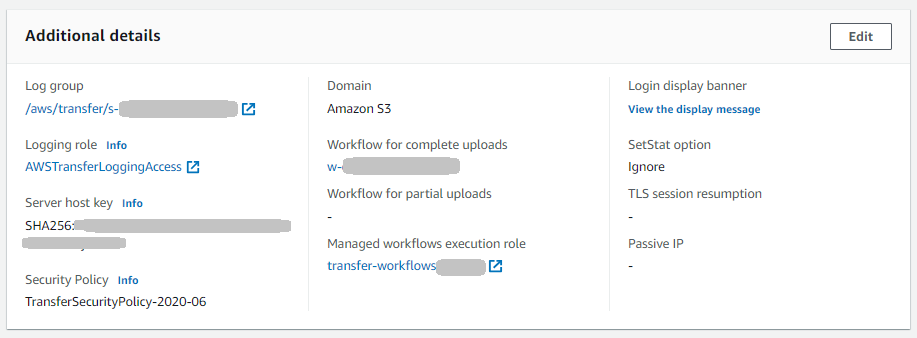

# Creating, updating, and viewing logging for

servers

For all AWS Transfer Family servers, we provide structured logging. We recommend that you use
structured logging for all new and existing Transfer Family servers. Benefits of using structured
logging include the following:

- Receive logs in a structured JSON format.
- Query your logs with Amazon CloudWatch Logs Insights, which automatically discovers JSON
  formatted fields.
- Share log groups across AWS Transfer Family resources allows you to combine log streams
  from multiple servers into a single log group, making it easier to manage your
  monitoring configurations and log retention settings.
- Create aggregated metrics and visualizations that can be added to CloudWatch
  dashboards.
- Track usage and performance data by using log groups to create consolidated
  log metrics, visualizations, and dashboards.
  To enable logging for workflows that are attached to servers, you must use a logging
  role.

###### Note

When you add a logging role, the logging group is always
`/aws/transfer/`your-serverID``, and
can't be changed. This means, that unless you are sending your structured server
logs to the same group, you will be logging to two separate logging groups.

If you know that you are going to associate a workflow with your server, and thus
need to add a logging role, you can set up structured logging to log to the default
log group of
`/aws/transfer/`your-serverID``.

To modify your logging group, see [StructuredLogDestinations](../APIReference/API_UpdateServer.md#TransferFamily-UpdateServer-request-StructuredLogDestinations "../APIReference/API_UpdateServer.md#TransferFamily-UpdateServer-request-StructuredLogDestinations") in the _AWS Transfer Family API
Reference_.

If you create a new server by using the Transfer Family console, logging is enabled by default.
After you create the server, you can use the `UpdateServer` API operation to
change your logging configuration. For details, see [StructuredLogDestinations](../APIReference/API_UpdateServer.md#TransferFamily-UpdateServer-request-StructuredLogDestinations "../APIReference/API_UpdateServer.md#TransferFamily-UpdateServer-request-StructuredLogDestinations").

Currently, for workflows, if you want logging enabled, you must specify a logging
role:

- If you associate a workflow with a server, using either the
  `CreateServer` or `UpdateServer` API operation, the
  system does not automatically create a logging role. If you want to log your
  workflow events, you need to explicitly attach a logging role to the
  server.
- If you create a server using the Transfer Family console and you attach a workflow, logs
  are sent to a log group that contains the server ID in the name. The format is
  `/aws/transfer/`server-id``, for
 example, `/aws/transfer/s-1111aaaa2222bbbb3`. The server logs can be
  sent to this same log group or a different one.
  Logging considerations for creating and editing servers in the
  console

- New servers created through the console only support structured JSON logging,
  unless a workflow is attached to the server.
- _No logging_ is not an option for new servers that you
  create in the console.
- Existing servers can enable structured JSON logging through the console at any
  time.
- Enabling structured JSON logging through the console disables the existing
  logging method, so as to not double charge customers. The exception is if a
  workflow is attached to the server.
- If you enable structured JSON logging, you cannot later disable it through the
  console.
- If you enable structured JSON logging, you can change the log group
  destination through the console at any time.
- If you enable structured JSON logging, you cannot edit the logging role
  through the console if you have enabled both logging types through the API. The
  exception is if your server has a workflow attached. However, the logging role
  does continue to appear in **Additional details**.
  Logging considerations for creating and editing servers using
  the API or SDK

- If you create a new server through the API, you can configure either or both
  types of logging, or choose no logging.
- For existing servers, enable and disable structured JSON logging at any
  time.
- You can change the log group through the API at any time.
- You can change the logging role through the API at any time.
  To enable structured logging, you must be logged into an account
  with the following permissions

- `logs:CreateLogDelivery`
- `logs:DeleteLogDelivery`
- `logs:DescribeLogGroups`
- `logs:DescribeResourcePolicies`
- `logs:GetLogDelivery`
- `logs:ListLogDeliveries`
- `logs:PutResourcePolicy`
- `logs:UpdateLogDelivery`
  An example policy is available in the section [Configure CloudWatch logging role](configure-cw-logging-role.md "configure-cw-logging-role.md").

###### Topics

- [Creating logging for servers](#log-server-create "#log-server-create")
- [Updating logging for a server](#log-server-update "#log-server-update")
- [Viewing the server configuration](#log-server-config "#log-server-config")

## Creating logging for servers

When you create a new server, on the **Configure additional
details** page, you can specify an existing log group, or create a new
one.

If you choose **Create log group**, the CloudWatch console
([https://console.aws.amazon.com/cloudwatch/](https://console.aws.amazon.com/cloudwatch/ "https://console.aws.amazon.com/cloudwatch/")) opens to the **Create log
group** page. For details, see [Create a log group in CloudWatch Logs](../../../AmazonCloudWatch/latest/logs/Working-with-log-groups-and-streams.md#Create-Log-Group "../../../AmazonCloudWatch/latest/logs/Working-with-log-groups-and-streams.md#Create-Log-Group").

## Updating logging for a server

The details for logging depend on the scenario for your update.

###### Note

When you opt into structured JSON logging, there can be a delay, in rare
cases, where Transfer Family stops logging in the old format, but takes some time to start
logging in the new JSON format. This can result in events that don't get logged.
There won’t be any service disruptions, but you should be careful transferring
files during the first hour after changing your logging method, as logs could be
dropped.

If you are editing an existing server, your options depend on the state of the
server.

- The server already has a logging role enabled, but does not have
  Structured JSON logging enabled.

- The server does not have any logging enabled.

- The server already has Structured JSON logging enabled, but does not have
  a logging role specified.

- The server already has Structured JSON logging enabled, and also has a
  logging role specified.

## Viewing the server configuration

The details for the server configuration page depend on your scenario:

Depending on your scenario, the server configuration page might look like one of
the following examples:

- No logging is enabled.

- Structured JSON logging is enabled.

- Logging role is enabled, but structured JSON logging is not
  enabled.

- Both types of logging (logging role and structured JSON logging) are
  enabled.

