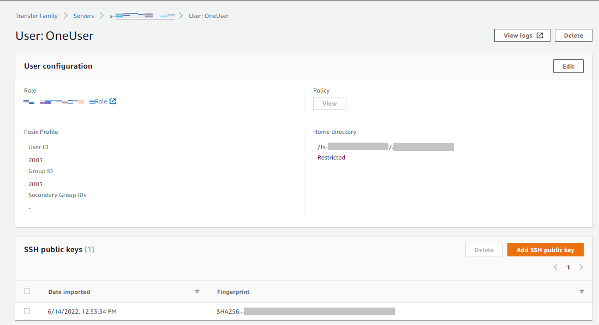
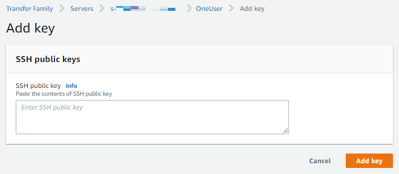
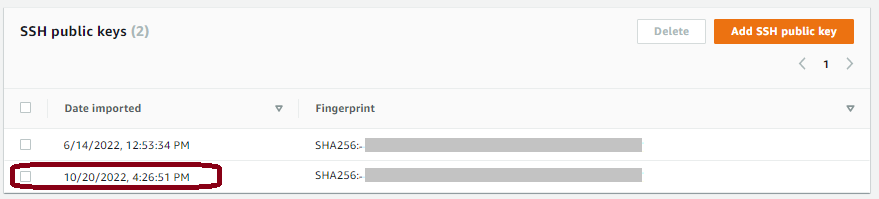

# Creating SSH keys on macOS, Linux, or

Unix

On the macOS, Linux, or Unix operating systems, you use the
`ssh-keygen` command to create an SSH public key and SSH private key
also known as a key pair.

###### Note

In the following examples, we do not specify a passphrase: in this case, the
tool asks you to enter your passphrase and then repeat it to verify. Creating a
passphrase offers better protection for your private key, and might also improve
overall system security. You cannot recover your passphrase: if you forget it,
you must create a new key.

However, if you are generating a server host key, you
_must_ specify an empty passphrase, by specifying the
`-N ""` option in the command (or by pressing
`Enter` twice when prompted), because Transfer Family servers
cannot request a password at start-up.

###### To create SSH keys on a macOS, Linux, or Unix operating system

1. On macOS, Linux, or Unix operating systems, open a command
   terminal.
2. AWS Transfer Family accepts RSA-, ECDSA-, and ED25519-formatted keys. Choose the
   appropriate command based on the type of key-pair you are generating.

**Tip**: Replace
`key_name` with the actual
name of your SSH key pair file.

    * To generate an RSA 4096-bit key pair:


    ```
    ssh-keygen -t rsa -b 4096 -f `key_name`
    ```
    * To generate an ECDSA 521-bit key-pair (ECDSA has bit sizes of 256,
     384, and 521):


    ```
    ssh-keygen -t ecdsa -b 521 -f `key_name`
    ```
    * To generate an ED25519 key pair:


    ```
    ssh-keygen -t ed25519 -f `key_name`
    ```

The following shows an example of the `ssh-keygen`
output.

```
ssh-keygen -t rsa -b 4096 -f key_name
Generating public/private rsa key pair.

Enter passphrase (empty for no passphrase):
Enter same passphrase again:
Your identification has been saved in key_name.
Your public key has been saved in key_name.pub.
The key fingerprint is:
SHA256:8tDDwPmanTFcEzjTwPGETVWOGW1nVz+gtCCE8hL7PrQ bob.amazon.com
The key's randomart image is:
+---[RSA 4096]----+
|    . ....E      |
| .   = ...       |
|. . . = ..o      |
| . o +  oo =     |
|  + =  .S.= *    |
| . o o ..B + o   |
|     .o.+.* .    |
|     =o*+*.      |
|    ..*o*+.      |
+----[SHA256]-----+
```

**Tip**: When you run the
`ssh-keygen` command as shown preceding, it creates the
public and private keys as files in the current directory.

Your SSH key pair is now ready to use. Follow steps 3 and 4 to store the
SSH public key for your service-managed users. These users use the keys when
they transfer files on Transfer Family server endpoints. 3. Navigate to the
``key_name`.pub` file and
open it. 4. Copy the text and paste it in **SSH public key** for the
service-managed user.

    1. Open the AWS Transfer Family console at [https://console.aws.amazon.com/transfer/](https://console.aws.amazon.com/transfer/ "https://console.aws.amazon.com/transfer/"), then select
     **Servers** from the navigation pane.
    2. On the **Servers** page, select the
     **Server ID** for server that contains the user
     that you want to update.
    3. Select the user for which you are adding a public key.
    4. In the **SSH public keys** pane, choose
     **Add SSH public key**.


    
    5. Paste the text of the public key you generated into the SSH public
     key text box, and then choose **Add key**.


    

    The new key is listed in the SSH public key pane.


    
