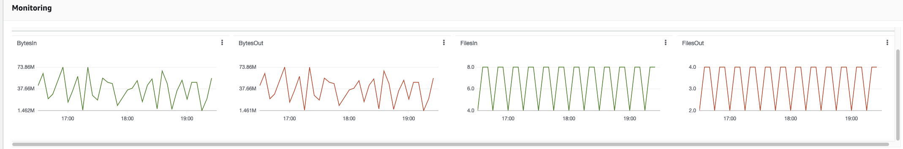
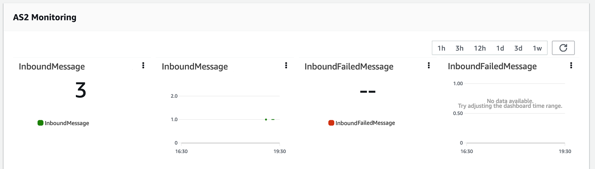

# Monitoring usage in the console

You can get information about your server's metrics on its **Server
details** page. This provides you with a single place to monitor your
file-transfers workloads. You can track how many files you have exchanged with your
partners and closely track their usage using a centralized dashboard. For details, see
[View SFTP, FTPS, and FTP server
details](configuring-servers-view-info.md "configuring-servers-view-info.md"). The following table describes the
metrics available for Transfer Family.

| Namespace                                                                                                                                                                                                                                                                                                                                                                                                                                                                                                                                           | Metric                                                                                                                                                                                                                                                                                                                                                                                                                                                                 | Description                                                                                                                                                                                                                                                                                                                                                                                                                                                                                                                                                                                                                                                                                                                                                                                                                                                                                                                                                                                                                                                                                                                                                                                          |
| --------------------------------------------------------------------------------------------------------------------------------------------------------------------------------------------------------------------------------------------------------------------------------------------------------------------------------------------------------------------------------------------------------------------------------------------------------------------------------------------------------------------------------------------------- | ---------------------------------------------------------------------------------------------------------------------------------------------------------------------------------------------------------------------------------------------------------------------------------------------------------------------------------------------------------------------------------------------------------------------------------------------------------------------- | ---------------------------------------------------------------------------------------------------------------------------------------------------------------------------------------------------------------------------------------------------------------------------------------------------------------------------------------------------------------------------------------------------------------------------------------------------------------------------------------------------------------------------------------------------------------------------------------------------------------------------------------------------------------------------------------------------------------------------------------------------------------------------------------------------------------------------------------------------------------------------------------------------------------------------------------------------------------------------------------------------------------------------------------------------------------------------------------------------------------------------------------------------------------------------------------------------- | ---------------------------------------------------------------------------------------------------------------------------------------------------------------------------------------------------------------------------------------------------------------------------------------------------------------------------------------------------------------------------------------------------------------------------------------------------------------------- |
| `AWS/Transfer`                                                                                                                                                                                                                                                                                                                                                                                                                                                                                                                                      | `BytesIn`                                                                                                                                                                                                                                                                                                                                                                                                                                                              | The total number of bytes transferred into the server. **Reporting criteria**:  • For SFTP/FTP/FTPS: emitted every 5 minutes while a connection is established to the Transfer Family server. If no files or bytes are transferred in the period, "0" is emitted.  • For AS2: when the customer receives a message in their AS2 server and emitted as soon as the inbound message has finished processing **Units**: Count **Period**: 5 minutes                                                                                                                                                                                                                                                                                                                                                                                                                                                                                                                                                                                                                                                                                                                                               |
| `BytesOut`                                                                                                                                                                                                                                                                                                                                                                                                                                                                                                                                          | The total number of bytes transferred out of the server. **Reporting criteria**:  • For SFTP/FTP/FTPS: emitted every 5 minutes while a connection is established to the Transfer Family server. If no files or bytes are transferred in the period, "0" is emitted.  • For AS2: when the customer calls `StartFileTransfer` from their AS2 connector and emitted as soon as the outbound message has finished processing. **Units**: Count **Period**: 5 minutes |                                                                                                                                                                                                                                                                                                                                                                                                                                                                                                                                                                                                                                                                                                                                                                                                                                                                                                                                                                                                                                                                                                                                                                                                      | `FilesIn`                                                                                                                                                                                                                                                                                                                                                                                                                                                              |
| The total number of files transferred into the server. For servers using the AS2 protocol, this metric represents the number of messages received. **Reporting criteria**:  • For SFTP/FTP/FTPS: emitted every 5 minutes while a connection is established to the Transfer Family server. If no files or bytes are transferred in the period, "0" is emitted.  • For AS2: when the customer receives a message in their AS2 server and emitted as soon as the inbound message has finished processing. **Units**: Count **Period**: 5 minutes |                                                                                                                                                                                                                                                                                                                                                                                                                                                                        | `FilesOut`                                                                                                                                                                                                                                                                                                                                                                                                                                                                                                                                                                                                                                                                                                                                                                                                                                                                                                                                                                                                                                                                                                                                                                                           | The total number of files transferred out of the server. **Reporting criteria**:  • For SFTP/FTP/FTPS: emitted every 5 minutes while a connection is established to the Transfer Family server. If no files or bytes are transferred in the period, "0" is emitted.  • For AS2: when the customer calls `StartFileTransfer` from their AS2 connector and emitted as soon as the outbound message has finished processing. **Units**: Count **Period**: 5 minutes |
| `InboundMessage`                                                                                                                                                                                                                                                                                                                                                                                                                                                                                                                                    | The total number of AS2 messages successfully received from a trading partner. **Reporting criteria**: When the customer receives a message in their AS2 server and emitted as soon as the inbound message has finished processing successfully **Units**: Count **Period**: 5 minutes                                                                                                                                                                                 |                                                                                                                                                                                                                                                                                                                                                                                                                                                                                                                                                                                                                                                                                                                                                                                                                                                                                                                                                                                                                                                                                                                                                                                                      | `InboundFailedMessage`                                                                                                                                                                                                                                                                                                                                                                                                                                                 |
| The total number of AS2 messages that were unsuccessfully received from a trading partner. That is, a trading partner sent a message, but the Transfer Family server was not able to successfully process it. **Reporting criteria**: When the customer receives a message in their AS2 server and emitted as soon as the inbound message has finished processing unsuccessfully **Units**: Count **Period**: 5 minutes                                                                                                                             |                                                                                                                                                                                                                                                                                                                                                                                                                                                                        | `OnUploadExecutionsStarted`                                                                                                                                                                                                                                                                                                                                                                                                                                                                                                                                                                                                                                                                                                                                                                                                                                                                                                                                                                                                                                                                                                                                                                          | The total number of workflow executions started on the server. **Reporting criteria**: Triggered every time an execution starts **Units**: Count **Period**: 1 minute                                                                                                                                                                                                                                                                                                  |
| `OnUploadExecutionsSuccess`                                                                                                                                                                                                                                                                                                                                                                                                                                                                                                                         | The total number of successful workflow executions on the server. **Reporting criteria**: Triggered every time an execution successfully finishes **Units**: Count **Period**: 1 minute                                                                                                                                                                                                                                                                                |                                                                                                                                                                                                                                                                                                                                                                                                                                                                                                                                                                                                                                                                                                                                                                                                                                                                                                                                                                                                                                                                                                                                                                                                      | `OnUploadExecutionsFailed`                                                                                                                                                                                                                                                                                                                                                                                                                                             |
| The total number of unsuccessful workflow executions on the server. **Reporting criteria**: Triggered every time an execution does not successfully finish **Units**: Count **Period**: 1 minute                                                                                                                                                                                                                                                                                                                                                    |                                                                                                                                                                                                                                                                                                                                                                                                                                                                        | `OutboundMessage`                                                                                                                                                                                                                                                                                                                                                                                                                                                                                                                                                                                                                                                                                                                                                                                                                                                                                                                                                                                                                                                                                                                                                                                    | The total number of AS2 messages successfully sent to a a trading partner. **Reporting criteria**: When the customer calls `StartFileTransfer` from their AS2 connector and emitted as soon as the outbound message has finished processing successfully **Units**: Count **Period**: 5 minutes                                                                                                                                                                        |
| `OutboundFailedMessage`                                                                                                                                                                                                                                                                                                                                                                                                                                                                                                                             | The total number of AS2 messages that were unsuccessfully sent to a trading partner. **Reporting criteria**: When the customer calls `StartFileTransfer` from their AS2 connector and emitted as soon as the outbound message has finished processing unsuccessfully **Units**: Count **Period**: 5 minutes                                                                                                                                                            | The **Monitoring** section contains four, individual graphs. These graphs show the bytes in, bytes out, files in, and files out.  For servers that have the AS2 protocol enabled, there is an **AS2 Monitoring** section below the **Monitoring** information. This section contains details for the number of inbound messages, both successful and failed.  To open the selected graph in its own window, choose the expand icon (  ). You can also click a graph's vertical ellipsis icon (  ) to open a dropdown menu with the following items:  • **Enlarge** – Opens the selected graph in its own window.  • **Refresh** – Reloads the graph with the most recent data.  • **View in metrics** – Opens the corresponding metrics details in Amazon CloudWatch.  • **View logs** – Opens the corresponding log group in CloudWatch. |
