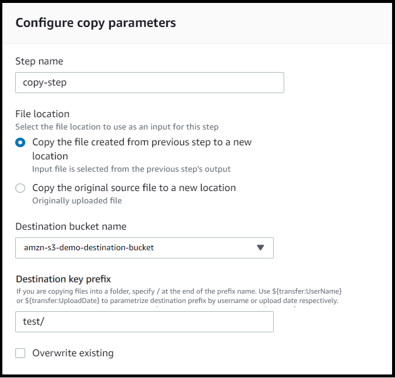
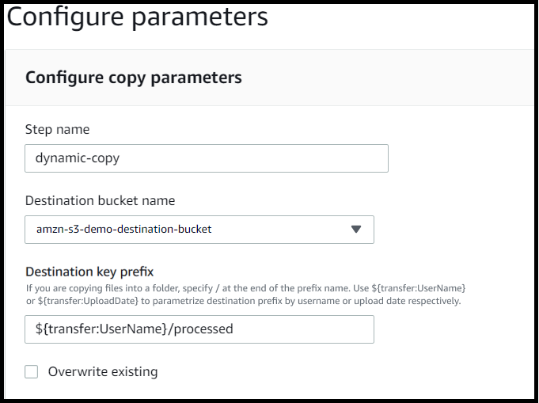
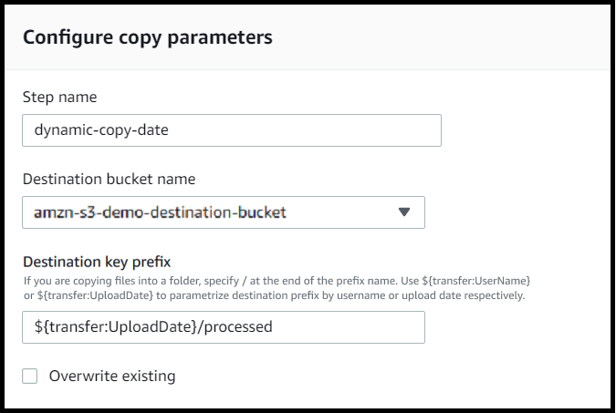
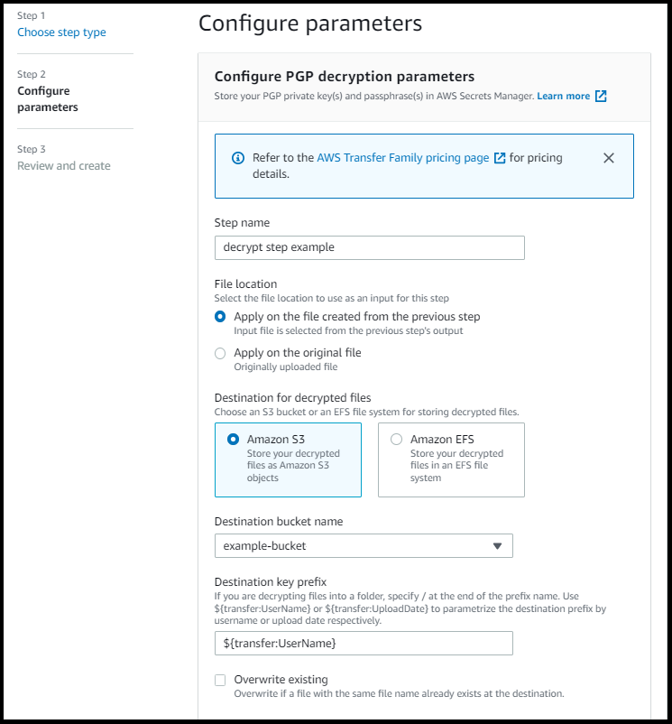
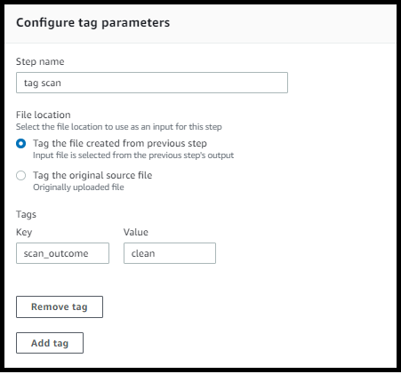
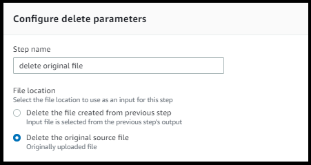
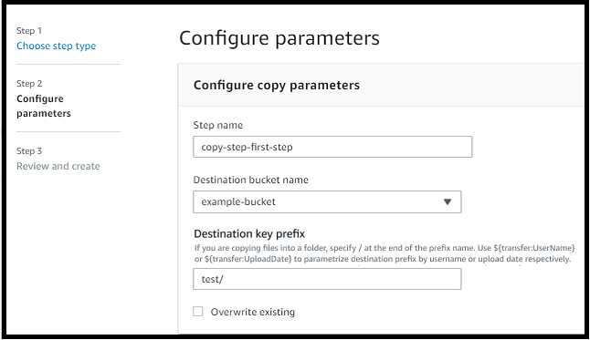

# Use predefined steps

When you're creating a workflow, you can choose to add one of the following predefined
steps discussed in this topic. You can also choose to add your own custom
file-processing steps. For more information, see [Use custom file-processing steps](custom-step-details.md "custom-step-details.md").

###### Topics

- [Copy file](#copy-step-details "#copy-step-details")
- [Decrypt file](#decrypt-step-details "#decrypt-step-details")
- [Tag file](#tag-step-details "#tag-step-details")
- [Delete file](#delete-step-details "#delete-step-details")
- [Named variables for workflows](#workflow-named-variables "#workflow-named-variables")
- [Example tag and delete workflow](#sourcefile-workflow "#sourcefile-workflow")

## Copy file

A copy file step creates a copy of the uploaded file in a new Amazon S3 location.
Currently, you can use a copy file step only with Amazon S3.

The following copy file step copies files into the `test`
folder in `amzn-s3-demo-destination-bucket`.

If the copy file step is not the first step of your workflow, you can specify the
**File location**. By specifying the file location, you can
copy either the file that was used in the previous step or the original file that
was uploaded. You can use this feature to make multiple copies of the original file
while keeping the source file intact for file archival and records retention. For an
example, see [Example tag and delete workflow](#sourcefile-workflow "#sourcefile-workflow").



### Provide the bucket and key details

You must provide the bucket name and a key for the destination of the copy
file step. The key can be either a path name or a file name. Whether the key is
treated as a path name or a file name is determined by whether you end the key
with the forward slash (`/`) character.

If the final character is `/`, your file is copied to the folder,
and its name does not change. If the final character is alphanumeric, your
uploaded file is renamed to the key value. In this case, if a file with that
name already exists, the behavior depends on the setting for the
**Overwrite existing** field.

- If **Overwrite existing** is selected, the existing file is replaced with the file being processed.
- If **Overwrite existing** is not selected,
  nothing happens, and the workflow processing stops.

###### Tip

If concurrent writes are executed on the same file path, it may result in unexpected behavior when overwriting files.

For example, if your key value is `test/`, your uploaded files are
copied to the `test` folder. If your key value is
`test/today`, (and **Overwrite existing** is
selected) every file you upload is copied to a file named
`today` in the `test` folder, and each
succeeding file overwrites the previous one.

###### Note

Amazon S3 supports buckets and objects, and there is no hierarchy. However, you
can use prefixes and delimiters in object key names to imply a hierarchy and
organize your data in a way similar to folders.

### Use a named variable in a copy file

step

In a copy file step, you can use a variable to dynamically copy your files
into user-specific folders. Currently, you can use
`${transfer:UserName}` or `${transfer:UploadDate}` as
a variable to copy files to a destination location for the given user who's
uploading files, or based on the current date.

In the following example, if the user `richard-roe` uploads a file,
it gets copied into the
`amzn-s3-demo-destination-bucket/richard-roe/processed/`
folder. If the user `mary-major` uploads a file, it gets copied into
the `amzn-s3-demo-destination-bucket/mary-major/processed/`
folder.



Similarly, you can use `${transfer:UploadDate}` as a variable to
copy files to a destination location named for the current date. In the
following example, if you set the destination to
`${transfer:UploadDate}/processed` on February 1, 2022, files
uploaded are copied into the
`amzn-s3-demo-destination-bucket/2022-02-01/processed/`
folder.



You can also use both of these variables together, combining their
functionality. For example, you could set the **Destination key
prefix** to
`folder/${transfer:UserName}/${transfer:UploadDate}/`,
which would created nested folders, for example
`folder/marymajor/2023-01-05/`.

### IAM permissions for copy step

To allow a copy step to succeed, make sure the execution role for your
workflow contains the following permissions.

```
{
    "Sid": "ListBucket",
    "Effect": "Allow",
    "Action": "s3:ListBucket",
    "Resource": [
        "arn:aws:s3:::`amzn-s3-demo-destination-bucket`"
    ]
}, {
    "Sid": "HomeDirObjectAccess",
    "Effect": "Allow",
    "Action": [
        "s3:PutObject",
        "s3:GetObject",
        "s3:DeleteObjectVersion",
        "s3:DeleteObject",
        "s3:GetObjectVersion"
    ],
    "Resource": "arn:aws:s3:::`amzn-s3-demo-destination-bucket`/*"
}
```

###### Note

The `s3:ListBucket` permission is only necessary if you do not
select **Overwrite existing**. This permission checks your
bucket to see if a file with the same name already exists. If you have
selected **Overwrite existing**, the workflow doesn't need
to check for the file, and can just write it.

If your Amazon S3 files have tags, you need to add one or two permissions to your IAM policy.

- Add `s3:GetObjectTagging` for an Amazon S3 file that isn't versioned.
- Add `s3:GetObjectVersionTagging` for an Amazon S3 file that is versioned.

## Decrypt file

The AWS storage blog has a post that describes how to simply decrypt files without writing any code using Transfer Family Managed workflows,
[Encrypt and decrypt files with PGP and AWS Transfer Family](https://aws.amazon.com/blogs/storage/encrypt-and-decrypt-files-with-pgp-and-aws-transfer-family/ "https://aws.amazon.com/blogs/storage/encrypt-and-decrypt-files-with-pgp-and-aws-transfer-family/").

### Supported symmetric encryption

algorithms

For PGP decryption, Transfer Family supports symmetric encryption algorithms that are
used to encrypt the actual file data within PGP files.

- For detailed information about supported symmetric encryption
  algorithms, see [PGP symmetric encryption
  algorithms](key-management.md#pgp-symmetric-algorithms "key-management.md#pgp-symmetric-algorithms").
- For information about PGP key pair algorithms used with these
  symmetric algorithms, see [PGP key pair algorithms](key-management.md#pgp-key-algorithms "key-management.md#pgp-key-algorithms").

### Use PGP decryption in your

workflow

Transfer Family has built-in support for Pretty Good Privacy (PGP) decryption. You can
use PGP decryption on files that are uploaded over SFTP, FTPS, or FTP to
Amazon Simple Storage Service (Amazon S3) or Amazon Elastic File System (Amazon EFS).

To use PGP decryption, you must create and store the PGP private keys that
will be used for decryption of your files. Your users can then encrypt files by
using corresponding PGP encryption keys before uploading the files to your Transfer Family
server. After you receive the encrypted files, you can decrypt those files in
your workflow. For a detailed tutorial, see [Setting up a managed workflow for decrypting a
file](workflow-decrypt-tutorial.md "workflow-decrypt-tutorial.md").

For information about supported PGP algorithms and recommendations, see [PGP encryption and decryption
algorithms](key-management.md#pgp-encryption-algorithms "key-management.md#pgp-encryption-algorithms").

###### To use PGP decryption in your workflow

1. Identify a Transfer Family server to host your workflow, or create a new one. You
   need to have the server ID before you can store your PGP keys in
   AWS Secrets Manager with the correct secret name.
2. Store your PGP key in AWS Secrets Manager under the required secret name. For
   details, see [Manage PGP keys](manage-pgp-keys.md "manage-pgp-keys.md"). Workflows can automatically
   locate the correct PGP key to be used for decryption based on the secret
   name in Secrets Manager.

###### Note

When you store secrets in Secrets Manager, your AWS account incurs charges. For information about
pricing, see [AWS Secrets Manager Pricing](https://aws.amazon.com/secrets-manager/pricing "https://aws.amazon.com/secrets-manager/pricing"). 3. Encrypt a file by using your PGP key pair. (For a list of supported
clients, see [Supported PGP clients](pgp-key-clients.md "pgp-key-clients.md").) If you are using the command
line, run the following command. To use this command, replace
`username@example.com`
with the email address that you used to create the PGP key pair. Replace
`testfile.txt`
with the name of the file that you want to encrypt.

```
gpg -e -r `username@example.com` `testfile.txt`
```

###### Important

When encrypting files for use with AWS Transfer Family workflows, always ensure you specify a
non-anonymous recipient using the `-r` parameter. Anonymous encryption
(without specifying a recipient) can cause decryption failures in the workflow
because the system won't be able to identify which key to use for decryption.
Debugging information for this issue is available at [Troubleshoot anonymous recipient
encryption issues](workflow-issues.md#workflows-decrypt-anonymous "workflow-issues.md#workflows-decrypt-anonymous"). 4. Upload the encrypted file to your Transfer Family server. 5. Configure a decryption step in your workflow. For more information,
see [Add a decryption step](#decrypt-step-procedure "#decrypt-step-procedure").

### Add a decryption step

A decryption step decrypts an encrypted file that was uploaded to Amazon S3 or
Amazon EFS as part of your workflow. For details about configuring decryption, see
[Use PGP decryption in your
workflow](#configure-decryption "#configure-decryption").

When you create your decryption step for a workflow, you must specify the
destination for the decrypted files. You must also select whether to overwrite
existing files if a file already exists at the destination location. You can
monitor the decryption workflow results and get audit logs for each file in real
time by using Amazon CloudWatch Logs.

After you choose the **Decrypt file** type for your step, the
**Configure parameters** page appears. Fill in the values
for the **Configure PGP decryption parameters** section.

The available options are as follows:

- **Step name** – Enter a descriptive name for
  the step.
- **File location** – By specifying the file
  location, you can decrypt either the file that was used in the previous
  step or the original file that was uploaded.

###### Note

This parameter is not available if this step is the first step of
the workflow.

- **Destination for decrypted files** – Choose
  an Amazon S3 bucket or an Amazon EFS file system as the destination for the
  decrypted file.
  - If you choose Amazon S3, you must provide a destination bucket name
    and a destination key prefix. To parameterize the destination
    key prefix by username, enter
    `${transfer:UserName}` for
    **Destination key prefix**. Similarly, to
    parameterize the destination key prefix by upload date, enter
    `${Transfer:UploadDate}` for
    **Destination key prefix**.
  - If you choose Amazon EFS, you must provide a destination file
    system and path.

###### Note

The storage option that you choose here must match the storage
system that's used by the Transfer Family server with which this workflow is
associated. Otherwise, you will receive an error when you attempt to
run this workflow.

- **Overwrite existing** – If you upload a file,
  and a file with the same filename already exists at the destination, the
  behavior depends on the setting for this parameter:
  - If **Overwrite existing** is selected, the existing file is replaced with the file being processed.
  - If **Overwrite existing** is not selected,
    nothing happens, and the workflow processing stops.

  ###### Tip

  If concurrent writes are executed on the same file path, it may result in unexpected behavior when overwriting files.

The following screenshot shows an example of the options that you might choose
for your decrypt file step.



### IAM permissions for decrypt step

To allow a decrypt step to succeed, make sure the execution role for your
workflow contains the following permissions.

```
{
    "Sid": "ListBucket",
    "Effect": "Allow",
    "Action": "s3:ListBucket",
    "Resource": [
        "arn:aws:s3:::`amzn-s3-demo-destination-bucket`"
    ]
}, {
    "Sid": "HomeDirObjectAccess",
    "Effect": "Allow",
    "Action": [
        "s3:PutObject",
        "s3:GetObject",
        "s3:DeleteObjectVersion",
        "s3:DeleteObject",
        "s3:GetObjectVersion"
    ],
    "Resource": "arn:aws:s3:::`amzn-s3-demo-destination-bucket`/*"
}, {
    "Sid": "Decrypt",
    "Effect": "Allow",
    "Action": [
        "secretsmanager:GetSecretValue",
    ],
    "Resource": "arn:aws:secretsmanager:`region`:`account-id`:secret:aws/transfer/*"
}
```

###### Note

The `s3:ListBucket` permission is only necessary if you do not
select **Overwrite existing**. This permission checks your
bucket to see if a file with the same name already exists. If you have
selected **Overwrite existing**, the workflow doesn't need
to check for the file, and can just write it.

If your Amazon S3 files have tags, you need to add one or two permissions to your IAM policy.

- Add `s3:GetObjectTagging` for an Amazon S3 file that isn't versioned.
- Add `s3:GetObjectVersionTagging` for an Amazon S3 file that is versioned.

## Tag file

To tag incoming files for further downstream processing, use a tag step. Enter the
value of the tag that you would like to assign to the incoming files. Currently, the
tag operation is supported only if you are using Amazon S3 for your Transfer Family server
storage.

The following example tag step assigns `scan_outcome` and
`clean` as the tag key and value, respectively.



To allow a tag step to succeed, make sure the execution role for your workflow
contains the following permissions.

```
{
            "Sid": "Tag",
            "Effect": "Allow",
            "Action": [
                "s3:PutObjectTagging",
                "s3:PutObjectVersionTagging"
            ],
            "Resource": [
                "arn:aws:s3:::`amzn-s3-demo-bucket`/*"
            ]
}
```

###### Note

If your workflow contains a tag step that runs before either a copy or decrypt
step, you need to add one or two permissions to your IAM policy.

- Add `s3:GetObjectTagging` for an Amazon S3 file that isn't
  versioned.
- Add `s3:GetObjectVersionTagging` for an Amazon S3 file that is
  versioned.

## Delete file

To delete a processed file from a previous workflow step or to delete the
originally uploaded file, use a delete file step.



To allow a delete step to succeed, make sure the execution role for your workflow
contains the following permissions.

```
{
            "Sid": "Delete",
            "Effect": "Allow",
            "Action": [
                "s3:DeleteObjectVersion",
                "s3:DeleteObject"
            ],
            "Resource": "arn:aws:secretsmanager:`region`:`account-ID`:secret:aws/transfer/*"
        }
```

## Named variables for workflows

For copy and decrypt steps, you can use a variable to dynamically perform actions.
Currently, AWS Transfer Family supports the following named variables.

- Use `${transfer:UserName}` to copy or decrypt files to a
  destination based on the user who's uploading the files.
- Use `${transfer:UploadDate}` to copy or decrypt files to a
  destination location based on the current date.

## Example tag and delete workflow

The following example illustrates a workflow that tags incoming files that need to
be processed by a downstream application, such as a data analytics platform. After
tagging the incoming file, the workflow then deletes the originally uploaded file to
save on storage costs.

Console

###### Example tag and move workflow

1. Open the AWS Transfer Family console at [https://console.aws.amazon.com/transfer/](https://console.aws.amazon.com/transfer/ "https://console.aws.amazon.com/transfer/").
2. In the left navigation pane, choose
   **Workflows**.
3. On the **Workflows** page, choose
   **Create workflow**.
4. On the **Create workflow** page, enter a
   description. This description appears on the
   **Workflows** page.
5. Add the first step (copy).
   1. In the **Nominal steps** section,
      choose **Add step**.
   2. Choose **Copy file**, then choose
      **Next**.
   3. Enter a step name, then select a destination bucket
      and a key prefix.

    4. Choose **Next**, then review the
   details for the step. 5. Choose **Create step** to add the
   step and continue.

6. Add the second step (tag).
   1. In the **Nominal steps** section,
      choose **Add step**.
   2. Choose **Tag file**, then choose
      **Next**.
   3. Enter a step name.
   4. For **File location**, select
      **Tag the file created from previous
      step**.
   5. Enter a **Key** and
      **Value**.

    6. Choose **Next**, then review the
   details for the step. 7. Choose **Create step** to add the
   step and continue.

7. Add the third step (delete).
   1. In the **Nominal steps** section,
      choose **Add step**.
   2. Choose **Delete file**, then choose
      **Next**.

    3. Enter a step name. 4. For **File location**, select
   **Delete the original source
   file**. 5. Choose **Next**, then review the
   details for the step. 6. Choose **Create step** to add the
   step and continue.

8. Review the workflow configuration, and then choose
   **Create workflow**.

CLI

###### Example tag and move workflow

1. Save the following code into a file; for example,
   `tagAndMoveWorkflow.json`. Replace each
   `user input
placeholder` with your own information.

```
[
   {
       "Type": "COPY",
       "CopyStepDetails": {
          "Name": "CopyStep",
          "DestinationFileLocation": {
             "S3FileLocation": {
                "Bucket": "amzn-s3-demo-bucket",
                "Key": "`test/`"
             }
          }
       }
   },
   {
       "Type": "TAG",
       "TagStepDetails": {
          "Name": "TagStep",
          "Tags": [
             {
                "Key": "`name`",
                "Value": "`demo`"
             }
          ],
          "SourceFileLocation": "${previous.file}"
       }
   },
   {
      "Type": "DELETE",
      "DeleteStepDetails":{
         "Name":"DeleteStep",
         "SourceFileLocation": "${original.file}"
      }
  }
]
```

The first step copies the uploaded file to a new Amazon S3
location. The second step adds a tag (key-value pair) to the
file (`previous.file`) that was copied to the
new location. And, finally, the third step deletes the original
file (`original.file`). 2. Create a workflow from the saved file. Replace each
`user input
 placeholder` with your own
information.

```
aws transfer create-workflow --description "`short-description`" --steps file://`path-to-file` --region `region-ID`
```

For example:

```
aws transfer create-workflow --description "copy-tag-delete workflow" --steps file://tagAndMoveWorkflow.json --region us-east-1
```

###### Note

For more details about using files to load parameters, see
[How to load parameters from a file](../../../cli/latest/userguide/cli-usage-parameters-file.md "../../../cli/latest/userguide/cli-usage-parameters-file.md"). 3. Update an existing server.

###### Note

This step assumes you already have a Transfer Family server and you
want to associate a workflow with it. If not, see [Configuring an SFTP, FTPS, or FTP server
endpoint](tf-server-endpoint.md "tf-server-endpoint.md"). Replace each
`user input
 placeholder` with your own
information.

```
aws transfer update-server --server-id `server-ID` --region `region-ID`
  --workflow-details '{"OnUpload":[{ "WorkflowId": "`workflow-ID`","ExecutionRole": "`execution-role-ARN`"}]}'
```

For example:

```
aws transfer update-server --server-id s-1234567890abcdef0 --region us-east-2
  --workflow-details '{"OnUpload":[{ "WorkflowId": "w-abcdef01234567890","ExecutionRole": "arn:aws:iam::111111111111:role/nikki-wolf-execution-role"}]}'
```
