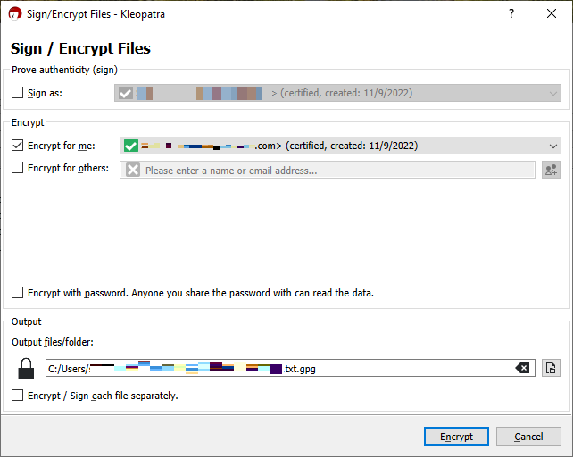

# Supported PGP clients

The following clients have been tested with Transfer Family and can be used to generate PGP keys,
and to encrypt files that you intend to decrypt with a workflow.

- **Gpg4win + Kleopatra**.

###### Note

When you select **Sign / Encrypt Files**, make sure to
clear the selection for **Sign as**: we do not currently
support signing for encrypted files.


If you sign the encrypted file and attempt to upload it to a Transfer Family server
with a decryption workflow, you receive the following error:

```
Encrypted file with signed message unsupported
```

- Major **GnuPG** versions: 2.4, 2.3, 2.2, 2.0, and
  1.4.
  Note that other PGP clients might work as well, but only the clients mentioned here
  have been tested with Transfer Family.
