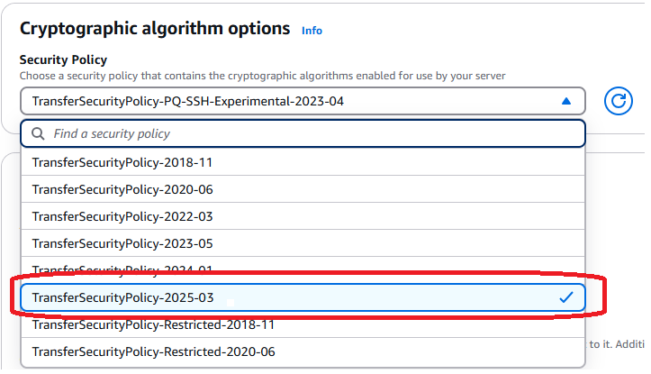

# Using hybrid post-quantum key exchange with

AWS Transfer Family

Transfer Family supports a hybrid post-quantum key establishment option for the Secure Shell (SSH)
protocol. Post-quantum key establishment is needed because it's already possible to record
network traffic and save it for decryption in future by a quantum computer, which is called a
_store-now-harvest-later_ attack.

You can use this option when you connect to Transfer Family for secure file transfers into and out of
Amazon Simple Storage Service (Amazon S3) storage or Amazon Elastic File System (Amazon EFS). Post-quantum hybrid key establishment in SSH
introduces post-quantum key establishment mechanisms, which it uses in conjunction with
classical key exchange algorithms. SSH keys created with classical cipher suites are safe from
brute-force attacks with current technology. However, classical encryption isn't expected to
remain secure after the emergence of large-scale quantum computing in the future.

If your organization relies on the long-term confidentiality of data passed over a Transfer Family
connection, you should consider a plan to migrate to post-quantum cryptography before
large-scale quantum computers become available for use.

To protect data encrypted today against potential future attacks, AWS is participating
with the cryptographic community in the development of quantum-resistant or post-quantum
algorithms. We've implemented hybrid post-quantum key exchange cipher suites in Transfer Family that
combine classic and post-quantum elements.

These hybrid cipher suites are available for use on your production workloads in most AWS
Regions. However, because the performance characteristics and bandwidth requirements of hybrid
cipher suites are different from those of classic key exchange mechanisms, we recommend that
you test them on your Transfer Family connections.

Find out more about post-quantum cryptography in the [Post-Quantum
Cryptography](https://aws.amazon.com/security/post-quantum-cryptography/ "https://aws.amazon.com/security/post-quantum-cryptography/") security blog post.

###### Contents

- [About post-quantum hybrid key exchange in
  SSH](post-quantum-security-policies.md#pq-about-key-exchange "post-quantum-security-policies.md#pq-about-key-exchange")
- [How post-quantum hybrid key establishment works in
  Transfer Family](post-quantum-security-policies.md#pqtls-details "post-quantum-security-policies.md#pqtls-details")
  - [Why ML-KEM?](post-quantum-security-policies.md#why-mlkem "post-quantum-security-policies.md#why-mlkem")
  - [Post-quantum hybrid SSH key exchange and cryptographic
    requirements (FIPS 140)](post-quantum-security-policies.md#pq-alignment "post-quantum-security-policies.md#pq-alignment")

- [Testing post-quantum hybrid key exchange in
  Transfer Family](post-quantum-security-policies.md#pq-policy-testing "post-quantum-security-policies.md#pq-policy-testing")
  - [Enable post-quantum hybrid key exchange on your SFTP
    endpoint](post-quantum-security-policies.md#pq-enable-policy "post-quantum-security-policies.md#pq-enable-policy")
  - [Set up an SFTP client that supports post-quantum
    hybrid key exchange](post-quantum-security-policies.md#pq-client-openssh "post-quantum-security-policies.md#pq-client-openssh")
  - [Confirm post-quantum hybrid key exchange in
    SFTP](post-quantum-security-policies.md#pq-verify-exchange "post-quantum-security-policies.md#pq-verify-exchange")

## About post-quantum hybrid key exchange in

SSH

Transfer Family supports post-quantum hybrid key exchange cipher suites, which uses both the
classical [Elliptic Curve Diffie-Hellman (ECDH)](https://csrc.nist.gov/publications/detail/sp/800-56a/rev-3/final "https://csrc.nist.gov/publications/detail/sp/800-56a/rev-3/final") key exchange algorithm, and ML-KEM. ML-KEM
is a post-quantum public-key encryption and key-establishment algorithm that the [National Institute for
Standards and Technology(NIST)](https://csrc.nist.gov/projects/post-quantum-cryptography "https://csrc.nist.gov/projects/post-quantum-cryptography") has designated as its first standard post-quantum
key-agreement algorithm.

The client and server still do an ECDH key exchange. Additionally, the server
encapsulates a post-quantum shared secret to the client’s post-quantum KEM public key,
which is advertised in the client’s SSH key exchange message. This strategy combines the
high assurance of a classical key exchange with the security of the proposed post-quantum
key exchanges, to help ensure that the handshakes are protected as long as the ECDH or the
post-quantum shared secret cannot be broken.

## How post-quantum hybrid key establishment works in

Transfer Family

AWS recently announced support for post-quantum key exchange in SFTP file transfers in
AWS Transfer Family. Transfer Family securely scales business-to-business file transfers to AWS Storage
services using SFTP and other protocols. SFTP is a more secure version of the File Transfer
Protocol (FTP) that runs over SSH. The post-quantum key exchange support of Transfer Family raises the
security bar for data transfers over SFTP.

The post-quantum hybrid key exchange SFTP support in Transfer Family includes combining
post-quantum algorithms ML-KEM-768, and ML-KEM-1024, with ECDH over P256, P384, or
Curve25519 curves. The following corresponding SSH key exchange methods are specified in
[the
post-quantum hybrid SSH key exchange draft](https://datatracker.ietf.org/doc/draft-kampanakis-curdle-ssh-pq-ke/ "https://datatracker.ietf.org/doc/draft-kampanakis-curdle-ssh-pq-ke/").

- `mlkem768nistp256-sha256`
- `mlkem1024nistp384-sha384`
- `mlkem768x25519-sha256`

### Why ML-KEM?

AWS is committed to supporting standardized, interoperable algorithms. ML-KEM is
the only post-quantum key exchange algorithm standardized and approved by the [NIST Post-Quantum
Cryptography project](https://csrc.nist.gov/projects/post-quantum-cryptography "https://csrc.nist.gov/projects/post-quantum-cryptography"). Standards bodies are already integrating ML-KEM into
protocols. AWS already supports ML-KEM in TLS in some AWS API endpoints.

As part of this commitment, AWS has submitted a draft proposal to the IETF for
post-quantum cryptography that combines ML-KEM with NIST-approved curves like P256 for
SSH. To help enhance security for our customers, the AWS implementation of the
post-quantum key exchange in SFTP and SSH follows that draft. We plan to support future
updates to it until our proposal is adopted by the IETF and becomes a standard.

The new key exchange methods (listed in section [How post-quantum hybrid key establishment works in
Transfer Family](#pqtls-details "#pqtls-details")) might change as the draft evolves towards
standardization.

###### Note

Post-quantum algorithm support is currently available for post-quantum hybrid key
exchange in TLS for AWS KMS ( see [Using hybrid post-quantum TLS with
AWS KMS](../../../kms/latest/developerguide/pqtls.md "../../../kms/latest/developerguide/pqtls.md")),AWS Certificate Manager, and AWS Secrets Manager API endpoints.

### Post-quantum hybrid SSH key exchange and cryptographic

requirements (FIPS 140)

For customers that require FIPS compliance, Transfer Family provides FIPS-approved cryptography
in SSH by using the AWS FIPS 140-certified, open-source cryptographic library,
AWS-LC. The post-quantum hybrid key exchange methods supported in the TransferSecurityPolicy-FIPS-2025-03
in Transfer Family are FIPS approved according to [NIST's SP 800-56Cr2 (section 2)](https://nvlpubs.nist.gov/nistpubs/SpecialPublications/NIST.SP.800-56Cr2.pdf "https://nvlpubs.nist.gov/nistpubs/SpecialPublications/NIST.SP.800-56Cr2.pdf"). The German Federal Office for Information
Security ( [BSI](https://www.bsi.bund.de/EN/Themen/Unternehmen-und-Organisationen/Informationen-und-Empfehlungen/Quantentechnologien-und-Post-Quanten-Kryptografie/quantentechnologien-und-post-quanten-kryptografie_node.html "https://www.bsi.bund.de/EN/Themen/Unternehmen-und-Organisationen/Informationen-und-Empfehlungen/Quantentechnologien-und-Post-Quanten-Kryptografie/quantentechnologien-und-post-quanten-kryptografie_node.html")) and the Agence nationale de la sécurité des systèmes d'information
([ANSSI](https://www.ssi.gouv.fr/en/publication/anssi-views-on-the-post-quantum-cryptography-transition/ "https://www.ssi.gouv.fr/en/publication/anssi-views-on-the-post-quantum-cryptography-transition/")) of France also recommend such post-quantum hybrid key exchange
methods.

## Testing post-quantum hybrid key exchange in

Transfer Family

This section describes the steps you take to test post-quantum hybrid key
exchange.

1. [Enable post-quantum hybrid key exchange on your SFTP
   endpoint](#pq-enable-policy "#pq-enable-policy").
2. Use an SFTP client (such as [Set up an SFTP client that supports post-quantum
   hybrid key exchange](#pq-client-openssh "#pq-client-openssh")) that supports post-quantum hybrid key
   exchange by following the guidance in the aforementioned draft specification.
3. Transfer a file using a Transfer Family server.
4. [Confirm post-quantum hybrid key exchange in
   SFTP](#pq-verify-exchange "#pq-verify-exchange").

### Enable post-quantum hybrid key exchange on your SFTP

endpoint

You can choose the SSH policy when you create a new SFTP server endpoint in Transfer Family, or
by editing the Cryptographic algorithm options in an existing SFTP endpoint. The
following snapshot shows an example of the AWS Management Console where you update the SSH
policy.



The SSH policy names that support post-quantum key exchange are
**TransferSecurityPolicy-2025-03** and **TransferSecurityPolicy-FIPS-2025-03**. For more
details on Transfer Family policies, see [Security policies for AWS Transfer Family servers](security-policies.md "security-policies.md").

### Set up an SFTP client that supports post-quantum

hybrid key exchange

After you select the correct post-quantum SSH policy in your SFTP Transfer Family endpoint, you
can experiment with post-quantum SFTP in Transfer Family. Install the latest OpenSSH client (such
as version 9.9) on your local system to test.

###### Note

Make sure that your client supports one or more of the ML-KEM algorithms listed
earlier. You can view the supported algorithms for your version of OpenSSH by running
this command: `ssh -Q kex`.

You can run the example SFTP client to connect to your SFTP endpoint (for example,
`s-1111aaaa2222bbbb3.server.transfer.us-west-2.amazonaws.com`) by using
the post-quantum hybrid key exchange methods, as shown in the following command.

```
sftp -v -o \
   KexAlgorithms=mlkem768x25519-sha256 \
   -i `username_private_key_PEM_file` \
   `username`@`server-id`.server.transfer.`region-id`.amazonaws.com
```

In the previous command, replace the following items with your own
information:

- Replace `username_private_key_PEM_file` with the SFTP
  user's private key PEM-encoded file
- Replace `username` with the SFTP user name
- Replace `server-id` with the Transfer Family server ID
- Replace `region-id` with the actual region where your
  Transfer Family server is located

### Confirm post-quantum hybrid key exchange in

SFTP

To confirm that post-quantum hybrid key exchange was used during an SSH connection
for SFTP to Transfer Family, check the client output. Optionally, you can use a packet capture
program. If you use the OpenSSH 9.9 client, the output should look similar to the
following (omitting irrelevant information for brevity):

```
% sftp -o KexAlgorithms=mlkem768x25519-sha256 -v -o IdentitiesOnly=yes -i `username_private_key_PEM_file` `username`@s-1111aaaa2222bbbb3.server.transfer.us-west-2.amazonaws.com
OpenSSH_9.9p2, OpenSSL 3.4.1 11 Feb 2025
debug1: Reading configuration data /Users/username/.ssh/config
debug1: /Users/username/.ssh/config line 146: Applying options for *
debug1: Reading configuration data /Users/username/.ssh/bastions-config
debug1: Reading configuration data /opt/homebrew/etc/ssh/ssh_config
debug1: Connecting to s-1111aaaa2222bbbb3.server.transfer.us-west-2.amazonaws.com [xxx.yyy.zzz.nnn] port 22.
debug1: Connection established.
[...]
debug1: Local version string SSH-2.0-OpenSSH_9.9
debug1: Remote protocol version 2.0, remote software version AWS_SFTP_1.1
debug1: compat_banner: no match: AWS_SFTP_1.1
debug1: Authenticating to s-1111aaaa2222bbbb3.server.transfer.us-west-2.amazonaws.com:22 as 'username'
debug1: load_hostkeys: fopen /Users/username/.ssh/known_hosts2: No such file or directory
[...]
debug1: SSH2_MSG_KEXINIT sent
debug1: SSH2_MSG_KEXINIT received
debug1: kex: algorithm: mlkem768x25519-sha256
debug1: kex: host key algorithm: ssh-ed25519
debug1: kex: server->client cipher: aes128-ctr MAC: hmac-sha2-256-etm@openssh.com compression: none
debug1: kex: client->server cipher: aes128-ctr MAC: hmac-sha2-256-etm@openssh.com compression: none
debug1: expecting SSH2_MSG_KEX_ECDH_REPLY
debug1: SSH2_MSG_KEX_ECDH_REPLY received
debug1: Server host key: ssh-ed25519 SHA256:Ic1Ti0cdDmFdStj06rfU0cmmNccwAha/ASH2unr6zX0
[...]
debug1: rekey out after 4294967296 blocks
debug1: SSH2_MSG_NEWKEYS sent
debug1: expecting SSH2_MSG_NEWKEYS
debug1: SSH2_MSG_NEWKEYS received
debug1: rekey in after 4294967296 blocks
[...]
Authenticated to s-1111aaaa2222bbbb3.server.transfer.us-west-2.amazonaws.com ([xxx.yyy.zzz.nnn]:22) using "publickey".
debug1: channel 0: new session [client-session] (inactive timeout: 0)
[...]
Connected to s-1111aaaa2222bbbb3.server.transfer.us-west-2.amazonaws.com.
sftp>
```

The output shows that client negotiation occurred using the post-quantum hybrid
`mlkem768x25519-sha256` method and successfully established an SFTP
session.
