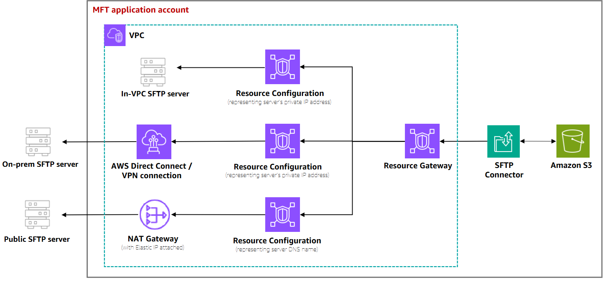
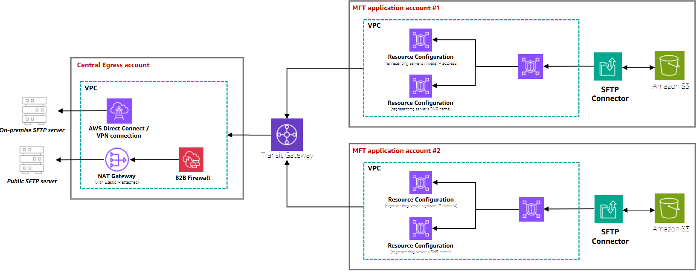

# Reference architectures using SFTP

connectors

This section lists the reference materials that are available for configuring
automated file transfer workflows using SFTP connectors. You can design your own
event-driven architectures by using the SFTP connector events in Amazon EventBridge, to
orchestrate between your file transfer action and pre- and post-processing actions in
AWS.

## Blog posts

The following blog post provides a reference architecture to build an MFT workflow using SFTP connectors, including encryption of files using PGP before sending them to a remote SFTP server using SFTP connectors:
[Architecting secure and compliant managed
file transfers with AWS Transfer Family SFTP connectors and PGP encryption.](https://aws.amazon.com/blogs/storage/architecting-secure-and-compliant-managed-file-transfers-with-aws-transfer-family-sftp-connectors-and-pgp-encryption/ "https://aws.amazon.com/blogs/storage/architecting-secure-and-compliant-managed-file-transfers-with-aws-transfer-family-sftp-connectors-and-pgp-encryption/")

## Workshops

- The following workshop provides hands on labs for configuring SFTP
  connectors and using your connectors to send or retrieve files from remote
  SFTP servers: [Transfer Family -
  SFTP workshop](https://catalog.workshops.aws/transfer-family-sftp/en-US "https://catalog.workshops.aws/transfer-family-sftp/en-US").
- The following workshop provides hands on labs to build fully automated and
  event-driven workflows involving file transfer to or from external SFTP
  servers to Amazon S3, and common pre- and post-processing of those files: [Event-driven MFT workshop](https://catalog.us-east-1.prod.workshops.aws/workshops/e55c90e0-bbb0-47e1-be83-6bafa3a59a8a/en-US "https://catalog.us-east-1.prod.workshops.aws/workshops/e55c90e0-bbb0-47e1-be83-6bafa3a59a8a/en-US").

This video provides a walk through of this workshop.

## Solutions

AWS Transfer Family provides the following solutions:

- The [File
  transfer synchronization solution](https://github.com/aws-samples/file-transfer-sync-solution "https://github.com/aws-samples/file-transfer-sync-solution") provides a reference
  architecture to automate the process of syncing remote SFTP
  directories—including entire folder structures—with your local
  Amazon S3 buckets using an SFTP connector. It orchestrates the process of listing
  remote directories, detecting changes, and transferring new or modified
  files.
- [Serverlessland - Selective file transfer between remote SFTP server
  & S3; using AWS Transfer Family](https://serverlessland.com/patterns/awstransfer-s3-sam?ref=search "https://serverlessland.com/patterns/awstransfer-s3-sam?ref=search") provides a sample pattern for listing
  files stored on remote SFTP locations, and transferring selective files to
  Amazon S3.

## VPC reference architectures

The following reference architectures show common patterns for deploying
VPC_LATTICE-enabled SFTP connectors. These examples help you understand where VPC Lattice
resources need to be created in your overall AWS architecture.

### Single account with shared egress

infrastructure

In this architecture, the egress infrastructure (NAT Gateway, VPN tunnel, or
Direct Connect) is configured in a VPC within the same account as your SFTP
connectors. All connectors can share the same Resource Gateway and NAT
Gateway.

This pattern is ideal when:

- All SFTP connectors are managed within a single AWS account
- Egress infrastructure is setup in a VPC within the same account as
  your SFTP connectors

### Cross-account with centralized egress

infrastructure

In this architecture, the egress infrastructure (NAT Gateway, VPN tunnel,
Direct Connect, or B2B Firewalls) is configured in a central Egress account
managed by the networking team. SFTP connectors are created in the MFT
Application account managed by the MFT admin team. Cross-account networking is
established using Transit Gateway to honor existing networking rules.

This pattern is ideal when:

- Network infrastructure is managed by a separate team in a dedicated
  account
- You have existing routes (such as AWS Transit Gateway ) between the account
  where SFTP connectors are created and the account where Egress
  infrastructure is setup. SFTP connectors will be able to leverage your
  existing routes connecting the two accounts.
- Centralized security controls and B2B firewalls are required
- You need to maintain separation of duties between networking and
  application teams
