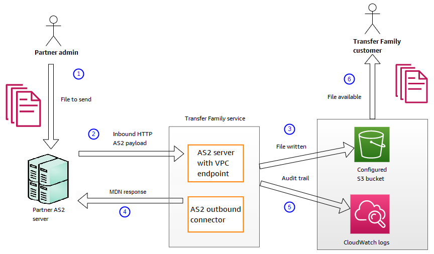
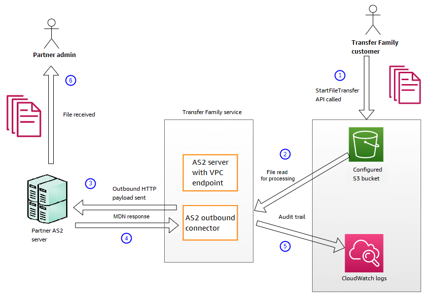

# Sending and receiving AS2 messages

This section describes the processes for sending and receiving AS2 messages. It also
provide details on filenames and locations associated with AS2 messages.

The following table lists the available encryption algorithms for AS2 messages, and
when you can use them.

| Encryption algorithm | HTTP | HTTPS | Notes                                                                                                                                          |
| -------------------- | ---- | ----- | ---------------------------------------------------------------------------------------------------------------------------------------------- |
| AES128_CBC           | Yes  | Yes   |                                                                                                                                                |
| AES192_CBC           | Yes  | Yes   |                                                                                                                                                |
| AES256_CBC           | Yes  | Yes   |                                                                                                                                                |
| DES_EDE3_CBC         | Yes  | Yes   | Only use this algorithm if you must support a legacy client that requires<br>it, as it is a weak encryption algorithm.                         |
| NONE                 | No   | Yes   | If you are sending messages to a Transfer Family server, you can only select<br>`NONE` if you are using an Application Load Balancer<br>(ALB). |

###### Topics

- [Receive AS2 message process](#as2-inbound-process "#as2-inbound-process")
- [Sending and receiving AS2 messages over
  HTTPS](#as2-https-process "#as2-https-process")
- [Transferring files by using an AS2
  connector](#transfer-as2-connectors "#transfer-as2-connectors")
- [File names and locations](#file-names-as2 "#file-names-as2")
- [Status codes](#status-codes "#status-codes")
- [Sample JSON files](#file-as2-json "#file-as2-json")

## Receive AS2 message process

The inbound process is defined as a message or file that's being transferred to
your AWS Transfer Family server. The sequence for inbound messages is as follows:

1. An admin or automated process starts an AS2 file transfer on the partner's
   remote AS2 server.
2. The partner's remote AS2 server signs and encrypts the file contents, then
   sends an HTTP POST request to an AS2 inbound endpoint hosted on Transfer Family.
3. Using the configured values for the server, partners, certificates, and
   agreement, Transfer Family decrypts and verifies the AS2 payload. The file contents are
   stored in the configured Amazon S3 file store.
4. The signed MDN response is returned either inline with the HTTP response,
   or asynchronously through a separate HTTP POST request back to the
   originating server.
5. An audit trail is written to Amazon CloudWatch with details about the
   exchange.
6. The decrypted file is available in a folder named
   `inbox/processed`.



## Sending and receiving AS2 messages over

HTTPS

This section describes how to configure a Transfer Family server that uses the AS2 protocol
to send and receive messages over HTTPS.

###### Topics

- [Send AS2 messages over HTTPS](#send-https "#send-https")
- [Receive AS2 messages over HTTPS](#receive-https "#receive-https")

### Send AS2 messages over HTTPS

To send AS2 messages using HTTPS, create a connector with the following
information:

- For the URL, specify an HTTPS URL
- For the encryption algorithm, select any of the available
  algorithms.

###### Note

To send messages to a Transfer Family server while not using encryption
(that is, you select `NONE` for the encryption
algorithm), you must use an Application Load Balancer (ALB).

- Provide the remaining values for the connector as described in [Configure AS2 connectors](configure-as2-connector.md "configure-as2-connector.md").

### Receive AS2 messages over HTTPS

AWS Transfer Family AS2 servers currently only provide HTTP transport over port 5080.
However, you can terminate TLS on a network or application load balancer in
front of your Transfer Family server VPC endpoint by using a port and certificate of your
choosing. With this approach, you can have incoming AS2 messages use
HTTPS.

Prerequisites

- The VPC must be in the same AWS Region as your Transfer Family server.
- The subnets of your VPC must be within the Availability Zones that you
  want to use your server in.

###### Note

Each Transfer Family server can support up to three Availability
Zones.

- Allocate up to three Elastic IP addresses in the same Region as your
  server. Or, you can choose to bring your own IP address range
  (BYOIP).

###### Note

The number of Elastic IP addresses must match the number of
Availability Zones that you use with your server endpoints.

You can configure either a Network Load Balance (NLB) or an Application Load
Balancer (ALB). The following table lists the pros and cons for each
approach.

The table below provides the differences in capabilities when you use an NLB
versus an ALB to terminate TLS.

| Feature             | Network Load Balancer (NLB)                                     | Application Load Balancer (ALB)                                                                                                                                                                                                                                                                                                                                                                                                    |
| ------------------- | --------------------------------------------------------------- | ---------------------------------------------------------------------------------------------------------------------------------------------------------------------------------------------------------------------------------------------------------------------------------------------------------------------------------------------------------------------------------------------------------------------------------- |
| Latency             | Lower latency as it operates at the network layer.              | Higher latency as it operates at the application<br>layer.                                                                                                                                                                                                                                                                                                                                                                         |
| Static IP support   | Can attach Elastic IP addresses that can be static.             | Cannot attach Elastic IP addresses: provides a domain whose<br>underlying IP addresses can change.                                                                                                                                                                                                                                                                                                                                 |
| Advanced routing    | Doesn't support advanced routing.                               | Supports advanced routing. Can inject<br>`X-Forwarded-Proto` header required for AS2<br>without encryption.<br>This header is described in [X-Forwarded-Proto](https://developer.mozilla.org/en-US/docs/Web/HTTP/Headers/X-Forwarded-Proto "https://developer.mozilla.org/en-US/docs/Web/HTTP/Headers/X-Forwarded-Proto") on the [developer.mozilla.org](https://developer.mozilla.org/ "https://developer.mozilla.org/") website. |
| TLS/SSL termination | Supports TLS/SSL termination                                    | Supports TLS/SSL termination                                                                                                                                                                                                                                                                                                                                                                                                       |
| Mutual TLS (mTLS)   | Transfer Family doesn't currently support using an NLB for mTLS | Support for mTLS                                                                                                                                                                                                                                                                                                                                                                                                                   |

Configure NLB
This procedure describes how to set up an internet-facing Network
Load Balancer (NLB) in your VPC.

###### To create a Network Load Balancer

and define the VPC endpoint of the server as the load balancer's
target

1.  Open the Amazon Elastic Compute Cloud console at [https://console.aws.amazon.com/ec2/](https://console.aws.amazon.com/ec2/ "https://console.aws.amazon.com/ec2/").
2.  From the navigation pane, choose **Load
    Balancers**, and then choose **Create
    load balancer**.
3.  Under **Network Load Balancer**, choose
    **Create**.
4.  In the **Basic configuration** section,
    enter the following information:
    - For **Name**, enter a descriptive
      name for the load balancer.
    - For **Scheme**, choose
      **Internet-facing**.
    - For **IP address type**, choose
      **IPv4**.

5.  In the **Network mapping** section, enter
    the following information:
    - For **VPC**, choose the virtual
      private cloud (VPC) that you created.
    - Under **Mappings**, choose the
      Availability Zones associated with the public
      subnets that are available in the same VPC that you
      use with your server endpoints.
    - For the **IPv4 address** of each
      subnet, choose one of the Elastic IP addresses that
      you allocated.

6.  In the **Listeners and routing** section,
    enter the following information:

        * For **Protocol**, choose
         **TLS**.
        * For **Port**, enter
         `5080`.
        * For **Default action**, choose
         **Create target group**. For the
         details of creating a new target group, see [To create a target group](#create-target-group "#create-target-group").

    After you create a target group, enter its name in the
    **Default action** field.

7.  In the **Secure listener settings**
    section, choose your certificate in the **Default
    SSL/TLS certificate** area.
8.  Choose **Create load balancer** to create
    your NLB.
9.  (Optional, but recommended) Turn on access logs for the
    Network Load Balancer to maintain a full audit trail, as
    described in [Access logs for your Network Load
    Balancer](../../../elasticloadbalancing/latest/network/load-balancer-access-logs.md "../../../elasticloadbalancing/latest/network/load-balancer-access-logs.md").

We recommend this step because the TLS connection is
terminated at the NLB. Therefore, the source IP address
that's reflected in your Transfer Family AS2 CloudWatch log groups is the
NLB's private IP address, instead of your trading partner's
external IP address.

Configure ALB
This procedure describes how to set up an Application Load
Balancer (ALB) in your VPC.

###### To create an Application Load

Balancer and define the VPC endpoint of the server as the load
balancer's target

1. Open the Amazon Elastic Compute Cloud console at [https://console.aws.amazon.com/ec2/](https://console.aws.amazon.com/ec2/ "https://console.aws.amazon.com/ec2/").
2. From the navigation pane, choose **Load
   Balancers**, and then choose **Create
   load balancer**.
3. Under **Application Load Balancer**,
   choose **Create**.
4. In the ALB console, create a new HTTP listener on port 443
   (HTTPS).
5. (Optional). If you want to set up mutual authentication
   (mTLS), configure security settings and a trust
   store.
   1. Attach your SSL/TLS certificate to the
      listener.
   2. Under **Client certificate
      handling**, select **Mutual
      authentication (mTLS)**.
   3. Choose **Verify with trust
      store**.
   4. Under **Advanced mTLS settings**,
      choose or create a trust store by uploading your CA
      certificates.

6. Create a new target group and add the private IP addresses
   of your Transfer Family AS2 server endpoints as targets on port 5080.
   For the details of creating a new target group, see [To create a target group](#create-target-group "#create-target-group").
7. Configure health checks for the target group to use the
   HTTP protocol on port 5080.
8. Create a new rule to forward HTTPS traffic from the
   listener to the target group.
9. Configure the listener to use your SSL/TLS
   certificate.

After you set up the load balancer, clients communicate with the load balancer
over the custom port listener. Then, the load balancer communicates with the
server over port 5080.

###### To create a target group

1. After you choose **Create target group** in the
   previous procedure, you are taken to the **Specify group
   details** page for a new target group.
2. In the **Basic configuration** section, enter the
   following information.
   - For **Choose a target type**, choose
     **IP addresses**.
   - For **Target group name**, enter a name for
     the target group.
   - For **Protocol**, your selection is dependent
     upon whether you are using an ALB or an NLB.
     - For a Network Load Balancer (NLB), choose
       **TCP**
     - For an Application Load Balancer (ALB), choose
       **HTTP**

   - For **Port**, enter
     `5080`.
   - For **IP address** type, choose
     **IPv4**.
   - For **VPC**, choose the VPC that you created
     for your Transfer Family AS2 server.

3. In the **Health checks** section, choose the
   **Health check protocol**.
   - For an ALB, choose **HTTP**
   - For an NLB, choose **TCP**

4. Choose **Next**.
5. On the **Register targets** page, enter the following
   information:
   - For **Network**, confirm that the VPC that
     you created for your Transfer Family AS2 server is specified.
   - For **IPv4 address**, enter the private IPv4
     address of your Transfer Family AS2 server's endpoints.

   If you have more than one endpoint for your server, choose
   **Add IPv4 address** to add another row for
   entering another IPv4 address. Repeat this process until you've
   entered the private IP addresses for all of your server's
   endpoints.
   - Make sure that **Ports** is set to
     `5080`.
   - Choose **Include as pending below** to add
     your entries to the **Review targets**
     section.

6. In the **Review targets** section, review your IP
   targets.
7. Choose **Create target group**, then go back to the
   previous procedure for creating your NLB and enter the new target group
   where indicated.

Test access to the server from an Elastic IP
address

Connect to the server over the custom port by using an Elastic IP address or
the DNS name of the Network Load Balancer.

###### Important

Manage access to your server from client IP addresses by using the [network access control lists (network ACLs)](../../../vpc/latest/userguide/vpc-network-acls.md "../../../vpc/latest/userguide/vpc-network-acls.md") for the subnets
configured on the load balancer. Network ACL permissions are set at the
subnet level, so the rules apply to all resources that are using the subnet.
You can't control access from client IP addresses by using security groups,
because the load balancer's target type is set to **IP
addresses** instead of **Instances**.
Therefore, the load balancer doesn't preserve source IP addresses. If the
[Network Load Balancer's health checks](../../../elasticloadbalancing/latest/network/target-group-health-checks.md "../../../elasticloadbalancing/latest/network/target-group-health-checks.md") fail, this means that the
load balancer can't connect to the server endpoint. To troubleshoot this
issue, check the following:

- Confirm that the server [endpoint's associated security group](https://aws.amazon.com/premiumsupport/knowledge-center/sftp-enable-elastic-ip-custom-port/ "https://aws.amazon.com/premiumsupport/knowledge-center/sftp-enable-elastic-ip-custom-port/") allows inbound
  connections from the subnets that are configured on the load
  balancer. The load balancer must be able to connect to the server
  endpoint over port 5080.
- Confirm that the server's **State** is
  **Online**.

## Transferring files by using an AS2

connector

AS2 connectors establish a relationship between trading partners for transfers of
AS2 messages from a Transfer Family server to an external, partner-owned destination.

You can use Transfer Family to send AS2 messages by referencing the connector ID and the paths
to the files, as illustrated in the following `start-file-transfer` AWS Command Line Interface (AWS CLI) command:

```
aws transfer start-file-transfer --connector-id c-`1234567890abcdef0` \
--send-file-paths "/amzn-s3-demo-source-bucket`/myfile1.txt`" "/amzn-s3-demo-source-bucket`/myfile2.txt`"
```

To get the details for your connectors, run the following command:

```
aws transfer list-connectors
```

The `list-connectors` command returns the connector IDs, URLs, and Amazon Resource Names (ARNs)
for your connectors.

To return the properties of a particular connector, run the following command with the ID that you want to use:

```
aws transfer describe-connector --connector-id `your-connector-id`
```

The `describe-connector` command returns all of the properties for the connector,
including its URL, roles, profiles, Message Disposition Notices (MDNs), tags, and monitoring metrics.

You can confirm that the partner successfully received the files by viewing
the JSON and MDN files. These files are named according to the conventions described
in [File names and locations](#file-names-as2 "#file-names-as2"). If you configured a logging role
when you created the connector, you can also check your CloudWatch logs for the status of AS2 messages.

To view AS2 connector details, see [View AS2 connector details](configure-as2-connector.md#connectors-view-info "configure-as2-connector.md#connectors-view-info"). For more information about creating AS2
connectors, see [Configure AS2 connectors](configure-as2-connector.md "configure-as2-connector.md").

###### To send an AS2 outbound message

The outbound process is defined as a message or file being sent from AWS to
an external client or service. The sequence for outbound messages is as
follows:

1. An admin calls the `start-file-transfer` AWS Command Line Interface (AWS CLI)
   command or the `StartFileTransfer` API operation. This operation
   references a `connector` configuration.
2. Transfer Family detects a new file request and locates the file. The file is
   compressed, signed, and encrypted.
3. A transfer HTTP client performs an HTTP POST request to transmit the
   payload to the partner's AS2 server.
4. The process returns the signed MDN response, inline with the HTTP response
   (synchronous MDN).
5. As the file moves between different stages of transmission, the process
   delivers the MDN response receipt and processing details to the customer.
6. The remote AS2 server makes the decrypted and verified file available to
   the partner admin.



AS2 processing supports many of the RFC 4130 protocols, with a focus on common use
cases and integration with existing AS2-enabled server implementations. For details
of the supported configurations, see [AS2 configurations](create-b2b-server.md#as2-supported-configurations "create-b2b-server.md#as2-supported-configurations").

## File names and locations

This section discusses the file-naming conventions for AS2 transfers.

For inbound file transfers, note the following:

- You specify the base directory in an agreement. The base directory is the
  Amazon S3 bucket name combined with a prefix, if any. For example,
  `/`amzn-s3-demo-bucket`/AS2-folder`.
- If an incoming file is processed successfully, the file (and the
  corresponding JSON file) is saved to the `/processed`
  folder. For example,
  `/`amzn-s3-demo-bucket`/AS2-folder/processed`.

The JSON file contains the following fields:

    + `agreement-id`
    + `as2-from`
    + `as2-to`
    + `as2-message-id`
    + `transfer-id`
    + `client-ip`
    + `connector-id`
    + `failure-message`
    + `file-path`
    + `message-subject`
    + `mdn-message-id`
    + `mdn-subject`
    + `requester-file-name`
    + `requester-content-type`
    + `server-id`
    + `status-code`
    + `failure-code`
    + `transfer-size`

- If an incoming file cannot be processed successfully, the file (and the
  corresponding JSON file) is saved to the `/failed`
  folder. For example,
  `/amzn-s3-demo-bucket/AS2-folder/failed`.
- The transferred file is stored in the `processed`
  folder as
  ``original_filename`.`messageId`.`original_extension``.
  That is, the message ID for the transfer is appended to the name of the
  file, before its original extension.
- A JSON file is created and saved as
  ``original_filename`.`messageId`.`original_extension`.json`.
In addition to the message ID being added, the string
`.json` is appended to the transferred file's
  name.
- A Message Disposition Notice (MDN) file is created and saved as
  ``original_filename`.`messageId`.`original_extension`.mdn`.
In addition to the message ID being added, the string
`.mdn` is appended to the transferred file's
  name.
- If there is an inbound file named
  `ExampleFileInS3Payload.dat`, the following files are
  created:
  - **File** –
    `ExampleFileInS3Payload.c4d6b6c7-23ea-4b8c-9ada-0cb811dc8b35@44313c54b0a46a36.dat`
  - **JSON** –
    `ExampleFileInS3Payload.c4d6b6c7-23ea-4b8c-9ada-0cb811dc8b35@44313c54b0a46a36.dat.json`
  - **MDN** –
    `ExampleFileInS3Payload.c4d6b6c7-23ea-4b8c-9ada-0cb811dc8b35@44313c54b0a46a36.dat.mdn`

For outbound transfers, the naming is similar, with the difference that there is
no incoming message file, and also, the transfer ID for the transferred message is
added to the file name. The transfer ID is returned by the
`StartFileTransfer` API operation (or when another process or script
calls this operation).

- The `transfer-id` is an identifier that is associated with a
  file transfer. All requests that are part of a
  `StartFileTransfer` call share a
  `transfer-id`.
- The base directory is the same as the path that you use for the source
  file. That is, the base directory is the path that you specify in the
  `StartFileTransfer` API operation or
  `start-file-transfer` AWS CLI command. For example:

```
aws transfer start-file-transfer --send-file-paths `/amzn-s3-demo-bucket/AS2-folder/file-to-send.txt`
```

If you run this command, MDN and JSON files are saved in
`/amzn-s3-demo-bucket/AS2-folder/processed` (for
successful transfers), or
`/amzn-s3-demo-bucket/AS2-folder/failed` (for
unsuccessful transfers).

- A JSON file is created and saved as
  ``original_filename`.`transferId`.`messageId`.`original_extension`.json`.
- An MDN file is created and saved as
  ``original_filename`.`transferId`.`messageId`.`original_extension`.mdn`.
- If there is an outbound file named
  `ExampleFileOutTestOutboundSyncMdn.dat`, the
  following files are created:
  - **JSON** –
    `ExampleFileOutTestOutboundSyncMdn.dedf4601-4e90-4043-b16b-579af35e0d83.fbe18db8-7361-42ff-8ab6-49ec1e435f34@c9c705f0baaaabaa.dat.json`
  - **MDN** –
    `ExampleFileOutTestOutboundSyncMdn.dedf4601-4e90-4043-b16b-579af35e0d83.fbe18db8-7361-42ff-8ab6-49ec1e435f34@c9c705f0baaaabaa.dat.mdn`

You can also check the CloudWatch logs to view the details of your transfers, including
any that failed.

## Status codes

The following table lists all of the status codes that can be logged to CloudWatch logs
when you or your partner send an AS2 message. Different message processing steps
apply to different message types and are intended for monitoring only. The COMPLETED
and FAILED states represent the final step in processing, and are visible in JSON
files.

| Code         | Description                                                                                                                                                       | Processing completed? |
| ------------ | ----------------------------------------------------------------------------------------------------------------------------------------------------------------- | --------------------- |
| PROCESSING   | The message is in the process of being converted to its final format. For example, decompression and decryption steps both have this status.                      | No                    |
| MDN_TRANSMIT | Message processing is sending an MDN response.                                                                                                                    | No                    |
| MDN_RECEIVE  | Message processing is receiving an MDN response.                                                                                                                  | No                    |
| COMPLETED    | Message processing has completed successfully. This state<br>includes when an MDN is sent for an inbound message or for MDN<br>verification of outbound messages. | Yes                   |
| FAILED       | The message processing has failed. For a list of error codes, see [AS2 error codes](as2-monitoring.md#as2-error-codes "as2-monitoring.md#as2-error-codes").       | Yes                   |

## Sample JSON files

This section lists sample JSON files for both inbound and outbound transfers,
including sample files for successful transfers and transfers that fail.

Sample outbound file that is successfully transferred:

```
{
  "requester-content-type": "application/octet-stream",
  "message-subject": "File xyzTest from MyCompany_OID to partner YourCompany",
  "requester-file-name": "TestOutboundSyncMdn-9lmCr79hV.dat",
  "as2-from": "MyCompany_OID",
  "connector-id": "c-c21c63ceaaf34d99b",
  "status-code": "COMPLETED",
  "disposition": "automatic-action/MDN-sent-automatically; processed",
  "transfer-size": 3198,
  "mdn-message-id": "OPENAS2-11072022063009+0000-df865189-1450-435b-9b8d-d8bc0cee97fd@PartnerA_OID_MyCompany_OID",
  "mdn-subject": "Message be18db8-7361-42ff-8ab6-49ec1e435f34@c9c705f0baaaabaa has been accepted",
  "as2-to": "PartnerA_OID",
  "transfer-id": "dedf4601-4e90-4043-b16b-579af35e0d83",
  "file-path": "/amzn-s3-demo-bucket/as2testcell0000/openAs2/TestOutboundSyncMdn-9lmCr79hV.dat",
  "as2-message-id": "fbe18db8-7361-42ff-8ab6-49ec1e435f34@c9c705f0baaaabaa",
  "timestamp": "2022-07-11T06:30:10.791274Z"
}
```

Sample outbound file that is unsuccessfully transferred:

```
{
  "failure-code": "HTTP_ERROR_RESPONSE_FROM_PARTNER",
  "status-code": "FAILED",
  "requester-content-type": "application/octet-stream",
  "subject": "Test run from Id da86e74d6e57464aae1a55b8596bad0a to partner 9f8474d7714e476e8a46ce8c93a48c6c",
  "transfer-size": 3198,
  "requester-file-name": "openAs2TestOutboundWrongAs2Ids-necco-3VYn5n8wE.dat",
  "as2-message-id": "9a9cc9ab-7893-4cb6-992a-5ed8b90775ff@718de4cec1374598",
  "failure-message": "http://Test123456789.us-east-1.elb.amazonaws.com:10080 returned status 500 for message with ID 9a9cc9ab-7893-4cb6-992a-5ed8b90775ff@718de4cec1374598",
  "transfer-id": "07bd3e07-a652-4cc6-9412-73ffdb97ab92",
  "connector-id": "c-056e15cc851f4b2e9",
  "file-path": "/amzn-s3-demo-bucket-4c1tq6ohjt9y/as2IntegCell0002/openAs2/openAs2TestOutboundWrongAs2Ids-necco-3VYn5n8wE.dat",
  "timestamp": "2022-07-11T21:17:24.802378Z"
}
```

Sample inbound file that is successfully transferred:

```
{
  "requester-content-type": "application/EDI-X12",
  "subject": "File openAs2TestInboundAsyncMdn-necco-5Ab6bTfCO.dat sent from MyCompany to PartnerA",
  "client-ip": "10.0.109.105",
  "requester-file-name": "openAs2TestInboundAsyncMdn-necco-5Ab6bTfCO.dat",
  "as2-from": "MyCompany_OID",
  "status-code": "COMPLETED",
  "disposition": "automatic-action/MDN-sent-automatically; processed",
  "transfer-size": 1050,
  "mdn-subject": "Message Disposition Notification",
  "as2-message-id": "OPENAS2-11072022233606+0000-5dab0452-0ca1-4f9b-b622-fba84effff3c@MyCompany_OID_PartnerA_OID",
  "as2-to": "PartnerA_OID",
  "agreement-id": "a-f5c5cbea5f7741988",
  "file-path": "processed/openAs2TestInboundAsyncMdn-necco-5Ab6bTfCO.OPENAS2-11072022233606+0000-5dab0452-0ca1-4f9b-b622-fba84effff3c@MyCompany_OID_PartnerA_OID.dat",
  "server-id": "s-5f7422b04c2447ef9",
  "timestamp": "2022-07-11T23:36:36.105030Z"
}
```

Sample inbound file that is unsuccessfully transferred:

```
{
  "failure-code": "INVALID_REQUEST",
  "status-code": "FAILED",
  "subject": "Sending a request from InboundHttpClientTests",
  "client-ip": "10.0.117.27",
  "as2-message-id": "testFailedLogs-TestRunConfig-Default-inbound-direct-integ-0c97ee55-af56-4988-b7b4-a3e0576f8f9c@necco",
  "as2-to": "0beff6af56c548f28b0e78841dce44f9",
  "failure-message": "Unsupported date format: 2022/123/456T",
  "agreement-id": "a-0ceec8ca0a3348d6a",
  "as2-from": "ab91a398aed0422d9dd1362710213880",
  "file-path": "failed/01187f15-523c-43ac-9fd6-51b5ad2b08f3.testFailedLogs-TestRunConfig-Default-inbound-direct-integ-0c97ee55-af56-4988-b7b4-a3e0576f8f9c@necco",
  "server-id": "s-0582af12e44540b9b",
  "timestamp": "2022-07-11T06:30:03.662939Z"
}
```
