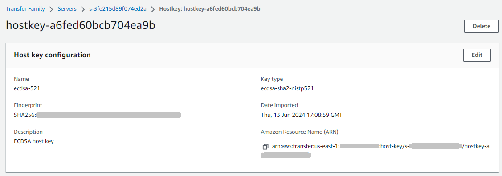
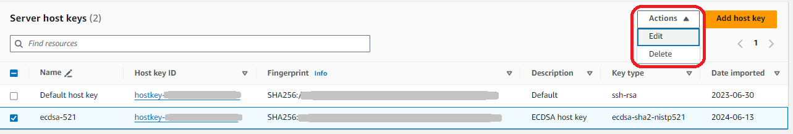

# Additional server host key information

You can select a host key to display details for that key.

You can delete a host key, or edit its description from the
**Actions** menu on the Server details screen. Select the host key,
then choose the appropriate action from the menu.

