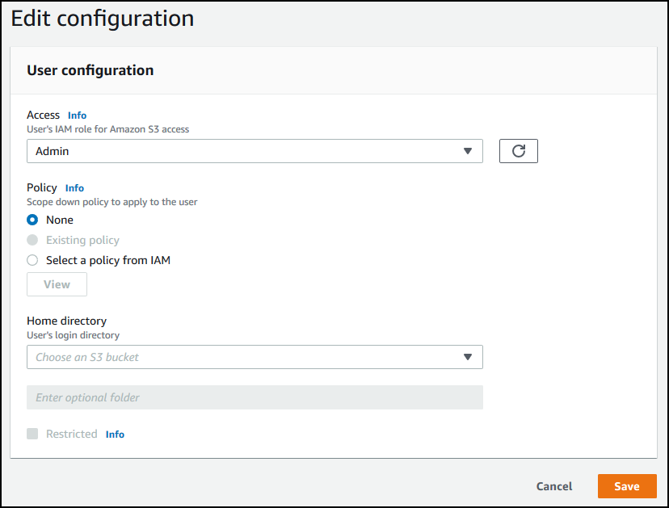

# Working with service-managed users

You can add either Amazon S3 or Amazon EFS service-managed users to your server, depending on
the server's **Domain** setting. For more information, see [Configuring an SFTP, FTPS, or FTP server
endpoint](tf-server-endpoint.md "tf-server-endpoint.md").

If you use a service-managed identity type, you add users to your file transfer
protocol enabled server. When you do so, each username must be unique on your
server.

To add a service-managed user programmatically, see the [example](../APIReference/API_CreateUser.md#API_CreateUser_Examples "../APIReference/API_CreateUser.md#API_CreateUser_Examples") for the [CreateUser](../APIReference/API_CreateUser.md "../APIReference/API_CreateUser.md")
API.

###### Note

For service-managed users there is a limit of 2,000 logical directory entries. For
information about using logical directories see [Using logical directories to simplify your Transfer Family
directory structures](logical-dir-mappings.md "logical-dir-mappings.md").

###### Topics

- [Adding Amazon S3 service-managed users](#add-s3-user "#add-s3-user")
- [Adding Amazon EFS service-managed users](#add-efs-user "#add-efs-user")
- [Managing service-managed
  users](#managing-service-managed-users "#managing-service-managed-users")

## Adding Amazon S3 service-managed users

###### Note

If you want to configure a cross account Amazon S3 bucket, follow the steps
mentioned in this Knowledge Center article: [How do I configure my AWS Transfer Family server to use an Amazon Simple Storage Service bucket that's in
another AWS account?](https://aws.amazon.com/premiumsupport/knowledge-center/sftp-cross-account-s3-bucket/ "https://aws.amazon.com/premiumsupport/knowledge-center/sftp-cross-account-s3-bucket/").

###### To add an Amazon S3 service-managed user to your server

1. Open the AWS Transfer Family console at [https://console.aws.amazon.com/transfer/](https://console.aws.amazon.com/transfer/ "https://console.aws.amazon.com/transfer/"), then select
   **Servers** from the navigation pane.
2. On the **Servers** page, select the check box of the
   server that you want to add a user to.
3. Choose **Add user**.
4. In the **User configuration** section, for
   **Username**, enter the username. This
   username must be a minimum of 3 and a maximum of 100 characters. You can use the following
   characters in the username: a–z, A-Z, 0–9, underscore '\_',
   hyphen '-', period '.' and at sign '@'. The username can't start with
   a hyphen '-', period '.' or at sign '@'.
5. For **Access**, choose the IAM role that you previously
   created that provides access to your Amazon S3 bucket.

You created this IAM role using the procedure in [Create an IAM role and policy](requirements-roles.md "requirements-roles.md"). That
IAM role includes an IAM policy that provides access to your Amazon S3
bucket. It also includes a trust relationship with the AWS Transfer Family service,
defined in another IAM policy. If you need fine-grained access control for
your users, refer to the [Enhance data access control with AWS Transfer Family and Amazon S3](https://aws.amazon.com/blogs/storage/enhance-data-access-control-with-aws-transfer-family-and-amazon-s3-access-points/ "https://aws.amazon.com/blogs/storage/enhance-data-access-control-with-aws-transfer-family-and-amazon-s3-access-points/") blog
post. 6. (Optional) For **Policy**, select one of the
following:

    * **None**
    * **Existing policy**
    * **Select a policy from IAM**: allows you to
     choose an existing session policy. Choose **View**
     to see a JSON object containing the details of the policy.
    * **Auto-generate policy based on home folder**:
     generates a session policy for you. Choose **View**
     to see a JSON object containing the details of the policy.

    ###### Note

    If you choose **Auto-generate policy based on home
     folder**, do not select
     **Restricted** for this user.

To learn more about session policies, see [Create an IAM role and policy](requirements-roles.md "requirements-roles.md"), [Creating a session policy for an Amazon S3
bucket](users-policies-session.md "users-policies-session.md"), or [Dynamic permission management
approaches](dynamic-permission-management.md "dynamic-permission-management.md"). 7. For **Home directory**, choose the Amazon S3 bucket to store
the data to transfer using AWS Transfer Family. Enter the path to the `home`
directory where your user lands when they log in using their client.

If you keep this parameter blank, the `root` directory of your
Amazon S3 bucket is used. In this case, make sure that your IAM role provides
access to this `root` directory.

###### Note

We recommend that you choose a directory path that contains the user
name of the user, which enables you to effectively use a session policy.
The session policy limits user access in the Amazon S3 bucket to that
user's `home` directory. 8. (Optional) For **Restricted**, select the check box so
that your users can't access anything outside of that folder and
can't see the Amazon S3 bucket or folder name.

###### Note

Assigning the user a home directory and restricting the user to that
home directory should be sufficient to lock down the user's access
to the designated folder. If you need to apply further controls, use a
session policy.

If you select **Restricted** for this user, you
cannot select **Auto-generate policy based on home
folder**, because home folder is not a defined value for
Restricted users. 9. For **SSH public key**, enter the public SSH key portion
of the SSH key pair.

Your key is validated by the service before you can add your new
user.

###### Note

For instructions on how to generate an SSH key pair, see [Generate SSH keys for service-managed users](sshkeygen.md "sshkeygen.md"). 10. (Optional) For **Key** and **Value**,
enter one or more tags as key-value pairs, and choose **Add
tag**. 11. Choose **Add** to add your new user to the server that
you chose.

The new user appears in the **Users** section of the
**Server details** page.

**Next steps** – For the next step, continue
on to [Transferring files over a server endpoint using a
client](transfer-file.md "transfer-file.md").

## Adding Amazon EFS service-managed users

Amazon EFS uses the Portable Operating System Interface (POSIX) file permission model
to represent file ownership.

- For more details on Amazon EFS file ownership, see [Amazon EFS file ownership](configure-storage.md#efs-file-ownership "configure-storage.md#efs-file-ownership").
- For more details on setting up directories for your EFS users, see [Set up Amazon EFS users for
  Transfer Family](configure-storage.md#configure-efs-users-permissions "configure-storage.md#configure-efs-users-permissions").

###### To add an Amazon EFS service-managed user to your server

1.  Open the AWS Transfer Family console at [https://console.aws.amazon.com/transfer/](https://console.aws.amazon.com/transfer/ "https://console.aws.amazon.com/transfer/"), then select
    **Servers** from the navigation pane.
2.  On the **Servers** page, select the Amazon EFS server that you
    want to add a user to.
3.  Choose **Add user** to display the **Add
    user** page.
4.  In the **User configuration** section, use the following
    settings.
    1.  The **Username**, must be a minimum of 3 and a
        maximum of 100 characters. You can use the following characters in
        the username: a–z, A-Z, 0–9, underscore '\_', hyphen
        '-', period '.', and at sign "@". The username can't start with
        a hyphen '-', period '.', or at sign "@".
    2.  For **User ID** and **Group
        ID**, note the following:
        - For the first user that you create, we recommend that you
          enter a value of `0` for both
          **Group ID** and **User
          ID**. This grants the user administrator
          privileges for Amazon EFS.
        - For additional users, enter the user's POSIX user ID and
          group ID. These IDs are used for all Amazon Elastic File System operations
          performed by the user.
        - For **User ID** and **Group
          ID**, do not use any leading zeroes. For
          example, `12345` is acceptable,
          `012345` is not.

    3.  (Optional) For **Secondary Group IDs**, enter one
        or more additional POSIX group IDs for each user, separated by
        commas.
    4.  For **Access**, choose the IAM role
        that:

            * Gives the user access to only the Amazon EFS resources (file
             systems) that you want them to access.
            * Defines which file system operations that the user can and
             cannot perform.

        We recommend that you use the IAM role for Amazon EFS file system
        selection with mount access and read/write permissions. For example,
        the combination of the following two AWS managed policies, while
        quite permissive, grants the necessary permissions for your user:

            * AmazonElasticFileSystemClientFullAccess
            * AWSTransferConsoleFullAccess

        For more information, see the blog post [AWS Transfer Family support for Amazon Elastic File System](https://aws.amazon.com/blogs/aws/new-aws-transfer-family-support-for-amazon-elastic-file-system/ "https://aws.amazon.com/blogs/aws/new-aws-transfer-family-support-for-amazon-elastic-file-system/").

    5.  For **Home directory**, do the following:
        - Choose the Amazon EFS file system that you want to use for
          storing the data to transfer using AWS Transfer Family.
        - Decide whether to set the home directory to
          **Restricted**. Setting the home
          directory to **Restricted** has the
          following effects:
          - Amazon EFS users can't access any files or directories
            outside of that folder.
          - Amazon EFS users can't see the Amazon EFS file system name
            (**fs-xxxxxxx**).

          ###### Note

          When you select the
          **Restricted** option, symlinks
          don't resolve for Amazon EFS users.

        - (Optional) Enter the path to the home directory that you
          want users to be in when they log in using their
          client.

        If you don't specify a home directory, the root directory
        of your Amazon EFS file system is used. In this case, make sure
        that your IAM role provides access to this root
        directory.

5.  For **SSH public key**, enter the public SSH key portion
    of the SSH key pair.

Your key is validated by the service before you can add your new
user.

###### Note

For instructions on how to generate an SSH key pair, see [Generate SSH keys for service-managed users](sshkeygen.md "sshkeygen.md"). 6. (Optional) Enter any tags for the user. For **Key** and
**Value**, enter one or more tags as key-value pairs,
and choose **Add tag**. 7. Choose **Add** to add your new user to the server that
you chose.

The new user appears in the **Users** section of the
**Server details** page.

Issues that you might encounter when you first SFTP to your Transfer Family server:

- If you run the `sftp` command and the prompt doesn't appear,
  you might encounter the following message:

`Couldn't canonicalize: Permission denied`

`Need cwd`

In this case, you must increase the policy permissions for your user's
role. You can add an AWS managed policy, such as
`AmazonElasticFileSystemClientFullAccess`.

- If you enter `pwd` at the `sftp` prompt to view the
  user's home directory, you might see the following message, where
  `USER-HOME-DIRECTORY` is the home directory for
  the SFTP user:

`remote readdir("/`USER-HOME-DIRECTORY`"): No
 such file or directory`

In this case, you should be able to navigate to the parent directory
(`cd ..`), and create the user's home directory (`mkdir
 `username``) .

**Next steps** – For the next step, continue
on to [Transferring files over a server endpoint using a
client](transfer-file.md "transfer-file.md").

## Managing service-managed

users

In this section, you can find information about how to view a list of users, how
to edit user details, and how to add an SSH public key.

- [View a list of users](#list-users "#list-users")
- [View or edit user details](#view-user-details "#view-user-details")
- [Delete a user](#delete-user "#delete-user")
- [Add SSH public key](#add-user-ssh-key "#add-user-ssh-key")
- [Delete SSH public key](#delete-user-ssh-key "#delete-user-ssh-key")

###### To find a list of your users

1. Open the AWS Transfer Family console at [https://console.aws.amazon.com/transfer/](https://console.aws.amazon.com/transfer/ "https://console.aws.amazon.com/transfer/").
2. Select **Servers** from the navigation pane to display
   the **Servers** page.
3. Choose the identifier in the **Server ID** column to see
   the **Server details** page.
4. Under **Users**, view a list of users.

###### To view or edit user details

1. Open the AWS Transfer Family console at [https://console.aws.amazon.com/transfer/](https://console.aws.amazon.com/transfer/ "https://console.aws.amazon.com/transfer/").
2. Select **Servers** from the navigation pane to display
   the **Servers** page.
3. Choose the identifier in the **Server ID** column to see
   the **Server details** page.
4. Under **Users**, choose a username to see the
   **User details** page.

You can change the user's properties on this page by choosing
**Edit**. 5. On the **Users details** page, choose
**Edit** next to **User
configuration**.

 6. On the **Edit configuration** page, for
**Access**, choose the IAM role that you previously
created that provides access to your Amazon S3 bucket.

You created this IAM role using the procedure in [Create an IAM role and policy](requirements-roles.md "requirements-roles.md"). That
IAM role includes an IAM policy that provides access to your Amazon S3
bucket. It also includes a trust relationship with the AWS Transfer Family service,
defined in another IAM policy. 7. (Optional) For **Policy**, choose one of the
following:

    * **None**
    * **Existing policy**
    * **Select a policy from IAM** to choose an
     existing policy. Choose **View** to see a JSON
     object containing the details of the policy.

To learn more about session policies, see [Create an IAM role and policy](requirements-roles.md "requirements-roles.md"). To
learn more about creating a session policy, see [Creating a session policy for an Amazon S3
bucket](users-policies-session.md "users-policies-session.md"). 8. For **Home directory**, choose the Amazon S3 bucket to store
the data to transfer using AWS Transfer Family. Enter the path to the `home`
directory where your user lands when they log in using their client.

If you leave this parameter blank, the `root` directory of your
Amazon S3 bucket is used. In this case, make sure that your IAM role provides
access to this `root` directory.

###### Note

We recommend that you choose a directory path that contains the user
name of the user, which enables you to effectively use a session policy.
The session policy limits user access in the Amazon S3 bucket to that
user's `home` directory. 9. (Optional) For **Restricted**, select the check box so
that your users can't access anything outside of that folder and can't
see the Amazon S3 bucket or folder name.

###### Note

When assigning the user a home directory and restricting the user to
that home directory, this should be sufficient enough to lock down the
user's access to the designated folder. Use a session policy when
you need to apply further controls. 10. Choose **Save** to save your changes.

###### To delete a user

1. Open the AWS Transfer Family console at [https://console.aws.amazon.com/transfer/](https://console.aws.amazon.com/transfer/ "https://console.aws.amazon.com/transfer/").
2. Select **Servers** from the navigation pane to display
   the **Servers** page.
3. Choose the identifier in the **Server ID** column to see
   the **Server details** page.
4. Under **Users**, choose a username to see the
   **User details** page.
5. On the **Users details** page, choose
   **Delete** to the right of the username.
6. In the confirmation dialog box that appears, enter the word
   `delete`, and then choose
   **Delete** to confirm that you want to delete the
   user.

The user is deleted from the **users** list.

###### To add an SSH public key for a user

1. Open the AWS Transfer Family console at [https://console.aws.amazon.com/transfer/](https://console.aws.amazon.com/transfer/ "https://console.aws.amazon.com/transfer/").
2. In the navigation pane, choose **Servers**.
3. Choose the identifier in the **Server ID** column to see the
   **Server details** page.
4. Under **Users**, choose a username to see the **User
   details** page.
5. Choose **Add SSH public key** to add a new SSH public key
   to a user.

###### Note

SSH keys are used only by servers that are enabled for Secure Shell
(SSH) File Transfer Protocol (SFTP). For information about how to
generate an SSH key pair, see [Generate SSH keys for service-managed users](sshkeygen.md "sshkeygen.md"). 6. For **SSH public key**, enter the SSH public key portion
of the SSH key pair.

Your key is validated by the service before you can add your new user. The
format of the SSH key is `ssh-rsa
 `string``. To generate an SSH key pair,
see [Generate SSH keys for service-managed users](sshkeygen.md "sshkeygen.md"). 7. Choose **Add key**.

###### To delete an SSH public key for a user

1. Open the AWS Transfer Family console at [https://console.aws.amazon.com/transfer/](https://console.aws.amazon.com/transfer/ "https://console.aws.amazon.com/transfer/").
2. In the navigation pane, choose **Servers**.
3. Choose the identifier in the **Server ID** column to see the
   **Server details** page.
4. Under **Users**, choose a username to see the **User
   details** page.
5. To delete a public key, select its SSH key check box and choose
   **Delete**.
