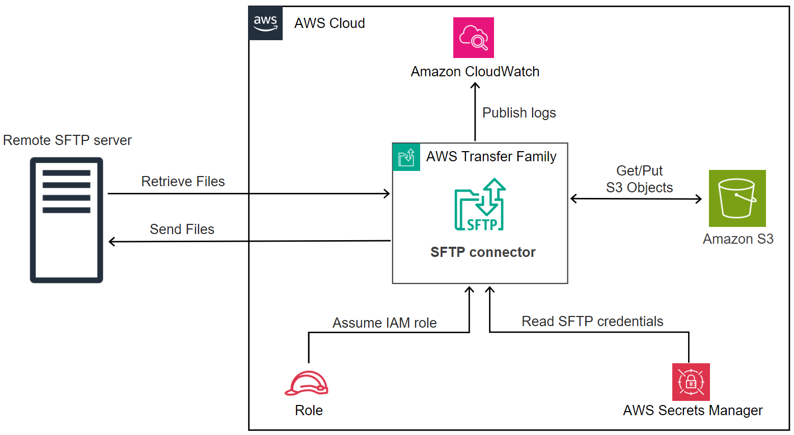
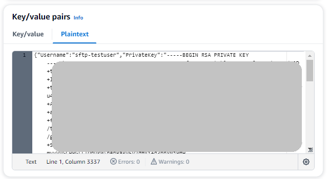
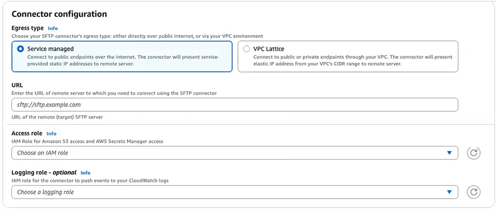
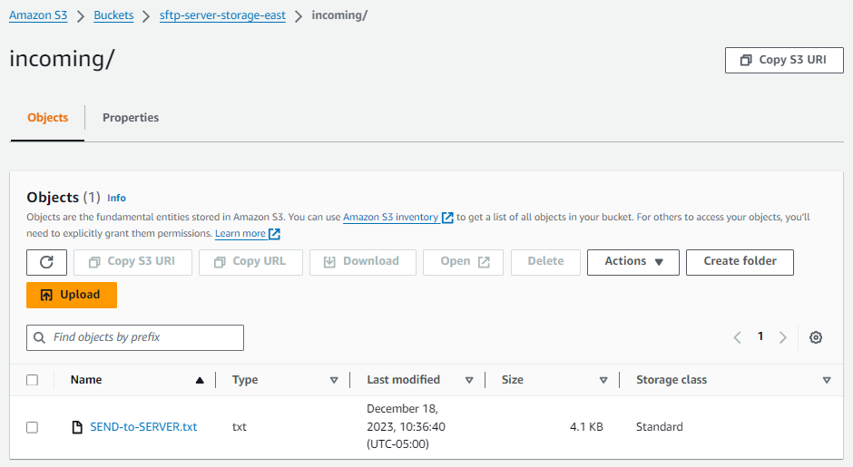
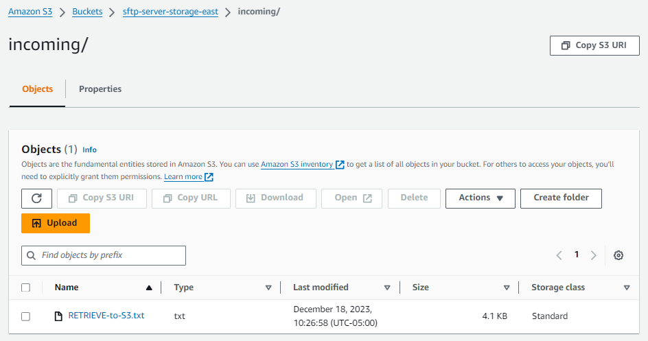

# Setting up and using SFTP connectors

The purpose of a connector is to establish a relationship between your AWS storage
and a partner's SFTP server. You can send files from Amazon S3 to an external, partner-owned
destination. You can also use an SFTP connector to retrieve files from a partner's SFTP
server.

This tutorial illustrates how to set up an SFTP connector with both service managed and
VPC_LATTICE egress types, and then transfer files between Amazon S3 storage and an SFTP
server.

An SFTP connector retrieves SFTP credentials from AWS Secrets Manager to authenticate into a remote
SFTP server and establish a connection. The connector sends files to or retrieves files from
the remote server, and stores the files in Amazon S3. You can choose between service managed
egress (using AWS managed infrastructure) or VPC egress (routing through your VPC using
Cross-VPC Resource Access). An IAM role is used to allow access to the Amazon S3 bucket and to
the credentials stored in Secrets Manager. And you can log to Amazon CloudWatch.


The following blog post provides a reference architecture to build an MFT workflow using SFTP connectors, including encryption of files using PGP before sending them to a remote SFTP server using SFTP connectors:
[Architecting secure and compliant managed
file transfers with AWS Transfer Family SFTP connectors and PGP encryption.](https://aws.amazon.com/blogs//storage/architecting-secure-and-compliant-managed-file-transfers-with-aws-transfer-family-sftp-connectors-and-pgp-encryption/ "https://aws.amazon.com/blogs//storage/architecting-secure-and-compliant-managed-file-transfers-with-aws-transfer-family-sftp-connectors-and-pgp-encryption/")

## Connector egress types

SFTP connectors support two egress types that determine how your connector routes
traffic to remote SFTP servers:

- **SERVICE_MANAGED** (default): Uses AWS
  Transfer Family managed infrastructure with static IP addresses for outbound
  connections.
- **VPC**: Routes traffic through your VPC using
  Cross-VPC Resource Access, enabling private endpoint connectivity and use of
  your own NAT gateways.

This tutorial covers both egress types. Choose VPC egress type when you need
to:

- Connect to private SFTP servers in your VPC (private IP addresses)
- Connect to on-premises SFTP servers via Direct Connect or VPN
- Route public endpoint traffic through your VPC for security controls
- Use your own Elastic IP addresses for outbound connections

###### Topics

- [Step 1: Create the necessary supporting
  resources](#create-prereq-resources "#create-prereq-resources")
- [Step 2: Create and test an SFTP
  connector](#create-connector-tutorial "#create-connector-tutorial")
- [Step 3: Send and retrieve files using the SFTP
  connector](#use-connector-tutorial "#use-connector-tutorial")
- [Procedures to create a Transfer Family server to
  use as your remote SFTP server](#non-standard-tutorial-procedures "#non-standard-tutorial-procedures")

## Step 1: Create the necessary supporting

resources

You can use SFTP connectors to copy files between Amazon S3 and any remote SFTP server. For
this tutorial, we are using an AWS Transfer Family server as our remote SFTP server. We need to
create and configure the following resources:

- Create Amazon S3 buckets to store files in your AWS environment, and to send and
  retrieve files from the remote SFTP server: [Create Amazon S3 buckets](#sftp-tutorial-s3-bucket "#sftp-tutorial-s3-bucket").
- Create an AWS Identity and Access Management role for accessing Amazon S3 storage and our secret in
  Secrets Manager: [Create an IAM role with the necessary
  permissions](#sftp-tutorial-role "#sftp-tutorial-role").
- Create a Transfer Family server that uses the SFTP protocol, and a service-managed user
  that uses the SFTP connector to transfer files to or from the SFTP server: [Create a Transfer Family SFTP server and a user](#sftp-tutorial-server "#sftp-tutorial-server").
- Create an AWS Secrets Manager secret that stores the credentials used by the SFTP
  connector to log in to the remote SFTP server: [Create and store a secret in
  AWS Secrets Manager](#sftp-tutorial-secret "#sftp-tutorial-secret").

For VPC egress type connectors, you also need:

- A VPC with appropriate subnets and security groups
- A Resource Gateway (minimum 2 Availability Zones required): [Create a Resource Gateway (VPC
  egress type only)](#sftp-tutorial-resource-gateway "#sftp-tutorial-resource-gateway").
- A Resource Configuration pointing to your SFTP server: [Create a Resource Configuration (VPC
  egress type only)](#sftp-tutorial-resource-config "#sftp-tutorial-resource-config"). For more information, see
  [Resource configurations](../../../vpc-lattice/latest/ug/resource-configuration.md "../../../vpc-lattice/latest/ug/resource-configuration.md") in the _Amazon VPC Lattice User
  Guide_.

### Create Amazon S3 buckets

###### To create an Amazon S3 bucket

1. Sign in to the AWS Transfer Family console at [https://console.aws.amazon.com/s3/](https://console.aws.amazon.com/s3/ "https://console.aws.amazon.com/s3/").
2. Choose a Region and enter a name.

For this tutorial, our bucket is in `US East (N. Virginia)
 us-east-1`, and the name is
`sftp-server-storage-east`. 3. Accept the defaults and choose **Create bucket**.

For complete details about creating Amazon S3 buckets, see [How do I create an
S3 bucket?](../../../AmazonS3/latest/user-guide/create-bucket-overview.md "../../../AmazonS3/latest/user-guide/create-bucket-overview.md") in the _Amazon Simple Storage Service User Guide_.

### Create an IAM role with the necessary

permissions

For the access role, create a policy with the following permissions.

JSON

```
`{
 "Version":"2012-10-17",
 "Statement": [
 {
 "Sid": "AllowListingOfUserFolder",
 "Action": [
 "s3:ListBucket",
 "s3:GetBucketLocation"
 ],
 "Effect": "Allow",
 "Resource": [
 "arn:aws:s3:::amzn-s3-demo-bucket"
 ]
 },
 {
 "Sid": "HomeDirObjectAccess",
 "Effect": "Allow",
 "Action": [
 "s3:PutObject",
 "s3:GetObject",
 "s3:DeleteObject",
 "s3:DeleteObjectVersion",
 "s3:GetObjectVersion",
 "s3:GetObjectACL",
 "s3:PutObjectACL"
 ],
 "Resource": "arn:aws:s3:::amzn-s3-demo-bucket/*"
 },
 {
 "Sid": "GetConnectorSecretValue",
 "Effect": "Allow",
 "Action": [
 "secretsmanager:GetSecretValue"
 ],
 "Resource": "arn:aws:secretsmanager:`us-west-2`:`111122223333`:secret:aws/transfer/`SecretName-6RandomCharacters`"
 }
 ]
}`

```

Replace items as follows:

- For `amzn-s3-demo-bucket`, the tutorial uses
  `sftp-server-storage-east`.
- For `region`, the tutorial uses
  `us-east-1`.
- For `account-id`, use your AWS account
  ID.
- For `SecretName-6RandomCharacters`, we are
  `using sftp-connector1` for the name (you will have
  your own six random characters for your secret).

You must also make sure that this role contains a trust relationship that allows
the connector to access your resources when servicing your users' transfer
requests. For details on establishing a trust relationship, see [To establish a trust relationship](requirements-roles.md#establish-trust-transfer "requirements-roles.md#establish-trust-transfer").

###### Note

To see the details for the role that we are using for the tutorial, see [Combined user and access role](#sftp-tutorial-combined-role "#sftp-tutorial-combined-role").

### Create and store a secret in

AWS Secrets Manager

We need to store a secret in Secrets Manager to store user credentials for your SFTP
connector. You can use a password, SSH private key, or both. For the tutorial, we
are using a private key.

###### Note

When you store secrets in Secrets Manager, your AWS account incurs charges. For information about
pricing, see [AWS Secrets Manager Pricing](https://aws.amazon.com/secrets-manager/pricing "https://aws.amazon.com/secrets-manager/pricing").

Before you begin the procedure to store the secret, retrieve and format your
private key. The private key must correspond to the public key that is configured
for the user on the remote SFTP server. For our tutorial, the private key must
correspond to the public key that is stored for our test user on the Transfer Family SFTP
server that we are using as remote server.

To do this, run the following command:

```
jq -sR . `path-to-private-key-file`
```

For example, if your private key file is located in
`~/.ssh/sftp-testuser-privatekey`, the command is as
follows.

```
jq -sR . ~/.ssh/sftp-testuser-privatekey
```

This outputs the key in the correct format (with embedded newline characters) to
standard output. Copy this text somewhere, as you need to paste it in the following
procedure (in step 6).

###### To store user credentials in Secrets Manager for an SFTP connector

1. Sign in to the AWS Management Console and open the AWS Secrets Manager console at [https://console.aws.amazon.com/secretsmanager/](https://console.aws.amazon.com/secretsmanager/ "https://console.aws.amazon.com/secretsmanager/").
2. In the left navigation pane, choose **Secrets**.
3. On the **Secrets** page, choose **Store a new
   secret**.
4. On the **Choose secret type** page, for **Secret
   type**, choose **Other type of secret**.
5. In the **Key/value pairs** section, choose the
   **Key/value** tab.
   - **Key** — Enter
     `Username`.
   - **value** — Enter the name of our user,
     `sftp-testuser`.

6. To enter the key, we recommend that you use the
   **Plaintext** tab.
   1. Choose **Add row**, then enter
      `PrivateKey`.
   2. Choose the **Plaintext** tab. The field now
      contains the following text:

   ```
   {"Username":"sftp-testuser","PrivateKey":""}
   ```

   3. Paste in the text for your private key (saved earlier) between the
      empty double quotes ("").

   Your screen should look as follows (key data is grayed
   out).

   

7. Choose **Next**.
8. On the **Configure secret** page, enter a name for your
   secret. For this tutorial, we name the secret
   `aws/transfer/sftp-connector1`.
9. Choose **Next**, and then accept the defaults on the
   **Configure rotation** page. Then choose
   **Next**.
10. On the **Review** page, choose **Store**
    to create and store the secret.

### Create a Resource Gateway (VPC

egress type only)

For VPC egress type connectors, you need to create a Resource Gateway in your VPC.
The Resource Gateway serves as the entry point for Cross-VPC Resource Access.

###### To create a Resource Gateway

1. Run the following command to create a Resource Gateway (replace the VPC ID
   and subnet IDs with your values):

```
aws vpc-lattice create-resource-gateway \
    --name my-sftp-resource-gateway \
    --vpc-identifier vpc-12345678 \
    --subnet-ids subnet-12345678 subnet-87654321
```

###### Note

Resource Gateways require subnets in at least 2 Availability
Zones. 2. Note the Resource Gateway ID from the response for use in the next
step.

### Create a Resource Configuration (VPC

egress type only)

Create a Resource Configuration that points to your SFTP server. This can be a
private IP address for servers in your VPC, or a public DNS name for external
servers. For more information about Resource Configurations, see [Resource configurations](../../../vpc-lattice/latest/ug/resource-configuration.md "../../../vpc-lattice/latest/ug/resource-configuration.md") in the _Amazon VPC Lattice User
Guide_.

###### To create a Resource Configuration

1. For a private SFTP server, run:

```
aws vpc-lattice create-resource-configuration \
    --name my-sftp-resource-config \
    --port-ranges 22 \
    --type SINGLE \
    --resource-gateway-identifier rgw-12345678 \
    --resource-configuration-definition ipResource={ipAddress="10.0.1.100"}
```

2. For a public SFTP server (DNS name only), run:

```
aws vpc-lattice create-resource-configuration \
    --name my-public-sftp-resource-config \
    --port-ranges 22 \
    --type SINGLE \
    --resource-gateway-identifier rgw-12345678 \
    --resource-configuration-definition dnsResource={domainName="sftp.example.com"}
```

###### Note

Public endpoints must use DNS names, not IP addresses. 3. Note the Resource Configuration ARN from the response for use when
creating the connector.

## Step 2: Create and test an SFTP

connector

In this section, we create an SFTP connector that uses all of the resources that we
created earlier. For more details, see [Creating SFTP connectors](configure-sftp-connector.md "configure-sftp-connector.md").

###### To create an SFTP connector

1. Open the AWS Transfer Family console at [https://console.aws.amazon.com/transfer/](https://console.aws.amazon.com/transfer/ "https://console.aws.amazon.com/transfer/").
2. In the left navigation pane, choose **SFTP Connectors**, then
   choose **Create SFTP connector**.
3. For **Egress type**, choose one of the following:
   - **Service managed** (default): Uses AWS Transfer
     Family managed infrastructure with static IP addresses for outbound
     connections.
   - **VPC Lattice**: Routes traffic through your VPC using
     Cross-VPC Resource Access. Choose this option for private endpoint
     connectivity or to use your own NAT gateways.

###### Important

You cannot change the egress type after creating the connector. Choose
carefully based on your connectivity requirements. 4. In the **Connector configuration** section, provide the
following information:

    * For the **URL**, enter the URL of the remote SFTP
     server. For the tutorial, we enter the URL of the Transfer Family server that we
     are using as the remote SFTP server.


    ```
    sftp://s-`1111aaaa2222bbbb3`.server.transfer.us-east-1.amazonaws.com
    ```

    Replace `1111aaaa2222bbbb3` with your Transfer Family
     server ID.
    * For the **Access role**, enter the role we created
     earlier, `sftp-connector-role`.
    * For **Resource Configuration ARN** (VPC Lattice egress
     type only), enter the ARN of the Resource Configuration you created
     earlier:


    ```
    arn:aws:vpc-lattice:us-east-1:`account-id`:resourceconfiguration/rcfg-`12345678`
    ```
    * For the **Logging role**, choose a role that includes
     a trust policy with `transfer.amazonaws.com` in the Principal
     element.


    **Tip:** In addition to adding Transfer Family as a
     trusted entity, you can add the
     **AWSTransferLoggingAccess** AWS managed policy
     to the role. This policy is described in detail in [AWSTransferLoggingAccess](../../../aws-managed-policy/latest/reference/AWSTransferLoggingAccess.md "../../../aws-managed-policy/latest/reference/AWSTransferLoggingAccess.md").

 5. In the **SFTP Configuration** section, provide the following
information:

    * For **Connector credentials**, choose the name of
     your Secrets Manager resource that contains SFTP credentials. For the
     tutorial, choose
     `aws/transfer/sftp-connector1`.
    * For **Trusted host keys** , paste in the public
     portion of the host key. You can retrieve this key by running
     `ssh-keyscan` for your SFTP server. For details on how to
     format and store the trusted host key, see the [SftpConnectorConfig](../APIReference/API_SftpConnectorConfig.md "../APIReference/API_SftpConnectorConfig.md") data type
     documentation.
    * For **Maximum concurrent connections**, select an
     integer value from 1 to 5: the default value is 5.

 6. After you have confirmed all of your settings, choose **Create
connector** to create the SFTP connector.

You can also create connectors using the AWS Command Line Interface.

- To create an SFTP connector with service-managed egress run the following
  command:

```
aws transfer create-connector \
    --url "sftp://s-1111aaaa2222bbbb3.server.transfer.us-east-1.amazonaws.com" \
    --access-role "arn:aws::iam::account-id:role/sftp-connector-role" \
    --sftp-config UserSecretId="aws/transfer/sftp-connector1",TrustedHostKeys="ssh-rsa AAAAB3NzaC..."
```

- To create an SFTP connector with VPC-based egress run the following
  command:

```
aws transfer create-connector \
   --url "sftp://my.sftp.server.com:22" \
   --access-role "arn:aws::iam::account-id:role/sftp-connector-role" \
   --sftp-config UserSecretId="aws/transfer/sftp-connector1",TrustedHostKeys="ssh-rsa AAAAB3NzaC..." \
   --egress-config VpcLattice={ResourceConfigurationArn="arn:aws:vpc-lattice:us-east-1:account-id:resourceconfiguration/rcfg-12345678",PortNumber=22}
```

After you create an SFTP connector, we recommend that you test it before you attempt
to transfer any files using your new connector.

###### Note

For VPC egress type connectors, DNS resolution may take several minutes after
creation. During this time, the connector status will be `PENDING` and
`TestConnection` will return "Connector not available". Wait for the
status to become `ACTIVE` before attempting file transfers.

Test a connector using the console ###### To test an SFTP connector

1. Open the AWS Transfer Family console at [https://console.aws.amazon.com/transfer/](https://console.aws.amazon.com/transfer/ "https://console.aws.amazon.com/transfer/").
2. In the left navigation pane, choose **SFTP Connectors**, and
   select a connector.
3. From the **Actions** menu, choose **Test connection**.


The system returns a message, indicating whether the test passes or fails. If the test fails, the system provides an error message based on the reason the test failed.


Test a connector using the CLI
To test a connector using the AWS Command Line Interface, run the following command at a
command prompt (replace `connector-id` with your
actual connector ID):

```
aws transfer test-connection --connector-id c-`connector-id`
```

If the test is successful, the following lines are returned:

```
{
   "Status": "OK",
   "StatusMessage": "Connection succeeded"
}
```

If the test is unsuccessful, you receive a descriptive error message, for
example:

```
{
   "Status": "ERROR",
   "StatusMessage": "Unable to assume the configured access role"
}
```

When you describe a VPC egress type connector, the response includes the new
fields:

```
{
   "Connector": {
      "AccessRole": "arn:aws:iam::219573224423:role/sftp-connector-role",
      "Arn": "arn:aws:transfer:us-east-1:219573224423:connector/c-5dfa309ccabf40759",
      "ConnectorId": "c-5dfa309ccabf40759",
      "Status": "ACTIVE",
      "EgressConfig": {
        "ResourceConfigurationArn": "arn:aws:vpc-lattice:us-east-1:025066256552:resourceconfiguration/rcfg-079259b27a357a190"
      },
      "EgressType": "VPC",
      "ServiceManagedEgressIpAddresses": null,
      "SftpConfig": {
         "TrustedHostKeys": [ "ssh-rsa AAAAB3NzaC..." ],
         "UserSecretId": "aws/transfer/sftp-connector1"
      },
      "Url": "sftp://my.sftp.server.com:22"
   }
}
```

Note that `ServiceManagedEgressIpAddresses` is null for VPC egress type
connectors since traffic routes through your VPC instead of AWS managed
infrastructure.

## Step 3: Send and retrieve files using the SFTP

connector

For simplicity, we assume that you already have files in your Amazon S3 bucket.

###### Note

The tutorial is using Amazon S3 buckets for both source and destination storage
locations. If your SFTP server doesn't use Amazon S3 storage, then wherever you see
`sftp-server-storage-east` in the following commands, you can
replace the path with a path to file locations accessible from your SFTP
server.

- We send a file named `SEND-to-SERVER.txt` from Amazon S3 storage
  to the SFTP server.
- We retrieve a file named `RETRIEVE-to-S3.txt` from the SFTP
  server to Amazon S3 storage.

###### Note

In the following commands, replace `connector-id` with
your connector ID.

First, we send a file from our Amazon S3 bucket to the remote SFTP server. From a command
prompt, run the following command:

```
aws transfer start-file-transfer --connector-id c-`connector-id` --send-file-paths "/sftp-server-storage-east/SEND-to-SERVER.txt" /
   --remote-directory-path "/sftp-server-storage-east/incoming"
```

Your `sftp-server-storage-east` bucket should now look like
this.



If you don't see the file as expected, check your CloudWatch logs.

###### To check your CloudWatch logs

1. Open the Amazon CloudWatch console at [https://console.aws.amazon.com/cloudwatch/](https://console.aws.amazon.com/cloudwatch/ "https://console.aws.amazon.com/cloudwatch/")
2. Select **Log groups** from the left navigation menu.
3. Enter your connector ID in the search bar to find your logs.
4. Select the Log stream that is returned from the search.
5. Expand the most recent log entry.

If successful, the log entry looks like the following:

```
{
    "operation": "SEND",
    "timestamp": "2023-12-18T15:26:57.346283Z",
    "connector-id": "`connector-id`",
    "transfer-id": "`transfer-id`",
    "file-transfer-id": "`transfer-id`/`file-transfer-id`",
    "url": "sftp://`server-id`.server.transfer.us-east-1.amazonaws.com",
    "file-path": "/sftp-server-storage-east/SEND-to-SERVER.txt",
    "status-code": "COMPLETED",
    "start-time": "2023-12-18T15:26:56.915864Z",
    "end-time": "2023-12-18T15:26:57.298122Z",
    "account-id": "`account-id`",
    "connector-arn": "arn:aws:transfer:us-east-1:`account-id`:connector/`connector-id`",
    "remote-directory-path": "/sftp-server-storage-east/incoming"
}
```

If the file transfer failed, the log entry contains an error message that specifies
the issue. Common causes for errors are problems with the IAM permissions and
incorrect file paths.

Next, we retrieve a file from the SFTP server into an Amazon S3 bucket. From a command
prompt, run the following command:

```
aws transfer start-file-transfer --connector-id c-`connector-id` --retrieve-file-paths "/sftp-server-storage-east/RETRIEVE-to-S3.txt" --local-directory-path "/sftp-server-storage-east/incoming"
```

If the transfer succeeds, your Amazon S3 bucket contains the transferred file, as shown
here.



If successful, the log entry looks like the following:

```
{
    "operation": "RETRIEVE",
    "timestamp": "2023-12-18T15:36:40.017800Z",
    "connector-id": "c-`connector-id`",
    "transfer-id": "`transfer-id`",
    "file-transfer-id": "`transfer-id`/`file-transfer-id`",
    "url": "sftp://s-`server-id`.server.transfer.us-east-1.amazonaws.com",
    "file-path": "/sftp-server-storage-east/RETRIEVE-to-S3.txt",
    "status-code": "COMPLETED",
    "start-time": "2023-12-18T15:36:39.727626Z",
    "end-time": "2023-12-18T15:36:39.895726Z",
    "account-id": "`account-id`",
    "connector-arn": "arn:aws:transfer:us-east-1:`account-id`:connector/c-`connector-id`",
    "local-directory-path": "/sftp-server-storage-east/incoming"
}
```

### Troubleshooting VPC egress type

connectors

If you're experiencing issues with VPC egress type connectors, check the
following:

- **Connector status is PENDING**: DNS
  resolution for VPC connectors can take several minutes. Wait for the status
  to become ACTIVE before attempting connections.
- **Connection timeouts**: Verify that security
  groups allow traffic on port 22 between your Resource Gateway subnets and
  the target SFTP server.
- **Resource Configuration errors**: Ensure
  your Resource Configuration points to the correct IP address or DNS name,
  and that the Resource Gateway is in the same VPC as your SFTP server (for
  private endpoints). For more information, see [Resource configurations](../../../vpc-lattice/latest/ug/resource-configuration.md "../../../vpc-lattice/latest/ug/resource-configuration.md") in the _Amazon VPC Lattice User
  Guide_.
- **Public endpoint issues**: For public
  endpoints, ensure you're using a DNS name, not an IP address, in your
  Resource Configuration. Verify that your VPC has a NAT Gateway for outbound
  internet access.
- **AZ availability**: Resource Gateways
  require subnets in at least 2 Availability Zones. Not all AZs support VPC
  Lattice - check the supported AZs in your region.

**Cost considerations for VPC egress type:**

- VPC Lattice charges $0.006/GB for data processing as the resource provider
  (billed directly by VPC Lattice)
- AWS Transfer Family absorbs the $0.01/GB resource consumer costs (first
  1 PB)
- For public endpoints via VPC, additional NAT Gateway and data transfer
  charges may apply
- No additional Transfer Family charges beyond the standard $0.40/GB data
  processing fee

## Procedures to create a Transfer Family server to

use as your remote SFTP server

Following, we outline the steps to create a Transfer Family server that serves as your remote
SFTP server for this tutorial. Note the following:

- We use a Transfer Family server to represent a remote SFTP server. Typical SFTP connector
  users have their own remote SFTP server. See [Create a Transfer Family SFTP server and a user](#sftp-tutorial-server "#sftp-tutorial-server").
- Because we're using a Transfer Family server, we're also using a service-managed SFTP
  user. And, for simplicity, we combined the permissions that this user needs to
  access the Transfer Family server with permissions they need to use our connector. Again,
  most SFTP connector use cases have a separate SFTP user that is not associated
  with a Transfer Family server. See [Create a Transfer Family SFTP server and a user](#sftp-tutorial-server "#sftp-tutorial-server").
- For the tutorial, because we are using Amazon S3 storage for our remote SFTP
  server, we need to create a second bucket,
  `sftp-server-storage-east`, so that we can transfer
  files from one bucket to another.

### Create a Transfer Family SFTP server and a user

Most users won't need to create a Transfer Family SFTP server and a user, as you already have
an SFTP server with users, and you can use this server to transfer files to and
from. However, for this tutorial, for simplicity, we are using a Transfer Family server to
function as the remote SFTP server.

Follow the procedure described in [Create an SFTP-enabled server](create-server-sftp.md "create-server-sftp.md") to create a server, and [Step 3: Add a service managed user](getting-started.md#getting-started-user "getting-started.md#getting-started-user") to add a
user. These are the user details that we are using for the tutorial:

- Create your service-managed user, `sftp-testuser`.
  - Set the home directory to
    `/sftp-server-storage-east/sftp-testuser`
  - When you create the user, you store a public key. Later, when you
    create the secret in Secrets Manager, you need to provide the corresponding
    private key.

- Role: `sftp-connector-role`. For the tutorial, we are
  using the same IAM role for both our SFTP user and for accessing the SFTP
  connector. When you create connectors for your organization, you might have
  separate user and access roles.
- Server host key: You need to use the server host key when you create the
  connector. You can retrieve this key by running `ssh-keyscan` for
  your server. For example, if your server ID is
  `s-1111aaaa2222bbbb3`, and its endpoint is in
  `us-east-1`, the following command retrieves the server host
  key:

```
ssh-keyscan s-1111aaaa2222bbbb3.server.transfer.us-east-1.amazonaws.com
```

Copy this text somewhere, as you need to paste it in the [Step 2: Create and test an SFTP
connector](#create-connector-tutorial "#create-connector-tutorial") procedure.

### Combined user and access role

For the tutorial, we are using a single, combined role. We use this role both for
our SFTP user, as well as for access to the connector. The following example
contains the details for this role, in case you want to perform the tasks in the
tutorial.

The following example grants the necessary permissions to access our two buckets
in Amazon S3, and the secret named `aws/transfer/sftp-connector1`
stored in Secrets Manager. For the tutorial, this role is named
`sftp-connector-role`.

```
`{
 "Version":"2012-10-17",
 "Statement": [
 {
 "Sid": "AllowListingOfUserFolder",
 "Action": [
 "s3:ListBucket",
 "s3:GetBucketLocation"
 ],
 "Effect": "Allow",
 "Resource": [
 "arn:aws:s3:::sftp-server-storage-east",
 "arn:aws:s3:::sftp-server-storage-east"
 ]
 },
 {
 "Sid": "HomeDirObjectAccess",
 "Effect": "Allow",
 "Action": [
 "s3:PutObject",
 "s3:GetObject",
 "s3:DeleteObject",
 "s3:DeleteObjectVersion",
 "s3:GetObjectVersion",
 "s3:GetObjectACL",
 "s3:PutObjectACL"
 ],
 "Resource": [
 "arn:aws:s3:::sftp-server-storage-east/*",
 "arn:aws:s3:::sftp-server-storage-east/*"
 ]
 },
 {
 "Sid": "GetConnectorSecretValue",
 "Effect": "Allow",
 "Action": [
 "secretsmanager:GetSecretValue"
 ],
 "Resource": "arn:aws:secretsmanager:us-east-1:`111122223333`:secret:aws/transfer/sftp-connector1-`6RandomCharacters`"
 }
 ]
}`

```

For complete details about creating roles for Transfer Family, follow the procedure described
in [Create a user role](requirements-roles.md#role-create-procedure "requirements-roles.md#role-create-procedure") to
create a role.
