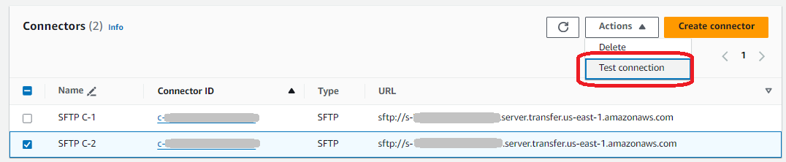
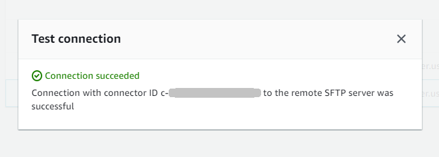
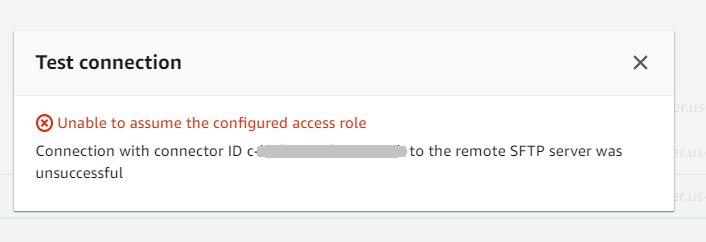

# Test an SFTP connector

After you create an SFTP connector, we recommend that you test it before you
attempt to transfer any files using your new connector.

###### To test an SFTP connector

1. Open the AWS Transfer Family console at [https://console.aws.amazon.com/transfer/](https://console.aws.amazon.com/transfer/ "https://console.aws.amazon.com/transfer/").
2. In the left navigation pane, choose **SFTP Connectors**, and
   select a connector.
3. From the **Actions** menu, choose **Test connection**.

The system returns a message, indicating whether the test passes or fails. If the test fails, the system provides an error message based on the reason the test failed.

###### Note

To use the API to test your connector, see the [TestConnection](../APIReference/API_TestConnection.md "../APIReference/API_TestConnection.md") API documentation.
