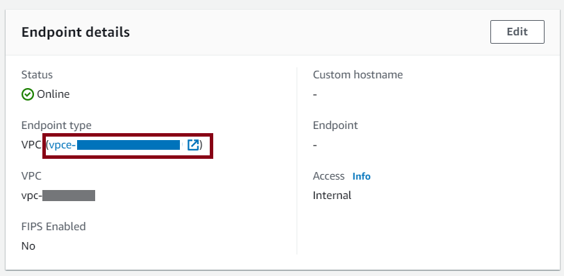
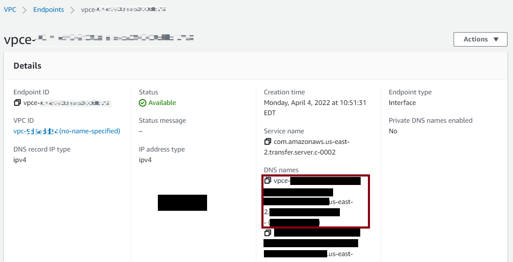
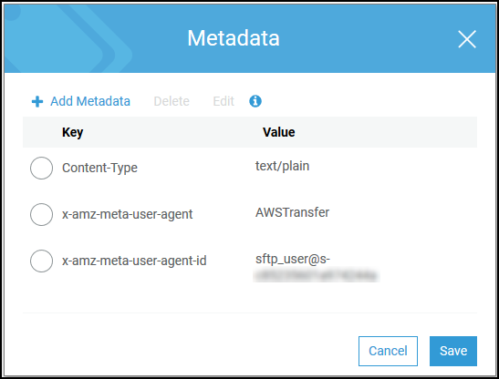

# Transferring files over a server endpoint using a

client

You transfer files over the AWS Transfer Family service by specifying the transfer operation in a
client. AWS Transfer Family supports the following clients:

- We support version 3 of the SFTP protocol.
- OpenSSH (macOS and Linux)

###### Note

This client works only with servers that are enabled for Secure Shell (SSH)
File Transfer Protocol (SFTP).

- WinSCP (Microsoft Windows only)
- Cyberduck (Windows, macOS, and Linux)
- FileZilla (Windows, macOS, and Linux)
  The following limitations apply to every client:

- The SCP protocol is not supported, as it is considered insecure. You can use the
  OpenSSH `scp` command as described in [Using the scp command](#openssh-scp "#openssh-scp").
- The maximum number of concurrent, multiplexed, SFTP sessions per connection is

10.

- For idle connections, the timeout value is 1800 seconds (30 minutes) for all
  protocols (SFTP/FTP/FTPS). If there is no activity after this period, the client may
  be disconnected. For unresponsive connections:
  - SFTP has a 300 seconds (5 minutes) timeout when a client is completely
    unresponsive.
  - FTPS and FTP have an approximately 10 minute unresponsive timeout that is
    handled by the underlying library.

- Amazon S3 and Amazon EFS (due to the NFSv4 protocol) require filenames to be in UTF-8
  encoding. Using different encoding can lead to unexpected results. For Amazon S3, see
  [Object
  key naming guidelines](../../../AmazonS3/latest/userguide/object-keys.md#object-key-guidelines "../../../AmazonS3/latest/userguide/object-keys.md#object-key-guidelines").
- For File Transfer Protocol over SSL (FTPS), only Explicit mode is supported.
  Implicit mode is not supported.
- For File Transfer Protocol (FTP) and FTPS, only Passive mode is supported.
- For FTP and FTPS, only STREAM mode is supported.
- For FTP and FTPS, only Image/Binary mode is supported.
- For FTP and FTPS, TLS - PROT C (unprotected) TLS for the data connection is the
  default but PROT C is not supported in the AWS Transfer Family FTPS protocol. So for FTPS, you
  need to issue PROT P for your data operation to be accepted.
- If you are using Amazon S3 for your server's storage, and if your client contains an
  option to use multiple connections for a single transfer, make sure to disable the
  option. Otherwise, large file uploads can fail in unpredictable ways. Note that if
  you are using Amazon EFS as your storage backend, EFS _does_ support
  multiple connections for a single transfer.
  The following is a list of available commands for FTP and FTPS:

| Available commands |
| ------------------ | ---- | ---- | ---- | ---- | ---- |
| ABOR               | FEAT | MLST | PASS | RETR | STOR |
| AUTH               | LANG | MKD  | PASV | RMD  | STOU |
| CDUP               | LIST | MODE | PBSZ | RNFR | STRU |
| CWD                | MDTM | NLST | PROT | RNTO | SYST |
| DELE               | MFMT | NOOP | PWD  | SIZE | TYPE |
| EPSV               | MLSD | OPTS | QUIT | STAT | USER |

###### Note

APPE is not supported.

For SFTP, the following operations are currently not supported for users that are using
the logical home directory on servers that are using Amazon Elastic File System (Amazon EFS).

| Unsupported SFTP<br>commands |
| ---------------------------- | --------------- | ------------------------------------------------- | --------------------------------------------------------------------------- |
| SSH_FXP_READLINK             | SSH_FXP_SYMLINK | SSH_FXP_STAT when the requested file is a symlink | SSH_FXP_REALPATH when the requested path contains any symlink<br>components |

###### Generate public-private key pair

Before you can transfer a file, you must have a public-private key pair available. If
you have not previously generated a key pair, see [Generate SSH keys for service-managed users](sshkeygen.md "sshkeygen.md").

###### Topics

- [Available SFTP/FTPS/FTP Commands](#transfer-sftp-commands "#transfer-sftp-commands")
- [Find your Amazon VPC endpoint](#find-vpc-endpoint "#find-vpc-endpoint")
- [Avoid setstat errors](#avoid-set-stat "#avoid-set-stat")
- [Use OpenSSH](#openssh "#openssh")
- [Use WinSCP](#winscp "#winscp")
- [Use Cyberduck](#cyberduck "#cyberduck")
- [Use FileZilla](#filezilla "#filezilla")
- [Use a Perl client](#using-clients-with-perl-modules "#using-clients-with-perl-modules")
- [Use LFTP](#using-client-lftp "#using-client-lftp")
- [Post upload processing](#post-processing-upload "#post-processing-upload")
- [SFTP messages](#sftp-transfer-activity-types "#sftp-transfer-activity-types")

## Available SFTP/FTPS/FTP Commands

The following table describes the available commands for AWS Transfer Family, for the SFTP, FTPS,
and FTP protocols.

###### Note

The table mentions _files_ and _directories_
for Amazon S3, which only supports buckets and objects: there is no hierarchy. However,
you can use prefixes in object key names to imply a hierarchy and organize your data
in a way similar to folders. This behavior is described in [Working
with object metadata](../../../AmazonS3/latest/userguide/UsingMetadata.md "../../../AmazonS3/latest/userguide/UsingMetadata.md") in the _Amazon Simple Storage Service User Guide_.

| SFTP/FTPS/FTP Commands | Command                                                                                          | Amazon S3                                                                                      | Amazon EFS |
| ---------------------- | ------------------------------------------------------------------------------------------------ | ---------------------------------------------------------------------------------------------- | ---------- |
| `cd`                   | Supported                                                                                        | Supported                                                                                      |
| `chgrp`                | Not supported                                                                                    | Supported (`root` or `owner` only)                                                             |
| `chmod`                | Not supported                                                                                    | Supported (`root` only)                                                                        |
| `chmtime`              | Not supported                                                                                    | Supported                                                                                      |
| `chown`                | Not supported                                                                                    | Supported (`root` only)                                                                        |
| `get`                  | Supported                                                                                        | Supported (including resolving symbolic links)                                                 |
| `ln -s`                | Not supported                                                                                    | Supported                                                                                      |
| `ls/dir`               | Supported                                                                                        | Supported                                                                                      |
| `mkdir`                | Supported                                                                                        | Supported                                                                                      |
| `put`                  | Supported                                                                                        | Supported                                                                                      |
| `pwd`                  | Supported                                                                                        | Supported                                                                                      |
| `rename`               | Supported for files only NoteRenaming that would overwrite an existing file is not<br>supported. | Supported NoteRenaming that would overwrite an existing file or directory is<br>not supported. |
| `rm`                   | Supported                                                                                        | Supported                                                                                      |
| `rmdir`                | Supported (empty directories only)                                                               | Supported                                                                                      |
| `version`              | Supported                                                                                        | Supported                                                                                      |

## Find your Amazon VPC endpoint

If the endpoint type for your Transfer Family server is VPC, identifying the endpoint to use for
transferring files is not straightforward. In this case, use the following procedure to
find your Amazon VPC endpoint.

###### To find your Amazon VPC endpoint

1. Navigate to your server's details page.
2. In the **Endpoint details** pane, select the
   **VPC**.

 3. In the Amazon VPC dashboard, select the **VPC endpoint
ID**. 4. In the list of **DNS names**, your server endpoint is the
first one listed.



## Avoid `setstat` errors

Some SFTP file transfer clients can attempt to change the attributes of remote files,
including timestamp and permissions, using commands, such as SETSTAT when uploading the
file. However, these commands are not compatible with object storage systems, such as
Amazon S3. Due to this incompatibility, file uploads from these clients can result in errors
even when the file is otherwise successfully uploaded.

- When you call the `CreateServer` or `UpdateServer` API,
  use the `ProtocolDetails` option `SetStatOption` to ignore
  the error that is generated when the client attempts to use SETSTAT on a file
  you are uploading to an S3 bucket.
- Set the value to `ENABLE_NO_OP` to have the Transfer Family server ignore the
  SETSTAT command, and upload files without needing to make any changes to your
  SFTP client.
- Note that while the `SetStatOption`
  `ENABLE_NO_OP` setting ignores the error, it
  _does_ generate a log entry in CloudWatch Logs, so you can
  determine when the client is making a SETSTAT call.

For the API details for this option, see [ProtocolDetails](../APIReference/API_ProtocolDetails.md "../APIReference/API_ProtocolDetails.md").

## Use OpenSSH

This section contains instructions to transfer files from the command line using
OpenSSH.

###### Note

This client works only with an SFTP-enabled server.

###### Topics

- [Using OpenSSH](#openssh-use "#openssh-use")
- [Using the scp command](#openssh-scp "#openssh-scp")

### Using OpenSSH

###### To transfer files over AWS Transfer Family using the OpenSSH command line

utility

1. On Linux, macOS, or Windows, open a command terminal.
2. At the prompt, enter the following command:

`sftp -i `transfer-key`
`sftp_user`@`service_endpoint``

In the preceding command,
`sftp_user` is the username and
`transfer-key` is the SSH
private key. Here, `service_endpoint`
is the server's endpoint as shown in the AWS Transfer Family console for the
selected server.

###### Note

This command uses settings that are in the default
`ssh_config` file. Unless you have previously
edited this file, SFTP uses port 22. You can specify a different port
(for example 2222) by adding a `-P` flag to the
command, as follows.

```
sftp -P 2222 -i `transfer-key` `sftp_user`@`service_endpoint`
```

Alternatively, if you always want to use port 2222 or port 22000, you
can update your default port in your `ssh_config`
file.

An `sftp` prompt should appear. 3. (Optional) To view the user's home directory, enter the following command
at the `sftp` prompt:

`pwd` 4. To upload a file from your file system to the Transfer Family server, use the
`put` command. For example, to upload
`hello.txt` (assuming that file is in your current
directory on your file system), run the following command at the
`sftp` prompt:

`put hello.txt`

A message similar to the following appears, indicating that the file
transfer is in progress, or complete.

`Uploading hello.txt to
 /amzn-s3-demo-bucket/home/sftp_user/hello.txt`

`hello.txt 100% 127 0.1KB/s 00:00`

###### Note

After your server is created, it can take a few minutes for the server
endpoint hostname to be resolvable by the DNS service in your
environment.

### Using the `scp` command

Transfer Family doesn't support the SCP protocol. However, you can use the OpenSSH
`scp` command if you need this functionality.

The recommendation for using SCP over SFTP is to use OpenSSH version 9.0 or later.
In OpenSSH version 9 and later, the `scp` command defaults to using the
SFTP protocol for file transfers instead of the legacy SCP protocol.

###### Important

Ensure that your Transfer Family server has been configured to use S3 optimized directory
access.

## Use WinSCP

Use the instructions that follow to transfer files from the command line using
WinSCP.

###### Note

If you are using WinSCP 5.19, you can directly connect to Amazon S3 using your AWS
credentials and upload/download files. For more details, see [Connecting to Amazon S3
service](https://winscp.net/eng/docs/guide_amazon_s3 "https://winscp.net/eng/docs/guide_amazon_s3").

###### To transfer files over AWS Transfer Family using WinSCP

1. Open the WinSCP client.
2. In the **Login** dialog box, for **File
   protocol**, choose a protocol: **SFTP** or
   **FTP**.

If you chose FTP, for **Encryption**, choose one of the
following:

    * **No encryption** for FTP
    * **TLS/SSL Explicit encryption** for FTPS

3. For **Host name**, enter your server endpoint. The server
   endpoint is located on the **Server details** page. For more
   information, see [View SFTP, FTPS, and FTP server
   details](configuring-servers-view-info.md "configuring-servers-view-info.md").

If your server uses a VPC endpoint, see [Find your Amazon VPC endpoint](#find-vpc-endpoint "#find-vpc-endpoint"). 4. For **Port number**, enter the following:

    * `22` for SFTP
    * `21` for FTP/FTPS

5. For **User name**, enter the name for the user that you
   created for your specific identity provider.

**Tip:** The username should be one of the users
you created or configured for your identity provider. AWS Transfer Family provides the
following identity providers:

    * [Working with service-managed users](service-managed-users.md "service-managed-users.md")
    * [Using AWS Directory Service for Microsoft
     Active Directory](directory-services-users.md "directory-services-users.md")
    * [Working with custom identity providers](custom-idp-intro.md "custom-idp-intro.md")

6. Choose **Advanced** to open the **Advanced Site
   Settings** dialog box. In the **SSH** section,
   choose **Authentication**.
7. For **Private key file**, browse for and choose the SSH
   private key file from your file system.

If WinSCP offers to convert your SSH private key to the PPK format, choose
**OK**. 8. Choose **OK** to return to the **Login**
dialog box, and then choose **Save**. 9. In the **Save session as site** dialog box, choose
**OK** to complete your connection setup. 10. In the **Login** dialog box, choose
**Tools**, and then choose
**Preferences**. 11. In the **Preferences** dialog box, for
**Transfer**, choose **Endurance**.

For the **Enable transfer resume/transfer to temporary filename
for** option, choose **Disable**.

###### Important

If you leave this option enabled, it increases upload costs, substantially
decreasing upload performance. It also can lead to failures of large file
uploads. 12. For **Transfer**, choose **Background**, and
clear the **Use multiple connections for single transfer**
check box.

**Tip:** If you leave this option selected, large
file uploads can fail in unpredictable ways. For example, orphaned multipart
uploads that incur Amazon S3 charges can be created. Silent data corruption can also
occur. 13. Perform your file transfer.

You can use drag-and-drop methods to copy files between the target and source
windows. You can use toolbar icons to upload, download, delete, edit, or modify
the properties of files in WinSCP.

###### Note

This note does not apply if you are using Amazon EFS for storage.

Commands that attempt to change attributes of remote files, including timestamps,
are not compatible with object storage systems such as Amazon S3. Therefore, if you are
using Amazon S3 for storage, be sure to disable WinSCP timestamp settings (or use the
`SetStatOption` as described in [Avoid setstat errors](#avoid-set-stat "#avoid-set-stat")) before you perform file transfers. To do so,
in the **WinSCP Transfer settings** dialog box, disable the
**Set permissions** upload option and the **Preserve
timestamp** common option.

## Use Cyberduck

Use the instructions that follow to transfer files from the command line using
Cyberduck.

###### To transfer files over AWS Transfer Family using Cyberduck

1. Open the [Cyberduck](https://cyberduck.io/download/ "https://cyberduck.io/download/")
   client.
2. Choose **Open Connection**.
3. In the **Open Connection** dialog box, choose a protocol:
   **SFTP (SSH File Transfer Protocol)**, **FTP-SSL
   (Explicit AUTH TLS)**, or **FTP (File Transfer
   Protocol)**.
4. For **Server**, enter your server endpoint. The server
   endpoint is located on the **Server details** page. For more
   information, see [View SFTP, FTPS, and FTP server
   details](configuring-servers-view-info.md "configuring-servers-view-info.md").

If your server uses a VPC endpoint, see [Find your Amazon VPC endpoint](#find-vpc-endpoint "#find-vpc-endpoint"). 5. For **Port number**, enter the following:

    * `22` for SFTP
    * `21` for FTP/FTPS

6. For **Username**, enter the name for the user that you
   created in [Managing users for server endpoints](create-user.md "create-user.md").
7. If SFTP is selected, for **SSH Private Key**, choose or enter
   the SSH private key.
8. Choose **Connect**.
9. Perform your file transfer.

Depending on where your files are, do one of the following:

    * In your local directory (the source), choose the files that you want
     to transfer, and drag and drop them into the Amazon S3 directory (the
     target).
    * In the Amazon S3 directory (the source), choose the files that you want to
     transfer, and drag and drop them into your local directory (the
     target).

## Use FileZilla

Use the instructions that follow to transfer files using FileZilla.

###### To set up FileZilla for a file transfer

1. Open the FileZilla client.
2. Choose **File**, and then choose **Site
   Manager**.
3. In the **Site Manager** dialog box, choose **New
   site**.
4. On the **General** tab, for **Protocol**,
   choose a protocol: **SFTP** or **FTP**.

If you chose FTP, for **Encryption**, choose one of the
following:

    * **Only use plain FTP (insecure)** – for
     FTP
    * **Use explicit FTP over TLS if available** –
     for FTPS

5.  For **Host name**, enter the protocol that you are using,
    followed by your server endpoint. The server endpoint is located on the
    **Server details** page. For more information, see [View SFTP, FTPS, and FTP server
    details](configuring-servers-view-info.md "configuring-servers-view-info.md").

        * If you are using SFTP, enter:
         `sftp://`hostname``
        * If you are using FTPS, enter:
         `ftps://`hostname``

    Make sure to replace `hostname` with your actual
    server endpoint.

If your server uses a VPC endpoint, see [Find your Amazon VPC endpoint](#find-vpc-endpoint "#find-vpc-endpoint"). 6. For **Port number**, enter the following:

    * `22` for SFTP
    * `21` for FTP/FTPS

7. If SFTP is selected, for **Logon Type**, choose **Key
   file**.

For **Key file**, choose or enter the SSH private key. 8. For **User**, enter the name for the user that you created in
[Managing users for server endpoints](create-user.md "create-user.md"). 9. Choose **Connect**. 10. Perform your file transfer.

###### Note

If you interrupt a file transfer in progress, AWS Transfer Family might write a
partial object in your Amazon S3 bucket. If you interrupt an upload, check that
the file size in the Amazon S3 bucket matches the file size of the source object
before continuing.

## Use a Perl client

If you use the NET::SFTP::Foreign perl client, you must set the
`queue_size` to `1`. For example:

`my $sftp =
 Net::SFTP::Foreign->new('`user`@`s-12345`.server.transfer.`us-east-2`.amazonaws.com',
 queue_size => 1);`

###### Note

This workaround is needed for revisions of `Net::SFTP::Foreign` prior
to [1.92.02](https://metacpan.org/changes/release/SALVA/Net-SFTP-Foreign-1.93#L12 "https://metacpan.org/changes/release/SALVA/Net-SFTP-Foreign-1.93#L12").

## Use LFTP

LFTP is a free FTP client that allows users to perform file transfers via the
command-line interface from most Linux machines.

For large file downloads, LFTP has a known issue with out of order packets, causing
the file transfer to fail.

## Post upload processing

You can view post upload processing information including Amazon S3 object metadata and event
notifications.

###### Topics

- [Amazon S3 object metadata](#post-processing-S3-object-metadata "#post-processing-S3-object-metadata")
- [Amazon S3 event
  notifications](#post-processing-S3-event-notifications "#post-processing-S3-event-notifications")

### Amazon S3 object metadata

As a part of your object's metadata you see a key called
`x-amz-meta-user-agent` whose value is `AWSTransfer` and
`x-amz-meta-user-agent-id` whose value is
`username@server-id`. The `username` is the Transfer Family user who uploaded
the file and `server-id` is the server used for the upload. This information
can be accessed using the [HeadObject](../../../AmazonS3/latest/API/RESTObjectHEAD.md "../../../AmazonS3/latest/API/RESTObjectHEAD.md") operation on the S3
object inside your Lambda function.



### Amazon S3 event

notifications

When an object is uploaded to your S3 bucket using Transfer Family, `RoleSessionName`
is contained in the Requester field in the [S3 event notification
structure](../../../AmazonS3/latest/dev/notification-content-structure.md "../../../AmazonS3/latest/dev/notification-content-structure.md") as `[AWS:Role Unique
 Identifier]/username.sessionid@server-id`.

For example, the following are the contents for a sample Requester field from an S3 access log for a file that was copied to the S3 bucket.

`arn:aws:sts::AWS-Account-ID:assumed-role/*IamRoleName*/username.sessionid@server-id`

In the Requester field above, it shows the IAM Role called `IamRoleName`.

For more information about configuring S3 event notifications, see [Configuring Amazon S3
event notifications](../../../AmazonS3/latest/dev/NotificationHowTo.md "../../../AmazonS3/latest/dev/NotificationHowTo.md") in the _Amazon Simple Storage Service Developer
Guide_. For more information about AWS Identity and Access Management (IAM) role unique
identifiers, see [Unique
identifiers](../../../IAM/latest/UserGuide/reference_identifiers.md#identifiers-unique-ids "../../../IAM/latest/UserGuide/reference_identifiers.md#identifiers-unique-ids") in the _AWS Identity and Access Management User Guide_.

## SFTP messages

This section describes client side messages that you may receive during or after your
SFTP file transfers when using a Transfer Family server. For more information on any SFTP event,
check your SFTP client logs. You can use that information to troubleshoot any errors, or
forward that information to your network team for their help in identifying the
issue.

| SFTP client-side messages | Activity                                                                                                                                                                                                                                                                                                                                                                                                                                          | Description |
| ------------------------- | ------------------------------------------------------------------------------------------------------------------------------------------------------------------------------------------------------------------------------------------------------------------------------------------------------------------------------------------------------------------------------------------------------------------------------------------------- | ----------- |
| AUTH_FAILURE              | The user failed authentication. This can be any kind of failure from<br>a custom identity provider or service managed user. The details in the<br>event help clarify the root cause of the failure.                                                                                                                                                                                                                                               |
| CLOSE                     | Indicates that an opened file or directory is closed<br>successfully.                                                                                                                                                                                                                                                                                                                                                                             |
| CONNECTED/DISCONNECTED    | Indicates normal connection success and disconnections.                                                                                                                                                                                                                                                                                                                                                                                           |
| CREATE_SYMLINK            | A symbolic link was created (successfully or unsuccessfully).                                                                                                                                                                                                                                                                                                                                                                                     |
| DELETE                    | A file was deleted (successfully or unsuccessfully).                                                                                                                                                                                                                                                                                                                                                                                              |
| ERROR                     | A general, unexpected error. The associated description contains<br>information that can help you or your network administrators to identify<br>the specific issue.                                                                                                                                                                                                                                                                               |
| EXIT_REASON               | Emitted when an unexpected error caused termination of your SFTP<br>session. The message associated with the event describes the<br>cause.                                                                                                                                                                                                                                                                                                        |
| MKDIR                     | A directory was created (successfully or unsuccessfully).                                                                                                                                                                                                                                                                                                                                                                                         |
| OPEN                      | A file was opened for read or write (successfully or<br>unsuccessfully)                                                                                                                                                                                                                                                                                                                                                                           |
| PARTIAL_CLOSE             | The client disconnected from the server while a file was still open<br>with no CLOSE message received. Transfer Family stores the received portion of the<br>file (which could in fact be the complete file) and emits the<br>PARTIAL_CLOSE event to alert the customer about the issue. Workflows<br>integration also receives an `onPartialClose` event to handle<br>the file appropriately.                                                    |
| RENAME                    | A file was renamed (successfully or unsuccessfully)                                                                                                                                                                                                                                                                                                                                                                                               |
| RMDIR                     | A directory was deleted (successfully or unsuccessfully)                                                                                                                                                                                                                                                                                                                                                                                          |
| SETSTAT                   | The attributes of a file are changed (successfully or<br>unsuccessfully).<br>NoteTransfer Family doesn't support SETSTAT if you are using Amazon S3 for<br>storage. The [Avoid setstat errors](#avoid-set-stat "#avoid-set-stat") section provides details on<br>how to avoid `SetStat` errors, by turning off the<br>setting. This avoids you receiving a `fail unsupported<br>error`: instead, you receive `success but do<br>nothing` message. |
| TLS_RESUME_FAILURE        | The server is configured to enforce TLS Session Resumption and the<br>client does not support it.                                                                                                                                                                                                                                                                                                                                                 |
