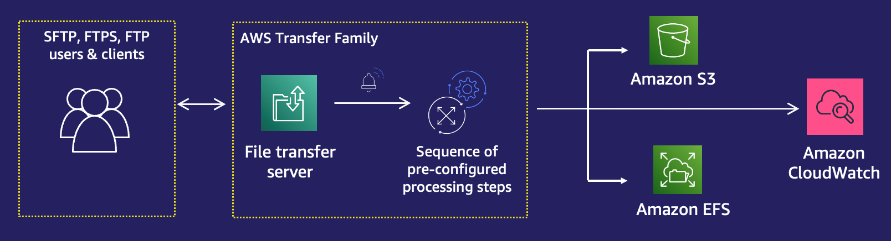
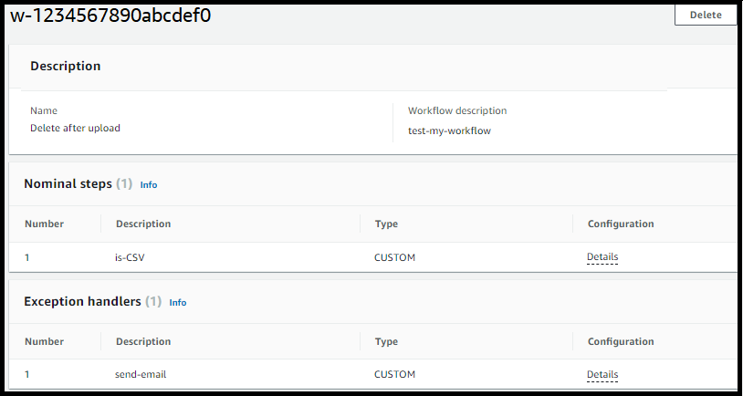
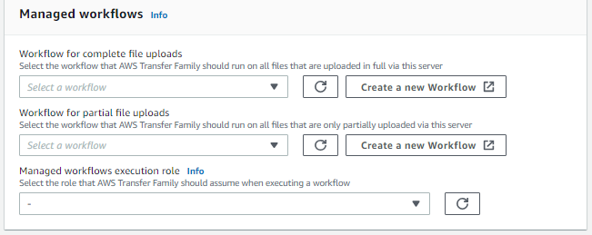

# AWS Transfer Family managed workflows

AWS Transfer Family supports managed workflows for file processing. With managed workflows, you can
kick off a workflow after a file has been transferred over SFTP, FTPS, or FTP. Using this
feature, you can securely and cost effectively meet your compliance requirements for
business-to-business (B2B) file exchanges by coordinating all the necessary steps required
for file processing. In addition, you benefit from end-to-end auditing and
visibility.


By orchestrating file-processing tasks, managed workflows help you preprocess data before
it is consumed by your downstream applications. Such file-processing tasks might
include:

- Moving files to user-specific folders.
- Decrypting files as part of a workflow.
- Tagging files.
- Performing custom processing by creating and attaching an AWS Lambda function to a
  workflow.
- Sending notifications when a file has been successfully transferred. (For a blog
  post that details this use case, see [Customize file delivery notifications using AWS Transfer Family managed
  workflows](https://aws.amazon.com/blogs/storage/customize-file-delivery-notifications-using-aws-transfer-family-managed-workflows/ "https://aws.amazon.com/blogs/storage/customize-file-delivery-notifications-using-aws-transfer-family-managed-workflows/").)
  To quickly replicate and standardize common post-upload file processing tasks spanning
  multiple business units in your organization, you can deploy workflows by using
  infrastructure as code (IaC). You can specify a managed workflow to be initiated on files
  that are uploaded in full. You can also specify a different managed workflow to be initiated
  on files that are only partially uploaded because of a premature session disconnect.
  Built-in exception handling helps you quickly react to file-processing outcomes, while
  offering you control over how to handle failures. In addition, each workflow step produces
  detailed logs, which you can audit to trace the data lineage.

To get started, perform the following tasks:

1. Set up your workflow to contain preprocessing actions, such as copying, tagging,
   and other steps based on your requirements. See [Create a workflow](create-workflow.md "create-workflow.md") for details.
2. Configure an execution role, which Transfer Family uses to run the workflow. See [IAM policies for workflows](workflow-execution-role.md "workflow-execution-role.md") for
   details.
3. Map the workflow to a server, so that on file arrival, the actions specified in
   this workflow are evaluated and initiated in real time. See [Configure and run a workflow](create-workflow.md#configure-workflow "create-workflow.md#configure-workflow") for
   details.

Related information

- To monitor your workflow executions, see [Using CloudWatch metrics for Transfer Family servers](metrics.md "metrics.md").
- For detailed execution logs and troubleshooting information, see [Troubleshoot workflow-related errors
  using Amazon CloudWatch](workflow-issues.md#workflows-cloudwatch-errors "workflow-issues.md#workflows-cloudwatch-errors").
- Transfer Family provides a blog post and a workshop that walk you through building a file transfer
  solution. This solution leverages AWS Transfer Family for managed SFTP/FTPS endpoints and
  Amazon Cognito and DynamoDB for user management.

The blog post is available at [Using Amazon Cognito as an identity provider with AWS Transfer Family and
Amazon S3](https://aws.amazon.com/blogs/storage/using-amazon-cognito-as-an-identity-provider-with-aws-transfer-family-and-amazon-s3/ "https://aws.amazon.com/blogs/storage/using-amazon-cognito-as-an-identity-provider-with-aws-transfer-family-and-amazon-s3/").
You can view the details for the workshop
[here](https://catalog.workshops.aws/transfer-family-sftp/en-US "https://catalog.workshops.aws/transfer-family-sftp/en-US").

- The following video provides a brief introduction
  to Transfer Family managed workflows.
- The following workshop provides hands on labs to build fully automated and
  event-driven workflows involving file transfer to or from external SFTP
  servers to Amazon S3, and common pre- and post-processing of those files: [Event-driven MFT workshop](https://catalog.us-east-1.prod.workshops.aws/workshops/e55c90e0-bbb0-47e1-be83-6bafa3a59a8a/en-US "https://catalog.us-east-1.prod.workshops.aws/workshops/e55c90e0-bbb0-47e1-be83-6bafa3a59a8a/en-US").

This video provides a walk through of this workshop.

###### Topics

- [Create a workflow](create-workflow.md "create-workflow.md")
- [Use predefined steps](nominal-steps-workflow.md "nominal-steps-workflow.md")
- [Use custom file-processing steps](custom-step-details.md "custom-step-details.md")
- [IAM policies for workflows](workflow-execution-role.md "workflow-execution-role.md")
- [Exception handling for a workflow](#exception-workflow "#exception-workflow")
- [Monitor workflow execution](cloudwatch-workflow.md "cloudwatch-workflow.md")
- [Create a workflow from a template](workflow-template.md "workflow-template.md")
- [Remove a workflow from a Transfer Family
  server](#remove-workflow-association "#remove-workflow-association")
- [Managed workflows restrictions and
  limitations](#limitations-workflow "#limitations-workflow")
  For more help getting started
  with managed workflows, see the following resources:

- [AWS Transfer Family managed
  workflows](https://www.youtube.com/watch?v=t-iNqCRospw "https://www.youtube.com/watch?v=t-iNqCRospw") demo video
- [Building a cloud-native file transfer platform using AWS Transfer Family workflows](https://aws.amazon.com/blogs/architecture/building-a-cloud-native-file-transfer-platform-using-aws-transfer-family-workflows/ "https://aws.amazon.com/blogs/architecture/building-a-cloud-native-file-transfer-platform-using-aws-transfer-family-workflows/")
  blog post

## Exception handling for a workflow

If any errors occur during a workflow's execution, the exception-handling steps that
you specified are executed. You specify the error-handling steps for a workflow in the
same manner as you specify the nominal steps for the workflow. For example, suppose that
you've configured custom processing in nominal steps to validate incoming files. If the
file validation fails, an exception-handling step can send an email to the
administrator.

The following example workflow contains two steps:

- One nominal step that checks whether the uploaded file is in CSV format
- An exception-handling step that sends an email in case the uploaded file is
  not in CSV format, and the nominal step fails

To initiate the exception-handling step, the AWS Lambda function in the nominal step
must respond with `Status="FAILURE"`. For more information about error
handling in workflows, see [Use custom file-processing steps](custom-step-details.md "custom-step-details.md").



## Remove a workflow from a Transfer Family

server

If you have associated a workflow with a Transfer Family server, and you now want to remove that
association, you can do so by using the console or programmatically.

Console

###### To remove a workflow from a Transfer Family server

1.  Open the AWS Transfer Family console at [https://console.aws.amazon.com/transfer/](https://console.aws.amazon.com/transfer/ "https://console.aws.amazon.com/transfer/").
2.  In the left navigation pane, choose **Servers**.
3.  Choose the identifier for the server in the **Server ID** column.
4.  On the details page for the server, scroll down to the
    **Additional details** section, and then choose
    **Edit**.
5.  On the **Edit additional details**
    page, in the **Managed workflows** section, clear
    the information for all settings:

        * Select the dash (-) from the list of workflows for the
         **Workflow for complete file
         uploads**.
        * If not already cleared, select the dash (-) from the list
         of workflows for the **Workflow for
         partial file uploads**.
        * Select the dash (-) from the list of roles for the
         **Managed workflows execution
         role**.

    If you don't see the dash, scroll up until you see it, as it is
    the first value in each menu.

The screen should look like the following.

 6. Scroll down and choose **Save** to save your
changes.

CLI
You use the `update-server` (or `UpdateServer` for
API) call, and provide empty arguments for the `OnUpload` and
`OnPartialUpload` parameters.

From the AWS CLI, run the following command:

```
aws transfer update-server --server-id `your-server-id` --workflow-details '{"OnPartialUpload":[],"OnUpload":[]}'
```

Replace `your-server-id` with the ID
for your server. For example, if your server ID is,
`s-01234567890abcdef`, the command is as follows:

```
aws transfer update-server --server-id s-01234567890abcdef --workflow-details '{"OnPartialUpload":[],"OnUpload":[]}'
```

## Managed workflows restrictions and

limitations

**Restrictions**

The following restrictions currently apply to post-upload processing workflows for
AWS Transfer Family.

- Cross-account and cross-region AWS Lambda functions are not supported. You can,
  however, copy across accounts, provided that your AWS Identity and Access Management (IAM) policies are
  correctly configured.
- For all workflow steps, any Amazon S3 buckets accessed by the workflow must be in
  the same region as the workflow itself.
- For a decryption step, the decryption destination must match the source for
  Region and backing store (for example, if the file to be decrypted is stored in
  Amazon S3, then the specified destination must also be in Amazon S3).
- Only asynchronous custom steps are supported.
- Custom step timeouts are approximate. That is, it might take slightly longer
  to time out than specified. Additionally, the workflow is dependent upon the
  Lambda function. Therefore, if the function is delayed during execution, the
  workflow is not aware of the delay.
- If you exceed your throttling limit, Transfer Family doesn't add workflow operations
  to the queue.
- Workflows are not initiated for files that have a size of 0. Files with a size
  greater than 0 do initiate the associated workflow.
- You can attach a file-processing workflow to a Transfer Family server that uses
  the AS2 protocol: however, AS2 messages don't execute workflows attached to the server.

**Limitations**

Additionally, the following functional limits apply to workflows for Transfer Family:

- The number of workflows per Region, per account, is limited to 10.
- The maximum timeout for custom steps is 30 minutes.
- The maximum number of steps in a workflow is 8.
- The maximum number of tags per workflow is 50.
- The maximum number of concurrent executions that contain a decrypt step is 250
  per workflow.
- You can store a maximum of 3 PGP private keys, per Transfer Family server, per user.
- The maximum size for a decrypted file is 10 GB.
- We throttle the new execution rate using a [token bucket](https://en.wikipedia.org/wiki/Token_bucket "https://en.wikipedia.org/wiki/Token_bucket") system
  with a burst capacity of 100 and a refill rate of 1.
- Anytime you remove a workflow from a server and replace it with a new one, or
  update server configuration (which impacts a workflow's execution role),
  you must wait approximately 10 minutes before executing the new workflow. The
  Transfer Family server caches the workflow details, and it takes 10 minutes for the server
  to refresh its cache.

Additionally, you must log out of any active SFTP sessions, and then log back in after the 10-minute waiting period to see the changes.
