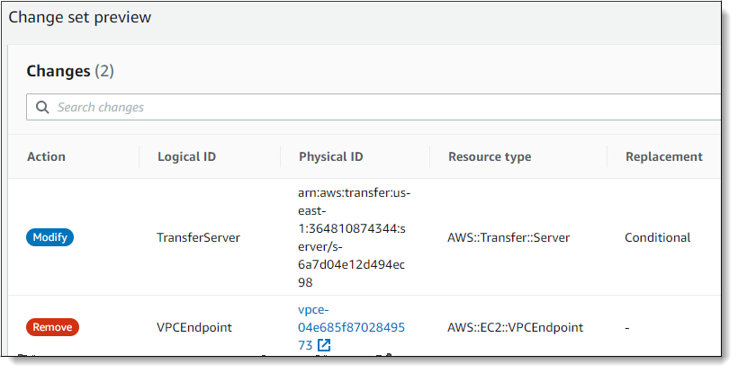

# Updating the AWS Transfer Family server endpoint type

from VPC_ENDPOINT to VPC

You can use the AWS Management Console, CloudFormation, or the Transfer Family API to update a server's
`EndpointType` from `VPC_ENDPOINT` to `VPC`.
Detailed procedures and examples for using each of these methods to update a server
endpoint type are provided in the following sections. If you have servers in multiple
AWS regions and in multiple AWS accounts, you can use the example script provided in
the following section, with modifications, to identify servers using the
`VPC_ENDPOINT` type that you will need to update.

###### Topics

- [Identifying servers using the VPC_ENDPOINT
  endpoint type](#id-servers "#id-servers")
- [Updating the server endpoint type using
  the AWS Management Console](#update-endpoint-console "#update-endpoint-console")
- [Updating the server endpoint type
  using CloudFormation](#update-endpoint-cloudformation "#update-endpoint-cloudformation")
- [Updating the server EndpointType using the
  API](#update-endpoint-cli "#update-endpoint-cli")

## Identifying servers using the `VPC_ENDPOINT`

endpoint type

You can identify which servers are using the `VPC_ENDPOINT` using the
AWS Management Console.

###### To identify servers using the `VPC_ENDPOINT` endpoint type using

the console

1. Open the AWS Transfer Family console at [https://console.aws.amazon.com/transfer/](https://console.aws.amazon.com/transfer/ "https://console.aws.amazon.com/transfer/").
2. Choose **Servers** in the navigation pane to display the
   list of servers in your account in that region.
3. Sort the list of servers by the **Endpoint type** to see
   all servers using `VPC_ENDPOINT`.

###### To identify servers using `VPC_ENDPOINT` across multiple AWS

Regions and accounts

If you have servers in multiple AWS regions and in multiple AWS accounts,
you can use the following example script, with modifications, to identify
servers using the `VPC_ENDPOINT` endpoint type. The example script
uses the Amazon EC2 [DescribeRegions](../../../AWSEC2/latest/APIReference/API_DescribeRegions.md "../../../AWSEC2/latest/APIReference/API_DescribeRegions.md") and the Transfer Family [ListServers](../APIReference/API_ListServers.md "../APIReference/API_ListServers.md") API operations. If you have many
AWS accounts, you could loop through your accounts using an IAM Role with
read only auditor access if you authenticate using session profiles to your
identity provider.

1. Following is a simple example.

```
import boto3

profile = input("Enter the name of the AWS account you'll be working in: ")
session = boto3.Session(profile_name=profile)

ec2 = session.client("ec2")

regions = ec2.describe_regions()

for region in regions['Regions']:
    region_name = region['RegionName']
    if region_name=='ap-northeast-3': #https://github.com/boto/boto3/issues/1943
        continue
    transfer = session.client("transfer", region_name=region_name)
    servers = transfer.list_servers()
    for server in servers['Servers']:
       if server['EndpointType']=='VPC_ENDPOINT':
           print(server['ServerId'], region_name)
```

2. After you have the list of the servers to update, you can use one of the
   methods described in the following sections to update the
   `EndpointType` to `VPC`.

## Updating the server endpoint type using

the AWS Management Console

1. Open the AWS Transfer Family console at [https://console.aws.amazon.com/transfer/](https://console.aws.amazon.com/transfer/ "https://console.aws.amazon.com/transfer/").
2. In the navigation pane, choose **Servers**.
3. Select the check box of the server that you want to change the endpoint
   type for.

###### Important

You must stop the server before you can change its endpoint. 4. For **Actions**, choose **Stop**. 5. In the confirmation dialog box that appears, choose
**Stop** to confirm that you want to stop the
server.

###### Note

Before proceeding to the next step, wait for the
**Status** of the server to change to
**Offline**; this can take a couple of minutes. You
might have to choose **Refresh** on the
**Servers** page to see the status change. 6. After the status changes to **Offline**, choose the
server to display the server details page. 7. In the **Endpoint details** section, choose
**Edit**. 8. Choose **VPC hosted** for the **Endpoint
type**. 9. Choose **Save** 10. For **Actions**, choose **Start** and
wait for the status of the server to change to **Online**;
this can take a couple of minutes.

## Updating the server endpoint type

using CloudFormation

This section describes how to use CloudFormation to update a server's
`EndpointType` to `VPC`. Use this procedure for Transfer Family
servers that you have deployed using CloudFormation. In this example, the original CloudFormation
template used to deploy the Transfer Family server is shown as follows:

```
AWSTemplateFormatVersion: '2010-09-09'
Description: 'Create AWS Transfer Server with VPC_ENDPOINT endpoint type'
Parameters:
  SecurityGroupId:
    Type: AWS::EC2::SecurityGroup::Id
  SubnetIds:
    Type: List<AWS::EC2::Subnet::Id>
  VpcId:
    Type: AWS::EC2::VPC::Id
Resources:
  TransferServer:
    Type: AWS::Transfer::Server
    Properties:
      Domain: S3
      EndpointDetails:
        VpcEndpointId: !Ref VPCEndpoint
      EndpointType: VPC_ENDPOINT
      IdentityProviderType: SERVICE_MANAGED
      Protocols:
        - SFTP
  VPCEndpoint:
    Type: AWS::EC2::VPCEndpoint
    Properties:
      ServiceName: com.amazonaws.us-east-1.transfer.server
      SecurityGroupIds:
        - !Ref SecurityGroupId
      SubnetIds:
        - !Select [0, !Ref SubnetIds]
        - !Select [1, !Ref SubnetIds]
        - !Select [2, !Ref SubnetIds]
      VpcEndpointType: Interface
      VpcId: !Ref VpcId
```

The template is updated with the following changes:

- The `EndpointType` was changed to `VPC`.
- The `AWS::EC2::VPCEndpoint` resource is removed.
- The `SecurityGroupId`, `SubnetIds`, and
  `VpcId` were moved to the `EndpointDetails`
  section of the `AWS::Transfer::Server` resource,
- The `VpcEndpointId` property of `EndpointDetails`
  was removed.

The updated template looks as follows:

```
AWSTemplateFormatVersion: '2010-09-09'
Description: 'Create AWS Transfer Server with VPC endpoint type'
Parameters:
  SecurityGroupId:
    Type: AWS::EC2::SecurityGroup::Id
  SubnetIds:
    Type: List<AWS::EC2::Subnet::Id>
  VpcId:
    Type: AWS::EC2::VPC::Id
Resources:
  TransferServer:
    Type: AWS::Transfer::Server
    Properties:
      Domain: S3
      EndpointDetails:
        SecurityGroupIds:
          - !Ref SecurityGroupId
        SubnetIds:
          - !Select [0, !Ref SubnetIds]
          - !Select [1, !Ref SubnetIds]
          - !Select [2, !Ref SubnetIds]
        VpcId: !Ref VpcId
      EndpointType: VPC
      IdentityProviderType: SERVICE_MANAGED
      Protocols:
        - SFTP
```

###### To update the endpoint type of Transfer Family servers deployed using CloudFormation

1. Stop the server that you want to update using the following steps.
   1. Open the AWS Transfer Family console at [https://console.aws.amazon.com/transfer/](https://console.aws.amazon.com/transfer/ "https://console.aws.amazon.com/transfer/").
   2. In the navigation pane, choose
      **Servers**.
   3. Select the check box of the server that you want to change the
      endpoint type for.

   ###### Important

   You must stop the server before you can change its
   endpoint. 4. For **Actions**, choose
   **Stop**. 5. In the confirmation dialog box that appears, choose
   **Stop** to confirm that you want to stop the
   server.

   ###### Note

   Before proceeding to the next step, wait for the
   **Status** of the server to change to
   **Offline**; this can take a couple of
   minutes. You might have to choose **Refresh**
   on the **Servers** page to see the status
   change.

2. Update the CloudFormation stack
   1. Open the CloudFormation console at
      [https://console.aws.amazon.com/cloudformation](https://console.aws.amazon.com/cloudformation/ "https://console.aws.amazon.com/cloudformation/").
   2. Choose the stack used to create the Transfer Family server.
   3. Choose **Update**.
   4. Choose **Replace current template**
   5. Upload the new template. CloudFormation Change Sets help you
      understand how template changes will affect running resources before
      you implement them. In this example, the Transfer server resource
      will be modified, and the VPCEndpoint resource will be removed. The
      VPC endpoint type server creates a VPC Endpoint on your behalf,
      replacing the original `VPCEndpoint` resource.

   After uploading the new template, the change set will look similar
   to the following:

    6. Update the stack.

3. Once the stack update is complete, navigate to the Transfer Family management console
   at [https://console.aws.amazon.com/transfer/](https://console.aws.amazon.com/transfer/ "https://console.aws.amazon.com/transfer/").
4. Restart the server. Choose the server you updated in CloudFormation, and then
   choose **Start** from the **Actions**
   menu.

## Updating the server EndpointType using the

API

You can use the [describe-server](../../../cli/latest/reference/transfer/update-server.md "../../../cli/latest/reference/transfer/update-server.md")
AWS CLI command, or the [UpdateServer](../APIReference/API_UpdateServer.md "../APIReference/API_UpdateServer.md")
API command. The following example script stops the Transfer Family server, updates the
EndpointType, removes the VPC_ENDPOINT, and starts the server.

```
import boto3
import time

profile = input("Enter the name of the AWS account you'll be working in: ")
region_name = input("Enter the AWS Region you're working in: ")
server_id = input("Enter the AWS Transfer Server Id: ")

session = boto3.Session(profile_name=profile)

ec2 = session.client("ec2", region_name=region_name)
transfer = session.client("transfer", region_name=region_name)

group_ids=[]

transfer_description = transfer.describe_server(ServerId=server_id)
if transfer_description['Server']['EndpointType']=='VPC_ENDPOINT':
    transfer_vpc_endpoint = transfer_description['Server']['EndpointDetails']['VpcEndpointId']
    transfer_vpc_endpoint_descriptions = ec2.describe_vpc_endpoints(VpcEndpointIds=[transfer_vpc_endpoint])
    for transfer_vpc_endpoint_description in transfer_vpc_endpoint_descriptions['VpcEndpoints']:
        subnet_ids=transfer_vpc_endpoint_description['SubnetIds']
        group_id_list=transfer_vpc_endpoint_description['Groups']
        vpc_id=transfer_vpc_endpoint_description['VpcId']
        for group_id in group_id_list:
             group_ids.append(group_id['GroupId'])
    if transfer_description['Server']['State']=='ONLINE':
        transfer_stop = transfer.stop_server(ServerId=server_id)
        print(transfer_stop)
        time.sleep(300) #safe
        transfer_update = transfer.update_server(ServerId=server_id,EndpointType='VPC',EndpointDetails={'SecurityGroupIds':group_ids,'SubnetIds':subnet_ids,'VpcId':vpc_id})
        print(transfer_update)
        time.sleep(10)
        transfer_start = transfer.start_server(ServerId=server_id)
        print(transfer_start)
        delete_vpc_endpoint = ec2.delete_vpc_endpoints(VpcEndpointIds=[transfer_vpc_endpoint])
```
