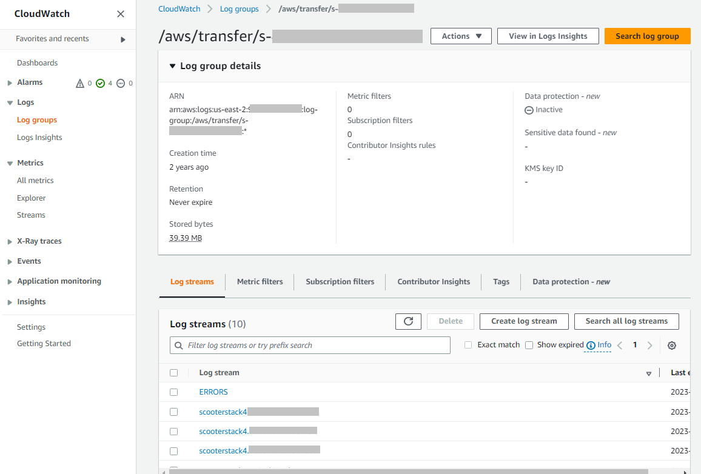
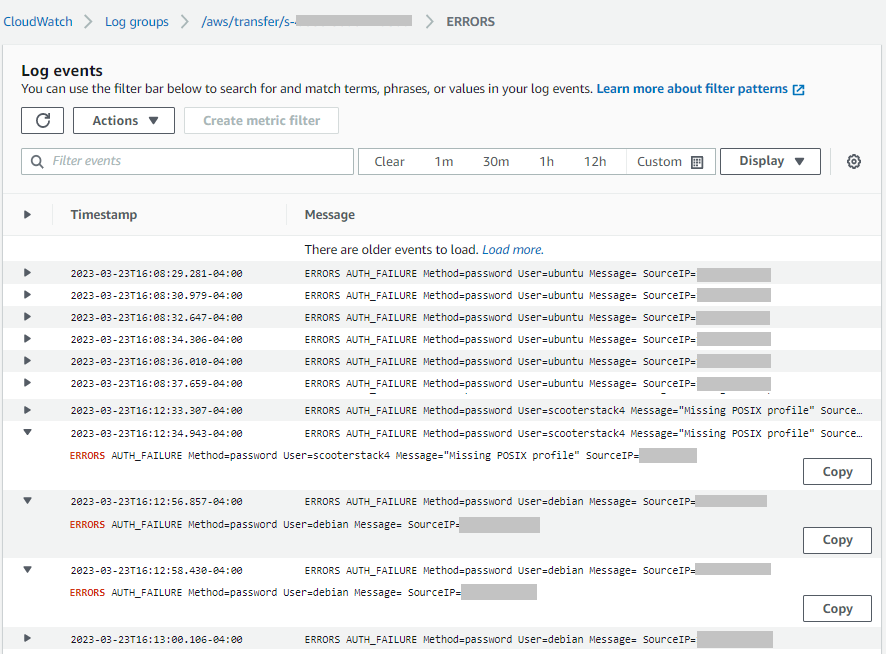
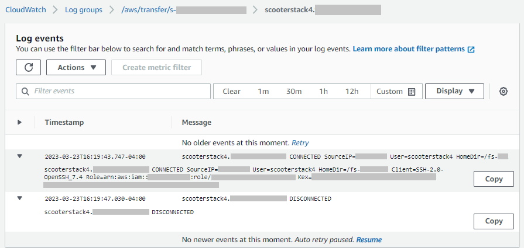
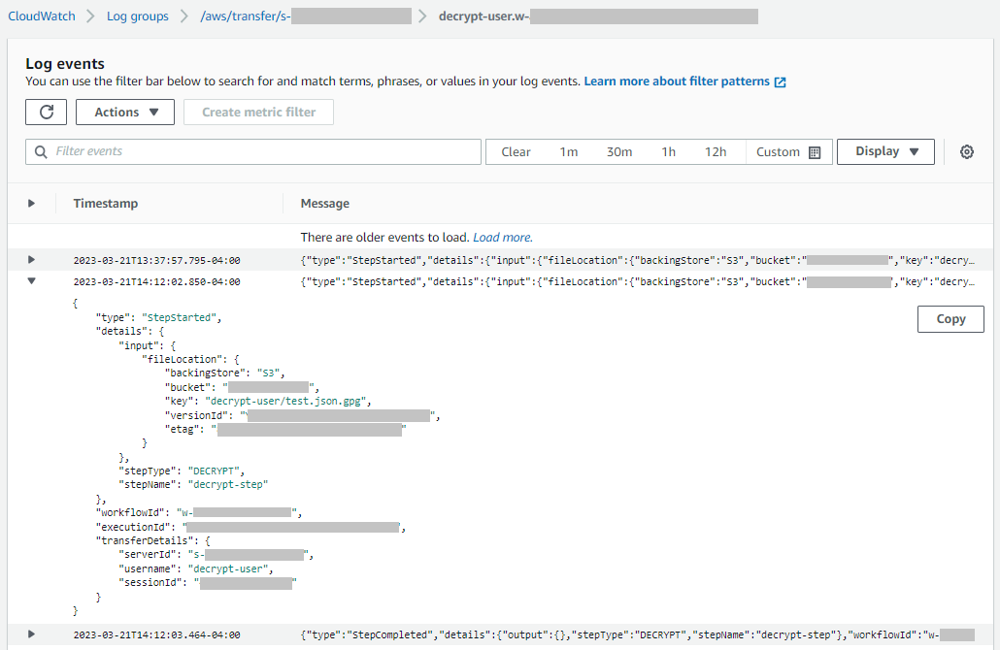

# Viewing Transfer Family log streams

###### To view your Transfer Family server logs

1. Navigate to the details page for a server.
2. Choose **View logs**. This opens Amazon CloudWatch.
3. The log group for your selected server is displayed.

 4. You can select a log stream to display details and individual entries for the
stream.

    * If there is a listing for **ERRORS**, you can choose
     it to view details for the latest errors for the server.

    
    * Choose any other entry to see an example log stream.

    
    * If your server has a managed workflow associated with it, you can view
     logs for the workflow runs.

    ###### Note

    The format for the log stream for the workflow is
     ``username`.`workflowId`.`uniqueStreamSuffix``.
     For example,
     **decrypt-user.w-a1111222233334444.aaaa1111bbbb2222**
     could be the name of a log stream for user
     `decrypt-user` and workflow
     `w-a1111222233334444`.

    

###### Note

For any expanded log entry, you can copy the entry to the clipboard by choosing
**Copy**. For more details about CloudWatch logs, see [Viewing log data](../../../AmazonCloudWatch/latest/logs/Working-with-log-groups-and-streams.md#ViewingLogData "../../../AmazonCloudWatch/latest/logs/Working-with-log-groups-and-streams.md#ViewingLogData").
