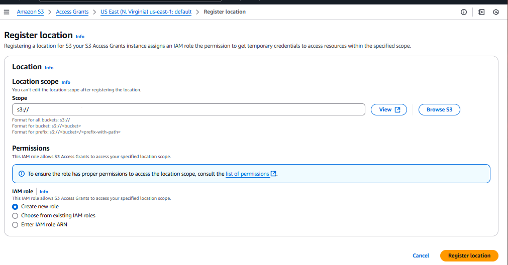
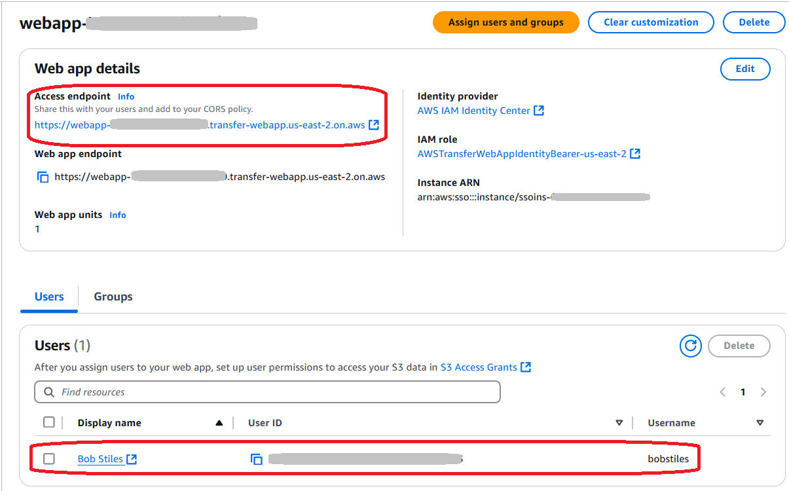
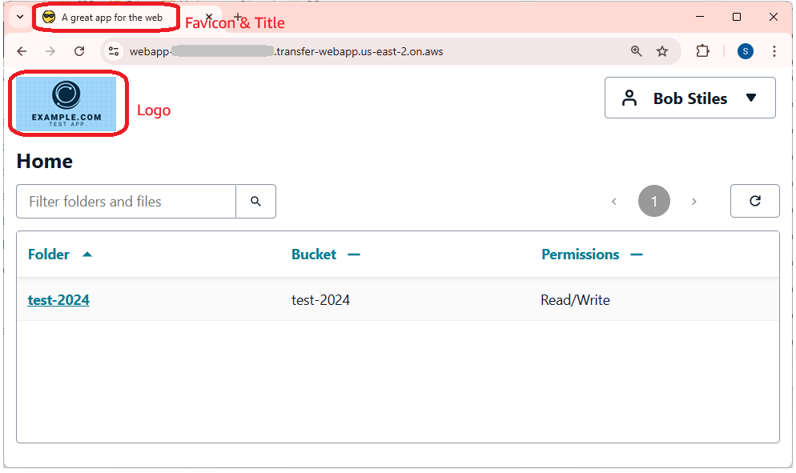
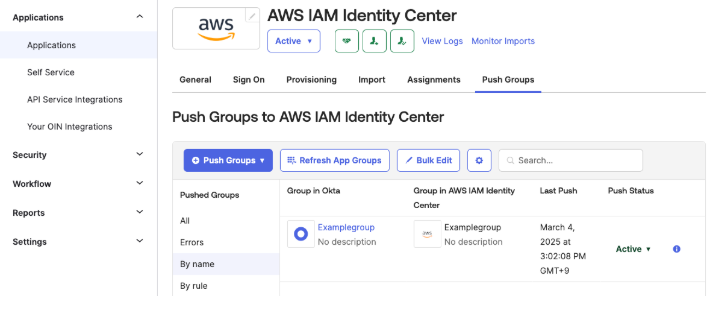
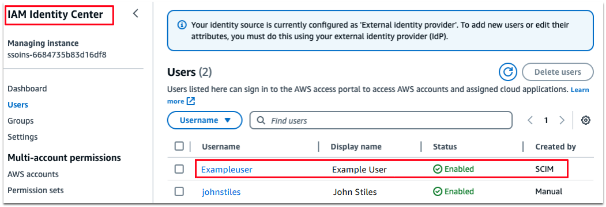
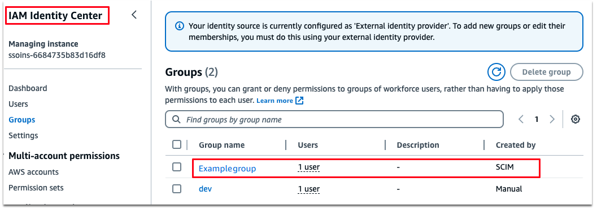
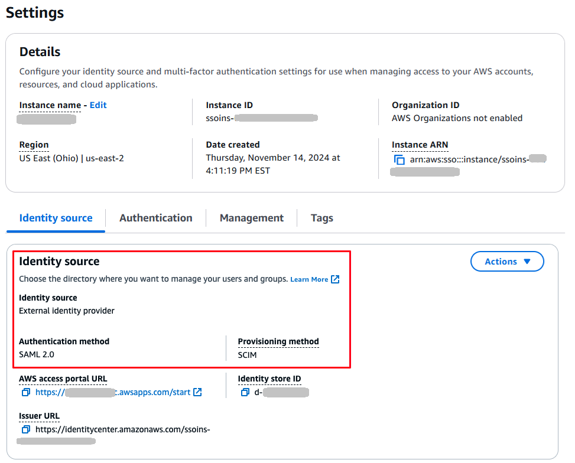

# Tutorial: Setting up a basic Transfer Family web app

This tutorial walks through how to set up a Transfer Family web app. Transfer Family web apps enable a simple
interface for transferring data to and from Amazon S3 over a web browser. For detailed
documentation for this feature, see [Transfer Family web apps](web-app.md "web-app.md").

## Web app tutorial: prerequisites

- Create either an account instance or organization instance of AWS IAM Identity Center. For
  details, see [Configure your identity provider for Transfer Family web
  apps](webapp-identity-center.md "webapp-identity-center.md").

If you are not using IAM Identity Center as your identity provider, [Integrate Okta as your identity provider for web
apps](#web-tutorial-okta "#web-tutorial-okta") illustrates
how to use an alternative (in this case Okta) identity provider.

- You need an Amazon S3 bucket to use for interacting with your Transfer Family web app. For
  details, see [Configure an Amazon S3 bucket](configure-storage.md#requirements-S3 "configure-storage.md#requirements-S3")

###### Note

This tutorial assumes that you are using the IAM Identity Center directory for your identity
provider, If that is not the case, see [Configure your identity provider for Transfer Family web
apps](webapp-identity-center.md "webapp-identity-center.md") before proceeding with this
tutorial.

After you complete the tutorial, your user can log in and interact with the web app that
you create.

## Step 1: Create the necessary supporting

resources

You need to add a user to your IAM Identity Center directory. You also need two roles: one to use as
an identity bearer role for your web app, and a second to use for configuring an Amazon S3
access grant. For the tutorial, we allow AWS services to create these roles for
us.

###### To add a user

1. Sign in to the AWS Management Console and open the AWS IAM Identity Center console at [https://console.aws.amazon.com/singlesignon/](https://console.aws.amazon.com/singlesignon/ "https://console.aws.amazon.com/singlesignon/").
2. From the left navigation pane, choose **Users**.
3. Choose **Add user** and specify the user details.

Specify a username, email address, and other required information. You can
choose to either send an email to the user with instructions for setting up
their password, or you can generate a one-time password to share with
them. 4. Choose **Next** and optionally assign the new user to one or
more groups. 5. Choose **Next** and review your choices.

If everything looks good, choose **Add user** to create the
new user with the details that you specified.

For the tutorial, the example user is **Bob Stiles**,
username **bobstiles** and email address
**bobstiles@example.com**.

## Step 2: Create a Transfer Family web app

###### To create a Transfer Family web app

1. Sign in to the AWS Management Console and open the AWS Transfer Family console at [https://console.aws.amazon.com/transfer/](https://console.aws.amazon.com/transfer/ "https://console.aws.amazon.com/transfer/").
2. In the left navigation pane, choose **Web apps**.
3. Choose **Create web app**.

For authentication access, note that the service automatically finds the
AWS IAM Identity Center instance that you set up as a prerequisite. 4. In the **Permission type** pane, select **Create and
use a new service role**. The service creates the
identity bearer role for you. An identity bearer role includes an authenticated
user's identity in its sessions. 5. In the **Web app units** pane, accept the default value of 1,
or adjust to a higher value if needed. 6. Add a tag to help you organize your web apps. For the tutorial, enter
**Name** for the key and **Tutorial web
app** for the value.

###### Tip

You can edit the web app name directly from the **Web
apps** list page after you create it. 7. Choose **Next** to open the **Design web
app** page. On this screen, provide the following
information.

You can optionally provide a title for your web app. You can also upload image
files for your logo and favicon.

    * For the page title, customize the title for the browser tab that your
     users see when they connect to the web app. If you don't enter anything
     for the page title, it defaults to **Transfer Web
     App**.
    * For the logo, upload an image file. The maximum file size for your
     logo image is 50 KB.
    * For the favicon, upload an image file. The maximum file size for your
     favicon is 20 KB.

8. Choose **Next**, then choose **Create web
   app**.

To provide a branded experience, you can provide a custom URL for your users to access
your Transfer Family web app. For details, see [Update your access endpoint with a custom URL](webapp-customize.md "webapp-customize.md").

## Step 3: Configure Cross-origin resource sharing

(CORS) for your bucket

You must set up cross-origin resource sharing (CORS) for all buckets that are used by
your web app. A _CORS configuration_ is a document that
defines rules that identify the origins that you will allow to access your bucket. For
more information about CORS, see [Configuring cross-origin resource sharing (CORS)](../../../AmazonS3/latest/userguide/enabling-cors-examples.md "../../../AmazonS3/latest/userguide/enabling-cors-examples.md").

###### To set up Cross-origin resource sharing (CORS) for your Amazon S3 bucket

1.  Sign in to the AWS Management Console and open the Amazon S3 console at
    [https://console.aws.amazon.com/s3/](https://console.aws.amazon.com/s3/ "https://console.aws.amazon.com/s3/").
2.  Choose **Buckets** from the left navigation panel and search
    for your bucket in the search dialog, then choose the
    **Permissions** tab.
3.  In **Cross-origin resource sharing (CORS)**, choose
    **Edit** and paste in the following code. Replace
    `AccessEndpoint` with the actual access endpoint
    for your web app. Make sure not to enter trailing slashes, because doing so
    causes errors when users attempt to log on to your web app.

        * Incorrect example:
         `https://webapp-c7bf3423.transfer-webapp.us-east-2.on.aws`/``
        * Correct example:
         `https://webapp-c7bf3423.transfer-webapp.us-east-2.on.aws`

    If you are reusing a bucket for multiple web apps, append their web app access
    endpoints to the `AllowedOrigins` list.

```
[
  {
    "AllowedHeaders": [
      "*"
    ],
    "AllowedMethods": [
      "GET",
      "PUT",
      "POST",
      "DELETE",
      "HEAD"
    ],
    "AllowedOrigins": [
      "https://`AccessEndpoint`"
    ],
    "ExposeHeaders": [
      "last-modified",
       "content-length",
      "etag",
      "x-amz-version-id",
      "content-type",
      "x-amz-request-id",
      "x-amz-id-2",
      "date",
      "x-amz-cf-id",
      "x-amz-storage-class",
      "access-control-expose-headers"
     ],
    "MaxAgeSeconds": 3000
  }
]
```

4. Choose **Save changes** to update the CORS.

## Step 4: Add a user to your Transfer Family web app

Add the user that you previously created in IAM Identity Center.

###### To assign users to a Transfer Family web app

1. Navigate to the web app that you created earlier.
2. Choose **Assign users and groups**.

 3. To assign the user that you previously created in IAM Identity Center, select
**Assign existing users and groups** and select
**Next**.

    1. Search for the user by the display name. Note that no users appear
     until you begin entering your search criteria. To add `Bob
     Stiles`, enter **bob** in the search
     box. If you can't find your user, navigate to the IAM Identity Center management
     console, find the user, then copy and paste their display name
     here.
    2. Choose the `Bob Stiles` user, then choose
     **Assign**.

## Step 5: Register a location in Amazon S3 and create an

access grant

After you assign a user to your web app, you need to register a bucket and create an
access grant for that user.

###### Note

You must have an S3 Access Grants instance before you can proceed. For details,
see [Create an S3
Access Grants instance](../../../AmazonS3/latest/userguide/access-grants-instance-create.md "../../../AmazonS3/latest/userguide/access-grants-instance-create.md") in the _Amazon Simple Storage Service User
Guide_.

###### To register a location and create an access grant

1. Sign in to the AWS Management Console and open the Amazon S3 console at
   [https://console.aws.amazon.com/s3/](https://console.aws.amazon.com/s3/ "https://console.aws.amazon.com/s3/").
2. Choose **Access Grants** from the left navigation
   pane.
3. Choose **View details** to see the details for your S3 Access
   Grants instance.
4. Select the **Locations** tab, then choose **Register
   location**.
5. Provide the following information.
   - For the **Scope**, browse for a bucket or enter the
     name of your bucket, and optionally a prefix. Note that the scope begins
     with the string `s3://`.
   - For the IAM role, choose **Create new role** to
     have Amazon S3 create a role. This role allows S3 Access Grants to access
     your specified location scope.



Choose **Register location** to continue. 6. Select the **Grants** tab, then choose **Create
Grant** and provide the following details.

    * For **Location**, select **Browse
     locations** and choose the location that you registered in
     the previous step.
    * For **Subprefix**, enter `*` to
     indicate that the access grant applies to the entire bucket.
    * For **Permissions**, select **Read**
     and **Write**.
    * For **Grantee type**, choose **Directory
     identity from IAM Identity Center**.
    * For **Directory identity type**, select
     **User**.
    * In **IAM Identity Center user/ ID**, copy and paste the user ID for
     `Bob Stiles`. This ID is available in the
     **Users** pane in your Transfer Family web app.

7. Choose **Create Grant**.

The access grant is created.

## Step 6: Access your Transfer Family web app as a user

Now, we navigate to the web app's URL and log in as the user that we assigned
earlier.

###### To log onto the Transfer Family web app

1. Navigate to your web app
2. Choose the **Access endpoint** from the **Web app
   details** pane.

 3. On the sign in screen, enter the user you created,
`bobstiles`, then select
**Next**. 4. Enter the password that the system assigned to this user when created and
select **Next**. 5. If your organization requires multi-factor authentication (MFA), you need to
set it up now. If not, skip ahead to step 6.

    1. You are presented with a screen to register your MFA device. Choose
     one of the available options and select
     **Next**.
    2. Perform the necessary steps to configure MFA for this user: the steps
     depend upon the MFA option you chose.
    3. You may have to set a new password for your user: if required, do so
     now. The system may also require that you sign in again, using the new
     MFA credentials that you configured.

Your use should see a screen similar to the following. Note that this screenshot
includes customization for the favicon and logo.



## Next steps

You have successfully set up a basic Transfer Family web app with standard S3 bucket access. If you need more granular control over bucket permissions, such as allowing users to download from one bucket and upload to another, see [Tutorial: Setting up AWS Transfer Family web app with selective
multi-bucket access](webapp-s3-tutorial.md "webapp-s3-tutorial.md").

## Integrate Okta as your identity provider for web

apps

You can integrate an external identity provider with Transfer Family web apps. This section
describes how to set up Okta as your identity provider.

1. In Okta, create a user, group, and application. For details on how to do this,
   see [Configure SAML and SCIM with Okta and IAM Identity Center](../../../singlesignon/latest/userguide/gs-okta.md "../../../singlesignon/latest/userguide/gs-okta.md").

 2. Connect Okta and import user and group from Okta to AWS IAM Identity Center. Follow steps
1–4 in [Configure SAML and SCIM
with Okta and IAM Identity Center](../../../singlesignon/latest/userguide/gs-okta.md "../../../singlesignon/latest/userguide/gs-okta.md").



 3. Confirm that the identity source in IAM Identity Center is SAML 2.0.

 4. Assign your user and group, as described in [Step 4: Add a user to your Transfer Family web app](#web-tutorial-step4 "#web-tutorial-step4"). 5. To avoid having your users need to use MFA when logging into your web app,
perform the following steps in Okta.

    1. From the Okta admin console, access **[Applications] -
     [Applications]**, and select the AWS IAM Identity Center
     application.
    2. On the **Sign on** tab, select **[User
     authentication] - Edit**.
    3. Select **Password only**.

After you perform all of the other steps for the tutorial, your user should be able to
access your Transfer Family web app by navigating to the web app's access endpoint in a web
browser.
