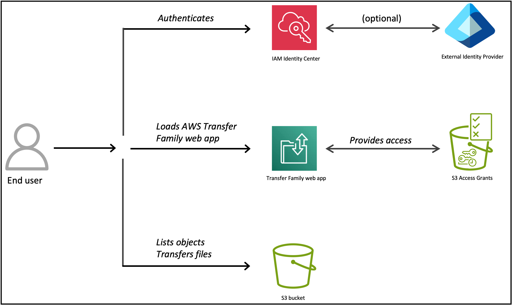

# Transfer Family web apps

You can create web apps to enable a simple interface for transferring data to and from
Amazon Simple Storage Service (S3) over a web browser. This does not require you to create or provision AWS Transfer Family
servers.

Before the introduction of Transfer Family web apps, end users needed to use a client, custom-built,
or a third-party solution to access their data in Amazon S3. This was due to stringent security
requirements for customers and partners, and because clients apps are challenging for
non-technical users to operate.

With the launch of web apps, you can now extend a branded, secure, and highly available
portal for your end users to browse, upload, and download data in Amazon S3. Web apps are
natively integrated with AWS IAM Identity Center and Amazon S3 Access Grants. This means that only your
authenticated users can view the data that they’re authorized to access. Web apps are built
using [Storage Browser for Amazon S3](../../../AmazonS3/latest/userguide/storage-browser.md "../../../AmazonS3/latest/userguide/storage-browser.md") and offer the same end user functionalities in a fully
managed offering without having to write code or host your own application.

For more information about the other AWS services that you use with Transfer Family web apps, see
the following documentation:

- [Managing access with S3 Access Grants in the Amazon Simple Storage Service User Guide](../../../AmazonS3/latest/userguide/access-grants.md "../../../AmazonS3/latest/userguide/access-grants.md")
- [AWS IAM Identity Center User Guide](../../../singlesignon/latest/userguide.md "../../../singlesignon/latest/userguide.md")
- [Amazon S3 Access Grants workshop](https://catalog.us-east-1.prod.workshops.aws/workshops/77b0af63-6ad2-4c94-bfc0-270eb9358c7a/en-US "https://catalog.us-east-1.prod.workshops.aws/workshops/77b0af63-6ad2-4c94-bfc0-270eb9358c7a/en-US")
- [Announcing AWS Transfer Family web apps for fully managed Amazon S3 file
  transfers](https://aws.amazon.com/blogs/aws/announcing-aws-transfer-family-web-apps-for-fully-managed-amazon-s3-file-transfers/ "https://aws.amazon.com/blogs/aws/announcing-aws-transfer-family-web-apps-for-fully-managed-amazon-s3-file-transfers/")
  The following resources are available to help you to get started with Transfer Family web
  apps.

- The user guide offers a detailed, step-by-step walkthrough of setting up a Transfer Family
  web app here:[Tutorial: Setting up a basic Transfer Family web app](web-app-tutorial.md "web-app-tutorial.md").
- The **AWS Getting Started Resource Center** offers a tutorial
  here: [Getting started with AWS Transfer Family web app](https://aws.amazon.com/getting-started/hands-on/set-up-an-aws-transfer-family-web-app/ "https://aws.amazon.com/getting-started/hands-on/set-up-an-aws-transfer-family-web-app/").
- The following video provides a walkthrough for
  getting started with Transfer Family web apps.

## AWS Regions for Transfer Family web apps

AWS Transfer Family web apps are available in all the Transfer Family supported regions, as listed in [AWS Transfer Family service endpoints](../../../general/latest/gr/transfer-service.md#transfer-region "../../../general/latest/gr/transfer-service.md#transfer-region"), except for Mexico (Central).

## Browser compatibility for AWS Transfer Family web apps

Transfer Family web apps support the following browsers.

| Browser         | Version           | Compatibility |
| --------------- | ----------------- | ------------- |
| Microsoft Edge  | Latest 3 versions | Compatible    |
| Mozilla Firefox | Latest 3 versions | Compatible    |
| Google Chrome   | Latest 3 versions | Compatible    |
| Apple Safari    | Latest 3 versions | Compatible    |

## How to create a Transfer Family web app

The following diagram illustrates the Transfer Family web app architecture.

Based on the diagram, you can see that Transfer Family web apps interact with the following
AWS services:

- Amazon S3 for storage and Amazon S3 Access Grants to acquire session credentials.
- AWS IAM Identity Center as the federated identity provider.
- Amazon CloudFront if you configure a custom URL for your web app.

Note the following limitations when using web apps.

- Maximum number of search results per query: 10,000
- The Amazon S3 buckets that are used by the Transfer Family web app must be in the same account as the web app itself. Cross-account buckets are not currently supported.
- Maximum search breadth per query: 10,000 searched files
- Maximum upload size per file: 160 GB (149 GiB)
- Maximum size file for copying: 5.36 GB (5 GiB)
- Folder names starting or ending with dots (.) are not supported

###### Prerequisites

_In AWS Identity and Access Management, configure the necessary roles._ Paste in the
code blocks that we provide in the instructions. For information about configuring
the necessary roles, see [Configure IAM roles for Transfer Family web apps](webapp-roles.md "webapp-roles.md").

- Create an identity bearer role.
- Create an IAM role to be used by S3 Access Grants. S3 Access Grants assumes
  this IAM role to vend temporary credentials to the grantee for the registered
  Amazon S3 location.

###### Process to create a Transfer Family web app

To create your web app and get your end users up and running, you perform the
following tasks:

1. _Configure IAM Identity Center to act as your federated identity
   provider_. Perform the following tasks in IAM Identity Center. For more details
   about configuring IAM Identity Center, see [Configure your identity provider for Transfer Family web
   apps](webapp-identity-center.md "webapp-identity-center.md").
   1. Create an IAM Identity Center instance, if you don't already have one.
   2. Determine your identity source. It can be the default IAM Identity Center directory
      or a third-party provider (for example Okta).
   3. Create or identify the users or groups that will be using your web
      app.
   4. If you are using the IAM Identity Center directory for your identity source, note
      the user or group IDs that you create. You need them later when you
      create an access grant by using S3 Access Grants.

2. _In Amazon S3, configure Amazon S3 Access Grants._ For more
   information about S3 Access Grants, see [Configure Amazon S3 Access Grants for Transfer Family web
   apps](webapp-access-grant.md "webapp-access-grant.md").
   - Create an S3 Access Grants instance if you don't already have one in
     that AWS Region.
   - Register your location using the IAM role.
   - Create the access grant.

3. _In Transfer Family, perform the following tasks._
   1. Create the Transfer Family web app. For more information about how to create the
      Transfer Family web app, see [Configure a Transfer Family web app](webapp-configure.md "webapp-configure.md").

   ###### Important

   Set up Cross-origin resource sharing (CORS) for all Amazon S3 buckets
   that are used by your web app. For information about setting up
   CORS, see [Set up Cross-origin resource sharing (CORS) for your
   bucket](access-grant-cors.md "access-grant-cors.md"). 2. Assign users or groups to the web app. For more information about how
   to assign users and groups, see [Assign or add users or groups to Transfer Family
   web app](webapp-configure.md#webapp-add-users "webapp-configure.md#webapp-add-users"). 3. (Optional) Update the access endpoint for your web app with a custom
   URL. For information about creating a custom URL, see [Update your access endpoint with a custom URL](webapp-customize.md "webapp-customize.md"). 4. Provide your end users with the access endpoint URL so that they can
   log in and interact with your web app.
