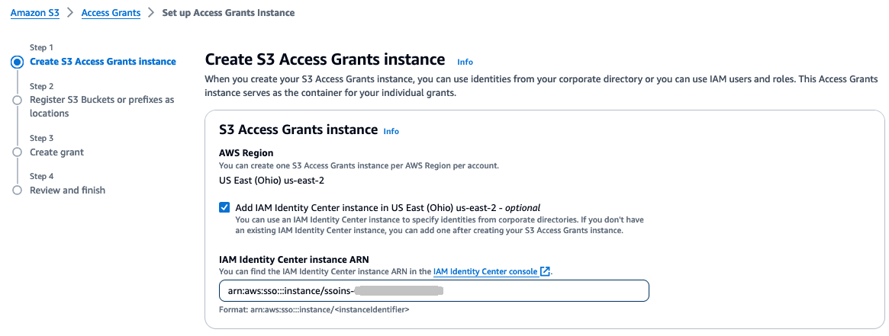
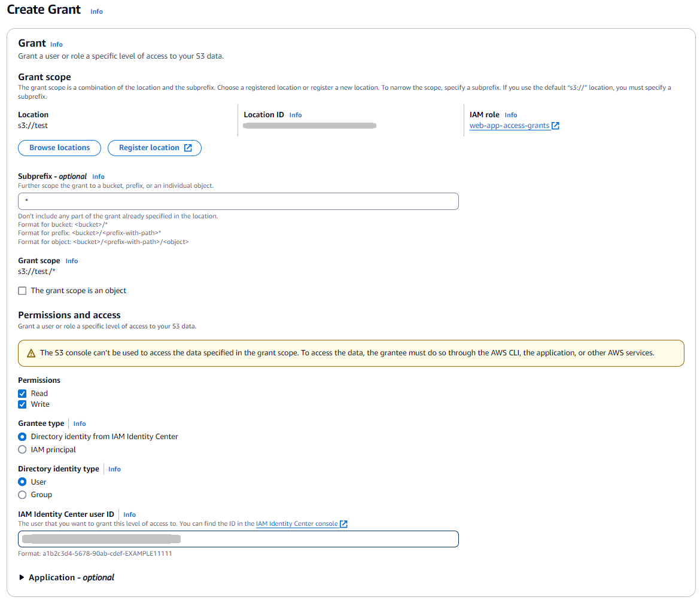
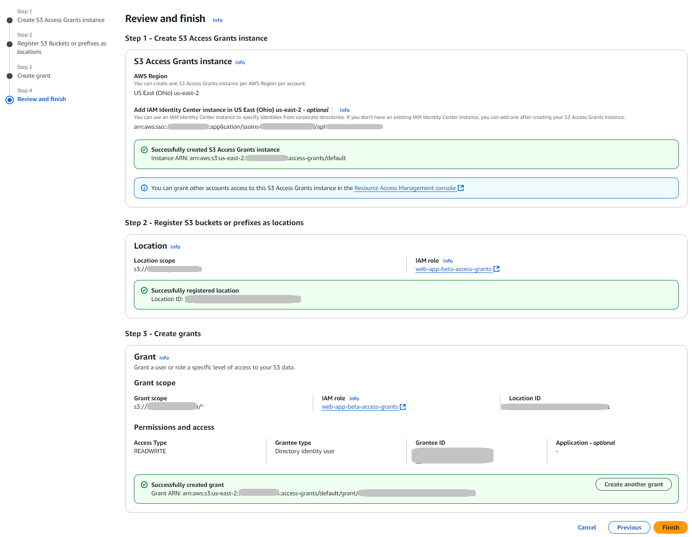
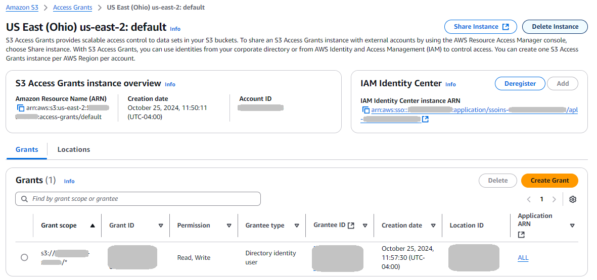

# Configure Amazon S3 Access Grants for Transfer Family web

apps

This topic describes how to add an access grant using Amazon S3 Access Grants. This access
grant defines access to your data directly to your users and groups in your corporate
directory and vends just-in-time, least privilege, temporary credentials based on
grants. An individual grant in an S3 Access Grants instance allows a specific user or
group in a corporate directory—to get access within a location that is registered
in your S3 Access Grants instance. For more details, see [S3 Access Grants
concepts](../../../AmazonS3/latest/userguide/access-grants-concepts.md "../../../AmazonS3/latest/userguide/access-grants-concepts.md") in the Amazon S3 User Guide.

###### Note

You can't use the IAM Identity Center directory with S3 Access Grants other than with Transfer Family web
apps.

You must specify an Amazon S3 access grant for identity propagation. An Amazon S3 access grant
stores the data that your end users must access. When your end users sign in to your
Transfer Family web app, S3 Access Grants passes a user's identity to the trusted application. This
section describes how to add and configure an Amazon S3 access grant instance and then an
access grant for an Amazon S3 bucket.

###### Note

Have your [IAM Identity Center instance ARN](webapp-identity-center.md#identity-center-arn "webapp-identity-center.md#identity-center-arn") and user
or group ID ready, as you need them to complete setting up your access grant.

###### To create a grant using Amazon S3 Access Grants

1. Sign in to the AWS Management Console and open the Amazon S3 console at
   [https://console.aws.amazon.com/s3/](https://console.aws.amazon.com/s3/ "https://console.aws.amazon.com/s3/").
2. Create a bucket, or note an existing bucket to use with your web app. For
   information on creating buckets, see the [Amazon S3 User Guide](../../../AmazonS3/latest/userguide.md "../../../AmazonS3/latest/userguide.md").
3. From the left navigation pane, choose **Access
   Grants**.
4. Choose **Create S3 Access Grants instance** and provide the
   following information.
   - Select **Add IAM Identity Center instance in
     `your-Region`** where
     `your-Region` is your AWS Region. Keep
     this box cleared if you are not using IAM Identity Center as your identity
     provider.
   - Paste in your IAM Identity Center instance ARN.

Choose **Next** to continue. 5. **Register S3 Buckets or prefixes as locations**. We
recommend that you register the default location, `s3://`, and map it
to an IAM role. The location at this default path covers access to all of your
Amazon S3 buckets in the AWS Region of your account. When you create an access
grant, you can narrow the scope to a bucket, a prefix, or an object within the
default location.

Provide the following information.

    * For the **Scope**, browse for a bucket or enter the
     name of your bucket, and optionally a prefix.
    * For the IAM role, choose **Create new role** to
     have the service create a role.

    Alternatively, you can create the role yourself, as described in [Configure IAM roles for Transfer Family web apps](webapp-roles.md "webapp-roles.md"), and then
     enter its ARN here.

Choose **Next** to continue. 6. In the **Create Grant** screen, provide the following
details.

    * For **Permissions**, select **Read**
     and **Write**. The access grant permissions can be
     either read-only or read & write, but write-only is not
     supported.
    * For **Grantee type**, choose **Directory
     identity from IAM Identity Center**.
    * For **Directory identity type**, select
     **User** or **Group**, depending
     on which type you want to register now.
    * In **IAM Identity Center user/group ID**, paste in the ID for your
     user or group. This ID is available in the **IAM Identity Center**
     console and in your Transfer Family web app in your users and groups table.

Choose **Next**. 7. Review the settings on the screen. If everything is correct, choose
**Finish** to create the access grant. Alternatively, you
can choose **Cancel** or **Previous** to make
changes.

This completes the setup for your web app. The users and groups that you've
configured can visit the web app at the access point, log in, and upload and download
files.
