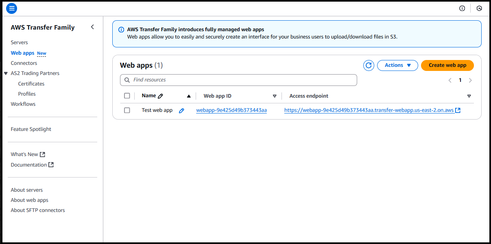
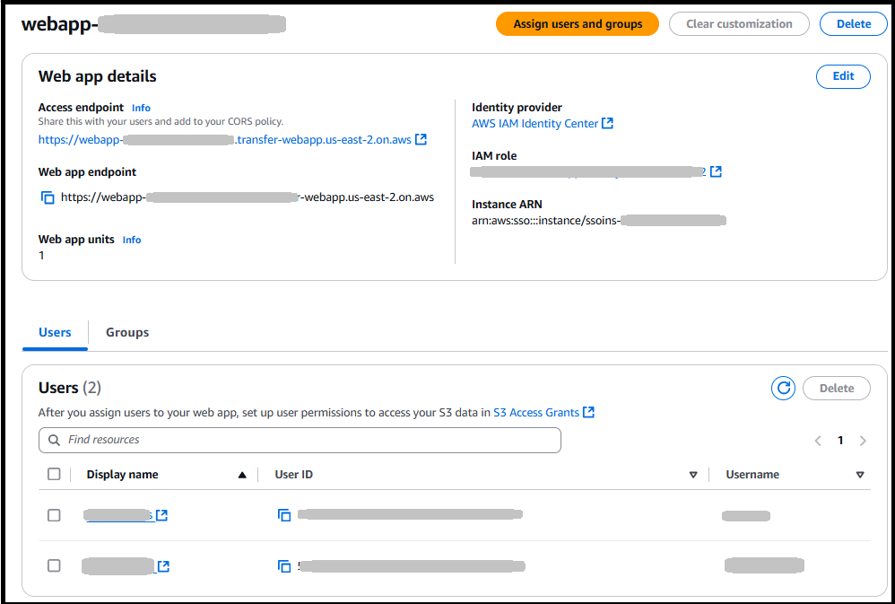
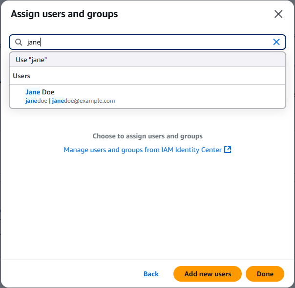
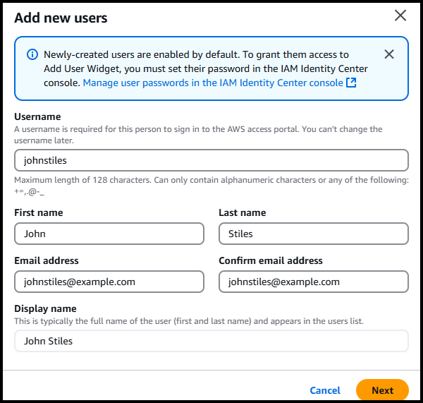

# Configure a Transfer Family web app

This section describes the procedures for creating a Transfer Family web app and then assigning
users and groups that can use it.

###### Note

Repeat these procedures to add additional web apps. You can reuse the IAM roles
that you created earlier. Make sure to add the access endpoints for the new web apps
to each bucket's Cross-origin resource sharing (CORS) policy.

## Create a Transfer Family web app

###### Note

If you are not using the IAM Identity Center directory for your identity provider, don't
attempt to create a web app until you have already set up IAM Identity Center and configured a
third party identity provider, as described in [Configure your identity provider for Transfer Family web
apps](webapp-identity-center.md "webapp-identity-center.md").

Complete the following steps to create a Transfer Family web app.

###### To create a Transfer Family web app

1. Sign in to the AWS Management Console and open the AWS Transfer Family console at [https://console.aws.amazon.com/transfer/](https://console.aws.amazon.com/transfer/ "https://console.aws.amazon.com/transfer/").
2. In the left navigation pane, choose **Web apps**.
3. Choose **Create web app**.

For authentication access, the pane is populated as follows.

    * If you have already created either an organization or account
     instance in AWS IAM Identity Center, then you see this message: **Your
     AWS Transfer Family application connected to an account instance of
     IAM Identity Center**.
    * If you already have an account instance and are a member of an
     organization instance, you have the option to choose which instance
     to connect.
    * If you don't already have an account instance, or are a member in
     an organization instance, you're presented with the options to
     create an account instance.

4. In the **Permission type** pane, you can use a previously
   created role, or have the service create one for you.
   - If you have already created an identity bearer role, choose
     **Use an existing role** and choose your role
     from the **Select an existing role** menu.
   - To have the service create a role for you, choose **Create
     and use a new service role**.

5. In the **Web app units** pane, choose a value. One web
   app unit allows web app activity from up to 250 unique sessions. When
   creating a web app, you provision how many units you need based on your
   expected peak workload volumes. Changing your web app units has an impact on
   your billing. For information about pricing, see [AWS Transfer Family Pricing](https://aws.amazon.com/aws-transfer-family/pricing "https://aws.amazon.com/aws-transfer-family/pricing").
6. If you are using Transfer Family in an AWS GovCloud (US) Region, you can select the
   **FIPS Enabled endpoint** checkbox in the
   **FIPS Enabled** pane. For all other AWS Regions,
   this option is unavailable.
7. (Optional) Add a tag to help you organize your web apps. We suggest that
   you add a tag with **Name** as the key and a descriptive
   name as the value.
8. Choose **Next**. On this screen, you can optionally
   provide a title for your web app. If you don't provide a title, the default
   title of **Transfer Web App** is supplied. You can also
   upload image files for your logo and favicon.
9. Choose **Next**, then choose **Create web
   app**.

###### Note

Make sure to set up a Cross-origin resource sharing (CORS) policy for all of
the buckets that are accessed from the web app endpoint.

## Assign or add users or groups to Transfer Family

web app

After you create a Transfer Family web app, you can assign users and groups who can then
access the web app. You can either retrieve users that are already created and
stored in IAM Identity Center, or you can [add new users directly](../../../singlesignon/latest/userguide/addusers.md "../../../singlesignon/latest/userguide/addusers.md")
(if you're using an IAM Identity Center directory as your identity provider). If you add new
users, they are also added to your IAM Identity Center instance.

Note the following:

- You can only add new users if you are using the IAM Identity Center directory as your
  identity source and have the proper permissions. If you are a member of an
  organization instance, you might not have the necessary permissions to add
  users.

###### Note

If you don't assign users or groups to your application, your users
will get an error when they attempt to log into your web app.

- If you create a new user, you must also create an S3 access grant for this
  user so that they can access data on your web app.
- After you create a new user, that user receives an onboarding email from
  IAM Identity Center with directions for how to proceed.

###### To assign users to a Transfer Family web app

1. Navigate to your web app list, and choose the one that you want to
   edit.
2. Choose **Assign users and groups**.

 3. To assign users that you previously created in IAM Identity Center, select
**Assign existing users and groups**. To create new
users, skip ahead to step 4.

    1. An information screen appears. Choose **Get
     started** to continue.
    2. Search for the user. Note that no users appear until you begin
     entering your search criteria. You must search by the
     *display name*, not the
     *username*, if different. Only exact matches
     are returned. If you can't find your user, navigate to the IAM Identity Center
     management console, find the user, then copy and paste their display
     name here.

    
    3. Choose the users and groups to add, then choose
     **Assign**.

4. To create a new user, select **Add and assign new
   users**.
   1. An information screen appears. Choose **Get
      started** to continue.
   2. Choose **Add new users**.
   3. Enter the following user details into the dialog box: username,
      first and last name, and an email address.

    4. Choose **Next**, then choose
   **Add** to add the user and close the dialog
   box, or **Add new user** to create another
   user.
