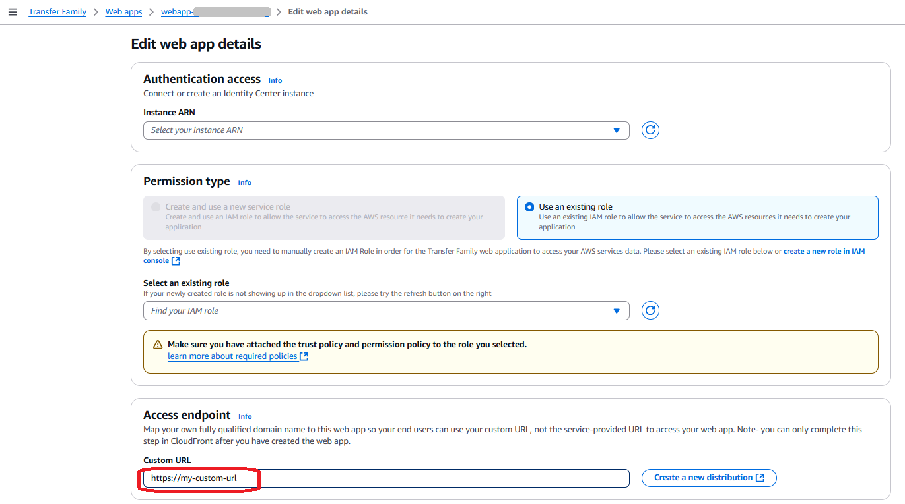

# Update your access endpoint with a custom URL

The default access endpoint that is created with your web app contains
service-generated identifiers. To provide a branded experience, you may want to provide
a custom URL for your users to access your Transfer Family web app. This topic describes how to
update your access endpoint with a custom URL.

###### Note

The following procedure relies on you using the recommended [CloudFormation stack template](https://s3.amazonaws.com/aws-transfer-resources/custom-domain-templates/aws-transfer-web-app-custom-domain-distribution.template.yml "https://s3.amazonaws.com/aws-transfer-resources/custom-domain-templates/aws-transfer-web-app-custom-domain-distribution.template.yml"). You don't need to use the template: you can
create the distribution by using the [CloudFront console](https://console.aws.amazon.com/cloudfront/v4/home "https://console.aws.amazon.com/cloudfront/v4/home") directly.

However, the provided template simplifies the process, and makes it easier to
avoid misconfiguration. If you don't use the AWS CloudFormation template, make sure to follow
these guidelines:

- The [Origin request policy](../../../AmazonCloudFront/latest/DeveloperGuide/using-managed-origin-request-policies.md#managed-origin-request-policy-cors-custom "../../../AmazonCloudFront/latest/DeveloperGuide/using-managed-origin-request-policies.md#managed-origin-request-policy-cors-custom") should forward query strings and cookies
  to the origin, and should not forward the `Host` header to the
  origin.
- The [Cache policy](../../../AmazonCloudFront/latest/DeveloperGuide/using-managed-cache-policies.md#managed-cache-policy-origin-cache-headers "../../../AmazonCloudFront/latest/DeveloperGuide/using-managed-cache-policies.md#managed-cache-policy-origin-cache-headers") should not include the `Host` header in
  the cache key.

###### To customize your web app URL

1. Create a CloudFront distribution by using the Transfer Family supplied AWS CloudFormation template,
   [CloudFormation stack template](https://s3.amazonaws.com/aws-transfer-resources/custom-domain-templates/aws-transfer-web-app-custom-domain-distribution.template.yml "https://s3.amazonaws.com/aws-transfer-resources/custom-domain-templates/aws-transfer-web-app-custom-domain-distribution.template.yml").
   1. Open the AWS CloudFormation console at [https://console.aws.amazon.com/cloudformation](https://console.aws.amazon.com/cloudformation/ "https://console.aws.amazon.com/cloudformation/").
   2. Choose **Create stack** and specify the
      following.
      - In the **Prerequisite - Prepare template**
        section, choose **Choose an existing
        template**.
      - In the **Specify template** section, choose
        **Upload a template file**.
      - Save the [CloudFormation stack template](https://s3.amazonaws.com/aws-transfer-resources/custom-domain-templates/aws-transfer-web-app-custom-domain-distribution.template.yml " https://s3.amazonaws.com/aws-transfer-resources/custom-domain-templates/aws-transfer-web-app-custom-domain-distribution.template.yml") file, and then upload it
        here.

   3. Choose **Next** and provide the following
      information.
      - **WebAppEndpoint**: copy the value from your
        web app
      - **AccessEndpoint**: provide the custom domain
        name that you want to use
      - **AcmCertificateArn**: provide the ARN for a
        public or private SSL/TLS certificate that is stored in
        AWS Certificate Manager

   4. Complete the AWS CloudFormation wizard until your new stack is created.

2. In your web app, edit the **Access endpoint**, updating the
   **Custom URL** to the URL that you want to use.

 3. Create DNS records to route traffic for your custom domain name to the CloudFront
distribution. If you're using Route 53 for the zone, you can create an Alias or
CNAME record to the CloudFront distribution name (for example,
**xxxx.cloudfront.net**). For information about using
Amazon Route 53 with CloudFront, see [Configuring Amazon Route 53 to route traffic to a CloudFront
distribution](../../../Route53/latest/DeveloperGuide/routing-to-cloudfront-distribution.md#routing-to-cloudfront-distribution-config "../../../Route53/latest/DeveloperGuide/routing-to-cloudfront-distribution.md#routing-to-cloudfront-distribution-config"). 4. Update your cross-origin resource sharing policy by replacing the default
access endpoint with the following line in the `AllowedOrigins` code
block:

```
 "https://`custom-url`"
```

You need to make this change for each bucket used by your web app.

After you make your update, the `AllowedOrigins` section of your
CORS policy should look like the following:

```
"AllowedOrigins": [
    "https://`custom-url`"],
```

You need only a single AllowedOrigins entry for each Transfer Family web app.

See the [Set up Cross-origin resource sharing
(CORS) for your Amazon S3 bucket](access-grant-cors.md#cors-configure "access-grant-cors.md#cors-configure") procedure for more details.
You can now visit your custom access endpoint, and share this link with your end
users.
