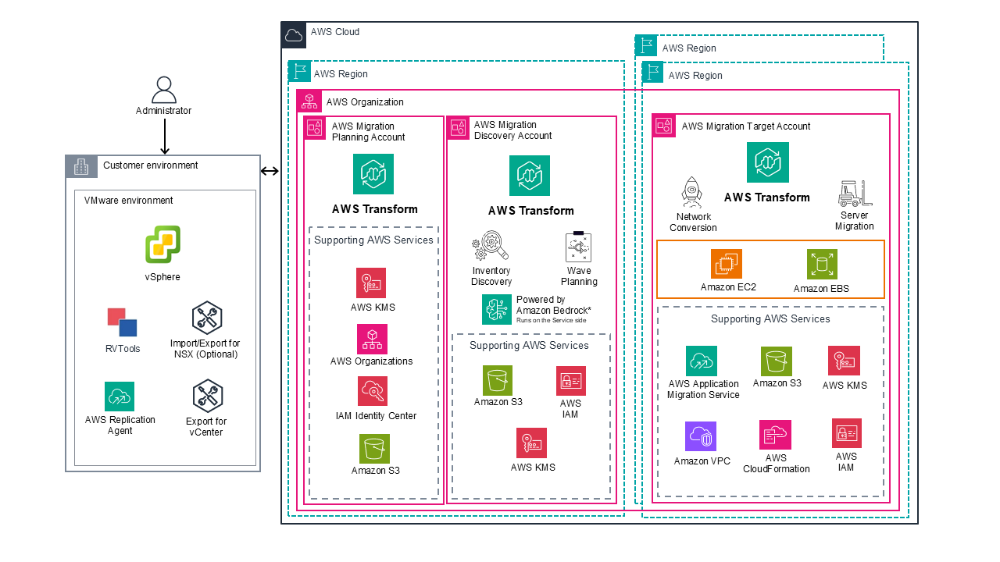

# VMware migration

AWS Transform can help you migrate your VMware environment to Amazon EC2 by using generative AI.
This document provides an overview of AWS Transform and of the workflow of the migration
process.

## Capabilities and key

features

AWS Transform offers the following capabilities and key features for migrating your VMware
environment to AWS.

- Three discovery options:
  - Assisted discovery of your VMware environment by using collectors from
    AWS Application Discovery Service.
  - Use the open-source [Export for
    vCenter](https://github.com/awslabs/export-for-vcenter "https://github.com/awslabs/export-for-vcenter") tool.
  - Importing independently collected discovery data.

- AI-driven conversion of your source VMware network configuration to an
  Amazon VPC network architecture.
- AI-driven generation of migration plans, including application grouping and
  suggested migration waves.
- Rehosting your servers to run natively on Amazon EC2.

AWS Transform supports migrating Windows and Linux servers of supported operating systems.
For the full list of supported operating systems, see [Supported operating
systems](../../../mgn/latest/ug/Supported-Operating-Systems.md "../../../mgn/latest/ug/Supported-Operating-Systems.md") in the _AWS Application Migration Service User
Guide_.

## AWS Transform VMware migration architecture

This diagram displays an overview of AWS Transform VMware migration architecture.

## Limitations

AWS Transform has the following limitations:

- If you stop a running migration job, and then ask the agent to restart it, the
  job will start again from the beginning and you will lose any progress you have
  made in the job. However, artifacts created in the job before restarting it will
  still be available.
- You can specify one target AWS account and one target AWS Region per
  VMware migration job. To migrate waves to different target accounts or different
  Regions, create multiple VMware migration jobs, and use the same source account
  connector for your inventory. For information about the two types of account
  connectors, see [AWS account connectors for
  VMware migrations](transform-app-vmware-acct-connections.md "transform-app-vmware-acct-connections.md").
- NSX imports are only supported for end-to-end migration jobs.

###### Important

AWS Transform generates network configurations and migration strategies based on your environment assessment.
Review these configurations with stakeholders to ensure that they meet your organization's security,
compliance, and business requirements. While AWS Transform provides automated configuration recommendations,
you are responsible for validating and adjusting the settings to match your security and compliance needs before proceeding with migration.
