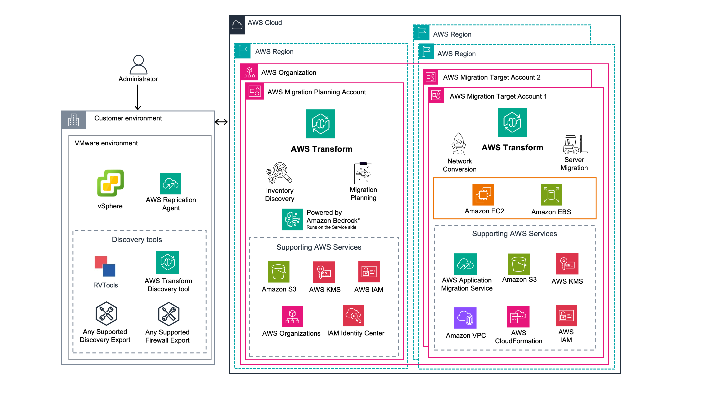

# Migrations (including VMware)

AWS Transform can help you migrate your virtual and bare metal server environments to Amazon EC2
by using generative AI, including VMware, Hyper-V, and other sources. An AI-powered agent
accelerates each stage of your migration, from discovery and planning through network
migration and server rehost. This reduces the manual effort traditionally required for
large-scale migrations. You interact with the agent through a conversational interface that
guides you step by step, so you can focus on decisions rather than execution.

## Capabilities and key features

AWS Transform offers the following capabilities and key features for migrating your
server environments to AWS.

- **Flexible discovery** that meets you where you
  are, with multiple options to capture your source environment:

  - Assisted discovery of your VMware environment by using collectors from
    AWS Application Discovery Service.
  - The open-source [Export for
    vCenter](https://github.com/awslabs/export-for-vcenter "https://github.com/awslabs/export-for-vcenter") tool (VMware environments).
  - Importing independently collected discovery data (any source environment).

- **AI-driven network migration** that translates
  your source network configuration into a production-ready Amazon VPC architecture,
  so you don't have to design it from scratch.
- **Intelligent migration planning** that
  automatically groups applications and sequences migration waves, helping you
  move faster with fewer planning cycles.
- **Automated server rehosting** to run your
  servers natively on Amazon EC2, with guided testing and cutover workflows.
- **Localized interface**, allowing you to use
  AWS Transform for migrations in your preferred language. For more information, see
  [Language settings](transform-environment.md#transform-environment-language "transform-environment.md#transform-environment-language").

AWS Transform supports migrating Windows and Linux servers of supported operating systems.
For the full list of supported operating systems, see [Supported operating
systems](../../../mgn/latest/ug/Supported-Operating-Systems.md "../../../mgn/latest/ug/Supported-Operating-Systems.md") in the _AWS Transform MGN User
Guide_.

## AWS Transform migration architecture

AWS Transform orchestrates the entire migration lifecycle from a single interface. The
following diagram displays an overview of the architecture.

