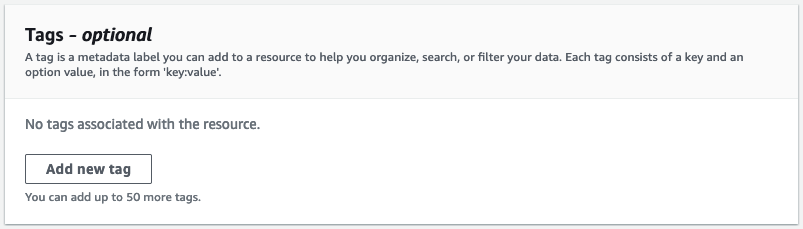
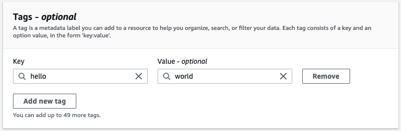
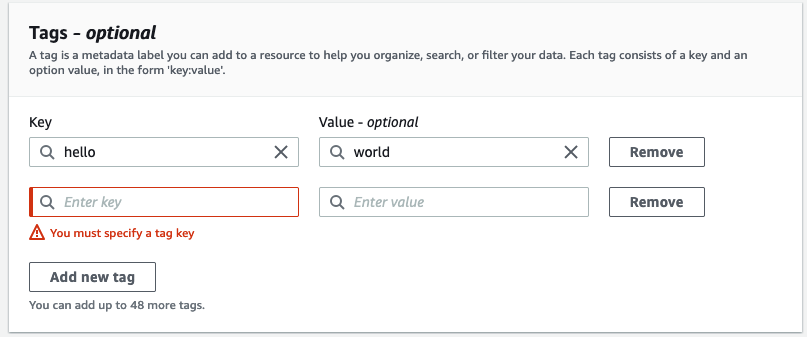

# Tagging a new resource

You can add tags to a **ParallelData**
or **Custom Terminology** resource when you create it.

###### To add tags to a new resource (console)

1. Sign in to the [Amazon Translate console](https://console.aws.amazon.com/translate/ "https://console.aws.amazon.com/translate/").
2. From the left navigation pane, select
   the resource (`Parallel data` or `Custom terminology`) that you want to create.
3. Chose **Create parallel data** or **Create
   terminology**. The console displays the main 'create' page for your resource. At
   the end of this page, you see a '**Tags -**
   _optional_' panel.

 4. Choose **Add new tag** to add a tag for the resource. Enter a tag key
and, optionally, a tag value.

 5. Repeat step 4 until you have added all your tags. Each key must be unique for this
resource.

 6. Choose **Create parallel data** or **Create
terminology** to create the resource.
You can also add tags using the Amazon Translate [CreateParallelData](../APIReference/API_CreateParallelData.md "../APIReference/API_CreateParallelData.md") API operation.
The following example shows how to add tags with the create-parallel-data CLI command.

```
aws translate create-parallel-data \
--name "`myTest`" \
--parallel-data-config "{\"format\": \"`CSV`\",  \
             "S3Uri\": \"s3://`test-input/TEST.csv`\"}" \
--tags "[{\"Key\": \"`color`\",\"Value\": \"`orange`\"}]"
```
