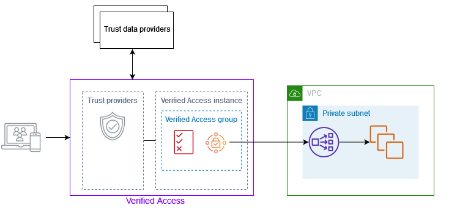

# How Verified Access works

AWS Verified Access evaluates each application request from your users and allows access based
on:

- Trust data sent by your chosen trust provider (from AWS or a third party).
- Access policies that you create in Verified Access.
  When a user tries to access an application, Verified Access gets their data from the trust provider and
  evaluates it against the policies that you set for the application. Verified Access grants access to the
  requested application only if the user meets your specified security requirements. All application
  requests are denied by default, until a policy is defined.

In addition, Verified Access logs every access attempt, to help you respond quickly to security
incidents and audit requests.

## Key components of Verified Access

The following diagram provides a high-level overview of Verified Access. Users send requests to access
an application. Verified Access evaluates the request against the access policy for the group and any
application-specific endpoint policies. If access is allowed, the request is sent to the
application through the endpoint.

- Verified Access instances – An instance evaluates application
  requests and grants access only when your security requirements are met.
- Verified Access endpoints – Each endpoint represents an
  application. In the diagram above, the application is hosted on EC2 instances that are
  targets of a load balancer.
- Verified Access group – A collection of Verified Access endpoints. We
  recommend that you group the endpoints for applications with similar security requirements to
  simplify policy administration. For example, you can group the endpoints for all your sales
  applications together.
- Access policies – A set of user-defined rules that
  determine whether to allow or deny access to an application. You can specify a combination of
  factors, including user identity and device security state. You create a group access policy
  for each Verified Access group, which is inherited by all endpoints in the group. You can optionally
  create application-specific policies and attach them to specific endpoints.
- Trust providers – A service that manages user
  identities or device security state. Verified Access works with both AWS and third-party trust
  providers. You must attach at least one trust provider to each Verified Access instance. You can attach a
  single identity trust provider and multiple device trust providers to each Verified Access
  instance.
- Trust data – The security-related data for users or
  devices that your trust provider sends to Verified Access. Also referred to as _user
  claims_ or _trust context_. For example, the email address of a
  user or the operating system version of a device. Verified Access evaluates this data against your access
  policies when it receives each request to access an application.
