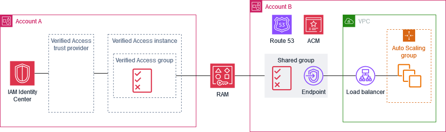

# Share a Verified Access group with another AWS account

When you share a Verified Access group that you own with other AWS accounts, you enable those
accounts to create Verified Access endpoints in your group. The account that created the Verified Access group
in is referred to as the _owner_ account. The account that uses a shared
group is referred to as the _consumer_ account.

The following diagram illustrates the benefit of sharing a Verified Access group. The central
security team owns Account A. They manage users and groups in AWS IAM Identity Center, and manage the Verified Access
resources required to provide access to internal applications, such as Verified Access trust providers,
Verified Access instances, Verified Access groups, and Verified Access policies. The application team owns Account B. They
manage the resources required to run their internal application, such as the load balancer,
Auto Scaling group, DNS configuration in Amazon Route 53, and TLS certificates from AWS Certificate Manager (ACM). After
the central security team shares a Verified Access group with Account B, the application team can
create Verified Access endpoints using the shared group. Access to the application is allowed or denied
based on the policies that the central security team created for the Verified Access group.

## Considerations

The following considerations apply to shared Verified Access groups.

###### Owners

- To share a Verified Access group, users must have the following permissions:
  `ec2:PutResourcePolicy` and `ec2:DeleteResourcePolicy`.
- To share a Verified Access group, you must own it. You can't share a Verified Access group that was shared
  with you.
- If you enable sharing with the accounts in your organization, you can share resources,
  such as Verified Access groups, without using invitations. Otherwise, the consumer receives an
  invitation and must accept it to access the shared group. To enable sharing, from the
  management account for your organization, open the
  **[Settings](https://console.aws.amazon.com/ram/home#Settings: "https://console.aws.amazon.com/ram/home#Settings:")**
  page in the AWS RAM console and choose **Enable sharing with AWS Organizations**.
- You can't delete a group if there are associated Verified Access endpoints. You can view the
  endpoints created by consumer accounts on the **Verified Access endpoints** page
  in your account. The account ID of the owner of an endpoint is reflected in the Amazon
  Resource Name (ARN) of the certificate for the endpoint.

###### Consumers

- To view the Verified Access groups that are shared with you, open the **Verified Access groups**
  page in the console, or call [describe-verified-access-groups](../../../cli/latest/reference/ec2/describe-verified-access-groups.md "../../../cli/latest/reference/ec2/describe-verified-access-groups.md"). The account ID of the owner is reflected in the
  **Owner** field and the Amazon Resource Name (ARN) of the group.
- When you create a Verified Access endpoint, you can specify any Verified Access groups that were
  shared with you.
- You can't view endpoints that are associated with the shared group but not owned
  by you.
- If the owner of the Verified Access group deletes the resource share, you can't create a new
  Verified Access endpoint in the group. Any Verified Access endpoints that you created prior to the deletion
  of the resource share are unaffected by the deletion of the resource share. However, the
  owner of the shared group can delete your endpoints.

## Resource shares

To share a Verified Access group, you must add it to a resource share. A resource share specifies
the resources to share and the consumers that can use the shared resources.

###### To share a Verified Access group using the console

1. Open the AWS RAM console at [https://console.aws.amazon.com/ram/home](https://console.aws.amazon.com/ram/home "https://console.aws.amazon.com/ram/home").
2. If you don't have a resource share for your organization, create one. For the principal,
   you can choose your entire organization, an organizational unit, or specific AWS accounts.
3. Select your resource share and choose **Modify**.
4. For `Resources`, choose **Verified Access Groups** as the resource
   type, and then select the resource group to share.
5. Choose **Skip to: Review and update**.
6. Choose **Update resource share**.

For more information, see [Create a resource share](../../../ram/latest/userguide/getting-started-sharing.md#getting-started-sharing-create "../../../ram/latest/userguide/getting-started-sharing.md#getting-started-sharing-create") in the _AWS RAM User Guide_.
