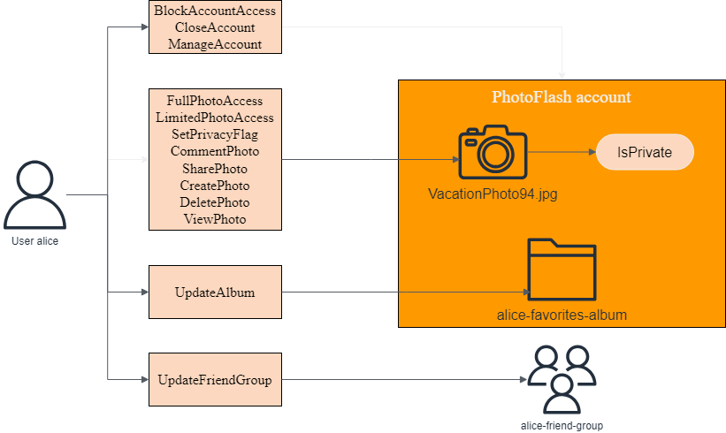

# Create your first Amazon Verified Permissions policy store

For this tutorial, let's assume you're the developer of a photo sharing application and
you are looking for a way to control what actions the users of the application can perform.
You want to control who can add, delete, or view photos and photo albums. You also want to
control what actions a user can take on their account. Can they manage their account, how
about the account of a friend? To control these actions you would create policies that
permit or forbid these actions based on the identity of the user. Verified Permissions offers [policy stores](terminology.md#term-policy-store "terminology.md#term-policy-store"), or containers, to house these
policies.

In this tutorial we'll walk through creating a sample policy store using the
Amazon Verified Permissions console. The console offers a few sample policy store options and we’re going to
create a **PhotoFlash** policy store. This policy store allows
_principals_, such as users, to perform _actions_,
such as sharing, on _resources_, such as photos or albums.

The following diagram illustrates the relationships between a principal,
`User::alice`, and the actions she can take on various resources, namely her
PhotoFlash account, the `VactionPhoto94.jpg` file, the photo album
`alice-favorites-album`, and the user group
`alice-friend-group`.

Now that you have an understanding of the **PhotoFlash**
policy store, let’s create the policy store and explore it.

## Prerequisites

### Sign up for an AWS account

To get started with AWS, you need an AWS account. For information about creating an AWS account, see
[Getting started with an AWS account](../../../accounts/latest/reference/getting-started.md "../../../accounts/latest/reference/getting-started.md")
in the _AWS Account Management Reference Guide_.

## Step 1: Create a PhotoFlash policy store

In the following procedure you'll create a **PhotoFlash** policy
store using the AWS console.

###### To create a PhotoFlash policy store

1. In the [Verified Permissions console](https://console.aws.amazon.com/verifiedpermissions "https://console.aws.amazon.com/verifiedpermissions"),
   choose **Create new policy store**.
2. For **Starting options**, choose **Start from a
   sample policy store**.
3. For **Sample project**, choose
   **PhotoFlash**.
4. Choose **Create policy store**.

Once you see the message "Created and configured policy store," choose **Go to
overview** to explore your policy store.

## Step 2: Create a policy

When you created the policy store, a default policy was created that allows users to
have full control over their own accounts. This is a useful policy, but for our
purposes, let’s create a more restrictive policy to explore the nuances of Verified Permissions. If you
remember the diagram we looked at earlier in the tutorial, we had a principal,
`User::alice`, who could perform an action, `UpdateAlbum`, on
a resource, `alice-favorites-album`. Let's add the policy that will allow
Alice, and only Alice, to manage this album.

###### To create a policy

1. In the [Verified Permissions console](https://console.aws.amazon.com/verifiedpermissions "https://console.aws.amazon.com/verifiedpermissions"),
   choose the policy store you created in step 1.
2. In the navigation, choose **Policies**.
3. Choose **Create policy** and then choose **Create
   static policy**.
4. For **Policy effect**, choose
   **Permit**.
5. For **Principals scope**, choose **Specific
   principal**, then for **Specify entity type**,
   choose **PhotoFlash::User**, and for **Specify entity
   identifier**, enter `alice`.
6. For **Resources scope**, choose **Specific
   resource**, then for **Specify entity type**,
   choose **PhotoFlash::Album**, and for **Specify entity
   identifier**, enter
   `alice-favorites-album`.
7. For **Actions scope**, choose **Specific set of
   actions**, then for **Action(s) this policy should apply
   to**, select **UpdateAlbum**.
8. Choose **Next**.
9. Under **Details**, for **Policy description -
   optional** enter `Policy allowing alice to update
alice-favorites-album.`.
10. Choose Create policy

Now that you've created a policy you can test it in the Verified Permissions console.

## Step 3: Testing a policy store

After creating your policy store and policy, you can test them by running a simulated [authorization request](terminology.md#term-authorization-request "terminology.md#term-authorization-request") using the Verified Permissions
test bench.

###### To test policy store policies

1. Open the [Verified Permissions console](https://console.aws.amazon.com/verifiedpermissions/ "https://console.aws.amazon.com/verifiedpermissions/"). Choose your policy store.
2. In the navigation pane on the left, choose **Test
   bench**.
3. Choose **Visual mode**.
4. For **Principal**, do the following:

   1. For **Principal taking action** choose
      **PhotoFlash::User** and for **Specify
      entity identifier**, enter
      `alice`.
   2. Under **Attributes**, for **Account:
      Entity**, make sure that the
      **PhotoFlash::Account** entity is selected, and for
      **Specify entity identifier**, enter
      `alice-account`.

5. Under **Resource**, for **Resource that principal is
   acting on**, choose the **PhotoFlash::Album**
   resource type and for **Specify entity identifier**, enter
   `alice-favorites-album`.
6. For **Action**, choose
   **PhotoFlash::Action::"UpdateAlbum"** from the list of
   valid actions.
7. At the top of the page, choose **Run authorization request**
   to simulate the authorization request for the Cedar policies in the sample
   policy store. The test bench should display **Decision: Allow**
   indicating our policy is working as expected.

The following table provides additional values for the principal, resource, and action
you can test with the Verified Permissions test bench. The table includes the authorization request
decision based on the static policies included with the PhotoFlash sample policy store and the policy you
created in step 2.

| **Principal value**       | **Principal Account: Entity value** | **Resource value**           | **Resource parent value** | **Action**                 | **Authorization decision** |
| ------------------------- | ----------------------------------- | ---------------------------- | ------------------------- | -------------------------- | -------------------------- | ---------------------------- | ------------------------------------- | ------------------------------------- | ----- |
| \*_PhotoFlash::User_ • | bob                                 | \*_PhotoFlash::Account_ • | alice-account             | \*_PhotoFlash::Album_ • |  alice-favorites-album  | N/A                          | **PhotoFlash::Action::"UpdateAlbum"** | Deny                                  |
| \*_PhotoFlash::User_ • | alice                               | \*_PhotoFlash::Account_ • | alice-account             | \*_PhotoFlash::Photo_ • | photo.jpeg                 | \*_PhotoFlash::Account_ • | bob-account                           | **PhotoFlash::Action::"ViewPhoto"**   | Deny  |
| \*_PhotoFlash::User_ • | alice                               | \*_PhotoFlash::Account_ • | alice-account             | \*_PhotoFlash::Photo_ • | photo.jpeg                 | \*_PhotoFlash::Account_ • | alice-account                         | **PhotoFlash::Action::"ViewPhoto"**   | Allow |
| \*_PhotoFlash::User_ • | alice                               | \*_PhotoFlash::Account_ • | alice-account             | \*_PhotoFlash::Photo_ • | bob-photo.jpeg             | \*_PhotoFlash::Album_ •   | Bob-Vacation-Album                    | **PhotoFlash::Action::"DeletePhoto"** | Deny  |

## Step 4: Clean up resources

After you have finished exploring your policy store, delete it.

###### To delete a policy store

1. In the [Verified Permissions console](https://console.aws.amazon.com/verifiedpermissions "https://console.aws.amazon.com/verifiedpermissions"),
   choose the policy store you created in step 1.
2. In the navigation, choose **Settings**.
3. Under **Delete policy store**, choose **Delete this
   policy store**.
4. In the **Delete this policy store?** dialog box, enter
   _delete_, and then choose
   **Delete**.
