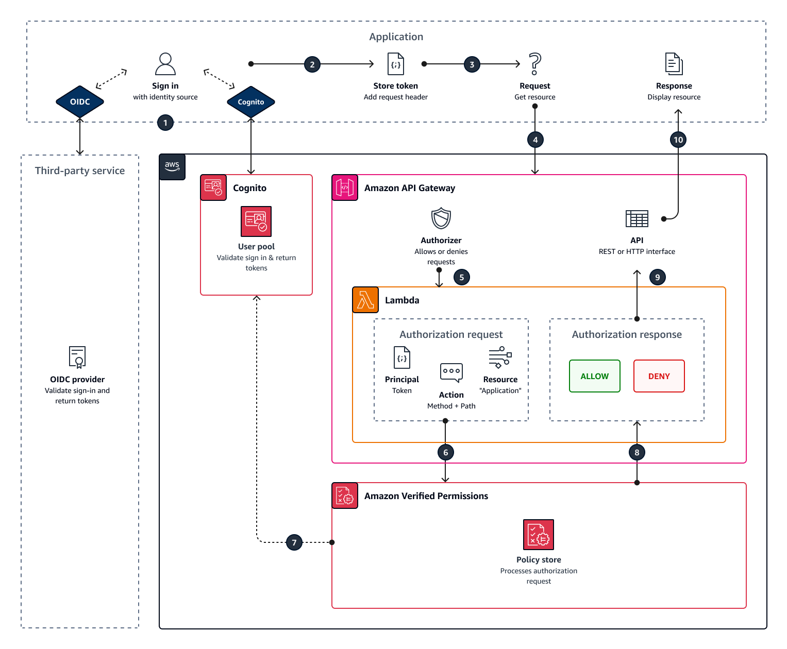

# API-linked policy stores

A common use case is to use Amazon Verified Permissions to authorize user access to APIs hosted on
Amazon API Gateway. Using a wizard in the AWS console, you can create role-based access policies
for users managed in [Amazon Cognito](https://aws.amazon.com/cognito "https://aws.amazon.com/cognito"), or any OIDC
identity provider (IdP), and deploy an AWS Lambda Authorizer that calls Verified Permissions to evaluate
these policies.

To complete the wizard, choose **Set up with API Gateway and an identity
provider** when you [create a new
policy store](policy-stores-create.md "policy-stores-create.md") and follow the steps.

An API-linked policy store is created and it provisions your authorization model and
resources for authorization requests. The policy store has an identity source and a Lambda
authorizer that connects API Gateway to Verified Permissions. Once the policy store is created, you can authorize
API requests based on users’ group memberships. For example, Verified Permissions can grant access only to
users who are members of the `Directors` group.

As your application grows, you can implement fine-grained authorization with user
attributes and OAuth 2.0 scopes using the [Cedar policy
language](https://docs.cedarpolicy.com/ "https://docs.cedarpolicy.com/"). For example, Verified Permissions can grant access only to users who have an
`email` attribute in the domain `mycompany.co.uk`.

After you have set up the authorization model for your API, your remaining responsibility
is to authenticate users and generate API requests in your application, and to maintain your
policy store.

To see an demo, see [Amazon Verified Permissions - Quick Start Overview and Demo](https://www.youtube.com/watch?v=OBrSrzfuWhQ "https://www.youtube.com/watch?v=OBrSrzfuWhQ") on the _Amazon Web Services YouTube channel_.

###### Topics

- [How Verified Permissions authorizes API
  requests](#policy-stores-api-userpool-how-it-works "#policy-stores-api-userpool-how-it-works")
- [Considerations for
  API-linked policy stores](#policy-stores-api-userpool-considerations "#policy-stores-api-userpool-considerations")
- [Adding attribute-based access control
  (ABAC)](#policy-stores-api-userpool-abac "#policy-stores-api-userpool-abac")
- [Moving to
  production with AWS CloudFormation](policy-stores-api-userpool-considerations-production.md "policy-stores-api-userpool-considerations-production.md")
- [Troubleshooting API-linked policy stores](policy-stores-api-userpool-considerations-troubleshooting.md "policy-stores-api-userpool-considerations-troubleshooting.md")

###### Important

Policy stores that you create with the **Set up with API Gateway and an identity
source** option in the Verified Permissions console aren’t intended for immediate
deployment to production. With your initial policy store, finalize your authorization
model and export the policy store resources to CloudFormation. Deploy Verified Permissions to
production programmatically with the [AWS Cloud Development Kit (AWS CDK)](https://aws.amazon.com/cdk "https://aws.amazon.com/cdk").
For more information, see [Moving to
production with AWS CloudFormation](policy-stores-api-userpool-considerations-production.md "policy-stores-api-userpool-considerations-production.md").

In a policy store that's linked to an API and an identity source, your application
presents a user pool token in an authorization header when it makes a request to the API.
The identity source of your policy store provides token validation for Verified Permissions. The token
forms the `principal` in authorization requests with the [IsAuthorizedWithToken](../apireference/API_IsAuthorizedWithToken.md "../apireference/API_IsAuthorizedWithToken.md") API. Verified Permissions builds policies around the
group membership of your users, as presented in a groups claim in identity (ID) and access
tokens, for example `cognito:groups` for user pools. Your API processes the token
from your application in a Lambda authorizer and submits it to Verified Permissions for an authorization
decision. When your API receives the authorization decision from the Lambda authorizer, it
passes the request on to your data source or denies the request.

###### Components of identity source and API Gateway authorization with Verified Permissions

- An [Amazon Cognito](../../../cognito/latest/developerguide/cognito-user-identity-pools.md "../../../cognito/latest/developerguide/cognito-user-identity-pools.md") user pool or OIDC IdP that authenticates and groups users. Users'
  tokens populate the group membership and the principal or context that Verified Permissions
  evaluates in your policy store.
- An [API Gateway](../../../apigateway/latest/developerguide/apigateway-rest-api.md "../../../apigateway/latest/developerguide/apigateway-rest-api.md")
  REST API. Verified Permissions defines actions from API paths and API methods, for example
  `MyAPI::Action::get /photo`.
- A Lambda function and a [Lambda authorizer](../../../apigateway/latest/developerguide/apigateway-use-lambda-authorizer.md "../../../apigateway/latest/developerguide/apigateway-use-lambda-authorizer.md") for your API. The Lambda function
  takes in bearer tokens from your user pool, requests authorization from Verified Permissions, and
  returns a decision to API Gateway. The **Set up with API Gateway and an identity
  source** workflow automatically creates this Lambda authorizer for
  you.
- A Verified Permissions policy store. The policy store identity source is your Amazon Cognito user pool or
  OIDC provider group. The policy store schema reflects the configuration of your API,
  and the policies link user groups to permitted API actions.
- An application that authenticates users with your IdP and appends tokens to API
  requests.

## How Verified Permissions authorizes API

requests

When you create a new policy store and select the **Set up with API Gateway and an identity
source** option, Verified Permissions creates policy store schema and policies. The schema
and policies reflect API actions and the user groups that you want to authorize to
take the actions. Verified Permissions also creates the Lambda function and [authorizer](../../../apigateway/latest/developerguide/apigateway-use-lambda-authorizer.md "../../../apigateway/latest/developerguide/apigateway-use-lambda-authorizer.md").

1. Your user signs in with your application through Amazon Cognito or another OIDC IdP.
   The IdP issues ID and access tokens with the user's information.
2. Your application stores the JWTs. For more information, see [Using tokens with user pools](../../../cognito/latest/developerguide/amazon-cognito-user-pools-using-tokens-with-identity-providers.md "../../../cognito/latest/developerguide/amazon-cognito-user-pools-using-tokens-with-identity-providers.md") in the _Amazon Cognito
   Developer Guide_..
3. Your user requests data that your application must retrieve from an external
   API.
4. Your application requests data from a REST API in API Gateway. It appends an ID or
   access token as a request header.
5. If your API has a cache for the authorization decision, it returns the
   previous response. If caching is disabled or the API has no current cache, API Gateway
   passes the request parameters to a [token-based Lambda authorizer](../../../apigateway/latest/developerguide/apigateway-use-lambda-authorizer.md "../../../apigateway/latest/developerguide/apigateway-use-lambda-authorizer.md").
6. The Lambda function sends an authorization request to a Verified Permissions policy store with the
   [IsAuthorizedWithToken](../apireference/API_IsAuthorizedWithToken.md "../apireference/API_IsAuthorizedWithToken.md") API. The Lambda function passes the elements
   of an authorization decision:
   1. The user's token as the principal.
   2. The API method combined with the API path, for example
      `GetPhoto`, as the action.
   3. The term `Application` as the resource.

7. Verified Permissions validates the token. For more information about how Amazon Cognito tokens are
   validated, see [Authorization with Amazon Verified Permissions](../../../cognito/latest/developerguide/amazon-cognito-authorization-with-avp.md "../../../cognito/latest/developerguide/amazon-cognito-authorization-with-avp.md") in the _Amazon Cognito
   Developer Guide_.
8. Verified Permissions evaluates the authorization request against the policies in your policy store
   and returns an authorization decision.
9. The Lambda authorizer returns an `Allow` or `Deny`
   response to API Gateway.
10. The API returns data or an `ACCESS_DENIED` response to your
    application. Your application processes and displays the results of the API
    request.

## Considerations for

API-linked policy stores

When you build an API-linked policy store in the Verified Permissions console, you're creating a test for an
eventual production deployment. Before you move to production, establish a fixed
configuration for your API and user pool. Consider the following factors:

**API Gateway caches responses**

In API-linked policy stores, Verified Permissions creates a Lambda authorizer with an
**Authorization caching** TTL of 120 seconds. You can
adjust this value or turn off caching in your authorizer. In an authorizer
with caching enabled, your authorizer returns the same response each time
until the TTL expires. This can extend the effective lifetime of user pool
tokens by a duration that equals the caching TTL of the requested
stage.

**Amazon Cognito groups can be reused**

Amazon Verified Permissions determines group membership for user pool users from the
`cognito:groups` claim in a user's ID or access token. The
value of this claim is an array of the friendly names of the user pool
groups that the user belongs to. You can't associate user pool groups with a
unique identifier.

User pool groups that you delete and recreate with the same name present
to your policy store as the same group. When you delete a group from a user pool,
delete all references to the group from your policy store.

**API-derived namespace and schema are point-in-time**

Verified Permissions captures your API at a _point in
time_: it only queries your API when you create your policy store.
When the schema or name of your API changes, you must update your policy
store and Lambda authorizer, or create a new API-linked policy store. Verified Permissions derives
the policy store [namespace](https://docs.cedarpolicy.com/schema/schema.html#schema-namespace "https://docs.cedarpolicy.com/schema/schema.html#schema-namespace") from the name of your API.

**Lambda function has no VPC configuration**

The Lambda function that Verified Permissions creates for your API authorizer is
launched in the default VPC. By default. APIs that have network access restricted to
private VPCs can't communicate with the Lambda function that authorizes
access requests with Verified Permissions.

**Verified Permissions deploys authorizer resources in CloudFormation**

To create an API-linked policy store, you must sign in a highly-privileged AWS
principal to the Verified Permissions console. This user deploys an AWS CloudFormation stack that
creates resources across several AWS services. This principal must have
the permission to add and modify resources in Verified Permissions, IAM, Lambda, and
API Gateway. As a best practice, don't share these credentials with other
administrators in your organization.

See [Moving to
production with AWS CloudFormation](policy-stores-api-userpool-considerations-production.md "policy-stores-api-userpool-considerations-production.md") for an
overview of the resources that Verified Permissions creates.

## Adding attribute-based access control

(ABAC)

A typical authentication session with an IdP returns ID and access tokens. You can
pass either of these token types as a bearer token in application requests to your API.
Depending on your choices when you create your policy store, Verified Permissions expects one of the
two types of tokens. Both types carry information about the user’s group membership. For
more information about token types in Amazon Cognito, see [Using tokens with user pools](../../../cognito/latest/developerguide/amazon-cognito-user-pools-using-tokens-with-identity-providers.md "../../../cognito/latest/developerguide/amazon-cognito-user-pools-using-tokens-with-identity-providers.md") in the _Amazon Cognito Developer Guide_.

After you create a policy store, you can add and extend policies. For example, you can
add new groups to your policies as you add them to your user pool. Because your policy
store is already aware of the way that your user pool presents groups in tokens, you can
permit a set of actions for any new group with a new policy.

You might also want to extend the group-based model of policy evaluation into a more
precise model based on user properties. User pool tokens contain additional user
information that can contribute to authorization decisions.

**ID tokens**

ID tokens represent a user’s attributes and have a high level of
fine-grained access control. To evaluate email addresses, phone numbers, or
custom attributes like department and manager, evaluate the ID token.

**Access tokens**

Access tokens represent a user’s permissions with OAuth 2.0 scopes. To add
a layer of authorization or to set up requests for additional resources,
evaluate the access token. For example, you can validate that a user is in
the appropriate groups _and_ carries a
scope like `PetStore.read` that generally authorizes access to
the API. User pools can add custom scopes to tokens with [resource servers](../../../cognito/latest/developerguide/cognito-user-pools-define-resource-servers.md "../../../cognito/latest/developerguide/cognito-user-pools-define-resource-servers.md") and with [token customization at runtime](../../../cognito/latest/developerguide/user-pool-lambda-pre-token-generation.md#user-pool-lambda-pre-token-generation-accesstoken "../../../cognito/latest/developerguide/user-pool-lambda-pre-token-generation.md#user-pool-lambda-pre-token-generation-accesstoken").

See [Mapping Amazon Cognito tokens to schema](cognito-map-token-to-schema.md "cognito-map-token-to-schema.md") and [Mapping OIDC tokens to schema](oidc-map-token-to-schema.md "oidc-map-token-to-schema.md") for example policies that process
claims in ID and access tokens.
