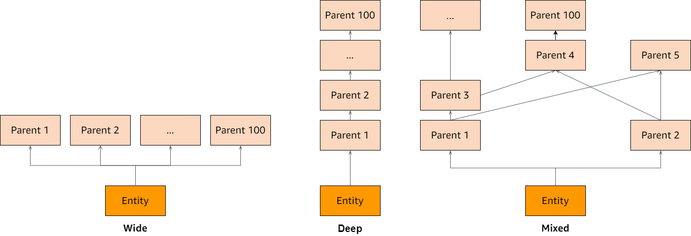

# Quotas for Amazon Verified Permissions

Your AWS account has default quotas, formerly referred to as limits, for each AWS
service. Unless otherwise noted, each quota is Region-specific. You can request increases
for some quotas, and other quotas cannot be increased.

To view the quotas for Verified Permissions, open the [Service Quotas
console](https://console.aws.amazon.com/servicequotas/home "https://console.aws.amazon.com/servicequotas/home"). In the navigation pane, choose **AWS services** and
select **Verified Permissions**.

To request a quota increase, see [Requesting a Quota
Increase](../../../servicequotas/latest/userguide/request-quota-increase.md "../../../servicequotas/latest/userguide/request-quota-increase.md") in the _Service Quotas User Guide_. If the quota is not yet
available in Service Quotas, use the [limit increase
form](https://console.aws.amazon.com/support/home#/case/create?issueType=service-limit-increase "https://console.aws.amazon.com/support/home#/case/create?issueType=service-limit-increase").

Your AWS account has the following quotas related to Verified Permissions.

###### Topics

- [Quotas for resources](#quotas-resources "#quotas-resources")
- [Quotas for hierarchies](#quotas-hierarchies "#quotas-hierarchies")
- [Quotas for operations per second](#quotas-tps "#quotas-tps")

## Quotas for resources

| Name                                 | Default                          | Adjustable                                                                                                                                                                                                 | Description                                                                       |
| ------------------------------------ | -------------------------------- | ---------------------------------------------------------------------------------------------------------------------------------------------------------------------------------------------------------- | --------------------------------------------------------------------------------- |
| Policy stores per Region per account | Each supported Region:<br>30,000 | [Yes](https://console.aws.amazon.com/servicequotas/home/services/verifiedpermissions/quotas/L-919F2C9C "https://console.aws.amazon.com/servicequotas/home/services/verifiedpermissions/quotas/L-919F2C9C") | The maximum number of policy stores.                                              |
| Policy templates per policy store    | Each supported Region:<br>40     | [Yes](https://console.aws.amazon.com/servicequotas/home/services/verifiedpermissions/quotas/L-97BDA0CF "https://console.aws.amazon.com/servicequotas/home/services/verifiedpermissions/quotas/L-97BDA0CF") | The maximum number of policy templates in a policy store.                         |
| Identity sources per policy store    | 1                                | No                                                                                                                                                                                                         | The maximum number of identity sources that you can define for a<br>policy store. |
| Authorization request size¹          | 1 MB                             | No                                                                                                                                                                                                         | The maximum size of an authorization request.                                     |
| Policy size                          | 10,000 bytes                     | No                                                                                                                                                                                                         | The maximum size of an individual policy.                                         |
| Schema size                          | 100,000 bytes                    | No                                                                                                                                                                                                         | The maximum size of the schema of a policy store.                                 |
| Policy size per resource             | 200,000 bytes²                   | Yes                                                                                                                                                                                                        | The maximum size of all policies that reference a specific<br>resource.           |

¹ The quota for an authorization request is the same for both [IsAuthorized](../apireference/API_IsAuthorized.md "../apireference/API_IsAuthorized.md")
and [IsAuthorizedWithToken](../apireference/API_IsAuthorizedWithToken.md "../apireference/API_IsAuthorizedWithToken.md").

² The default limit for the total size of all the policies scoped for a single
resource is 200,000 bytes. Similarly, the total size of all the policies, where the
scope leaves the resource undefined, thereby applying to all resources, is limited by
default to 200,000 bytes. Note that for template-linked policies the size of the policy template is counted only once,
plus the size of each set of parameters used to instantiate each template-linked policy. This limit can be
raised, provided that your policy design meets certain constraints. If you need to
explore this option,
[contact
Support](https://aws.amazon.com/contact-us/ "https://aws.amazon.com/contact-us/").

### Template-linked policy size

example

You can determine how template-linked policies contribute to the _Policy
size per resource_ quota by taking the sum of the length of the
principal and resource. If the principal or resource isn't specified, the length of
that piece is 0. If a resource isn't specified, its size counts towards the
`"unspecified"` resource quota. The size of the
template body itself has no impact on the policy size.

Let's look at the following template:

```
@id("template1")
permit (
  principal in ?principal,
  action in [Action::"view", Action::"comment"],
  resource in ?resource
)
unless {
  resource.tag =="private"
};
```

Let's create the following policies from that template:

```
TemplateLinkedPolicy {
  policyId: "policy1",
  templateId: "template1",
  principal: User::"alice",
  resource: Photo::"car.jpg"
}

TemplateLinkedPolicy {
  policyId: "policy2",
  templateId: "template1",
  principal: User::"bob",
  resource: Photo::"boat.jpg"
}

TemplateLinkedPolicy {
  policyId: "policy3",
  templateId: "template1",
  principal: User::"jane",
  resource: Photo::"car.jpg"

TemplateLinkedPolicy {
  policyId: "policy4",
  templateId: "template1",
  principal: User::"jane",
  resource
}
```

Now, let's calculate the size of those policies by counting the characters in the
`principal` and `resource` for each one. Each character
counts as 1 byte.

The size of `policy1` would be the length of the principal
`User::"alice"` (13) plus the length of the resource
`Photo::"car.jpg"` (16). Adding them up we have 13 + 16 = 29
bytes.

The size of `policy2` would be the length of the principal
`User::"bob"` (11) plus the length of the resource
`Photo::"boat.jpg"` (17). Adding them up we have 11 + 17 = 28
bytes.

The size of `policy3` would be the length of the principal
`User::"jane"` (12) plus the length of the resource
`Photo::"car.jpg"` (16). Adding them up we have 12 + 16 = 28
bytes.

The size of `policy4` would be the length of the principal
`User::"jane"` (12) plus the length of the resource (0). Adding them
up we have 12 + 0 = 12 bytes.

Since `policy2` is the only policy that references the resource
`Photo::"boat.jpg"`, the total resource size is 28 bytes.

Since `policy1` and `policy3` both reference the resource
`Photo::"car.jpg"`, the total resource size is 29 + 28 = 57
bytes.

Since `policy4` is the only policy that references the `"unspecified"` resource, the total
resource size is 12 bytes.

## Quotas for hierarchies

###### Note

The following quotas are aggregated, meaning they are added together. The maximum
number of transitive parents for the group is what's listed. For example, if the
limit of _Transitive parents per principal_ is 100 that means
there could be 100 parents of _principals_ and 0 parents for both
_actions_ and _resources_, or any
combination of parents that add up to 100 **total** parents.

| Name                             | Default | Adjustable | Description                                                  |
| -------------------------------- | ------- | ---------- | ------------------------------------------------------------ |
| Transitive parents per principal | 100     | No         | The maximum number of transitive parents for each principal. |
| Transitive parents per action    | 100     | No         | The maximum number of transitive parents for each action.    |
| Transitive parents per resource  | 100     | No         | The maximum number of transitive parents for each resource.  |

The diagram below illustrates how transitive parents can be defined for an entity
(principal, action, or resource).



## Quotas for operations per second

Verified Permissions throttles requests to service endpoints in an AWS Region when application
requests exceed the quota for an API operation. Verified Permissions might return an exception when you
exceed the quota in requests per second, or you attempt simultaneous write operations.
You can view your current RPS quotas in [Service Quotas](https://console.aws.amazon.com/servicequotas/home/services/verifiedpermissions/quotas "https://console.aws.amazon.com/servicequotas/home/services/verifiedpermissions/quotas"). To
prevent applications from exceeding the quota for an operation, you must optimize them
for retries and exponential backoff. For more information, see [Retry
with backoff pattern](../../../prescriptive-guidance/latest/cloud-design-patterns/retry-backoff.md "../../../prescriptive-guidance/latest/cloud-design-patterns/retry-backoff.md") and [Managing and
monitoring API throttling in your workloads](https://aws.amazon.com/blogs/mt/managing-monitoring-api-throttling-in-workloads/ "https://aws.amazon.com/blogs/mt/managing-monitoring-api-throttling-in-workloads/").

| Name                                                         | Default                      | Adjustable                                                                                                                                                                                                                                                                                              | Description                                                  |
| ------------------------------------------------------------ | ---------------------------- | ------------------------------------------------------------------------------------------------------------------------------------------------------------------------------------------------------------------------------------------------------------------------------------------------------- | ------------------------------------------------------------ |
| BatchGetPolicy requests per second per Region per<br>account | Each supported Region: 10    | [Yes](https://console.aws.amazon.com/servicequotas/home/services/verifiedpermissions/quotas/L-9647C866 "https://console.aws.amazon.com/servicequotas/home/services/verifiedpermissions/quotas/L-9647C866")                                                                                              | The maximum number of BatchGetPolicy requests per<br>second. |
|                                                              | Each supported Region:       | [https://console.aws.amazon.com/servicequotas/home/services/verifiedpermissions/quotas/L-9647C866](https://console.aws.amazon.com/servicequotas/home/services/verifiedpermissions/quotas/L-9647C866 "https://console.aws.amazon.com/servicequotas/home/services/verifiedpermissions/quotas/L-9647C866") |                                                              |
|                                                              | Each supported Region:       | [https://console.aws.amazon.com/servicequotas/home/services/verifiedpermissions/quotas/L-9647C866](https://console.aws.amazon.com/servicequotas/home/services/verifiedpermissions/quotas/L-9647C866 "https://console.aws.amazon.com/servicequotas/home/services/verifiedpermissions/quotas/L-9647C866") |                                                              |
|                                                              | Each supported Region:       | [https://console.aws.amazon.com/servicequotas/home/services/verifiedpermissions/quotas/L-9647C866](https://console.aws.amazon.com/servicequotas/home/services/verifiedpermissions/quotas/L-9647C866 "https://console.aws.amazon.com/servicequotas/home/services/verifiedpermissions/quotas/L-9647C866") |                                                              |
|                                                              | Each supported Region:       | [https://console.aws.amazon.com/servicequotas/home/services/verifiedpermissions/quotas/L-9647C866](https://console.aws.amazon.com/servicequotas/home/services/verifiedpermissions/quotas/L-9647C866 "https://console.aws.amazon.com/servicequotas/home/services/verifiedpermissions/quotas/L-9647C866") |                                                              |
| CreatePolicyStore requests per second per Region per account | Each supported Region:<br>1  | No                                                                                                                                                                                                                                                                                                      | The maximum number of CreatePolicyStore requests per second. |
|                                                              | Each supported Region:       | [https://console.aws.amazon.com/servicequotas/home/services/verifiedpermissions/quotas/L-8D5CB09F](https://console.aws.amazon.com/servicequotas/home/services/verifiedpermissions/quotas/L-8D5CB09F "https://console.aws.amazon.com/servicequotas/home/services/verifiedpermissions/quotas/L-8D5CB09F") |                                                              |
|                                                              | Each supported Region:       | [https://console.aws.amazon.com/servicequotas/home/services/verifiedpermissions/quotas/L-F81CF58F](https://console.aws.amazon.com/servicequotas/home/services/verifiedpermissions/quotas/L-F81CF58F "https://console.aws.amazon.com/servicequotas/home/services/verifiedpermissions/quotas/L-F81CF58F") |                                                              |
|                                                              | Each supported Region:       | [https://console.aws.amazon.com/servicequotas/home/services/verifiedpermissions/quotas/L-F81CF58F](https://console.aws.amazon.com/servicequotas/home/services/verifiedpermissions/quotas/L-F81CF58F "https://console.aws.amazon.com/servicequotas/home/services/verifiedpermissions/quotas/L-F81CF58F") |                                                              |
| DeletePolicyStore requests per second per Region per account | Each supported Region:<br>1  | No                                                                                                                                                                                                                                                                                                      | The maximum number of DeletePolicyStore requests per second. |
|                                                              | Each supported Region:       | [https://console.aws.amazon.com/servicequotas/home/services/verifiedpermissions/quotas/L-5CA93A13](https://console.aws.amazon.com/servicequotas/home/services/verifiedpermissions/quotas/L-5CA93A13 "https://console.aws.amazon.com/servicequotas/home/services/verifiedpermissions/quotas/L-5CA93A13") |                                                              |
|                                                              | Each supported Region:       | [https://console.aws.amazon.com/servicequotas/home/services/verifiedpermissions/quotas/L-C9736881](https://console.aws.amazon.com/servicequotas/home/services/verifiedpermissions/quotas/L-C9736881 "https://console.aws.amazon.com/servicequotas/home/services/verifiedpermissions/quotas/L-C9736881") |                                                              |
|                                                              | Each supported Region:       | [https://console.aws.amazon.com/servicequotas/home/services/verifiedpermissions/quotas/L-C9736881](https://console.aws.amazon.com/servicequotas/home/services/verifiedpermissions/quotas/L-C9736881 "https://console.aws.amazon.com/servicequotas/home/services/verifiedpermissions/quotas/L-C9736881") |                                                              |
| GetPolicyStore requests per second per Region per account    | Each supported Region:<br>10 | [Yes](https://console.aws.amazon.com/servicequotas/home/services/verifiedpermissions/quotas/L-C9736881 "https://console.aws.amazon.com/servicequotas/home/services/verifiedpermissions/quotas/L-C9736881")                                                                                              | The maximum number of GetPolicyStore requests per second.    |
|                                                              | Each supported Region:       | [https://console.aws.amazon.com/servicequotas/home/services/verifiedpermissions/quotas/L-D82415D2](https://console.aws.amazon.com/servicequotas/home/services/verifiedpermissions/quotas/L-D82415D2 "https://console.aws.amazon.com/servicequotas/home/services/verifiedpermissions/quotas/L-D82415D2") |                                                              |
|                                                              | Each supported Region:       | [https://console.aws.amazon.com/servicequotas/home/services/verifiedpermissions/quotas/L-B49B9779](https://console.aws.amazon.com/servicequotas/home/services/verifiedpermissions/quotas/L-B49B9779 "https://console.aws.amazon.com/servicequotas/home/services/verifiedpermissions/quotas/L-B49B9779") |                                                              |
|                                                              | Each supported Region:       | [https://console.aws.amazon.com/servicequotas/home/services/verifiedpermissions/quotas/L-771544C7](https://console.aws.amazon.com/servicequotas/home/services/verifiedpermissions/quotas/L-771544C7 "https://console.aws.amazon.com/servicequotas/home/services/verifiedpermissions/quotas/L-771544C7") |                                                              |
|                                                              | Each supported Region: 200   | [https://console.aws.amazon.com/servicequotas/home/services/verifiedpermissions/quotas/L-645D3857](https://console.aws.amazon.com/servicequotas/home/services/verifiedpermissions/quotas/L-645D3857 "https://console.aws.amazon.com/servicequotas/home/services/verifiedpermissions/quotas/L-645D3857") |                                                              |
|                                                              | Each supported Region:       | [https://console.aws.amazon.com/servicequotas/home/services/verifiedpermissions/quotas/L-4E0E8AFD](https://console.aws.amazon.com/servicequotas/home/services/verifiedpermissions/quotas/L-4E0E8AFD "https://console.aws.amazon.com/servicequotas/home/services/verifiedpermissions/quotas/L-4E0E8AFD") |                                                              |
|                                                              | Each supported Region:       | [https://console.aws.amazon.com/servicequotas/home/services/verifiedpermissions/quotas/L-4E0E8AFD](https://console.aws.amazon.com/servicequotas/home/services/verifiedpermissions/quotas/L-4E0E8AFD "https://console.aws.amazon.com/servicequotas/home/services/verifiedpermissions/quotas/L-4E0E8AFD") |                                                              |
| ListPolicyStores requests per second per Region per account  | Each supported Region:<br>10 | [Yes](https://console.aws.amazon.com/servicequotas/home/services/verifiedpermissions/quotas/L-271BE7E8 "https://console.aws.amazon.com/servicequotas/home/services/verifiedpermissions/quotas/L-271BE7E8")                                                                                              | The maximum number of ListPolicyStores requests per second.  |
|                                                              | Each supported Region:       | [https://console.aws.amazon.com/servicequotas/home/services/verifiedpermissions/quotas/L-70239429](https://console.aws.amazon.com/servicequotas/home/services/verifiedpermissions/quotas/L-70239429 "https://console.aws.amazon.com/servicequotas/home/services/verifiedpermissions/quotas/L-70239429") |                                                              |
|                                                              | Each supported Region:       | [https://console.aws.amazon.com/servicequotas/home/services/verifiedpermissions/quotas/L-886D79EB](https://console.aws.amazon.com/servicequotas/home/services/verifiedpermissions/quotas/L-886D79EB "https://console.aws.amazon.com/servicequotas/home/services/verifiedpermissions/quotas/L-886D79EB") |                                                              |
|                                                              | Each supported Region:       | [https://console.aws.amazon.com/servicequotas/home/services/verifiedpermissions/quotas/L-2AFF096D](https://console.aws.amazon.com/servicequotas/home/services/verifiedpermissions/quotas/L-2AFF096D "https://console.aws.amazon.com/servicequotas/home/services/verifiedpermissions/quotas/L-2AFF096D") |                                                              |
|                                                              | Each supported Region:       | [https://console.aws.amazon.com/servicequotas/home/services/verifiedpermissions/quotas/L-2AFF096D](https://console.aws.amazon.com/servicequotas/home/services/verifiedpermissions/quotas/L-2AFF096D "https://console.aws.amazon.com/servicequotas/home/services/verifiedpermissions/quotas/L-2AFF096D") |                                                              |
| UpdatePolicyStore requests per second per Region per account | Each supported Region:<br>10 | No                                                                                                                                                                                                                                                                                                      | The maximum number of UpdatePolicyStore requests per second. |
|                                                              | Each supported Region:       | [https://console.aws.amazon.com/servicequotas/home/services/verifiedpermissions/quotas/L-DC54B663](https://console.aws.amazon.com/servicequotas/home/services/verifiedpermissions/quotas/L-DC54B663 "https://console.aws.amazon.com/servicequotas/home/services/verifiedpermissions/quotas/L-DC54B663") |                                                              |
