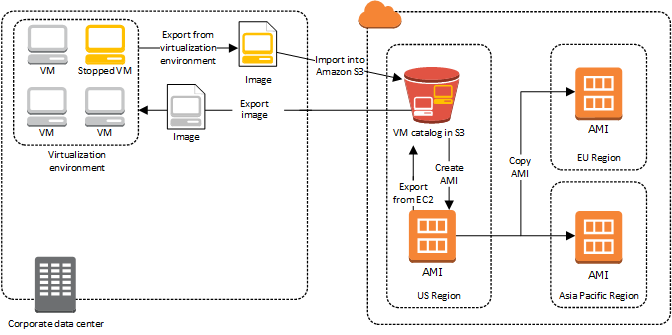

# Image import overview

First, you'll need to prepare your virtual machine for export, and then export it using one of the
supported formats. Next, you'll need to upload the VM image to Amazon S3, and then start the image import task.
After the import task is complete, you can launch instances from the AMI. If you want, you
can copy the AMI to other Regions so that you can launch instances in those Regions. You can
also export an AMI to a VM.

The following diagram shows the process of exporting a VM from your virtualization
environment to Amazon EC2 as an AMI.

Before you proceed with this process, see [VM Import/Export Requirements](vmie_prereqs.md "vmie_prereqs.md").
