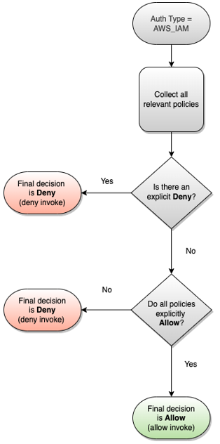

# Control access to VPC Lattice services using auth policies

VPC Lattice auth policies are IAM policy documents that you attach to service networks or
services to control whether a specified principal has access to a group of services or
specific service. You can attach one auth policy to each service network or service that you
want to control access to.

###### Note

The auth policy on the service network doesn’t apply to resource
configurations in the service network.

Auth policies are different from IAM identity-based policies. IAM identity-based
policies are attached to IAM users, groups, or roles and define what actions those
identities can do on which resources. Auth policies are attached to services and service
networks. For authorization to succeed, both auth policies and identity-based policies need
to have explicit allow statements. For more information, see [How authorization works](#auth-policies-evaluation-logic "#auth-policies-evaluation-logic").

You can use the AWS CLI and console to view, add, update, or remove auth policies on
services and service networks. When you add, update, or remove an auth policy, it might take
a few minutes to be ready. When using the AWS CLI, make sure you are in the correct Region.
You can either change the default Region for your profile, or use the `--region`
parameter with the command.

###### Contents

- [Common elements in an auth
  policy](#auth-policies-common-elements "#auth-policies-common-elements")
- [Resource format for auth policies](#auth-policies-resource-format "#auth-policies-resource-format")
- [Condition keys that can be used in auth policies](#auth-policies-condition-keys "#auth-policies-condition-keys")
- [Resource tags](#resource-tags "#resource-tags")
- [Principal tags](#principal-tags "#principal-tags")
- [Anonymous (unauthenticated)
  principals](#anonymous-unauthenticated-principals "#anonymous-unauthenticated-principals")
- [Example auth policies](#example-auth-policies "#example-auth-policies")
- [How authorization works](#auth-policies-evaluation-logic "#auth-policies-evaluation-logic")
  To get started with auth policies, follow the procedure to create an auth policy that
  applies to a service network. For more restrictive permissions that you don't want applied
  to other services, you can optionally set auth policies on individual services.

The following AWS CLI tasks show you how to manage access to a service network using
auth policies. For instructions that use the console, see [Service networks in VPC Lattice](service-networks.md "service-networks.md").

###### Tasks

- [Add an auth policy to a
  service network](#add-service-network-auth-policy "#add-service-network-auth-policy")
- [Change a service network's
  auth type](#change-service-network-auth-type "#change-service-network-auth-type")
- [Remove an auth policy from
  a service network](#remove-service-network-auth-policy "#remove-service-network-auth-policy")

### Add an auth policy to a

service network

Follow the steps in this section to use the AWS CLI to:

- Enable access control on a service network using IAM.
- Add an auth policy to the service network. If you do not add an auth
  policy, all traffic will get an access denied error.

###### To enable access control and add an auth policy to a new service

network

1. To enable access control on a service network so that it can use an
   auth policy, use the **create-service-network** command
   with the `--auth-type` option and a value of
   `AWS_IAM`.

```
aws vpc-lattice create-service-network --name `Name` --auth-type AWS_IAM [--tags `TagSpecification`]
```

If successful, the command returns output similar to the
following.

```
{
   "arn": "`arn`",
   "authType": "AWS_IAM",
   "id": "sn-0123456789abcdef0",
   "name": "Name"
}
```

2. Use the **put-auth-policy** command, specifying the ID
   of the service network where you want to add the auth policy and the
   auth policy you want to add.

For example, use the following command to create an auth policy for
the service network with the ID
`sn-0123456789abcdef0`.

```
aws vpc-lattice put-auth-policy --resource-identifier `sn-0123456789abcdef0` --policy `file://policy.json`
```

Use JSON to create a policy definition. For more information, see
[Common elements in an auth
policy](#auth-policies-common-elements "#auth-policies-common-elements").

If successful, the command returns output similar to the
following.

```
{
   "policy": "`policy`",
   "state": "Active"
}
```

###### To enable access control and add an auth policy to an existing service

network

1. To enable access control on a service network so that it can use an
   auth policy, use the **update-service-network** command
   with the `--auth-type` option and a value of
   `AWS_IAM`.

```
aws vpc-lattice update-service-network --service-network-identifier `sn-0123456789abcdef0` --auth-type AWS_IAM
```

If successful, the command returns output similar to the
following.

```
{
   "arn": "`arn`",
   "authType": "AWS_IAM",
   "id": "sn-0123456789abcdef0",
   "name": "Name"
}
```

2. Use the **put-auth-policy** command, specifying the ID
   of the service network where you want to add the auth policy and the
   auth policy you want to add.

```
aws vpc-lattice put-auth-policy --resource-identifier `sn-0123456789abcdef0` --policy `file://policy.json`
```

Use JSON to create a policy definition. For more information, see
[Common elements in an auth
policy](#auth-policies-common-elements "#auth-policies-common-elements").

If successful, the command returns output similar to the
following.

```
{
   "policy": "`policy`",
   "state": "Active"
}
```

### Change a service network's

auth type

###### To disable the auth policy for a service network

Use the **update-service-network** command with the
`--auth-type` option and a value of `NONE`.

```
aws vpc-lattice update-service-network --service-network-identifier `sn-0123456789abcdef0` --auth-type NONE
```

If you need to enable the auth policy again later, run this command with
`AWS_IAM` specified for the `--auth-type`
option.

### Remove an auth policy from

a service network

###### To remove an auth policy from a service network

Use the **delete-auth-policy** command.

```
aws vpc-lattice delete-auth-policy --resource-identifier `sn-0123456789abcdef0`
```

The request fails if you remove an auth policy before changing the
auth type of a service network to `NONE`.

The following AWS CLI tasks show you how to manage access to a service using auth
policies. For instructions that use the console, see [Services in VPC Lattice](services.md "services.md").

###### Tasks

- [Add an auth policy to a
  service](#add-service-auth-policy "#add-service-auth-policy")
- [Change a service's auth type](#change-service-auth-type "#change-service-auth-type")
- [Remove an auth policy from a
  service](#remove-service-auth-policy "#remove-service-auth-policy")

### Add an auth policy to a

service

Follow these steps to use the AWS CLI to:

- Enable access control on a service using IAM.
- Add an auth policy to the service. If you do not add an auth policy,
  all traffic will get an access denied error.

###### To enable access control and add an auth policy to a new service

1. To enable access control on a service so that it can use an auth
   policy, use the **create-service** command with the
   `--auth-type` option and a value of
   `AWS_IAM`.

```
aws vpc-lattice create-service --name `Name` --auth-type AWS_IAM [--tags `TagSpecification`]
```

If successful, the command returns output similar to the
following.

```
{
   "arn": "`arn`",
   "authType": "AWS_IAM",
   "dnsEntry": {
      ...
   },
   "id": "svc-0123456789abcdef0",
   "name": "Name",
   "status": "CREATE_IN_PROGRESS"
}
```

2. Use the **put-auth-policy** command, specifying the ID
   of the service where you want to add the auth policy and the auth policy
   you want to add.

For example, use the following command to create an auth policy for
the service with the ID
`svc-0123456789abcdef0`.

```
aws vpc-lattice put-auth-policy --resource-identifier `svc-0123456789abcdef0` --policy `file://policy.json`
```

Use JSON to create a policy definition. For more information, see
[Common elements in an auth
policy](#auth-policies-common-elements "#auth-policies-common-elements").

If successful, the command returns output similar to the
following.

```
{
   "policy": "`policy`",
   "state": "Active"
}
```

###### To enable access control and add an auth policy to an existing

service

1. To enable access control on a service so that it can use an auth
   policy, use the **update-service** command with the
   `--auth-type` option and a value of
   `AWS_IAM`.

```
aws vpc-lattice update-service --service-identifier `svc-0123456789abcdef0` --auth-type AWS_IAM
```

If successful, the command returns output similar to the
following.

```
{
   "arn": "`arn`",
   "authType": "AWS_IAM",
   "id": "svc-0123456789abcdef0",
   "name": "Name"
}
```

2. Use the **put-auth-policy** command, specifying the ID
   of the service where you want to add the auth policy and the auth policy
   you want to add.

```
aws vpc-lattice put-auth-policy --resource-identifier `svc-0123456789abcdef0` --policy `file://policy.json`
```

Use JSON to create a policy definition. For more information, see
[Common elements in an auth
policy](#auth-policies-common-elements "#auth-policies-common-elements").

If successful, the command returns output similar to the
following.

```
{
   "policy": "`policy`",
   "state": "Active"
}
```

### Change a service's auth type

###### To disable the auth policy for a service

Use the **update-service** command with the
`--auth-type` option and a value of `NONE`.

```
aws vpc-lattice update-service --service-identifier `svc-0123456789abcdef0` --auth-type NONE
```

If you need to enable the auth policy again later, run this command with
`AWS_IAM` specified for the `--auth-type`
option.

### Remove an auth policy from a

service

###### To remove an auth policy from a service

Use the **delete-auth-policy** command.

```
aws vpc-lattice delete-auth-policy --resource-identifier `svc-0123456789abcdef0`
```

The request fails if you remove an auth policy before changing the
auth type of the service to `NONE`.

If you enable auth policies that require authenticated requests to a service, any
requests to that service must contain a valid request signature that is computed using
Signature Version 4 (SigV4). For more information, see [SIGv4 authenticated requests for Amazon VPC Lattice](sigv4-authenticated-requests.md "sigv4-authenticated-requests.md").

## Common elements in an auth

policy

VPC Lattice auth policies are specified using the same syntax as IAM policies. For
more information, see [Identity-based
policies and resource-based policies](../../../IAM/latest/UserGuide/access_policies_identity-vs-resource.md "../../../IAM/latest/UserGuide/access_policies_identity-vs-resource.md") in the
_IAM User Guide_.

An auth policy contains the following elements:

- **Principal** – The person or application
  who is allowed access to the actions and resources in the statement. In an auth
  policy, the principal is the IAM entity who is the recipient of this
  permission. The principal is authenticated as an IAM entity to make requests
  to a specific resource, or group of resources as in the case of services in a
  service network.

You must specify a principal in a resource-based policy. Principals can
include accounts, users, roles, federated users, or AWS services. For more
information, see [AWS
JSON policy elements: Principal](../../../IAM/latest/UserGuide/reference_policies_elements_principal.md "../../../IAM/latest/UserGuide/reference_policies_elements_principal.md") in the
_IAM User Guide_.

- **Effect** – The effect when the specified
  principal requests the specific action. This can be either `Allow` or
  `Deny`. By default, when you enable access control on a service
  or service network using IAM, principals have no permissions to make requests
  to the service or service network.
- **Actions** – The specific API action for which
  you are granting or denying permission. VPC Lattice supports actions that use the
  `vpc-lattice-svcs` prefix. For more information, see [Actions defined by Amazon VPC Lattice Services](../../../service-authorization/latest/reference/list_amazonvpclatticeservices.md#amazonvpclatticeservices-actions-as-permissions "../../../service-authorization/latest/reference/list_amazonvpclatticeservices.md#amazonvpclatticeservices-actions-as-permissions") in the _Service Authorization Reference_.
- **Resources** – The services that are
  affected by the action.
- **Condition** – Conditions are optional.
  You can use them to control when your policy is in effect. For more information, see [Condition keys for Amazon VPC Lattice Services](../../../service-authorization/latest/reference/list_amazonvpclatticeservices.md#amazonvpclatticeservices-policy-keys "../../../service-authorization/latest/reference/list_amazonvpclatticeservices.md#amazonvpclatticeservices-policy-keys") in the _Service Authorization Reference_.

As you create and manage auth policies, you might want to use the [IAM Policy Generator](../../../IAM/latest/UserGuide/access_policies_create.md#access_policies_create-generator "../../../IAM/latest/UserGuide/access_policies_create.md#access_policies_create-generator").

###### Requirement

The policy in JSON must not contain newlines or blank lines.

## Resource format for auth policies

You can restrict access to specific resources by creating an auth policy that uses a
matching schema with a `<serviceARN>/<path>` pattern and code the
`Resource` element as shown in the following examples.

| Protocol                                                  | Examples                                                                                                                                                                                                                                                                                                                    |
| --------------------------------------------------------- | --------------------------------------------------------------------------------------------------------------------------------------------------------------------------------------------------------------------------------------------------------------------------------------------------------------------------- | --------------------------------------------------------------------------------------------------------------------------------------------------------------------------------------------------------------------------------------------------------------------------------------------------------------------------------------------------------------------------------------------------------------------------------------------------------------------------------------------------------------------------------------------------------------------------------------------------------------------------------------------------------------------------------------------------------------------------------------------------------------------------------------------------------------------------------------------------------------------------------------------------------------------------------------------------------------------------------------------------------------------------------------------------------------------------------------------------------------------------------------------------------------------------------------------------------------------------------------------------------------------------------------------------------------------------------------------------------------------------------------------------------------------------------------------------------------------------------------------------- | ------------------------------------------------- | ------------------- | -------------------------------------------------------------------------------------------------------------------------------------------------------------------------------------------------------------------------------------------------------------------------------------------------------------------------------------------------------------------------------------------------------------------------------------------------------------------------------------------------------------------------------------------------------------------------------------------------------------------------------------------------------------------------------------------------------------------------------------------------------------------------------------------------------------------------------------------------------------------------------------------------------------------------------------------------------------------------------------------------------------------------------------------------------------------------------------------------------------------------------------------------------------------------------------------------------------------------------------------------------------------------------------------------------------------------------------------------------------------------------------------------------------------------------------------------------------------------------------------------------------------------------------------------------------------------------------------------------------------------------------------------------------------------------------------------------------------------------------------------------------------------------------------------------------------------------------------------------------------------------------------------------------------------------------------------------------------------------------------------------------------------------------------------------------------------------------------------------------------------------------------------------------------------------------------------------------------------------------------------------------------------------------------------------------------------------------------------------------------------------------------------------------------------------------------------------------------------------------------------------------------------------------------------------------------------------------------------------------------------------------------------------------------------------------------------------------------------------------------------------------------------------------------------------------------------------------------------------------------------------------------------------------------------------------------------------------------------------------------------------------------------------------------------------------------------------------------------------------------------------------------------------------------------------------------------------------------------------------------------------------------------------------------------------------------------------------------------------------------------------------------------------------------------------------------------------------------------------------------------------------------------------------------------------------------------------------------------------------------------------------------------------------------------------------------------------------------------------------------------------------------------------------------------------------------------------------------------------------------------------------------------------------------------------------------------------------------------------------------------------------------------------------------------------------------------------------------------------------------------------------------------------------------------------------------------------------------------------------------------------------------------------------------------------------------------------------------------------------------------------------------------------------------------------------------------------------------------------------------------------------------------------------------------------------------------------------------------------------------------------------------------------------------------------------------------------------------------------------------------------------------------------------------------------------------------------------------------------------------------------------------------------------------------------------------------------------------------------------------------------------------------------------------------------------------------------------------------------------------------------------------------------------------------------------------------------------------------------------------------------------------------------------------------------------------------------------------------------------------------------------------------------------------------------------------------------------------------------------------------------------------------------------------------------------------------------------------------------------------------------------------------------------------------------------------------------------------------------------------------------------------------------------------------------------------------------------------------------------------------------------------------------------------------------------------------------------------------------------------------------------------------------------------------------------------------------------------------------------------------------------------------------------------------------------------------------------------------------------------------------------------------------------------------------------------------------------------------------------------------------------------------------------------------------------------------------------------------------------------------------------------------------------------------------------------------------------------------------------------- |
| HTTP                                                      | <br>• `"Resource": "arn:aws:vpc-lattice:us-west-2:1234567890:service/svc-0123456789abcdef0/rates"` <br>• `"Resource": "*/rates"` <br>• `"Resource": "*/*"`                                                                                                                                                                  |
| gRPC                                                      | <br>• `"Resource": "arn:aws:vpc-lattice:us-west-2:1234567890:service/svc-0123456789abcdef0/api.parking/GetRates"` <br>• `"Resource": "arn:aws:vpc-lattice:us-west-2:1234567890:service/svc-0123456789abcdef0/api.parking/*"` <br>• `"Resource": "arn:aws:vpc-lattice:us-west-2:1234567890:service/svc-0123456789abcdef0/*"` | Use the following Amazon Resource Name (ARN) resource format for `<serviceARN>`: `` arn:aws:vpc-lattice:`region`:`account-id`:service/`service-id` `` For example: `"Resource": "arn:aws:vpc-lattice:us-west-2:123456789012:service/svc-0123456789abcdef0"` ## Condition keys that can be used in auth policies Access can be further controlled by condition keys in the **Condition** element of auth policies. These condition keys are present for evaluation depending on the protocol and whether the request is signed with [Signature Version 4 (SigV4)](sigv4-authenticated-requests.md "sigv4-authenticated-requests.md") or anonymous. Condition keys are case sensitive. AWS provides global condition keys that you can use to control access, such as `aws:PrincipalOrgID` and `aws:SourceIp`. To see a list of the AWS global condition keys, see [AWS global condition context keys](../../../IAM/latest/UserGuide/reference_policies_condition-keys.md "../../../IAM/latest/UserGuide/reference_policies_condition-keys.md") in the _IAM User Guide_. The following tale lists the VPC Lattice condition keys. For more information, see [Condition keys for Amazon VPC Lattice Services](../../../service-authorization/latest/reference/list_amazonvpclatticeservices.md#amazonvpclatticeservices-policy-keys "../../../service-authorization/latest/reference/list_amazonvpclatticeservices.md#amazonvpclatticeservices-policy-keys") in the _Service Authorization Reference_. |
| Condition keys                                            | Description                                                                                                                                                                                                                                                                                                                 | Example                                                                                                                                                                                                                                                                                                                                                                                                                                                                                                                                                                                                                                                                                                                                                                                                                                                                                                                                                                                                                                                                                                                                                                                                                                                                                                                                                                                                                                                                                             | Available for anonymous (unauthenticated) caller? | Available for gRPC? |
| ---                                                       | ---                                                                                                                                                                                                                                                                                                                         | ---                                                                                                                                                                                                                                                                                                                                                                                                                                                                                                                                                                                                                                                                                                                                                                                                                                                                                                                                                                                                                                                                                                                                                                                                                                                                                                                                                                                                                                                                                                 | ---                                               | ---                 |
| `vpc-lattice-svcs:Port`                                   | Filters access by the service port the request is made to                                                                                                                                                                                                                                                                   | 80                                                                                                                                                                                                                                                                                                                                                                                                                                                                                                                                                                                                                                                                                                                                                                                                                                                                                                                                                                                                                                                                                                                                                                                                                                                                                                                                                                                                                                                                                                  | Yes                                               | Yes                 |
| `vpc-lattice-svcs:RequestMethod`                          | Filters access by the method of the request                                                                                                                                                                                                                                                                                 | GET                                                                                                                                                                                                                                                                                                                                                                                                                                                                                                                                                                                                                                                                                                                                                                                                                                                                                                                                                                                                                                                                                                                                                                                                                                                                                                                                                                                                                                                                                                 | Yes                                               | Always POST         |
| `vpc-lattice-svcs:RequestHeader/`header-name`: `value``   | Filters access by a header name-value pair in the request headers                                                                                                                                                                                                                                                           | content-type: application/json                                                                                                                                                                                                                                                                                                                                                                                                                                                                                                                                                                                                                                                                                                                                                                                                                                                                                                                                                                                                                                                                                                                                                                                                                                                                                                                                                                                                                                                                      | Yes                                               | Yes                 |
| `vpc-lattice-svcs:RequestQueryString/`key-name`: `value`` | Filters access by the query string key-value pairs in the request URL                                                                                                                                                                                                                                                       | quux: [corge, grault]                                                                                                                                                                                                                                                                                                                                                                                                                                                                                                                                                                                                                                                                                                                                                                                                                                                                                                                                                                                                                                                                                                                                                                                                                                                                                                                                                                                                                                                                               | Yes                                               | No                  |
| `vpc-lattice-svcs:ServiceNetworkArn`                      | Filters access by the ARN of the service network of the service that is receiving the request                                                                                                                                                                                                                               | arn:aws:vpc-lattice:us-west-2:123456789012:servicenetwork/sn-0123456789abcdef0                                                                                                                                                                                                                                                                                                                                                                                                                                                                                                                                                                                                                                                                                                                                                                                                                                                                                                                                                                                                                                                                                                                                                                                                                                                                                                                                                                                                                      | Yes                                               | Yes                 |
| `vpc-lattice-svcs:ServiceArn`                             | Filters access by the ARN of the service that is receiving the request                                                                                                                                                                                                                                                      | arn:aws:vpc-lattice:us-west-2:123456789012:service/svc-0123456789abcdef0                                                                                                                                                                                                                                                                                                                                                                                                                                                                                                                                                                                                                                                                                                                                                                                                                                                                                                                                                                                                                                                                                                                                                                                                                                                                                                                                                                                                                            | Yes                                               | Yes                 |
| `vpc-lattice-svcs:SourceVpc`                              | Filters access by the VPC the request is made from                                                                                                                                                                                                                                                                          | vpc-1a2b3c4d                                                                                                                                                                                                                                                                                                                                                                                                                                                                                                                                                                                                                                                                                                                                                                                                                                                                                                                                                                                                                                                                                                                                                                                                                                                                                                                                                                                                                                                                                        | Yes                                               | Yes                 |
| `vpc-lattice-svcs:SourceVpcOwnerAccount`                  | Filters access by the owning account of the VPC the request is made from                                                                                                                                                                                                                                                    | 123456789012                                                                                                                                                                                                                                                                                                                                                                                                                                                                                                                                                                                                                                                                                                                                                                                                                                                                                                                                                                                                                                                                                                                                                                                                                                                                                                                                                                                                                                                                                        | Yes                                               | Yes                 | ## Resource tags A _tag_ is a metadata label that you assign or that AWS assigns to an AWS resource. Each tag has two parts: <br>• A _tag key_ (for example, `CostCenter`, `Environment`, or `Project`). Tag keys are case sensitive. <br>• An optional field known as a _tag value_ (for example, `111122223333` or `Production`). Omitting the tag value is the same as using an empty string. Like tag keys, tag values are case-sensitive. For more information about tagging, see [Controlling access to AWS resources using tags](../../../IAM/latest/UserGuide/access_tags.md "../../../IAM/latest/UserGuide/access_tags.md") You can use tags in your auth policies using the `aws:ResourceTag/key` AWS global condition context key. The following example policy grants access to services with the tag `Environment=Gamma`. This policy lets you refer to services without hard‑coding service ARNs or IDs. `{ "Version": "2012-10-17", "Statement": [ { "Sid": "AllowGammaAccess", "Effect": "Allow", "Principal": "*", "Action": "vpc-lattice-svcs:Invoke", "Resource": "arn:aws:vpc-lattice:us-west-2:123456789012:service/svc-0124446789abcdef0/*", "Condition": { "StringEquals": { "aws:ResourceTag/Environment": "Gamma", } } } ] }` ## Principal tags You can control access to your services and resources based on the tags attached to the caller's identity. VPC Lattice supports access control based on any principal tags on the user, role, or session tags using the `aws:PrincipalTag/context` variables. For more information, see [Controlling access for IAM principals](../../../IAM/latest/UserGuide/access_iam-tags.md#access_iam-tags_control-principals "../../../IAM/latest/UserGuide/access_iam-tags.md#access_iam-tags_control-principals"). The following example policy grants access only to identities with the tag `Team=Payments`. This policy lets you control access without hard‑coding account IDs or role ARNs. `{ "Version": "2012-10-17", "Statement": [ { "Sid": "AllowPaymentsTeam", "Effect": "Allow", "Principal": "*", "Action": "vpc-lattice-svcs:Invoke", "Resource": "arn:aws:vpc-lattice:us-west-2:123456789012:service/svc-0123456789abcdef0/*", "Condition": { "StringEquals": { "aws:PrincipalTag/Team": "Payments", } } } ] }` ## Anonymous (unauthenticated) principals Anonymous principals are callers that don't sign their AWS requests with [Signature Version 4 (SigV4)](sigv4-authenticated-requests.md "sigv4-authenticated-requests.md"), and are within a VPC that is connected to the service network. Anonymous principals can make unauthenticated requests to services in the service network if an auth policy allows it. ## Example auth policies The following are example auth policies that require requests to be made by authenticated principals. All examples use the `us-west-2` Region and contain fictitious account IDs. ###### Example 1: Restrict access to services by a specific AWS organization The following auth policy example grants permissions to any authenticated request to access any services in the service network to which the policy applies. However, the request must originate from principals that belong to the AWS organization specified in the condition. JSON `` `{ "Version":"2012-10-17", "Statement": [ { "Effect": "Allow", "Principal": "*", "Action": "vpc-lattice-svcs:Invoke", "Resource": "*", "Condition": { "StringEquals": { "aws:PrincipalOrgID": [ "`o-123456example`" ] } } } ] }` `` ###### Example 2: Restrict access to a service by a specific IAM role The following auth policy example grants permissions to any authenticated request that uses the IAM role `rates-client` to make HTTP GET requests on the service specified in the `Resource` element. The resource in the `Resource` element is the same as the service that the policy is attached to. JSON `` `{ "Version":"2012-10-17", "Statement":[ { "Effect": "Allow", "Principal": { "AWS": [ "arn:aws:iam::`123456789012`:role/rates-client" ] }, "Action": "vpc-lattice-svcs:Invoke", "Resource": [ "arn:aws:vpc-lattice:us-west-2:`123456789012`:service/`svc-0123456789abcdef0`/*" ], "Condition": { "StringEquals": { "vpc-lattice-svcs:RequestMethod": "GET" } } } ] }` `` ###### Example 3: Restrict access to services by authenticated principals in a specific VPC The following auth policy example only allows authenticated requests from principals in the VPC whose VPC ID is `vpc-1a2b3c4d`. JSON `` `{ "Version":"2012-10-17", "Statement": [ { "Effect": "Allow", "Principal": "*", "Action": "vpc-lattice-svcs:Invoke", "Resource": "*", "Condition": { "StringNotEquals": { "aws:PrincipalType": "Anonymous" }, "StringEquals": { "vpc-lattice-svcs:SourceVpc": "`vpc-1a2b3c4d`" } } } ] }` `` ## How authorization works When a VPC Lattice service receives a request, the AWS enforcement code evaluates all relevant permissions policies together to determine whether to authorize or deny the request. It evaluates all the IAM identity-based policies and auth policies that are applicable in the request context during authorization. By default, all requests are implicitly denied when the auth type is `AWS_IAM`. An explicit allow from all relevant policies overrides the default. Authorization includes: <br>• Collecting all the relevant IAM identity-based policies and auth policies. <br>• Evaluating the resulting set of policies: + Verifying that the requester (such as an IAM user or role) has permissions to perform the operation from the account to which the requester belongs. If there is no explicit allow statement, AWS does not authorize the request. + Verifying that the request is allowed by the auth policy for the service network. If an auth policy is enabled, but there is no explicit allow statement, AWS does not authorize the request. If there is an explicit allow statement, or the auth type is `NONE`, the code continues. + Verifying that the request is allowed by the auth policy for the service. If an auth policy is enabled, but there is no explicit allow statement, AWS does not authorize the request. If there is an explicit allow statement,or the auth type is `NONE`, then the enforcement code returns a final decision of **Allow**. + An explicit deny in any policy overrides any allows. The diagram shows the authorization workflow. When a request is made, the relevant policies allow or deny the request access to a given service.  |
