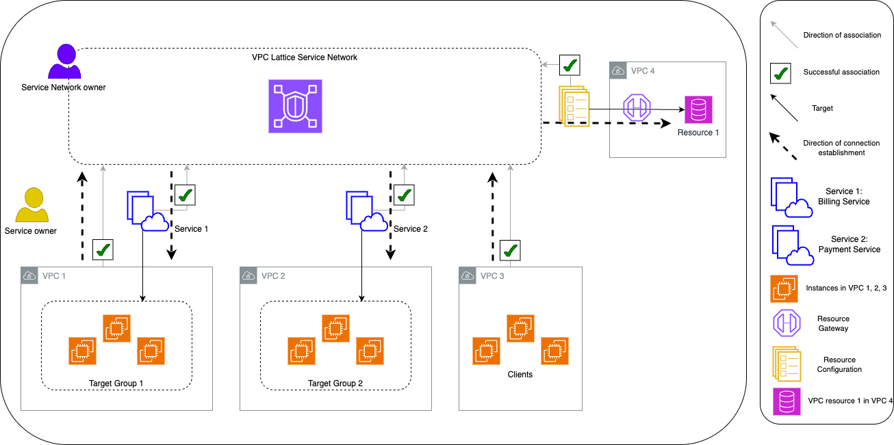

# How VPC Lattice works

VPC Lattice is designed to help you easily and effectively discover, secure, connect, and
monitor all of the services and resources within it. Each component within VPC Lattice communicates
unidirectionally or bi-directionally within the service network based on its association with the
service network and its access settings. Access settings are comprised of authentication and
authorization policies required for this communication.

The following summary describes communication between components within VPC Lattice:

- There are two ways a VPC can be connected to a service network - through a VPC association
  and through a VPC endpoint of type service network.
- Services and resources that are associated with the service network can receive requests
  from clients whose VPCs are also connected to the service network.
- A client can send requests to services and resources associated with a service network only
  if it's in a VPC that's connected to the same service network. Client traffic that traverses a
  VPC peering connection, a transit gateway, Direct Connect, or VPN can reach resources and
  services only if the VPC is connected to the service network through a VPC endpoint.
- Targets of services in VPCs that are associated with the service network are also clients
  and can send requests to other services and resources associated with the service
  network.
- Targets of services in VPCs that aren't associated with the service network aren't clients
  and can't send requests to other services and resources associated with the service
  network.
- Clients in VPCs that have resources but where the VPC isn’t associated with the service
  network aren't clients and can't send requests to other services and resources associated with
  the service network.
  The following flow diagram uses an example scenario to explain the flow of information and
  direction of communication between the components within VPC Lattice. There are two services
  associated with a service network. Both services and all VPCs were created in the same
  account as the service network. Both services are configured to allow traffic from the service
  network.

Service 1 is a billing application running on a group of instances registered with target
group 1 in VPC 1. Service 2 is a payment application running on a group of instances registered
with target group 2 in VPC 2. VPC 3 is in the same account, and it has clients but no
services. Resource 1 is a database that has customer data in VPC 4.

The following list describes, in order, the typical workflow of tasks for VPC Lattice.

1. **Create a service network**

The service network owner creates the service network. 2. **Create a service**

The service owners create their respective services, service 1 and service 2. During
creation, the service owner adds listeners and defines rules for routing requests to the target
group for each service. 3. **Define routing**

The service owners create the target group for each service (target group 1 and target
group 2). They do this by specifying the target instances on which the services run. They also
specify the VPCs in which these targets reside.

In the preceding diagram, the solid arrows represent services routing traffic to target
groups, and resource configurations routing to resources. 4. **Associate services with the service network**

The service network owner or the service owner associates the services with the service
network. The associations are shown as arrows with check marks pointing to the service network
from the service. When you associate a service with a service network, that service becomes
discoverable to other services associated with the service network and clients in VPCs connected
to the service network.

The dashed arrows between the service network and target groups show the direction of
connection establishment. Return traffic flows back to clients using the service network. The
arrows representing the returning traffic aren't included in this diagram. 5. **Create a resource gateway**

The resource owner creates a resource gateway in VPC 4 in order to be able to enable
connectivity from clients to resource 1. 6. **Create a resource configuration**

The resource owner creates a resource configuration to represent resource 1 and specifies
the resource gateway for resource 1. 7. **Associate resource configurations with the service
network**

The service network owner or the resource owner associates the resource configuration with
the service network. The association is shown as an arrow with a check mark pointing to the
service network from the resource configuration. When you associate a resource configuration
with a service network, that resource configuration becomes discoverable to other services
associated with the service network and clients in the VPCs connected to the service network.

The dashed arrows from the service network to the resource represent the resource receiving
requests from clients. Return traffic flows back to the client using the service network. The
arrows representing the returning traffic aren't included in this diagram. 8. **Connect VPCs with the service network**

VPCs can be connected with the service network in two ways - by associating the VPC to
service network, or by creating a VPC endpoint. Here, the service network owner associates VPC 1
and VPC 3 with the service network. The associations are shown using arrows with check marks
pointed to the service network. With these associations, any resources in the VPC can act as
clients, and can make requests to services within the service network. The dashed arrows between
VPC 1 and the service network show the direction of connection establishment. The service
network only initiates connections towards resources targeted by service 1 target groups. Any
resource in VPC 1 can act as a client and initiate connections to the service network services
and resources.

VPC 2 does not have an arrow or a check mark that represents an association.
This means that the service network owner or the service owner hasn't associated VPC 2 with the
service network. This is because service 2, in this example, only needs to receive requests and
send responses using the same request. In other words, the targets for service 2 aren't clients
and don't need to make requests to other services in the service network.

Similarly, VPC 4 does not have an arrow or a check mark that represents an association.
This means that the service network owner or the resource owner hasn't associated VPC 4 with the
service network. This is because resource 1 only receives requests and send responses using the
same request. It cannot make requests to other services and resources in the service
network.
In summary, the proceeding diagram showed the following scenarios:

- VPCs with ingress only connections from VPC Lattice to their resources. VPC 2 and VPC 4
  represent these scenarios.
- A VPC with egress only connections from their resources to VPC Lattice. VPC 3 represents this
  scenario.
- A VPC with ingress connections from VPC Lattice to their resources and with egress connections
  from their resources to VPC Lattice. VPC 1 represents this scenario.
