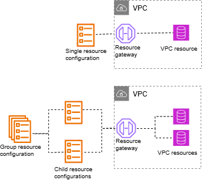

# Resource configurations for VPC resources

A resource configuration represents a resource or a group of resources that you want to
make accessible to clients in other VPCs and accounts. By defining a resource configuration,
you can allow private, secure, unidirectional network connectivity to resources in your VPC
from clients in other VPCs and accounts. A resource configuration is associated with a resource
gateway through which it receives traffic. For a resource to be accessed from another VPC,
it needs to have a resource configuration.

###### Contents

- [Types of resource configurations](#resource-configuration-types "#resource-configuration-types")
- [Resource gateway](#resource-gateway "#resource-gateway")
- [Resource definition](#resource-definition "#resource-definition")
- [Protocol](#resource-configuration-protocol "#resource-configuration-protocol")
- [Port ranges](#resource-configuration-port "#resource-configuration-port")
- [Accessing resources](#resource-configuration-accessing "#resource-configuration-accessing")
- [Association with service
  network type](#resource-configuration-service-network-association "#resource-configuration-service-network-association")
- [Types of service networks](#service-network-types "#service-network-types")
- [Sharing resource configurations
  through AWS RAM](#sharing-resource-configuration-ram "#sharing-resource-configuration-ram")
- [Monitoring](#resource-configuration-monitoring "#resource-configuration-monitoring")
- [Create a resource
  configuration](create-resource-configuration.md "create-resource-configuration.md")
- [Manage
  associations](resource-configuration-associations.md "resource-configuration-associations.md")

## Types of resource configurations

A resource configuration can be of several types. The different types help represent
different kinds of resources. The types are:

- **Single resource configuration**: Represents an
  IP address or a domain name. It can be shared independently.
- **Group resource configuration**: It is
  collection of child resource configurations. It can be used to represent a group
  of DNS and IP address endpoints.
- **Child resource configuration**: It is a member
  of a group resource configuration. It represents an IP address or a domain name.
  It can’t be shared independently; it can only be shared as part of a group. It
  can be added and removed from a group. When added, its automatically
  accessible to those who can access the group.
- **ARN resource configuration**: Represents a
  supported resource-type that is provisioned by an AWS service. Any group-child
  relationship is automatically taken care of.

The following image shows a single, child, and group resource configuration:

## Resource gateway

A resource configuration is associated with a resource gateway. A resource gateway is a set of
ENIs that serve as a point of ingress into the VPC in which the resource is in. Multiple
resource configurations can be associated with the same resource gateway. When clients in other
VPCs or accounts access a resource in your VPC, the resource sees traffic coming locally
from the resource gateway's IP addresses in that VPC.

## Resource definition

In the resource configuration, identify the resource in one of the following
ways:

- By an **Amazon Resource Name (ARN)**: Supported
  resource-types that are provisioned by AWS services, can be identified by
  their ARN. Only Amazon RDS databases are supported. You can't create a resource
  configuration for a publicly accessible cluster.
- By a **domain-name target**: You can use any
  domain name that is publicly resolvable. If your domain name points to an IP that's outside of your VPC, you must have a NAT gateway in your VPC.
- By an **IP-address**: For IPv4, specify a
  private IP from the following ranges: 10.0.0.0/8, 100.64.0.0/10, 172.16.0.0/12,
  192.168.0.0/16. For IPv6, specify an IP from the VPC. Public IPs aren't supported.

## Protocol

When you create a resource configuration you can define the protocols that the
resource will support. Currently, only the TCP protocol is supported.

## Port ranges

When you create a resource configuration you can define the ports it will accept
requests on. Client access on other ports will not be allowed.

## Accessing resources

Consumers can access resource configurations directly from their VPC using a VPC
endpoint or through a service network. As a consumer, you can enable access from your
VPC to a resource configuration that is in your account or that has been shared with you
from another account through AWS RAM.

- _Accessing a resource configuration directly_

You can create a AWS PrivateLink VPC endpoint of type resource (resource
endpoint) in your VPC to access a resource configuration privately from your
VPC. For more information on how to create a resource endpoint, see [Accessing VPC
resources](../../../vpc/latest/privatelink/privatelink-access-resources.md "../../../vpc/latest/privatelink/privatelink-access-resources.md") in the _AWS PrivateLinkuser
guide_.

- _Accessing a resource configuration through a service
  network_

You can associate a resource configuration to a service network, and connect
your VPC to the service network. You can connect your VPC to the service network
either through an association or using a AWS PrivateLink service-network VPC
endpoint.

For more information on service network associations, see [Manage the
associations for a VPC Lattice service network](service-network-associations.md "service-network-associations.md").

For more information on service network VPC endpoints, see [Access
service networks](../../../vpc/latest/privatelink/privatelink-access-service-networks.md "../../../vpc/latest/privatelink/privatelink-access-service-networks.md") in the _AWS PrivateLink user
guide_.

When private DNS is enabled for your VPC, you can’t create a resource endpoint and service network endpoint for the same resource configuration.

## Association with service

network type

When you share a resource configuration with a consumer account, for example,
Account-B, through AWS RAM, Account-B can access the resource configuration either
directly through a resource VPC endpoint, or through a service network.

To access a resource configuration through a service network, Account-B would have to
associate the resource configuration with a service network. Service networks are
shareable between accounts. So, Account-B can share their service network (that the
resource configuration is associated to) with Account-C, making your resource accessible
from Account-C.

In order to prevent such transitive sharing, you can specify that your resource
configuration cannot be added to service networks that are shareable between accounts.
If you specify this, then Account-B won’t be able to add your resource configuration to
service networks that are shared or can be shared with another account in the
future.

## Types of service networks

When you share a resource configuration with another account, for example Account-B,
through AWS RAM, Account-B can access the resources specified in the resource
configuration in one of three ways:

- Using a VPC endpoint of type _resource_ (resource VPC
  endpoint).
- Using a VPC endpoint of type _service network_ (service
  network VPC endpoint).
- Using a service network VPC association.

When you use a service-network association, each resource is assigned an IP
per subnet from the 129.224.0.0/17 block, which is AWS owned and non-routable.
This is in addition to the [managed prefix
list](security-groups.md#managed-prefix-list "security-groups.md#managed-prefix-list") that VPC Lattice uses to route traffic to services over the
VPC Lattice network. Both of these IPs are updated to your VPC route table.

For service network VPC endpoint and service network VPC association, the resource
configuration would have to be associated with a service network in Account-B. Service
networks are shareable between accounts. So, Account-B can share their service network
(that contains the resource configuration) with Account-C, making your resource
accessible from Account-C. In order to prevent such transitive sharing, you can disallow
your resource configuration from being added to service networks that are shareable
between accounts. If you disallow this, then Account-B won’t be able to add your
resource configuration to a service network that is shared or can be shared with another
account.

## Sharing resource configurations

through AWS RAM

Resource configurations are integrated with AWS Resource Access Manager. You can share your resource
configuration with another account through AWS RAM. When you share a resource
configuration with an AWS account, clients in that account can privately access the
resource. You can share a resource configuration using a [resource share](../../../ram/latest/userguide/working-with-sharing.md "../../../ram/latest/userguide/working-with-sharing.md") in
AWS RAM.

Use the AWS RAM console, to view the resource shares to which you have been added, the
shared resources that you can access, and the AWS accounts that have shared resources
with you. For more information, see [Resources shared with you](../../../ram/latest/userguide/working-with-shared.md "../../../ram/latest/userguide/working-with-shared.md") in the _AWS RAM User Guide_.

To access a resource from another VPC in the same account as the resource
configuration, you don’t need to share the resource configuration through AWS RAM.

## Monitoring

You can enable monitoring logs on your resource configuration. You can choose a
destination to send the logs to.
