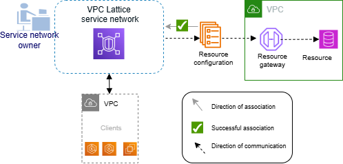

# Resource gateways in VPC Lattice

A _resource gateway_ is the point that receives traffic into
the VPC where a resource resides. It spans multiple Availability Zones.

A VPC must have a resource gateway if you plan on making resources inside the VPC accessible
from other VPCs or accounts. Every resource you share is associated with a resource gateway. When clients
in other VPCs or accounts access a resource in your VPC, the resource sees traffic coming locally
from the resource gateway in that VPC. The source IP address of the traffic is the IP address of the resource
gateway in an Availability Zone. Multiple resource configurations, each having multiple resources,
can be attached to a resource gateway.

The following diagram shows how a client accesses a resource through the resource
gateway:

###### Contents

- [Considerations](#resource-gateway-considerations "#resource-gateway-considerations")
- [Security groups](#resource-gateway-security-groups "#resource-gateway-security-groups")
- [IP address types](#resource-gateway-ip-address-type "#resource-gateway-ip-address-type")
- [IPv4 addresses per ENI](#ipv4-address-type-per-eni "#ipv4-address-type-per-eni")
- [Create a resource gateway](create-resource-gateway.md "create-resource-gateway.md")
- [Delete a resource gateway](delete-resource-gateway.md "delete-resource-gateway.md")

## Considerations

The following considerations apply to resource gateways:

- For your resource to be
  accessible from all [Availability Zones](https://aws.amazon.com/about-aws/global-infrastructure/regions_az/ "https://aws.amazon.com/about-aws/global-infrastructure/regions_az/"), you should create your resource gateways to span as many
  Availability Zones as possible.
- At least one Availability Zone of the VPC endpoint and the
  resource gateway have to overlap.
- A VPC can have a maximum of 100 resource gateways. For more
  information, see [Quotas for VPC Lattice](quotas.md "quotas.md").
- You can't create a resource gateway in a shared subnet.
- VPC Lattice might add new ENIs to your resource gateway.

## Security groups

You can attach security groups to a resource gateway. Security group rules for resource
gateways control outbound traffic from the resource gateway to resources.

**Recommended outbound rules for traffic flowing from a resource
gateway to a database resource**

For traffic to flow from a resource gateway to a resource, you must create outbound rules
for the resource's accepted listener protocols and port ranges.

| Destination               | Protocol | Port range | Comment                                            |
| ------------------------- | -------- | ---------- | -------------------------------------------------- |
| `CIDR range for resource` | TCP      | 3306       | Allows traffic from resource gateway to databases. |

## IP address types

A resource gateway can have IPv4, IPv6 or dual-stack addresses. The IP address type of a
resource gateway must be compatible with the subnets of the resource gateway and the IP address
type of the resource, as described here:

- **IPv4** – Assign IPv4 addresses to your resource gateway
  network interfaces. This option is supported only if all selected subnets have IPv4 address
  ranges, and the resource also has an IPv4 address. When you use this option, you can configure
  the number of IPv4 addresses per resource gateway ENI.
- **IPv6** – Assign IPv6 addresses to your resource gateway
  network interfaces. This option is supported only if all selected subnets are IPv6 only
  subnets, and the resource also has an IPv6 address. When you use this option, IPv6 addresses
  are assigned automatically and don’t need to be managed.
- **Dualstack** – Assign both IPv4 and IPv6 addresses to your
  resource gateway network interfaces. This option is supported only if all selected subnets have
  both IPv4 and IPv6 address ranges, and the resource either has an IPv4 or IPv6 address. When you use this option, you can configure
  the number of IPv4 addresses per resource gateway ENI.

The IP address type of the resource gateway is independent of the IP address type of the
client or the VPC endpoint through which the resource is accessed.

## IPv4 addresses per ENI

If your resource gateway has an IPv4 or a dual-stack IP address type, you can configure the
number of IPv4 addresses assigned to each ENI of your resource gateway. When you create a
resource gateway, you choose from 1 to 62 IPv4 addresses. Once you set the number of IPv4
addresses, the value can't be changed.

The IPv4 addresses are used for network address translation and determine the maximum number
of concurrent IPv4 connections to a resource. Each IPv4 address can support up to 55,000
simultaneous connections per destination IP. By default, all resource gateways are assigned 16
IPv4 addresses per ENI.

If your resource gateway uses the IPv6 address type, the resource gateway automatically
receives a /80 CIDR per ENI. This value can't be changed. The maximum transmission unit (MTU) per
connection is 8500 bytes.
