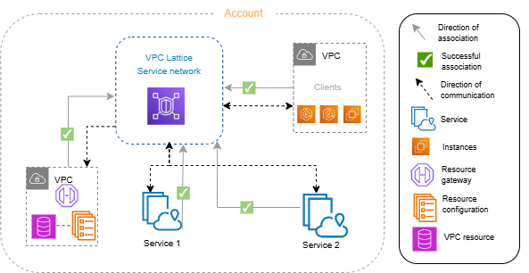
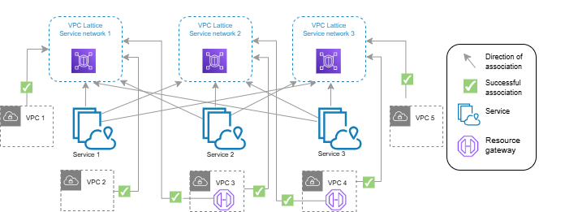

# Service networks in VPC Lattice

A _service network_ is a logical boundary for a
collection of services and resource configurations. Services and resource configurations
associated with the network can be authorized for discovery, connectivity, accessibility,
and observability. To make requests to services and resource configurations in the network,
your service or client must be in a VPC that is connected to the service network either
through an association or through a VPC endpoint.

The following diagram shows the key components of a typical service network within
Amazon VPC Lattice. Check marks on the arrows indicate that the services and the VPC are
associated with the service network. Clients in the VPC associated with the service network
can communicate with both services through the service network.

You can associate one or more services and resource configurations with multiple service
networks. You can also connect multiple VPCs with one service network. You can connect a VPC
to only one service network through an association. To connect a VPC to multiple service
networks, you can use VPC endpoints of type service network. For more information on VPC
endpoints of type service network, see the [_AWS PrivateLink user
guide_](../../../vpc/latest/privatelink/what-is-privatelink.md "../../../vpc/latest/privatelink/what-is-privatelink.md").

In the following diagram, the arrows represent the associations between services and
service networks, as well as associations between the VPCs and service networks. You can see
that multiple services are associated to multiple service networks, and multiple VPCs are
associated to each service network. Each VPC has exactly one association to a service
network. VPC 3 and VPC 4 however connect to two service-networks. VPC 3 connects to
service-network 1 through a VPC endpoint. Similarly, VPC 4 connects to service-network 2
through a VPC endpoint.

For more information, see [Quotas for Amazon VPC Lattice](quotas.md "quotas.md").

###### Contents

- [Create a service
  network](create-service-network.md "create-service-network.md")
- [Manage
  associations](service-network-associations.md "service-network-associations.md")
- [Edit access settings](service-network-access.md "service-network-access.md")
- [Edit monitoring
  details](service-network-monitoring.md "service-network-monitoring.md")
- [Manage tags](service-network-tags.md "service-network-tags.md")
- [Delete a service
  network](delete-service-network.md "delete-service-network.md")
