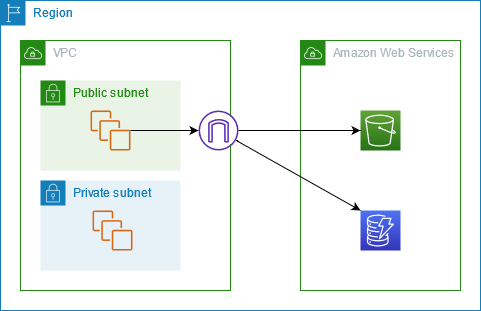
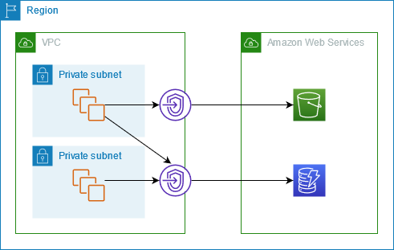

# Gateway endpoints

Gateway VPC endpoints provide reliable connectivity to Amazon S3 and DynamoDB without requiring an
internet gateway or a NAT device for your VPC. Gateway endpoints do not use AWS PrivateLink,
unlike other types of VPC endpoints.

Amazon S3 and DynamoDB support both gateway endpoints and interface endpoints. For a comparison of the
options, see the following:

- [Types of VPC endpoints for Amazon S3](../../../AmazonS3/latest/userguide/privatelink-interface-endpoints.md#types-of-vpc-endpoints-for-s3 "../../../AmazonS3/latest/userguide/privatelink-interface-endpoints.md#types-of-vpc-endpoints-for-s3")
- [Types of VPC endpoints for Amazon DynamoDB](../../../amazondynamodb/latest/developerguide/privatelink-interface-endpoints.md#types-of-vpc-endpoints-for-ddb "../../../amazondynamodb/latest/developerguide/privatelink-interface-endpoints.md#types-of-vpc-endpoints-for-ddb")

###### Pricing

There is no additional charge for using gateway endpoints.

###### Contents

- [Overview](#gateway-endpoint-overview "#gateway-endpoint-overview")
- [Routing](#gateway-endpoint-routing "#gateway-endpoint-routing")
- [Security](#gateway-endpoint-security "#gateway-endpoint-security")
- [IP address type](#gateway-endpoint-ip-address-type "#gateway-endpoint-ip-address-type")
- [DNS record IP type](#gateway-endpoint-dns-record-ip-type "#gateway-endpoint-dns-record-ip-type")
- [Endpoints for Amazon S3](vpc-endpoints-s3.md "vpc-endpoints-s3.md")
- [Endpoints for DynamoDB](vpc-endpoints-ddb.md "vpc-endpoints-ddb.md")

## Overview

You can access Amazon S3 and DynamoDB through their public service endpoints or through
gateway endpoints. This overview compares these methods.

###### Access through an internet gateway

The following diagram shows how instances access Amazon S3 and DynamoDB through their public
service endpoints. Traffic to Amazon S3 or DynamoDB from an instance in a public subnet is routed to
the internet gateway for the VPC and then to the service. Instances in a private subnet
can't send traffic to Amazon S3 or DynamoDB, because by definition private subnets do not have
routes to an internet gateway. To enable instances in the private subnet to send traffic to
Amazon S3 or DynamoDB, you would add a NAT device to the public subnet and route traffic in the
private subnet to the NAT device. While traffic to Amazon S3 or DynamoDB traverses the internet
gateway, it does not leave the AWS network.

###### Access through a gateway endpoint

The following diagram shows how instances access Amazon S3 and DynamoDB through a gateway
endpoint. Traffic from your VPC to Amazon S3 or DynamoDB is routed to the gateway endpoint. Each
subnet route table must have a route that sends traffic destined for the service to the
gateway endpoint using the prefix list for the service. For more information, see
[AWS-managed
prefix lists](../userguide/working-with-aws-managed-prefix-lists.md "../userguide/working-with-aws-managed-prefix-lists.md") in the _Amazon VPC User Guide_.

## Routing

When you create a gateway endpoint, you select the VPC route tables for the subnets
that you enable. The following route is automatically added to each route table that you
select. The destination is a prefix list for the service owned by AWS and the target
is the gateway endpoint.

| Destination            | Target                |
| ---------------------- | --------------------- | -------------------------------------------------------------------------------------------------------------------------------------------------------------------------------------------------------------------------------------------------------------------------------------------------------------------------------------------------------------------------------------------------------------------------------------------------------------------------------------------------------------------------------------------------------------------------------------------------------------------------------------------------------------------------------------------------------------------------------------------------------------------------------------------------------------------------------------------------------------------------------------------------------------------------------------------------------------------------------------------------------------------------------------------------------------------------------------------------------------------------------------------------------------------------------------------------------------------------------------------------------------------------------------------------------------------------------------------------------------------------------------------------------------------------------------------------------------------------------------------------------------------------------------------------------------------------------------------------------------------------------------------------------------------------------------------------------------------------------------------------------------------------------------------------------------------------------------------------------------------------------------------------------------------------------------------------------------------------------------------------------------------------------------------------------------------------------------------------------------------------------------------------------------------------------------------------------------------------------------------------------------------------------------- | --------------------------------------------------------------------------------------------------------------------------------------------------------------------------------------------------------------------------------------------------------------------------------------------------------------------------------------------------------------------------------------------------------------------------------------------------------------------------------------------------------------------------------------------------------------------------------------------------------------------------------------------------------------------------------------------------------------------------------------------------------------------------------------------------------------------------------------------------------------------------------------------------------------------------------------------------------------------------------------------------------------------------------------------------------------------------------------------------------------------------------------------------------------------------------------------------------------------------------------------------------------------------------------------------------------------------------------------------------------------------------------------------------------------------------------------------------------------------------------------------------------------------------------------------------------------------------------------------------------------------------------------------------------------------------------------------------------------------------------------------------------------------------------------------------------------------------------------------------------------------------- |
| `prefix_list_id`       | `gateway_endpoint_id` | ###### Considerations  • You can review the endpoint routes that we add to your route table, but you cannot modify or delete them. To add an endpoint route to a route table, associate it with the gateway endpoint. We delete the endpoint route when you disassociate the route table from the gateway endpoint or when you delete the gateway endpoint.  • All instances in the subnets associated with a route table associated with a gateway endpoint automatically use the gateway endpoint to access the service. Instances in subnets that aren't associated with these route tables use the public service endpoint, not the gateway endpoint.  • A route table can have both an endpoint route to Amazon S3 and an endpoint route to DynamoDB. You can have endpoint routes to the same service (Amazon S3 or DynamoDB) in multiple route tables. You can't have multiple endpoint routes to the same service (Amazon S3 or DynamoDB) in a single route table.  • We use the most specific route that matches the traffic to determine how to route the traffic (longest prefix match). For route tables with an endpoint route, this means the following: + If there is a route that sends all internet traffic (0.0.0.0/0) to an internet gateway, the endpoint route takes precedence for traffic destined for the service (Amazon S3 or DynamoDB) in the current Region. Traffic destined for a different AWS service uses the internet gateway. + Traffic that's destined for the service (Amazon S3 or DynamoDB) in a different Region goes to the internet gateway because prefix lists are specific to a Region. + If there is a route that specifies the exact IP address range for the service (Amazon S3 or DynamoDB) in the same Region, that route takes precedence over the endpoint route. ## Security When your instances access Amazon S3 or DynamoDB through a gateway endpoint, they access the service using its public endpoint. The security groups for these instances must allow traffic to and from the service. The following is an example outbound rule. It references the ID of the [prefix list](../userguide/working-with-aws-managed-prefix-lists.md "../userguide/working-with-aws-managed-prefix-lists.md") for the service. |
| Destination            | Protocol              | Port range                                                                                                                                                                                                                                                                                                                                                                                                                                                                                                                                                                                                                                                                                                                                                                                                                                                                                                                                                                                                                                                                                                                                                                                                                                                                                                                                                                                                                                                                                                                                                                                                                                                                                                                                                                                                                                                                                                                                                                                                                                                                                                                                                                                                                                                                             |
| ---                    | ---                   | ---                                                                                                                                                                                                                                                                                                                                                                                                                                                                                                                                                                                                                                                                                                                                                                                                                                                                                                                                                                                                                                                                                                                                                                                                                                                                                                                                                                                                                                                                                                                                                                                                                                                                                                                                                                                                                                                                                                                                                                                                                                                                                                                                                                                                                                                                                    |
| `prefix_list_id`       | TCP                   | 443                                                                                                                                                                                                                                                                                                                                                                                                                                                                                                                                                                                                                                                                                                                                                                                                                                                                                                                                                                                                                                                                                                                                                                                                                                                                                                                                                                                                                                                                                                                                                                                                                                                                                                                                                                                                                                                                                                                                                                                                                                                                                                                                                                                                                                                                                    | The network ACLs for the subnets for these instances must also allow traffic to and from the service. The following is an example outbound rule. You can't reference prefix lists in network ACL rules, but you can get the IP address ranges for the service from its prefix list.                                                                                                                                                                                                                                                                                                                                                                                                                                                                                                                                                                                                                                                                                                                                                                                                                                                                                                                                                                                                                                                                                                                                                                                                                                                                                                                                                                                                                                                                                                                                                                                               |
| Destination            | Protocol              | Port range                                                                                                                                                                                                                                                                                                                                                                                                                                                                                                                                                                                                                                                                                                                                                                                                                                                                                                                                                                                                                                                                                                                                                                                                                                                                                                                                                                                                                                                                                                                                                                                                                                                                                                                                                                                                                                                                                                                                                                                                                                                                                                                                                                                                                                                                             |
| ---                    | ---                   | ---                                                                                                                                                                                                                                                                                                                                                                                                                                                                                                                                                                                                                                                                                                                                                                                                                                                                                                                                                                                                                                                                                                                                                                                                                                                                                                                                                                                                                                                                                                                                                                                                                                                                                                                                                                                                                                                                                                                                                                                                                                                                                                                                                                                                                                                                                    |
| `service_cidr_block_1` | TCP                   | 443                                                                                                                                                                                                                                                                                                                                                                                                                                                                                                                                                                                                                                                                                                                                                                                                                                                                                                                                                                                                                                                                                                                                                                                                                                                                                                                                                                                                                                                                                                                                                                                                                                                                                                                                                                                                                                                                                                                                                                                                                                                                                                                                                                                                                                                                                    |
| `service_cidr_block_2` | TCP                   | 443                                                                                                                                                                                                                                                                                                                                                                                                                                                                                                                                                                                                                                                                                                                                                                                                                                                                                                                                                                                                                                                                                                                                                                                                                                                                                                                                                                                                                                                                                                                                                                                                                                                                                                                                                                                                                                                                                                                                                                                                                                                                                                                                                                                                                                                                                    |
| `service_cidr_block_3` | TCP                   | 443                                                                                                                                                                                                                                                                                                                                                                                                                                                                                                                                                                                                                                                                                                                                                                                                                                                                                                                                                                                                                                                                                                                                                                                                                                                                                                                                                                                                                                                                                                                                                                                                                                                                                                                                                                                                                                                                                                                                                                                                                                                                                                                                                                                                                                                                                    | ## IP address type The IP address type determines which prefix list is associated with your route table. ###### Requirements to enable IPv6 for a gateway endpoint  • The IP address type of a gateway endpoint must be compatible with the subnets for the gateway endpoint, as described here: + **IPv4** – Add the service's IPv4 prefix list to your route table. + **IPv6** – Add the service's IPv6 prefix list to your route table. This option is supported only if all selected subnets are IPv6 only subnets. + **Dualstack** – Add the service's IPv4 prefix list to your route table and add the service's IPv6 prefix list to your route table. This option is supported only if all selected subnets have both IPv4 and IPv6 address ranges. ## DNS record IP type The DNS record IP type of a gateway is [service-defined](../../../AWSEC2/latest/APIReference/API_DnsOptionsSpecification.md "../../../AWSEC2/latest/APIReference/API_DnsOptionsSpecification.md"). This means a gateway endpoint returns DNS records based on the service endpoint you call. If you create your gateway endpoint using the IPv4 service endpoint, such as `dynamodb.us-east-2.amazonaws.com`, DynamoDB returns A records to your clients, and all subnets in your route table use IPv4. In contrast, if you create your gateway endpoint using the dualstack service endpoint, such as `dynamodb.us-east-2.api.aws`, DynamoDB returns both A and AAAA records to your clients, and the subnets in your route table use IPv4 and IPv6. ###### Note IPv6 is only supported for DynamoDB. The DNS record IP type behavior is different for interface endpoints. For more information, see [DNS record IP type for interface endpoints](privatelink-access-aws-services.md#aws-services-dns-record-ip-type "privatelink-access-aws-services.md#aws-services-dns-record-ip-type"). |
