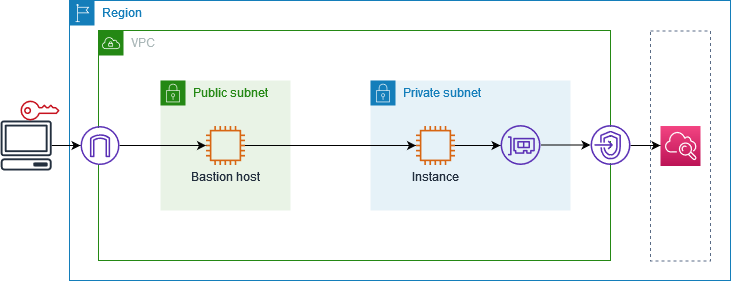

# Get started with AWS PrivateLink

This tutorial demonstrates how to send a request from an EC2 instance in a private
subnet to Amazon CloudWatch using AWS PrivateLink.

The following diagram provides an overview of this scenario. To connect from your computer
to the instance in the private subnet, you'll first connect to a bastion host in a public
subnet. Both the bastion host and the instance must use the same key pair. Because the
`.pem` file for the private key is on your computer, not the bastion host,
you'll use SSH key forwarding. Then, you can connect to the instance from the bastion host
without specifying the `.pem` file in the **ssh** command.
After you set up a VPC endpoint for CloudWatch, traffic from the instance that's destined for CloudWatch is
resolved to the endpoint network interface and then sent to CloudWatch using the VPC endpoint.


For testing purposes, you can use a single Availability Zone. In production, we recommend
that you use at least two Availability Zones for low latency and high availability.

###### Tasks

- [Step 1: Create a VPC with subnets](#create-vpc-subnets "#create-vpc-subnets")
- [Step 2: Launch the instances](#launch-instances "#launch-instances")
- [Step 3: Test CloudWatch access](#test-cloudwatch-access "#test-cloudwatch-access")
- [Step 4: Create a VPC endpoint to access CloudWatch](#create-vpc-endpoint-cloudwatch "#create-vpc-endpoint-cloudwatch")
- [Step 5: Test the VPC endpoint](#test-vpc-endpoint "#test-vpc-endpoint")
- [Step 6: Clean up](#clean-up "#clean-up")

## Step 1: Create a VPC with subnets

Use the following procedure to create a VPC with a public subnet and a private subnet.

###### To create the VPC

1. Open the Amazon VPC console at
   [https://console.aws.amazon.com/vpc/](https://console.aws.amazon.com/vpc/ "https://console.aws.amazon.com/vpc/").
2. Choose **Create VPC**.
3. For **Resources to create**, choose **VPC and more**.
4. For **Name tag auto-generation**, enter a name for the VPC.
5. To configure the subnets, do the following:
   1. For **Number of Availability Zones**, choose
      **1** or **2**, depending on your needs.
   2. For **Number of public subnets**, ensure that you have one public
      subnet per Availability Zone.
   3. For **Number of private subnets**, ensure that you have one
      private subnet per Availability Zone.

6. Choose **Create VPC**.

## Step 2: Launch the instances

Using the VPC that you created in the previous step, launch the bastion host in the public
subnet and the instance in the private subnet.

###### Prerequisites

- Create a key pair using the **.pem** format. You must choose this key pair
  when you launch both the bastion host and the instance.
- Create a security group for the bastion host that allows inbound SSH traffic from the CIDR
  block for your computer.
- Create a security group for the instance that allows inbound SSH traffic from the security
  group for the bastion host.
- Create an IAM instance profile and attach the
  **CloudWatchReadOnlyAccess** policy.

###### To launch the bastion host

1. Open the Amazon EC2 console at
   [https://console.aws.amazon.com/ec2/](https://console.aws.amazon.com/ec2/ "https://console.aws.amazon.com/ec2/").
2. Choose **Launch instance**.
3. For **Name**, enter a name for your bastion host.
4. Keep the default image and instance type.
5. For **Key pair**, select your key pair.
6. For **Network settings**, do the following:
   1. For **VPC**, choose your VPC.
   2. For **Subnet**, choose the public subnet.
   3. For **Auto-assign public IP**, choose
      **Enable**.
   4. For **Firewall**, choose **Select existing
      security group** and then choose the security group for the
      bastion host.

7. Choose **Launch instance**.

###### To launch the instance

1. Open the Amazon EC2 console at
   [https://console.aws.amazon.com/ec2/](https://console.aws.amazon.com/ec2/ "https://console.aws.amazon.com/ec2/").
2. Choose **Launch instance**.
3. For **Name**, enter a name for your instance.
4. Keep the default image and instance type.
5. For **Key pair**, select your key pair.
6. For **Network settings**, do the following:
   1. For **VPC**, choose your VPC.
   2. For **Subnet**, choose the private subnet.
   3. For **Auto-assign public IP**, choose
      **Disable**.
   4. For **Firewall**, choose **Select existing
      security group** and then choose the security group for the
      instance.

7. Expand **Advanced details**. For **IAM
   instance profile**, choose your IAM instance profile.
8. Choose **Launch instance**.

## Step 3: Test CloudWatch access

Use the following procedure to confirm that the instance can't access CloudWatch. You'll do so
using a read-only AWS CLI command for CloudWatch.

###### To test CloudWatch access

1. From your computer, add the key pair to the SSH agent using the following command,
   where `key.pem` is the name of your .pem file.

```
ssh-add ./`key.pem`
```

If you receive an error that permissions for your key pair are too open,
run the following command, and then retry the previous command.

```
chmod 400 ./`key.pem`
```

2. Connect to the bastion host from your computer. You must specify the `-A`
   option, the instance user name (for example, `ec2-user`), and the public IP
   address of the bastion host.

```
ssh -A `ec2-user`@`bastion-public-ip-address`
```

3. Connect to the instance from the bastion host. You must specify the instance user name
   (for example, `ec2-user`) and the private IP address of the instance.

```
ssh `ec2-user`@`instance-private-ip-address`
```

4. Run the CloudWatch [list-metrics](../../../cli/latest/reference/cloudwatch/list-metrics.md "../../../cli/latest/reference/cloudwatch/list-metrics.md") command on the instance as follows. For the `--region`
   option, specify the Region where you created the VPC.

```
aws cloudwatch list-metrics --namespace AWS/EC2 --region `us-east-1`
```

5. After a few minutes, the command times out. This demonstrates that you
   can't access CloudWatch from the instance with the current VPC configuration.

```
Connect timeout on endpoint URL: https://monitoring.`us-east-1`.amazonaws.com/
```

6. Stay connected to your instance. After you create the VPC endpoint, you'll
   try this **list-metrics** command again.

## Step 4: Create a VPC endpoint to access CloudWatch

Use the following procedure to create a VPC endpoint that connects to CloudWatch.

###### Prerequisite

Create a security group for the VPC endpoint that allows traffic to CloudWatch. For example,
add a rule that allows HTTPS traffic from the VPC CIDR block.

###### To create a VPC endpoint for CloudWatch

1. Open the Amazon VPC console at
   [https://console.aws.amazon.com/vpc/](https://console.aws.amazon.com/vpc/ "https://console.aws.amazon.com/vpc/").
2. In the navigation pane, choose **Endpoints**.
3. Choose **Create endpoint**.
4. For **Name tag**, enter a name for the endpoint.
5. For **Service category**, choose
   **AWS services**.
6. For **Service**, select
   **com.amazonaws.`region`.monitoring**.
7. For **VPC**, select your VPC.
8. For **Subnets**, select the Availability Zone and then select the
   private subnet.
9. For **Security group**, select the security group for the VPC endpoint.
10. For **Policy**, select **Full access** to allow all
    operations by all principals on all resources over the VPC endpoint.
11. (Optional) To add a tag, choose **Add new tag** and enter the tag
    key and the tag value.
12. Choose **Create endpoint**. The initial status is
    **Pending**. Before you go to the next step, wait until the status is
    **Available**. This can take a few minutes.

## Step 5: Test the VPC endpoint

Verify that the VPC endpoint is sending requests from your instance to CloudWatch.

###### To test the VPC endpoint

Run the following command on your instance. For the `--region` option,
specify the Region where you created the VPC endpoint.

```
aws cloudwatch list-metrics --namespace AWS/EC2 --region `us-east-1`
```

If you get a response, even a response with empty results, then you are connected
to CloudWatch using AWS PrivateLink.

If you get an `UnauthorizedOperation` error, ensure that the instance
has an IAM role that allows access to CloudWatch.

If the request times out, verify the following:

- The security group for the endpoint allows traffic to CloudWatch.
- The `--region` option specifies the Region in which you
  created the VPC endpoint.

## Step 6: Clean up

If you no longer need the bastion host and instance that you created for this
tutorial, you can terminate them.

###### To terminate the instances

1. Open the Amazon EC2 console at
   [https://console.aws.amazon.com/ec2/](https://console.aws.amazon.com/ec2/ "https://console.aws.amazon.com/ec2/").
2. In the navigation pane, choose **Instances**.
3. Select both test instances and choose **Instance state**,
   **Terminate instance**.
4. When prompted for confirmation, choose **Terminate**.

If you no longer need the VPC endpoint, you can delete it.

###### To delete the VPC endpoint

1. Open the Amazon VPC console at
   [https://console.aws.amazon.com/vpc/](https://console.aws.amazon.com/vpc/ "https://console.aws.amazon.com/vpc/").
2. In the navigation pane, choose **Endpoints**.
3. Select the VPC endpoint.
4. Choose **Actions**, **Delete VPC endpoints**.
5. When prompted for confirmation, enter `delete` and
   then choose **Delete**.
