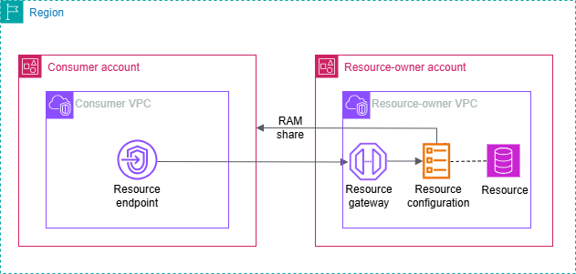

# Access VPC resources through AWS PrivateLink

You can privately access a VPC resource in another VPC using a resource VPC endpoint
(resource endpoint). A resource endpoint lets you privately and securely access VPC resources such
as a database, an Amazon EC2 instance, an application endpoint, a domain-name target, or
an IP address that may be in a private subnet in another VPC or in an on premise environment.
Without resource endpoints, you have to either add an internet gateway to your VPC or access the
resource using a AWS PrivateLink interface endpoint and a Network Load Balancer. Resource endpoints
don't require a [load balancer](../../../glossary/latest/reference/glos-chap.md#loadbalancer "../../../glossary/latest/reference/glos-chap.md#loadbalancer"), so you can access the VPC resource directly. A VPC resource is
represented by a resource configuration. A resource configuration is associated with a resource
gateway.

###### Pricing

When you access resources using resource endpoints, you are billed for each hour that your
resource VPC endpoint is provisioned. You are also billed per GB of data processed when you
access resources. For more information, see [AWS PrivateLink pricing](https://aws.amazon.com/privatelink/pricing/ "https://aws.amazon.com/privatelink/pricing/"). When you enable access to your resources using resource
configurations and resource gateways, you are billed per GB data processed by your resource
gateways. For more information, see [Amazon VPC Lattice pricing](https://aws.amazon.com/vpc/lattice/pricing/ "https://aws.amazon.com/vpc/lattice/pricing/").

###### Contents

- [Overview](#resource-endpoint-overview "#resource-endpoint-overview")
- [DNS hostnames](#resource-endpoint-dns "#resource-endpoint-dns")
- [DNS resolution](#resource-endpoint-dns-resolution "#resource-endpoint-dns-resolution")
- [Private DNS](#resource-endpoint-private-dns "#resource-endpoint-private-dns")
- [Subnets and Availability Zones](#resource-endpoint-subnets-zones "#resource-endpoint-subnets-zones")
- [IP address types](#resource-endpoint-ip-address-type "#resource-endpoint-ip-address-type")
- [Create a resource endpoint](use-resource-endpoint.md "use-resource-endpoint.md")
- [Manage resource endpoints](manage-resource-endpoint.md "manage-resource-endpoint.md")
- [Resource configuration](resource-configuration.md "resource-configuration.md")
- [Resource gateway](resource-gateway.md "resource-gateway.md")

## Overview

You can access resources in your account or those that have been shared with you from
another account. To access a resource, you create a resource VPC endpoint, which establishes
connections between the subnets in your VPC and the resource using network interfaces. Traffic
destined for the resource is resolved to the private IP addresses of the resource endpoint’s
network interfaces using DNS. Then, traffic is sent to the resource using the connection between the VPC
endpoint and the resource through the resource gateway.

The following image shows a resource endpoint in a consumer account accessing a resource that is owned by a different account and shared through AWS RAM:



### Considerations

- TCP traffic is supported. UDP traffic is not supported.
- Network connections must be initiated from the VPC that contains the resource endpoint,
  and not from the VPC that has the resource. The resource's VPC can't initiate network
  connections into the endpoint VPC.
- The only supported ARN-based resources are Amazon RDS resources.
- At least one [Availability Zone](../../../glossary/latest/reference/glos-chap.md#AZ "../../../glossary/latest/reference/glos-chap.md#AZ") of the VPC endpoint and the resource gateway have to overlap.

## DNS hostnames

With AWS PrivateLink, you send traffic to resources using private endpoints. When you create a
resource VPC endpoint, we create Regional DNS names (called default DNS name) that you can use to
communicate with the resource from your VPC and from on premises. We recommend that you use DNS
instead of endpoint IPs to connect to your resources. The default DNS name for your resource VPC
endpoint has the following syntax:

```
`endpoint_id`.`rcfgId`.`randomHash`.vpc-lattice-rsc.`region`.on.aws
```

When you create a resource VPC endpoint for select resource configurations that use ARNs,
you can enable [private DNS](privatelink-access-aws-services.md#interface-endpoint-private-dns "privatelink-access-aws-services.md#interface-endpoint-private-dns"). With private
DNS, you can continue to make requests to the resource using the DNS name provisioned for the
resource by the AWS service, while leveraging private connectivity through the resource VPC
endpoint. For more information, see [DNS resolution](#resource-endpoint-dns-resolution "#resource-endpoint-dns-resolution").

The following [describe-vpc-endpoint-associations](../../../cli/latest/reference/ec2/describe-vpc-endpoint-associations.md "../../../cli/latest/reference/ec2/describe-vpc-endpoint-associations.md") command displays the DNS entries for a resource
endpoint.

```
aws ec2 describe-vpc-endpoint-associations --vpc-endpoint-id `vpce-123456789abcdefgh` --query 'VpcEndpointAssociations[*].*'
```

The following is example output for a resource endpoint for an Amazon RDS database with private
DNS names enabled. The first DNS name is the default DNS name. The second DNS name is from the hidden
private hosted zone, which resolves requests to the public endpoint to the private IP addresses
of the endpoint network interfaces.

```
[
    [
        "vpce-rsc-asc-abcd1234abcd",
        "vpce-123456789abcdefgh",
        "Accessible",
        {
            "DnsName": "vpce-`1234567890abcdefg`-snra-`1234567890abcdefg`.rcfg-`abcdefgh123456789`.`4232ccc`.vpc-lattice-rsc.`us-east-1`.on.aws",
            "HostedZoneId": "ABCDEFGH123456789000"
        },
        {
            "DnsName": "`database-5-test.cluster-ro-example`.`us-east-1`.rds.amazonaws.com",
            "HostedZoneId": "A1B2CD3E4F5G6H8I91234"
        },
        "arn:aws:vpc-lattice:us-east-1:111122223333:resourceconfiguration/rcfg-1234567890abcdefg",
        "arn:aws:vpc-lattice:us-east-1:111122223333:resourceconfiguration/rcfg-1234567890xyz"
    ]
]
```

## DNS resolution

The DNS records that we create for your resource VPC endpoint are public. Therefore, these
DNS names are publicly resolvable. However, DNS requests from outside the VPC still return the
private IP addresses of the resource endpoint’s network interfaces. You can use these DNS names
to access the resource from on premises, as long as you have access to the VPC that the resource
endpoint is in, through VPN or Direct Connect.

## Private DNS

If you enable private DNS for your resource VPC endpoint for select resource configurations
that use ARNs, and your VPC has both [DNS
hostnames and DNS resolution](../userguide/vpc-dns.md#vpc-dns-updating "../userguide/vpc-dns.md#vpc-dns-updating") enabled, we create hidden, AWS-managed private hosted
zones for resource configurations with a custom DNS name. The hosted zone contains a record set
for the default DNS name for the resource that resolves it to the private IP addresses of the
resource endpoint's network interfaces in your VPC.

Amazon provides a DNS server for your VPC, called the [Route 53 Resolver](../../../Route53/latest/DeveloperGuide/resolver.md "../../../Route53/latest/DeveloperGuide/resolver.md"). The Route 53 Resolver automatically
resolves local VPC domain names and record in private hosted zones. However, you can't use the
Route 53 Resolver from outside your VPC. If you'd like to access your VPC endpoint from your on-premises
network, you can use the custom DNS name or you can use Route 53 Resolver endpoints and Resolver
rules. For more information, see [Integrating AWS Transit Gateway with AWS PrivateLink and Amazon Route 53 Resolver](https://aws.amazon.com/blogs/networking-and-content-delivery/integrating-aws-transit-gateway-with-aws-privatelink-and-amazon-route-53-resolver/ "https://aws.amazon.com/blogs/networking-and-content-delivery/integrating-aws-transit-gateway-with-aws-privatelink-and-amazon-route-53-resolver/").

## Subnets and Availability Zones

You can configure your VPC endpoint with one subnet per Availability Zone. We create an
endpoint network interface for the VPC endpoint in your subnet. We assign IP addresses to each
endpoint network interface from its subnet, based on the [IP address type](#resource-endpoint-ip-address-type "#resource-endpoint-ip-address-type") of the VPC endpoint. In a
production environment, for high availability and resiliency, we recommend configuring at least
two Availability Zones for each VPC endpoint.

## IP address types

Resource endpoints can support IPv4, IPv6, or dualstack addresses. Endpoints that support
IPv6 can respond to DNS queries with AAAA records. The IP address type of a resource endpoint
must be compatible with the subnets for the resource endpoint, as described here:

- **IPv4** – Assign IPv4 addresses to your endpoint network
  interfaces. This option is supported only if all selected subnets have IPv4 address
  ranges.
- **IPv6** – Assign IPv6 addresses to your endpoint network
  interfaces. This option is supported only if all selected subnets are IPv6 only subnets.
- **Dualstack** – Assign both IPv4 and IPv6 addresses to your
  endpoint network interfaces. This option is supported only if all selected subnets have both
  IPv4 and IPv6 address ranges.

If a resource VPC endpoint supports IPv4, the endpoint network interfaces have IPv4
addresses. If a resource VPC endpoint supports IPv6, the endpoint network interfaces have IPv6
addresses. The IPv6 address for an endpoint network interface is unreachable from the internet.
If you describe an endpoint network interface with an IPv6 address, notice that
`denyAllIgwTraffic` is enabled.
