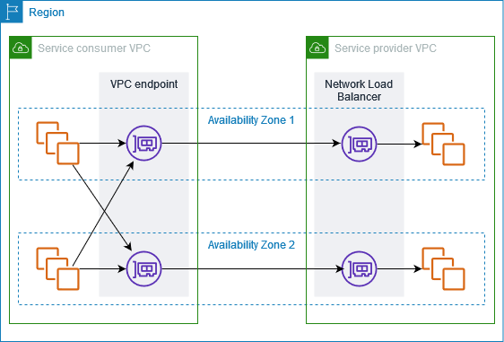

# Access SaaS products through AWS PrivateLink

Using AWS PrivateLink, you can access SaaS products privately, as if they were running in your
own VPC.

###### Contents

- [Overview](#partner-services-overview "#partner-services-overview")
- [Create an interface endpoint](#create-interface-endpoint-partner-service "#create-interface-endpoint-partner-service")

## Overview

You can discover, purchase, and provision SaaS products powered by AWS PrivateLink through
AWS Marketplace. For more information, see [Access SaaS applications securely and privately using AWS PrivateLink](https://aws.amazon.com/marketplace/solutions/privatelink/ "https://aws.amazon.com/marketplace/solutions/privatelink/").

You can also find SaaS products powered by AWS PrivateLink from AWS Partners. For more
information see [AWS PrivateLink Partners](https://aws.amazon.com/privatelink/partners/ "https://aws.amazon.com/privatelink/partners/").

The following diagram shows how you use VPC endpoints to connect to SaaS products. The
service provider creates an endpoint service and grants their customers access to the endpoint
service. As the service consumer, you create an interface VPC endpoint, which establishes
connections between one or more subnets in your VPC and the endpoint service.

## Create an interface endpoint

Use the following procedure to create an interface VPC endpoint that connects to the SaaS
product.

###### Requirement

Subscribe to the service.

###### To create an interface endpoint to a partner service

1. Open the Amazon VPC console at
   [https://console.aws.amazon.com/vpc/](https://console.aws.amazon.com/vpc/ "https://console.aws.amazon.com/vpc/").
2. In the navigation pane, choose **Endpoints**.
3. Choose **Create endpoint**.
4. If you purchased the service from AWS Marketplace, do the following:
   1. For **Type**, choose **AWS Marketplace services**.
   2. Select the service.

5. If you subscribed to a service with the AWS Service Ready designation, do the following:
   1. For **Type**, choose **PrivateLink Ready partner services**.
   2. Enter the name of the service, and then choose **Verify service**.

6. For **VPC**, select the VPC from which you'll access the product.
7. For **Subnets**, select the subnets in which to create endpoint network interfaces.
8. For **Security groups**, select the security groups to associate with
   the endpoint network interfaces. The security group rules must allow traffic between the
   resources in the VPC and the endpoint network interfaces.
9. (Optional) To add a tag, choose **Add new tag** and enter the tag
   key and the tag value.
10. Choose **Create endpoint**.

###### To configure an interface endpoint

For information about configuring your interface endpoint, see [Configure an interface endpoint](interface-endpoints.md "interface-endpoints.md").
