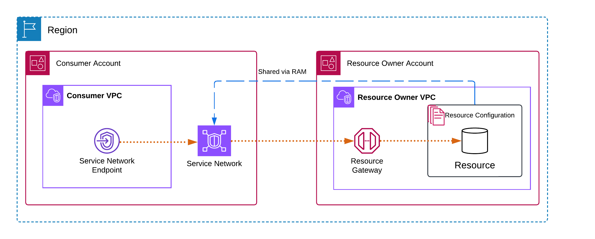

# Access service networks through

AWS PrivateLink

You can privately connect to a service network from your VPC using a service network VPC
endpoint (service-network endpoint). A service-network endpoint lets you privately and securely
access the resources and services that are associated to the service network. In this way, you can
privately access multiple resources and services through a single VPC endpoint.

A service network is a logical collection of resource configurations and VPC Lattice
services. Using a service-network endpoint, you can connect a service network to your VPC, and
access those resources and services privately from your VPC or from on-premises. A service-network
endpoint lets you connect to one service network. To connect to multiple service networks from
your VPC, you can create multiple service-network endpoints, each pointing to a different service
network.

Service networks are integrated with AWS Resource Access Manager (AWS RAM). You can share your service network
with another account through AWS RAM. When you share a service network with another AWS account,
that account can create a service-network endpoint to connect to the service network. You can
share a service network using a [resource share](../../../ram/latest/userguide/working-with-sharing.md "../../../ram/latest/userguide/working-with-sharing.md") in AWS RAM.

Use the AWS RAM console, to view the resource shares to which you have been added, the shared
service networks that you can access, and the AWS accounts that have shared the resources with
you. For more information, see [Resources shared with you](../../../ram/latest/userguide/working-with-shared.md "../../../ram/latest/userguide/working-with-shared.md") in the
_AWS RAM User Guide_.

###### Pricing

You are billed hourly for the resource configurations that are associated with your service
network. You are also billed per GB of data processed when you access resources through the
service network VPC endpoint. You are not billed hourly for the service-network VPC endpoint
itself. For more information, see [Amazon VPC Lattice pricing](https://aws.amazon.com/vpc/lattice/pricing/ "https://aws.amazon.com/vpc/lattice/pricing/").

###### Contents

- [Overview](#sn-network-overview "#sn-network-overview")
- [DNS hostnames](#sn-endpoint-dns "#sn-endpoint-dns")
- [DNS resolution](#sn-endpoint-dns-resolution "#sn-endpoint-dns-resolution")
- [Private DNS](#sn-endpoint-private-dns "#sn-endpoint-private-dns")
- [Subnets and Availability Zones](#sn-endpoint-subnets-zones "#sn-endpoint-subnets-zones")
- [IP address types](#sn-endpoint-ip-address-type "#sn-endpoint-ip-address-type")
- [Create a service-network
  endpoint](access-with-service-network-endpoint.md "access-with-service-network-endpoint.md")
- [Manage service-network endpoints](manage-sn-endpoint.md "manage-sn-endpoint.md")

## Overview

You can either create your own service network, or a service network can be shared with you
from another account. Either way, you can create a service-network endpoint to connect to it from
your VPC. For more information on how to create service network and associate resource
configurations to it, see the [Amazon VPC Lattice User Guide](../../../vpc-lattice/latest/ug.md "../../../vpc-lattice/latest/ug.md").

The following diagram shows how a service-network endpoint in your VPC accesses a service
network.



Network connections can only be initiated from the VPC that has the service-network endpoint
to the resources and services in the service network. The VPC with the resources and services
can't initiate network connections into the endpoint VPC.

## DNS hostnames

With AWS PrivateLink, you send traffic to service networks using private endpoints. When you
create a service-network VPC endpoint, we create Regional DNS names (called default DNS name) for
each resource and service that you can use to communicate with the resource and service from your
VPC and from on premises. IP addresses associated with the endpoint can change. We recommend
that you use DNS instead of endpoint IPs to connect to your service networks.

The default DNS name for a resource in the service network has the following syntax:

```
`endpointId`-`snraId`.`rcfgId`.`randomHash`.vpc-lattice-rsc.`region`.on.aws
```

The default DNS name for a Lattice service in the service-network has the following
syntax:

```
`endpointId`-`snsaId`.`randomHash`.vpc-lattice-svcs.`region`.on.aws
```

If you're using the AWS Management Console, you can find the DNS name under the **Associations** tab. If you're using the AWS CLI, use the [describe-vpc-endpoint-associations](../../../cli/latest/reference/ec2/describe-vpc-endpoint-associations.md "../../../cli/latest/reference/ec2/describe-vpc-endpoint-associations.md") command.

You can only enable [private DNS](privatelink-access-aws-services.md#interface-endpoint-private-dns "privatelink-access-aws-services.md#interface-endpoint-private-dns") when
your service network has an ARN-type resource configuration to an Amazon RDS database service. With
private DNS, you can continue to make requests to the resource using the DNS name provisioned for
the resource by the AWS service, while leveraging private connectivity through the
service-network VPC endpoint. For more information, see [DNS resolution](privatelink-access-resources.md#resource-endpoint-dns-resolution "privatelink-access-resources.md#resource-endpoint-dns-resolution").

## DNS resolution

When you create a service network endpoint, we create DNS names for each resource
configuration and Lattice service that is associated to the service network. These DNS records
are public. Therefore, these DNS names are publicly resolvable. However, DNS requests from
outside the VPC still return the private IP addresses of the service network endpoint’s network
interfaces. You can use these DNS names to access the resource and services from on premises, as
long as you have access to the VPC that the service network endpoint is in, through VPN or Direct
Connect.

## Private DNS

If you enable private DNS for your service-network VPC endpoint, and your VPC has both
[DNS hostnames and DNS
resolution](../userguide/vpc-dns.md#vpc-dns-updating "../userguide/vpc-dns.md#vpc-dns-updating") enabled, we create hidden, AWS-managed private hosted zones for the
resource configurations that have custom DNS names. The hosted zone contains a record set for the
default DNS name for the resource that resolves it to the private IP addresses of the
service-network endpoint's network interfaces in your VPC.

Amazon provides a DNS server for your VPC, called the [Route 53 Resolver](../../../Route53/latest/DeveloperGuide/resolver.md "../../../Route53/latest/DeveloperGuide/resolver.md"). The Route 53 Resolver automatically
resolves local VPC domain names and record in private hosted zones. However, you can't use the
Route 53 Resolver from outside your VPC. If you'd like to access your VPC endpoint from your on-premises
network, you can use the default DNS names or you can use Route 53 Resolver endpoints and Resolver
rules. For more information, see [Integrating AWS Transit Gateway with AWS PrivateLink and Amazon Route 53 Resolver](https://aws.amazon.com/blogs/networking-and-content-delivery/integrating-aws-transit-gateway-with-aws-privatelink-and-amazon-route-53-resolver/ "https://aws.amazon.com/blogs/networking-and-content-delivery/integrating-aws-transit-gateway-with-aws-privatelink-and-amazon-route-53-resolver/").

## Subnets and Availability Zones

You can configure your VPC endpoint with one subnet per Availability Zone.
We create an elastic network interface for the VPC endpoint in your subnet.
We assign IP addresses to each elastic network interface from its subnet in multiples of /28, if the [IP address type](privatelink-access-resources.md#resource-endpoint-ip-address-type "privatelink-access-resources.md#resource-endpoint-ip-address-type") of the VPC endpoint is IPv4.
The number of IP addresses assigned in each subnet depends on the number of resource configurations and we add additional IPs in /28 blocks as needed.
In a production environment, for high availability and resiliency, we recommend configuring at least two Availability Zones for each VPC endpoint and having contiguous IPs available.

## IP address types

Service-network endpoints can support IPv4, IPv6, or dual-stack addresses. Endpoints that
support IPv6 can respond to DNS queries with AAAA records. The IP address type of a
service-network endpoint must be compatible with the subnets for the resource endpoint, as
described here:

- **IPv4** – Assign IPv4 addresses to your endpoint network
  interfaces. This option is supported only if all selected subnets have IPv4 address
  ranges.
- **IPv6** – Assign IPv6 addresses to your endpoint network
  interfaces. This option is supported only if all selected subnets are IPv6 only subnets.
- **Dualstack** – Assign both IPv4 and IPv6 addresses to your
  endpoint network interfaces. This option is supported only if all selected subnets have both
  IPv4 and IPv6 address ranges.

If a service-network VPC endpoint supports IPv4, the endpoint network interfaces have IPv4
addresses. If a service-network VPC endpoint supports IPv6, the endpoint network interfaces have
IPv6 addresses. The IPv6 address for an endpoint network interface is unreachable from the
internet. If you describe an endpoint network interface with an IPv6 address, notice that
`denyAllIgwTraffic` is enabled.
