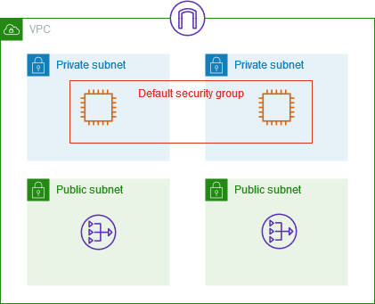

# Default security groups for your VPCs

Your default VPCs and any VPCs that you create come with a default security group.
The name of the default security group is "default".

We recommend that you create security groups for specific resources or groups of
resources instead of using the default security group. However, if you don't
associate a security group with some resources at creation time, we associate them
with the default security group. For example, if you don't specify a security group
when you launch an EC2 instance, we associate the instance with the default security
group for its VPC.

## Default security group basics

- You can change the rules for a default security group.
- You can't delete a default security group. If you try to delete a default
  security group, we return the following error code: `Client.CannotDelete`.

## Default rules

The following table describes the default inbound rules for a default security group.

| Source                 | Protocol | Port range | Description                                                                                                                            |
| ---------------------- | -------- | ---------- | -------------------------------------------------------------------------------------------------------------------------------------- |
| `sg-1234567890abcdef0` | All      | All        | Allows inbound traffic from all resources that are assigned to this security group. The source is the ID of this security group. |

The following table describes the default outbound rules for a default security group.

| Destination | Protocol | Port range | Description                                                                                                 |
| ----------- | -------- | ---------- | ----------------------------------------------------------------------------------------------------------- |
| 0.0.0.0/0   | All      | All        | Allows all outbound IPv4 traffic.                                                                           |
| ::/0        | All      | All        | Allows all outbound IPv6 traffic. This rule is added only if your VPC has an associated IPv6 CIDR block. |

## Example

The following diagram shows a VPC with a default security group, an internet gateway, and a
NAT gateway. The default security contains only its default rules, and it is
associated with two EC2 instances running in the VPC. In this scenario, each
instance can receive inbound traffic from the other instance on all ports and
protocols. The default rules do not allow the instances to receive traffic from the
internet gateway or the NAT gateway. If your instances must receive additional
traffic, we recommend that you create a security group with the required rules and
associate the new security group with the instances instead of the default security
group.

