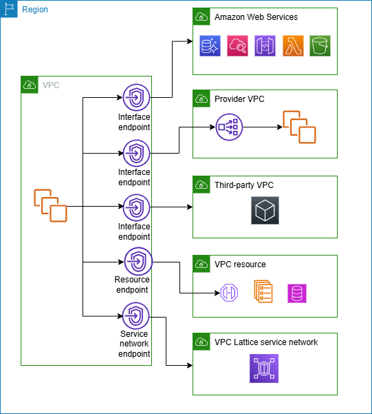

# Connect your VPC to services using AWS PrivateLink

AWS PrivateLink establishes private connectivity between virtual private clouds (VPC) and
supported AWS services, services hosted by other AWS accounts, supported AWS Marketplace services,
and supported resources. You do not need to use an internet gateway, NAT device, AWS Direct Connect
connection, or AWS Site-to-Site VPN connection to communicate with the service or resource.

To use AWS PrivateLink, create a VPC endpoint in any subnets from which you need to access
the service or resource. This creates elastic network interfaces in the specified subnets
that serve as entry points for traffic destined to the service or resource.

You can also create your own VPC endpoint service, powered by AWS PrivateLink and enable other
AWS customers to access your service. PrivateLink enables the creation of private API
endpoints, allowing organizations to expose their own services securely to other AWS
customers. This empowers businesses to monetize their internal capabilities, foster
collaborative ecosystems, and maintain control over how their services are accessed and
consumed.

One of the key benefits of using AWS PrivateLink is the ability to establish secure, private
connectivity without the need for traditional networking constructs like internet gateways,
NAT devices, or VPN connections. This helps simplify the network architecture, reduce the
attack surface, and improve overall security by keeping the data traffic confined within the
AWS network.

The following diagram shows common use cases for AWS PrivateLink. The VPC has several EC2
instances in a private subnet that have access to resources through five VPC endpoints. There
are three interface VPC endpoints, one resource VPC endpoint, and one service-network VPC
endpoint.

For more information, see [AWS PrivateLink](../privatelink.md "../privatelink.md").
