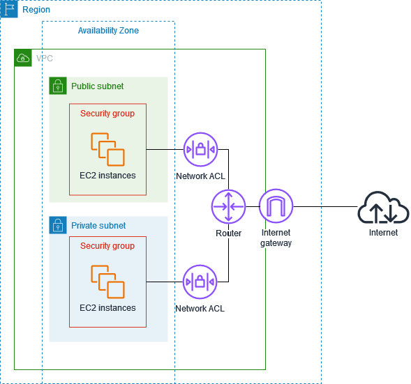

# Infrastructure security in Amazon VPC

As a managed service, Amazon Virtual Private Cloud is protected by AWS global network security. For
information about AWS security services and how AWS protects infrastructure, see [AWS Cloud Security](https://aws.amazon.com/security/ "https://aws.amazon.com/security/"). To design your AWS
environment using the best practices for infrastructure security, see [Infrastructure
Protection](../../../wellarchitected/latest/security-pillar/infrastructure-protection.md "../../../wellarchitected/latest/security-pillar/infrastructure-protection.md") in _Security Pillar AWS Well‐Architected
Framework_.

You use AWS published API calls to access Amazon VPC through the network. Clients must
support the following:

- Transport Layer Security (TLS). We require TLS 1.2 and recommend TLS 1.3.
- Cipher suites with perfect forward secrecy (PFS) such as DHE (Ephemeral
  Diffie-Hellman) or ECDHE (Elliptic Curve Ephemeral Diffie-Hellman). Most modern systems
  such as Java 7 and later support these modes.

## Network isolation

A virtual private cloud (VPC) is a virtual network in your own logically isolated area
in the AWS Cloud. Use separate VPCs to isolate infrastructure by workload or organizational
entity.

A subnet is a range of IP addresses in a VPC. When you launch an instance, you launch it
into a subnet in your VPC. Use subnets to isolate the tiers of your application (for example,
web, application, and database) within a single VPC. Use private subnets for your instances
if they should not be accessed directly from the internet.

You can use [AWS PrivateLink](../privatelink.md "../privatelink.md") to enable resources
in your VPC to connect to AWS services using private IP addresses, as if those services
were hosted directly in your VPC. Therefore, you do not need to use an internet gateway or
NAT device to access AWS services.

## Control network traffic

Consider the following options for controlling network traffic to the resources in
your VPC, such as EC2 instances:

- Use [security groups](vpc-security-groups.md "vpc-security-groups.md") as the
  primary mechanism for controlling network access to your VPCs. When necessary, use
  [network ACLs](vpc-network-acls.md "vpc-network-acls.md") to provide stateless,
  coarse-grain network control. Security groups are more versatile than network ACLs,
  due to their ability to perform stateful packet filtering and create rules that
  reference other security groups. Network ACLs can be effective as a secondary control
  (for example, to deny a specific subset of traffic) or as high-level subnet guard rails.
  Also, because network ACLs apply to an entire subnet, they can be used as defense-in-depth
  in case an instance is ever launched without the correct security group.
- Use private subnets for your instances if they should not be accessed
  directly from the internet. Use a bastion host or NAT gateway for internet access
  from instances in private subnets.
- Configure subnet [route tables](VPC_Route_Tables.md "VPC_Route_Tables.md")
  with the minimum network routes to support your connectivity requirements.
- Consider using additional security groups or network interfaces to control
  and audit Amazon EC2 instance management traffic separately from regular application traffic.
  Therefore, you can implement special IAM policies for change control, making it easier
  to audit changes to security group rules or automated rule-verification scripts. Multiple
  network interfaces also provide additional options for controlling network traffic,
  including the ability to create host-based routing policies or leverage different VPC
  subnet routing rules based on an network interfaces assigned to a subnet.
- Use AWS Virtual Private Network or AWS Direct Connect to establish private connections from your remote
  networks to your VPCs. For more information, see [Network-to-Amazon VPC connectivity options](../../../whitepapers/latest/aws-vpc-connectivity-options/network-to-amazon-vpc-connectivity-options.md "../../../whitepapers/latest/aws-vpc-connectivity-options/network-to-amazon-vpc-connectivity-options.md").
- Use [VPC Flow Logs](flow-logs.md "flow-logs.md") to monitor the traffic
  that reaches your instances.
- Use [AWS Security Hub](https://aws.amazon.com/security-hub/ "https://aws.amazon.com/security-hub/") to check for unintended
  network accessibility from your instances.
- Use [AWS Network Firewall](network-firewall.md "network-firewall.md") to protect the subnets in
  your VPC from common network threats.

## Compare security groups and network ACLs

The following table summarizes the basic differences between security groups and network
ACLs.

| Characteristic     | Security group                                               | Network ACL                                                               |
| ------------------ | ------------------------------------------------------------ | ------------------------------------------------------------------------- |
| Level of operation | Instance level                                               | Subnet level                                                              |
| Scope              | Applies to all instances associated with the security group  | Applies to all instances in the associated subnets                        |
| Rule type          | Allow rules only                                             | Allow and deny rules                                                      |
| Rule evaluation    | Evaluates all rules before deciding whether to allow traffic | Evaluates rules in ascending order until a match for the traffic is found |
| Return traffic     | Automatically allowed (stateful)                             | Must be explicitly allowed (stateless)                                    |

The following diagram illustrates the layers of security provided by security groups and
network ACLs. For example, traffic from an internet gateway is routed to the appropriate
subnet using the routes in the routing table. The rules of the network ACL that is associated
with the subnet control which traffic is allowed to the subnet. The rules of the security
group that is associated with an instance control which traffic is allowed to the
instance.

You can secure your instances using only security groups. However, you can add network
ACLs as an additional layer of defense. For more information, see [Example: Control access to instances in a subnet](nacl-examples.md "nacl-examples.md").
