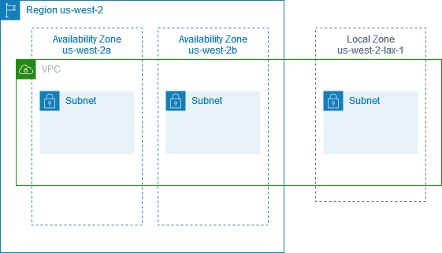
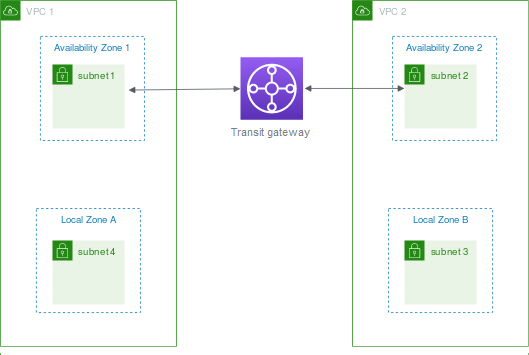

# Subnets in AWS Local Zones

AWS Local Zones allow you to place resources closer to your users, and seamlessly
connect to the full range of services in the AWS Region, using familiar APIs and tool
sets. When you create a subnet in a Local Zone, you extend the VPC to that Local
Zone.

To use a Local Zone, you use the following process:

- Opt in to the Local Zone.
- Create a subnet in the Local Zone.
- Launch resources in the Local Zone subnet, so that your
  applications are closer to your users.
  The following diagram illustrates a VPC in the US West (Oregon) (`us-west-2`)
  Region that spans Availability Zones and a Local Zone.

When you create a VPC, you can choose to assign a set of Amazon-provided public IP addresses
to the VPC. You can also set a network border group for the addresses that limits the
addresses to the group. When you set a network border group, the IP addresses can't move
between network border groups. Local Zone network traffic will go directly to the
internet or to points-of-presence (PoPs) without traversing the Local Zone's parent
Region, enabling access to low-latency computing. For the complete
list of Local Zones and their corresponding parent Regions, see [Available Local Zones](../../../local-zones/latest/ug/available-local-zones.md "../../../local-zones/latest/ug/available-local-zones.md")
in the _AWS Local Zones User Guide_.

The following rules apply to Local Zones:

- The Local Zone subnets follow the same routing rules as Availability Zone
  subnets, including route tables, security groups, and network ACLs.
- Outbound internet traffic leaves a Local Zone from the Local Zone.
- You must provision public IP addresses for use in a Local Zone. When you
  allocate addresses, you can specify the location from which the IP address is
  advertised. We refer to this as a network border group, and you can set this
  parameter to limit the addresses to this location. After you provision the IP
  addresses, you cannot move them between the Local Zone and the parent Region
  (for example, from `us-west-2-lax-1a` to `us-west-2`).
- If the Local Zone supports IPv6, you can request IPv6 Amazon-provided IP addresses and
  associate them with the network border group for a new or existing VPC. For the
  list of Local Zones that support IPv6, see [Considerations](../../../local-zones/latest/ug/how-local-zones-work.md#considerations "../../../local-zones/latest/ug/how-local-zones-work.md#considerations") in the _AWS Local Zones User
  Guide_
- You can't create VPC endpoints in Local Zone subnets.
  For more information about working with Local Zones, see the [AWS Local Zones User Guide](../../../local-zones/latest/ug.md "../../../local-zones/latest/ug.md").

## Considerations for internet gateways

Take the following information into account when you use internet gateways (in the parent
Region) in Local Zones:

- You can use internet gateways in Local Zones with Elastic IP addresses or Amazon
  auto-assigned public IP addresses. The Elastic IP addresses that you
  associate must include the network border group of the Local Zone. For more
  information, see [Associate Elastic IP addresses with resources in your VPC](vpc-eips.md "vpc-eips.md").

You cannot associate an Elastic IP address that is set for the Region.

- Elastic IP addresses that are used in Local Zones have the same quotas as Elastic IP
  addresses in a Region. For more information, see [Elastic IP addresses](amazon-vpc-limits.md#vpc-limits-eips "amazon-vpc-limits.md#vpc-limits-eips").
- You can use internet gateways in route tables that are associated with
  Local Zone resources. For more information, see [Routing to an internet gateway](route-table-options.md#route-tables-internet-gateway "route-table-options.md#route-tables-internet-gateway").

## Access Local Zones using a Direct Connect gateway

Consider the scenario where you want an on-premises data center to access resources that are
in a Local Zone. You use a virtual private gateway for the VPC that's associated
with the Local Zone to connect to a Direct Connect gateway. The Direct Connect
gateway connects to an Direct Connect location in a Region. The on-premises data center
has an Direct Connect connection to the Direct Connect location.

###### Note

Traffic that is destined for a subnet in a Local Zone using Direct Connect does not travel through the parent Region of the Local Zone. Instead, traffic takes the shortest path to the Local Zone. This decreases latency and helps make your applications more responsive.

You configure the following resources for this configuration:

- A virtual private gateway for the VPC that is associated with the Local Zone subnet. You
  can view the VPC for the subnet on the subnet details page in the Amazon VPC console,
  or use the [describe-subnets](../../../cli/latest/reference/ec2/describe-subnets.md "../../../cli/latest/reference/ec2/describe-subnets.md")
  command.

For information about creating a virtual private gateway, see [Create a target gateway](../../../vpn/latest/s2svpn/SetUpVPNConnections.md#vpn-create-target-gateway "../../../vpn/latest/s2svpn/SetUpVPNConnections.md#vpn-create-target-gateway") in the _AWS Site-to-Site VPN User Guide_.

- A Direct Connect connection. For the best latency performance, AWS recommends that you
  use the Direct Connect location closest to the Local Zone to which
  you'll be extending your subnet.

For information about ordering a connection, see [Cross connects](../../../directconnect/latest/UserGuide/Colocation.md#cross-connect-us-west-1 "../../../directconnect/latest/UserGuide/Colocation.md#cross-connect-us-west-1") in the _Direct Connect User Guide_.

- A Direct Connect gateway. For information about creating a Direct Connect gateway, see
  [Create a Direct Connect gateway](../../../directconnect/latest/UserGuide/direct-connect-gateways-intro.md#create-direct-connect-gateway "../../../directconnect/latest/UserGuide/direct-connect-gateways-intro.md#create-direct-connect-gateway") in the _Direct Connect User
  Guide_.
- A virtual private gateway association to connect the VPC to the Direct Connect gateway.
  For information about creating a virtual private gateway association, see
  [Associating and disassociating virtual private gateways](../../../directconnect/latest/UserGuide/virtualgateways.md#associate-vgw-with-direct-connect-gateway "../../../directconnect/latest/UserGuide/virtualgateways.md#associate-vgw-with-direct-connect-gateway") in the
  _Direct Connect User Guide_.
- A private virtual interface on the connection from the Direct Connect location to the
  on-premises data center. For information about creating a Direct Connect
  gateway, see [Creating a private virtual interface to the Direct Connect gateway](../../../directconnect/latest/UserGuide/virtualgateways.md#create-private-vif-for-gateway "../../../directconnect/latest/UserGuide/virtualgateways.md#create-private-vif-for-gateway") in the _Direct Connect User Guide_.

## Connect Local Zone subnets to a transit gateway

You can't create a transit gateway attachment for a subnet in a Local Zone. The following
diagram shows how to configure your network so that subnets in the Local Zone
connect to a transit gateway through the parent Availability Zone. Create subnets in the Local
Zones and subnets in the parent Availability Zones. Connect the subnets in the
parent Availability Zones to the transit gateway, and then create a route in the route table
for each VPC that routes traffic destined for the other VPC CIDR to the network
interface for the transit gateway attachment.

###### Note

Traffic destined for a subnet in a Local Zone that originates from a transit gateway will
first traverse the parent Region.

Create the following resources for this scenario:

- A subnet in each parent Availability Zone. For more information, see [Create a subnet](create-subnets.md "create-subnets.md").
- A transit gateway. For more information, see [Create a
  transit gateway](../tgw/tgw-transit-gateways.md#create-tgw "../tgw/tgw-transit-gateways.md#create-tgw") in _Amazon VPC Transit Gateways_.
- A transit gateway attachment for each VPC using the parent Availability Zone. For more information,
  see [Create a transit gateway attachment to a VPC](../tgw/tgw-vpc-attachments.md#create-vpc-attachment "../tgw/tgw-vpc-attachments.md#create-vpc-attachment") in
  _Amazon VPC Transit Gateways_.
- A transit gateway route table associated with the transit gateway attachment. For more information, see
  [Transit gateway
  route tables](../tgw/tgw-route-tables.md "../tgw/tgw-route-tables.md") in _Amazon VPC Transit Gateways_.
- For each VPC, an entry in the subnet route tables of the Local Zone subnets that have the other VPC CIDR as the
  destination, and the ID of the network interface for the transit gateway attachment as
  the target. To find the network interface for the transit gateway attachment, search the
  descriptions of your network interfaces for the ID of the transit gateway attachment. For
  more information, see [Routing for a transit gateway](route-table-options.md#route-tables-tgw "route-table-options.md#route-tables-tgw").

The following is an example route table for VPC 1.

| Destination  | Target                                 |
| ------------ | -------------------------------------- |
| `VPC 1 CIDR` | `local`                                |
| `VPC 2 CIDR` | `vpc1-attachment-network-interface-id` |

The following is an example route table for VPC 2.

| Destination  | Target                                 |
| ------------ | -------------------------------------- |
| `VPC 2 CIDR` | `local`                                |
| `VPC 1 CIDR` | `vpc2-attachment-network-interface-id` |

The following is an example of the transit gateway route table.
The CIDR blocks for each VPC propagate to the transit gateway route table.

| CIDR         | Attachment             | Route type |
| ------------ | ---------------------- | ---------- |
| `VPC 1 CIDR` | `Attachment for VPC 1` | propagated |
| `VPC 2 CIDR` | `Attachment for VPC 2` | propagated |
