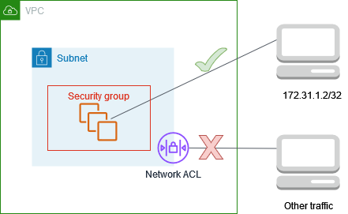

# Example: Control access to instances in a subnet

In this example, instances in the subnet can communicate with each other, and are
accessible from a trusted remote computer in order to perform administrative tasks.
The remote computer might be a computer in your local network, as shown in the diagram,
or it might be an instance in a different subnet or VPC. The network ACL rules for the
subnet, and the security group rules for the instances, allow access from the IP address
of your remote computer. All other traffic from the internet or other networks is denied.

Using a network ACL gives you the flexibility to change the security groups
or security group rules for your instances while relying on the network ACL as a backup
layer of defense. For example, if you accidentally update the security group to allow
inbound SSH access from anywhere, but the network ACL allows access only from the IP
address range of the remote computer, then the network ACL denies inbound SSH traffic
from any other IP addresses.

## Network ACL rules

The following are example inbound rules for the network ACL associated with the subnet.
These rules apply to all instances in the subnet.

| Rule # | Type        | Protocol | Port range | Source          | Allow/Deny | Comments                                        |
| ------ | ----------- | -------- | ---------- | --------------- | ---------- | ----------------------------------------------- |
| 100    | SSH         | TCP      | 22         | `172.31.1.2/32` | ALLOW      | Allow inbound traffic from the remote computer. |
| \*     | All traffic | All      | All        | 0.0.0.0/0       | DENY       | Deny all other inbound traffic.                 |

The following are example outbound rules for the network ACL associated with the subnet.
Network ACLs are stateless. Therefore, you must include a rule that allows responses to the
inbound traffic.

| Rule # | Type        | Protocol | Port range | Destination     | Allow/Deny | Comments                                          |
| ------ | ----------- | -------- | ---------- | --------------- | ---------- | ------------------------------------------------- |
| 100    | Custom TCP  | TCP      | 1024-65535 | `172.31.1.2/32` | ALLOW      | Allows outbound responses to the remote computer. |
| \*     | All traffic | All      | All        | 0.0.0.0/0       | DENY       | Denies all other outbound traffic.                |

## Security group rules

The following are example inbound rules for the security group associated with the
instances. These rules apply to all instances associated with the security group. A user
with the private key for the key pair associated with the instances can connect to the
instances from the remote computer using SSH.

| Protocol type | Protocol | Port range | Source                 | Comments                                                                       |
| ------------- | -------- | ---------- | ---------------------- | ------------------------------------------------------------------------------ |
| All traffic   | All      | All        | `sg-1234567890abcdef0` | Allow communication between the instances associated with this security group. |
| SSH           | TCP      | 22         | `172.31.1.2/32`        | Allow inbound SSH access from the remote computer.                             |

The following are example outbound bound rules for the security group associated with
the instances. Security groups are stateful. Therefore, you don't need a rule that allows
responses to inbound traffic.

| Protocol Type | Protocol | Port range | Destination            | Comments                                                                       |
| ------------- | -------- | ---------- | ---------------------- | ------------------------------------------------------------------------------ |
| All traffic   | All      | All        | `sg-1234567890abcdef0` | Allow communication between the instances associated with this security group. |

## Differences between network ACLs and security groups

The following table summarizes the basic differences between network ACLs and security groups.

| Characteristic     | Network ACL                                                               | Security group                                               |
| ------------------ | ------------------------------------------------------------------------- | ------------------------------------------------------------ |
| Level of operation | Subnet level                                                              | Instance level                                               |
| Scope              | Applies to all instances in the associated subnets                        | Applies to all instances associated with the security group  |
| Rule type          | Allow and deny rules                                                      | Allow rules only                                             |
| Rule evaluation    | Evaluates rules in ascending order until a match for the traffic is found | Evaluates all rules before deciding whether to allow traffic |
| Return traffic     | Must be explicitly allowed (stateless)                                    | Automatically allowed (stateful)                             |
