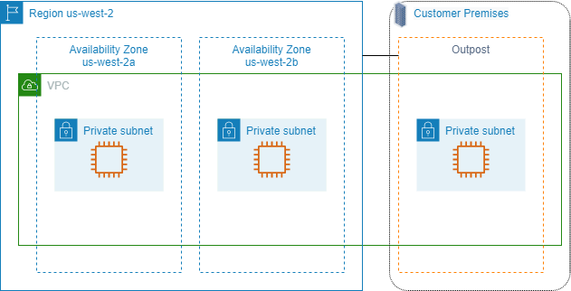

# Subnets in AWS Outposts

AWS Outposts offers you the same AWS hardware infrastructure, services, APIs, and tools to
build and run your applications on premises and in the cloud. AWS Outposts is ideal for
workloads that need low latency access to on-premises applications or systems, and for
workloads that need to store and process data locally. For more information about AWS Outposts,
see [AWS Outposts](https://aws.amazon.com/outposts/ "https://aws.amazon.com/outposts/").

A VPC spans all Availability Zones in an AWS Region. After you connect
your Outpost to its parent Region, you can extend any VPC in the Region to your
Outpost by creating a subnet for the Outpost in that VPC.

The following rules apply to AWS Outposts:

- The subnets must reside in one Outpost location.
- You create a subnet for an Outpost by specifying the Amazon Resource Name
  (ARN) of the Outpost when you create the subnet.
- Outposts rack - A local gateway handles the network connectivity between your VPC
  and on-premises networks. For more information, see [Local gateways](../../../outposts/latest/userguide/outposts-local-gateways.md "../../../outposts/latest/userguide/outposts-local-gateways.md")
  in the _AWS Outposts User Guide for Outposts rack_.
- Outposts servers - A local network interface handles the network connectivity between
  your VPC and on-premises networks. For more information, see [Local network interfaces](../../../outposts/latest/server-userguide/local-network-interface.md "../../../outposts/latest/server-userguide/local-network-interface.md")
  in the _AWS Outposts User Guide for Outposts servers_.
- By default, every subnet that you create in a VPC, including subnets for your
  Outposts, is implicitly associated with the main route table for the VPC.
  Alternatively, you can explicitly associate a custom route table with the
  subnets in your VPC and have a local gateway as a next-hop target for all
  traffic destined for your on-premises network.

