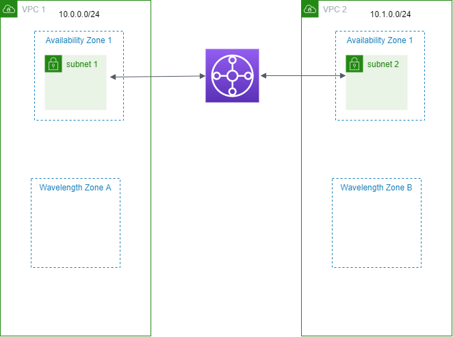

# Subnets in AWS Wavelength

_AWS Wavelength_ allows developers to build applications that deliver
ultra-low latencies to mobile devices and end-users. Wavelength deploys standard AWS
compute and storage services to the edge of telecommunication carriers' 5G networks.
Developers can extend a virtual private cloud (VPC) to one or more Wavelength
Zones, and then use AWS resources like Amazon EC2 instances to run applications that
require ultra-low latency and connect to AWS services in the Region.

To use a Wavelength Zones, you must first opt in to the Zone. Next, create a subnet in the
Wavelength Zone. You can create Amazon EC2 instances, Amazon EBS volumes, and Amazon VPC subnets and
carrier gateways in Wavelength Zones. You can also use services that orchestrate or work
with EC2, EBS, and VPC, such as Amazon EC2 Auto Scaling, Amazon EKS clusters, Amazon ECS clusters, Amazon EC2 Systems Manager,
Amazon CloudWatch, AWS CloudTrail, and AWS CloudFormation. The services in Wavelength are part of a
VPC that is connected over a reliable, high bandwidth connection to an AWS Region for
easy access to services including Amazon DynamoDB and Amazon RDS.

The following rules apply to Wavelength Zones:

- A VPC extends to a Wavelength Zone when you create a subnet in the VPC and
  associate it with the Wavelength Zone.
- By default, every subnet that you create in a VPC that spans a Wavelength Zone
  inherits the main VPC route table, including the local route.
- When you launch an EC2 instance in a subnet in a Wavelength Zone, you assign a
  carrier IP address to it. The carrier gateway uses the address for traffic from
  the interface to the internet, or mobile devices. The carrier gateway uses NAT
  to translate the address, and then sends the traffic to the destination. Traffic
  from the telecommunication carrier network routes through the carrier
  gateway.
- You can set the target of a VPC route table, or subnet route table in a Wavelength Zone to
  a carrier gateway, which allows inbound traffic from a carrier network in a
  specific location, and outbound traffic to the carrier network and internet. For
  more information about routing options in a Wavelength Zone, see [Routing](../../../wavelength/latest/developerguide/how-wavelengths-work.md#wavelength-routing-overview "../../../wavelength/latest/developerguide/how-wavelengths-work.md#wavelength-routing-overview") in the _AWS Wavelength Developer Guide_.
- Subnets in Wavelength Zones have the same networking components as subnets in
  Availability Zones, including IPv4 addresses, DHCP option sets, and network
  ACLs.
- You can't create a transit gateway attachment to a subnet in a Wavelength Zone. Instead, create the
  attachment through a subnet in the parent Availability Zone, and then route
  traffic to the desired destinations through the transit gateway. For an example, see the
  next section.

## Considerations for multiple Wavelength Zones

EC2 instances that are in different Wavelength Zones in the same VPC are not allowed
to communicate with each other. If you need Wavelength Zone to Wavelength Zone
communication, AWS recommends that you use multiple VPCs, one for each
Wavelength Zone. You can use a transit gateway to connect the VPCs. This
configuration enables communication between instances in the Wavelength
Zones.

Wavelength Zone to Wavelength Zone traffic routes through the AWS Region. For more
information, see [AWS Transit Gateway](https://aws.amazon.com/transit-gateway/ "https://aws.amazon.com/transit-gateway/").

The following diagram shows how to configure your network so that instances in two
different Wavelength Zones can communicate. You have two Wavelength Zones
(Wavelength Zone A and Wavelength Zone B). You need to create the following
resources to enable communication:

- For each Wavelength Zone, a subnet in an Availability Zone that is the parent
  Availability Zone for the Wavelength Zone. In the example, you create subnet
  1 and subnet 2. For information about creating subnets, see [Create a subnet](create-subnets.md "create-subnets.md"). Use the [describe-availability-zones](../../../cli/latest/reference/ec2/describe-availability-zones.md "../../../cli/latest/reference/ec2/describe-availability-zones.md") command to find the parent zone.
- A transit gateway. The transit gateway connects the VPCs. For information about creating a transit gateway, see [Create a
  transit gateway](../tgw/tgw-transit-gateways.md#create-tgw "../tgw/tgw-transit-gateways.md#create-tgw") in the _Amazon VPC Transit Gateways
  Guide_.
- For each VPC, a VPC attachment to the transit gateway in the parent Availability Zone of the
  Wavelength Zone. For more information, see [Transit gateway
  attachments to a VPC](../tgw/tgw-vpc-attachments.md "../tgw/tgw-vpc-attachments.md") in the _Amazon VPC Transit Gateways
  Guide_.
- Entries for each VPC in the transit gateway route table. For information about creating
  transit gateway routes, see [Transit gateway route
  tables](../tgw/tgw-route-tables.md "../tgw/tgw-route-tables.md") in the _Amazon VPC Transit Gateways Guide_.
- For each VPC, an entry in the VPC route table that has the other VPC CIDR as the
  destination, and the transit gateway ID as the target. For more information, see [Routing for a transit gateway](route-table-options.md#route-tables-tgw "route-table-options.md#route-tables-tgw").

In the example, the route table for VPC 1 has the following entry:

| Destination | Target                |
| ----------- | --------------------- | -------------------------------------------------------------- |
| 10.1.0.0/24 | tgw-22222222222222222 | The route table for VPC 2 has the following entry:             |
| Destination | Target                |
| ---         | ---                   |
| 10.0.0.0/24 | tgw-22222222222222222 |  |
