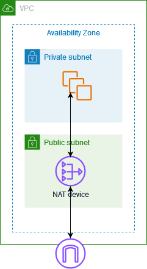

# Connect to the internet or other networks using NAT devices

You can use a NAT device to allow resources in private subnets to connect to the internet, other
VPCs, or on-premises networks. These instances can communicate with services outside the VPC, but
they cannot receive unsolicited connection requests.

For example, the following diagram shows a NAT device in a public subnet that allows the EC2 instances
in a private subnet to connect to the internet through an internet gateway. The NAT device replaces the
source IPv4 address of the instances with the address of the NAT device. When sending response traffic
to the instances, the NAT device translates the addresses back to the original source IPv4 addresses.

###### Important

- We use the term _NAT_ in this documentation to follow common IT practice,
  though the actual role of a NAT device is both address translation and port address translation
  (PAT).
- You can use a managed NAT device offered by AWS, called a _NAT gateway_,
  or you can create your own NAT device on an EC2 instance, called a _NAT instance_.
  We recommend that you use NAT gateways because they provide better availability and bandwidth and
  require less effort on your part to administer.

###### Contents

- [NAT gateways](vpc-nat-gateway.md "vpc-nat-gateway.md")
- [NAT instances](VPC_NAT_Instance.md "VPC_NAT_Instance.md")
- [Compare NAT gateways and NAT instances](vpc-nat-comparison.md "vpc-nat-comparison.md")
