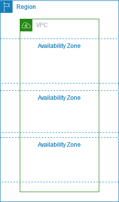

# VPC basics

A VPC spans all of the Availability Zones in a Region. After you create a VPC, you
can add one or more subnets in each Availability Zone. For more information, see [Subnets for your VPC](configure-subnets.md "configure-subnets.md").

###### Contents

- [VPC IP address range](#vpc-ip-address-range "#vpc-ip-address-range")
- [VPC diagram](#vpc-diagram "#vpc-diagram")
- [VPC resources](#vpc-resources "#vpc-resources")

## VPC IP address range

When you create a VPC, you specify its IP addresses as follows:

- IPv4 only – The VPC has an
  IPv4 CIDR block but does not have an IPv6 CIDR block.
- Dual stack – The VPC has both an
  IPv4 CIDR block and an IPv6 CIDR block.

For more information, see [IP addressing for your VPCs and subnets](vpc-ip-addressing.md "vpc-ip-addressing.md").

## VPC diagram

The following diagram shows a VPC with no additional VPC resources.
For example VPC configurations, see [VPC examples](vpc-examples-intro.md "vpc-examples-intro.md").

## VPC resources

Each VPC automatically comes with the following resources:

- [Default DHCP option set](DHCPOptionSetConcepts.md#ArchitectureDiagram "DHCPOptionSetConcepts.md#ArchitectureDiagram")
- [Default network ACL](default-network-acl.md "default-network-acl.md")
- [Default security group](default-security-group.md "default-security-group.md")
- [Main route table](subnet-route-tables.md#main-route-table "subnet-route-tables.md#main-route-table")

You can create the following resources for your VPC:

- [Network ACLs](vpc-network-acls.md "vpc-network-acls.md")
- [Custom route tables](VPC_Route_Tables.md "VPC_Route_Tables.md")
- [Security groups](vpc-security-groups.md "vpc-security-groups.md")
- [Internet gateway](VPC_Internet_Gateway.md "VPC_Internet_Gateway.md")
- [NAT gateways](vpc-nat-gateway.md "vpc-nat-gateway.md")
