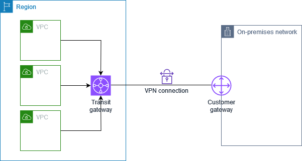
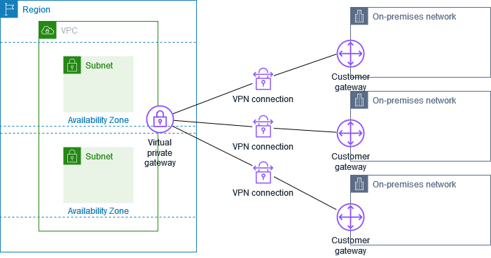
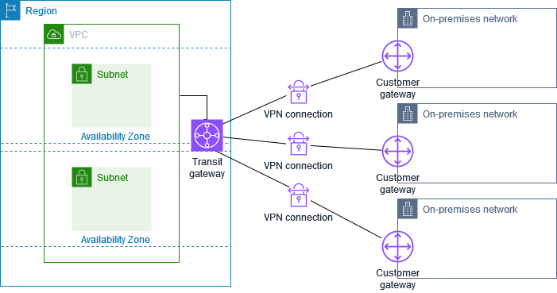
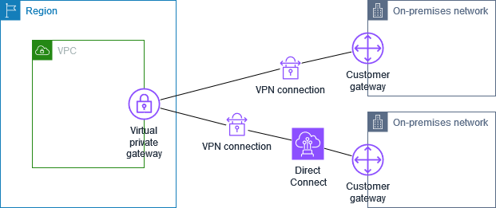
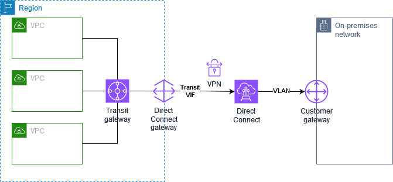

# AWS Site-to-Site VPN single and multiple VPN connection examples

The following diagrams illustrate single and multiple Site-to-Site VPN connections.

###### Examples

- [Single Site-to-Site VPN connection](#SingleVPN "#SingleVPN")
- [Single Site-to-Site VPN connection with a transit gateway](#SingleVPN-transit-gateway "#SingleVPN-transit-gateway")
- [Multiple Site-to-Site VPN connections](#MultipleVPN "#MultipleVPN")
- [Multiple Site-to-Site VPN connections with a transit gateway](#MultipleVPN-transit-gateway "#MultipleVPN-transit-gateway")
- [Site-to-Site VPN connection with AWS Direct Connect](#vpn-direct-connect "#vpn-direct-connect")
- [Private IP Site-to-Site VPN connection with AWS Direct Connect](#private-ip-direct-connect "#private-ip-direct-connect")

## Single Site-to-Site VPN connection

The VPC has an attached virtual private gateway, and your on-premises (remote) network
includes a customer gateway device, which you must configure to enable the VPN
connection. You must update the VPC route tables so that any traffic from the VPC bound
for your network goes to the virtual private gateway.

For steps to set up this scenario, see [Get started with AWS Site-to-Site VPN](SetUpVPNConnections.md "SetUpVPNConnections.md").

## Single Site-to-Site VPN connection with a transit gateway

The VPC has an attached transit gateway, and your on-premises (remote) network includes a customer
gateway device, which you must configure to enable the VPN connection. You must update the
VPC route tables so that any traffic from the VPC bound for your network goes to the
transit gateway.

For steps to set up this scenario, see [Get started with AWS Site-to-Site VPN](SetUpVPNConnections.md "SetUpVPNConnections.md").

## Multiple Site-to-Site VPN connections

The VPC has an attached virtual private gateway, and you have multiple Site-to-Site VPN connections
to multiple on-premises locations. You set up the routing so that any traffic from the
VPC bound for your networks is routed to the virtual private gateway.

When you create multiple Site-to-Site VPN connections to a single VPC, you can configure a second
customer gateway to create a redundant connection to the same external location. For
more information, see [Redundant AWS Site-to-Site VPN connections for failover](vpn-redundant-connection.md "vpn-redundant-connection.md").

You can also use this scenario to create Site-to-Site VPN connections to multiple geographic
locations and provide secure communication between sites. For more information, see
[Secure communication between AWS Site-to-Site VPN connections using
VPN CloudHub](VPN_CloudHub.md "VPN_CloudHub.md").

## Multiple Site-to-Site VPN connections with a transit gateway

The VPC has an attached transit gateway, and you have multiple Site-to-Site VPN connections to multiple
on-premises locations. You set up the routing so that any traffic from the VPC bound for
your networks is routed to the transit gateway.

When you create multiple Site-to-Site VPN connections to a single transit gateway, you can
configure a second customer gateway to create a redundant connection to the same
external location.

You can also use this scenario to create Site-to-Site VPN connections to multiple geographic
locations and provide secure communication between sites.

## Site-to-Site VPN connection with AWS Direct Connect

The VPC has an attached virtual private gateway, and connects to your on-premises (remote)
network through AWS Direct Connect. You can configure an AWS Direct Connect public virtual interface to
establish a dedicated network connection between your network to public AWS resources
through a virtual private gateway. You set up the routing so that any traffic from the VPC
bound for your network routes to the virtual private gateway and the AWS Direct Connect connection.

When both AWS Direct Connect and the VPN connection are set up on the same virtual private gateway,
adding or removing objects might cause the virtual private gateway to enter the ‘attaching’
state. This indicates a change is being made to internal routing that will switch between
AWS Direct Connect and the VPN connection to minimize interruptions and packet loss. When this is
complete, the virtual private gateway returns to the ‘attached’ state.

## Private IP Site-to-Site VPN connection with AWS Direct Connect

With a private IP Site-to-Site VPN you can encrypt AWS Direct Connect traffic between your on-premises network and AWS without the use of public IP addresses. Private IP VPN over AWS Direct Connect ensures that traffic between AWS and on-premises networks is both secure and private, allowing customers to comply with regulatory and security mandates.

For more information, see the following blog post: [Introducing AWS Site-to-Site VPN Private IP VPNs](https://aws.amazon.com/blogs/networking-and-content-delivery/introducing-aws-site-to-site-vpn-private-ip-vpns/ "https://aws.amazon.com/blogs/networking-and-content-delivery/introducing-aws-site-to-site-vpn-private-ip-vpns/").
